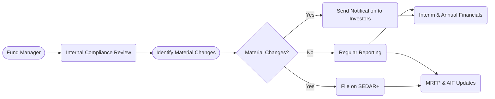

## 17.5 Other Forms and Requirements

In addition to the simplified prospectus and Fund Facts, mutual funds in Canada are subject to various other disclosure and reporting requirements. These documents provide a transparent view of a fund’s structure, assets, operations, and financial performance. For example, the Annual Information Form (AIF) and Management Reports of Fund Performance (MRFP) offer further insights beyond what is found in the fund’s core prospectus documentation. By disclosing all material changes promptly and comprehensively, the fund manager ensures that investors can make informed decisions about whether to continue holding or invest in the fund’s units. This section offers a deeper look into these additional forms and requirements, highlighting their importance, regulatory frameworks, and best practices for maintaining transparency and regulatory compliance in Canada’s mutual fund industry.

---

## Annual Information Form (AIF)

### Purpose and Contents
An Annual Information Form (AIF) provides detailed background information on a mutual fund, going beyond what is typically disclosed in the simplified prospectus. While not all funds are required to file an AIF, many choose to do so to meet regulatory best practices and enhance transparency. The contents of an AIF typically include:

• A detailed description of the fund’s business practices and operations  
• Information about the fund’s management, including details about the portfolio manager and other service providers  
• Risk factors that may affect the fund’s performance  
• Legal and regulatory proceedings (if applicable)  
• A discussion of market conditions or material developments that may influence the fund’s operations  

AIFs are filed on the System for Electronic Document Analysis and Retrieval (SEDAR+), the public filing system now used by Canadian reporting issuers. Investors or analysts can visit <https://www.sedarplus.ca/> to review the AIF of a specific mutual fund they are researching.

### How the AIF Supports Decision Making
Because the AIF is more technical and forward-looking than other disclosures, it enables more sophisticated investors and analysts to:

• Evaluate the fund’s operational risks  
• Examine the consistency between the fund’s stated objectives and its actual investment strategies  
• Assess managerial expertise and track record  
• Investigate any historical or ongoing legal matters  

This deeper analysis often appeals to institutional investors such as pension funds or large asset managers (e.g., major Canadian banks like RBC or TD Asset Management), which need detailed operational insight before allocating substantial capital to a fund.

---

## Management Report of Fund Performance (MRFP)

### Importance of the MRFP
The Management Report of Fund Performance (MRFP) is the primary vehicle for communicating the fund’s performance and portfolio changes over a specific period—usually semi-annually (interim report) and annually (annual report). It complements the financial statements by explaining any significant changes the fund has undergone, including new investment strategies or sector shifts. 

Under National Instrument 81-106 (Investment Fund Continuous Disclosure), fund managers must provide MRFPs to keep unitholders informed. The objective of MRFPs is to highlight:

• Past performance and factors driving fund returns  
• Portfolio composition and dynamics, such as shifts between asset classes or geographic areas  
• Any major developments affecting the fund’s fees, expenses, or management  
• Commentary on market conditions that impacted the fund’s strategy  

### Key Components of the MRFP
A typical MRFP includes:

1. Management Discussion of Fund Performance:  
   – Analysis of how market trends, sector rotations, or economic events influenced the fund.  
   – Explanations of any changes in asset allocation or weighting across different categories.  

2. Financial Highlights:  
   – Summarized financial information, including net income and distributions.  
   – Expense ratios and management fees to inform investors about ongoing costs.  

3. Past Performance Data:  
   – Returns on a one-, three-, five-, and ten-year basis.  
   – Comparison to relevant benchmarks or indices.  

4. Portfolio Summary:  
   – Key holdings and sectors.  
   – Largest positions that materially affect performance.

### Using MRFPs for Informed Investing  
Investors should carefully review MRFPs to check whether a fund’s strategy remains aligned with their personal investment goals. For instance, an investor initially drawn to a low-volatility dividend strategy may want to confirm that recent portfolio changes have not increased the fund’s risk profile. By comparing MRFP data across reporting periods, investors can confirm whether performance is consistent with market conditions or if unexpected volatility is creeping into the fund.

---

## Financial Statements Requirements

### Interim and Annual Financial Statements
Beyond the prospectus, simplified or otherwise, Canadian mutual funds are obligated to produce both interim (semi-annual) and annual financial statements. These statements must be published in accordance with International Financial Reporting Standards (IFRS) and filed on SEDAR+.

• Interim Financial Statements (Semi-Annual): Provide an unaudited snapshot of the fund’s assets, liabilities, and net asset value (NAV) at the midpoint of the fiscal year.  
• Annual Financial Statements: Typically audited, offering a comprehensive look at the fund’s financial health, performance, and cash flows over the entire fiscal year.

### Key Sections of Mutual Fund Financial Statements
1. Statement of Financial Position: Shows the fund’s assets, liabilities, and net assets.  
2. Statement of Comprehensive Income: Details revenues, expenses, and overall returns during the reporting period.  
3. Statement of Changes in Financial Position (or Changes in Net Assets): Outlines how the fund’s financial position evolved, capturing distributions, contributions, or redemptions.  
4. Statement of Cash Flows: Highlights the movement of cash in and out of the fund.  

Financial statements ensure transparency about the fund’s operational costs (including management and performance fees), portfolio holdings, and any adjustments to valuations.

---

## Unitholder Approvals for Major Changes

### Situations Requiring Unitholder Approval
Under Canadian securities regulations, mutual funds often require direct unitholder approval for certain pivotal changes. These votes are usually undertaken during unitholder meetings and cover:

• Changes to the fund’s fundamental investment objectives  
• Proposed reorganizations, mergers, or termination of the fund  
• Amendments to fee structures that materially affect investors  
• Other changes deemed “material” under the law  

Seeking unitholder approval ensures that the fund’s governance structure remains democratic, reflecting the investors’ best interests. If a fund, for instance, aims to change its objectives from long-term capital growth to monthly income, investors have the right to vote on how this affects their investment strategy.

### Best Practices for Voting and Communication
• Provide thorough documentation well in advance of the meeting.  
• Maintain an easily accessible communication channel—e.g., email notifications, official letters, and SEDAR+ postings—to ensure that all unitholders are aware of proposed changes.  
• Disclose anticipated benefits, risks, and costs associated with these changes, allowing investors to vote knowledgeably.

---

## Continuous Disclosure Obligations

### Definition and Rationale
Continuous disclosure is an ongoing requirement imposed by Canadian securities regulators to ensure that material information about a fund is disclosed promptly to investors. “Material information” refers to any fact that could reasonably be expected to have a significant impact on a fund's NAV, operations, or unitholder decisions.

### Types of Material Changes
A “material change” might relate to:

• A significant shift in the fund’s portfolio composition, such as moving from predominantly Canadian equities to global equities.  
• A new fee structure or administrative change that increases investor cost.  
• A major legal or regulatory proceeding involving the fund’s management.  
• Changes in key personnel, like a fund’s lead portfolio manager.  

Prompt disclosure allows investors to decide whether the fund still aligns with their investment objectives and risk tolerance.

### Ensuring Compliance with Regulators
Fund managers must maintain robust internal processes to identify and disclose material changes quickly. The Compliance Department within a fund management company typically oversees this, following guidelines set by the Canadian Investor Protection Fund (CIPF) and the Canadian Investment Regulatory Organization (CIRO). Additionally:

• Regular compliance training helps staff spot and report potential material changes.  
• Automated tracking software (sometimes open-source, sometimes proprietary) monitors portfolio movements or large-scale redemptions.  
• Legal counsel or the Chief Compliance Officer (CCO) reviews all disclosures before filing them on SEDAR+.

---

## Practical Example: A Hypothetical RBC Balanced Fund

Let’s consider a hypothetical RBC Balanced Fund that invests in a combination of Canadian equities and fixed-income securities. Over time:

1. The fund sees an opportunity in global equities due to rising international markets.  
2. It gradually reallocates more assets to overseas investments, thereby changing the fund’s overall risk profile.  
3. According to continuous disclosure requirements, RBC Balanced Fund discloses the reallocation in its monthly portfolio updates and highlights the change in the interim MRFP.  
4. If RBC Balanced Fund plans to alter its fundamental objective—say, from achieving moderate growth through Canadian equities and bonds to focusing on global growth—it must provide unitholders with comprehensive documentation and request their approval for the significant shift in investment strategy.

This scenario underscores how additional documents (MRFPs, updated prospectus, and potential unitholder approval notices) keep investors informed about a fund’s evolving strategy and risk exposure.

---

## Compliance Flow Diagram

Below is a basic Mermaid.js diagram illustrating the compliance flow for a mutual fund’s continuous disclosure and reporting processes:

Explanation of the Diagram:
• The Fund Manager regularly coordinates with Internal Compliance to identify whether there are any changes that meet the threshold of materiality.  
• If a material change is identified, the fund manager promptly files the updates on SEDAR+ and notifies investors, typically through official notices and website announcements.  
• Even with no material changes, the fund manager continues routine reporting requirements like issuing MRFPs, AIFs (if applicable), and financial statements at specified intervals.

---

## Common Pitfalls and Best Practices

### Common Pitfalls
1. Delayed Disclosure: Some funds fail to file material changes within the required timelines. This can erode investor trust and lead to regulatory sanctions.  
2. Overly Technical Language: Presenting overly complex documents can discourage investors from reading vital information.  
3. Inadequate Unitholder Communication: Failing to hold unitholder meetings or distributing incomplete documentation undermines transparency.

### Best Practices
1. Timely Filings: Ensure all disclosures and financial reports are filed on or ahead of deadlines set by National Instrument 81-106.  
2. Clear, Concise Language: Use plain language to encourage investor engagement and comprehension.  
3. Inclusive Governance: Invite unitholders to question and understand any major proposed changes before voting.

---

## Regulatory and Resource References

1. **National Instrument 81-106 (Investment Fund Continuous Disclosure)**  
   – Primary regulation dictating the content, frequency, and format of mutual fund reporting, including MRFPs and financial statements.  

2. **CIRO’s “Guidance on Fund Governance”**  
   – Best practices on how to structure a fund’s governance, ensuring the board of directors, Independent Review Committee (IRC), and other stakeholders effectively oversee the fund’s interests.  

3. **SEDAR+ (<https://www.sedarplus.ca/>)**  
   – A centralized database for electronic filings where investors can access the AIF, financial statements, MRFP, and other disclosure documents.

4. **Open-Source Compliance Tools**  
   – Several open-source software solutions exist to help track market events and automatically generate compliance alerts. While not always used in place of proprietary systems, they can supplement internal processes.

---

## Summary and Key Takeaways

The Annual Information Form (AIF), Management Reports of Fund Performance (MRFP), interim/annual financial statements, and unitholder-approval processes form the backbone of Canada’s rigorous mutual fund disclosure structure. Together, these documents and procedures:

• Keep investors well-informed about a fund’s operations, risks, fees, and strategy.  
• Build trust by ensuring transparency and accountability from fund managers.  
• Serve as mechanisms for corporate governance, where unitholder votes may be required for major strategic changes.  

Staying informed through these reports and promptly addressing material changes is critical for both compliance and maintaining investor confidence. By regularly reviewing the AIF, MRFP, and financial statements—and participating in unitholder meetings—investors can make appropriate decisions about entering, staying in, or exiting a mutual fund.

---

## Quiz: “Canadian Mutual Fund Disclosure & Reporting Essentials”



### Which document expands on details such as the fund’s historical legal proceedings, management team background, and deeper operational risks?

- [ ] Management Report of Fund Performance (MRFP)
- [ ] Fund Facts
- [x] Annual Information Form (AIF)
- [ ] Simplified Prospectus

> **Explanation:** The Annual Information Form (AIF) typically contains detailed information on the fund’s legal history, operations, and management that may not appear in other documents.

### Which of the following items is most likely found in a management report of fund performance (MRFP)?

- [x] A discussion on why the fund’s performance changed over the reporting period
- [ ] The fund manager’s personal employment contract details
- [ ] The full list of all regulatory guidance on mutual funds
- [ ] An in-depth biography of each board member

> **Explanation:** MRFPs focus on explaining the fund’s performance, portfolio shifts, and market commentary, rather than employment contracts or board member biographies.

### Under Canadian securities laws, which of the following changes typically requires unitholder approval?

- [x] A change in the fund’s fundamental investment objective
- [ ] Minor adjustments to the fund’s marketing materials
- [ ] Daily fluctuations in the net asset value per unit
- [ ] Routine portfolio rebalancing decisions

> **Explanation:** Major changes to a fund’s fundamental objectives generally require a unitholder vote, while routine adjustments or daily NAV fluctuations do not.

### What is the main purpose of continuous disclosure requirements for Canadian mutual funds?

- [ ] To eliminate the need for unitholder meetings
- [ ] To discourage large institutional investors from frequent trading
- [x] To ensure timely communication of material changes to unitholders
- [ ] To track fees on a daily basis

> **Explanation:** Continuous disclosure aims to keep unitholders informed of significant developments that could impact the fund’s value or operations. 

### Which of the following is a material change that must be disclosed promptly to investors?

- [x] A new portfolio manager replacing the long-standing manager of the fund
- [ ] A minor correction to the language in the prospectus
- [x] A significant shift in investment strategy or asset allocation
- [ ] A scheduled marketing campaign for the fund

> **Explanation:** Material changes include shifts in management or major portfolio adjustments; these could meaningfully affect the fund’s risk and performance.

### What regulation primarily governs the continuous disclosure requirements for Canadian mutual funds?

- [ ] National Instrument 81-101
- [ ] CIRO By-law 2
- [x] National Instrument 81-106
- [ ] Ontario Securities Act (OSA) Section 46

> **Explanation:** National Instrument 81-106 sets forth requirements on continuous disclosure, MRFPs, and financial statements for Canadian investment funds.

### Which document(s) provide audited and unaudited snapshots of the fund’s financial health throughout the year?

- [x] Interim and annual financial statements
- [ ] Only the AIF
- [x] Interim MRFPs
- [ ] Simplified Prospectus

> **Explanation:** Financial statements (annual and interim) give audited and unaudited insights into the fund’s finances, while interim MRFPs also discuss performance updates.

### How does the Annual Information Form (AIF) differ from Fund Facts?

- [x] The AIF provides more detailed operational and risk-related information than Fund Facts
- [ ] The AIF is exclusively a marketing tool
- [ ] The AIF focuses only on performance metrics
- [ ] Fund Facts and the AIF are identical in scope

> **Explanation:** The AIF goes into greater depth about the fund’s structure, management team, and potential legal risks, surpassing the more concise Fund Facts summary.

### Which resource would you consult to find an electronically filed copy of a mutual fund’s AIF or MRFP?

- [x] SEDAR+
- [ ] The fund manager’s personal consulting firm
- [ ] CIRO’s internal database
- [ ] TSX MarketEdge

> **Explanation:** SEDAR+ is the official platform for publicly filed documents, including AIFs and MRFPs, for Canadian investment funds.

### True or False: Only institutional investors should review MRFPs before making investment decisions.

- [x] True
- [ ] False

> **Explanation:** While large institutional investors deeply analyze MRFPs, retail investors also benefit from understanding fund performance, risks, and strategies. Both institutional and individual investors can gain valuable insights from MRFPs.



---

