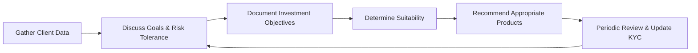

## 17.6 The Know Your Client Rule

The Know Your Client (KYC) rule is one of the most critical pillars of Canadian securities regulation. It underscores the responsibility that dealing representatives (often referred to as advisors) have in collecting and updating essential client information to ensure any investment recommendation or trade is suitable for the client’s unique profile.

This section provides a detailed overview of the KYC rule, explains its importance within the Canadian mutual funds landscape, and offers practical guidance on maintaining compliance and building trust with clients.

---

### Importance and Scope of the KYC Rule

The KYC rule requires advisors to gather and periodically update client information that captures financial circumstances, investment objectives, risk tolerance, time horizon, and other relevant personal or financial details. This comprehensive awareness helps:

• Ensure that all recommended investments match the client’s profile.  
• Identify and mitigate potential issues like over-concentration in a single sector or asset class.  
• Address liquidity requirements and goals (e.g., saving for retirement, paying for a child’s education).  
• Foster trust and transparency between clients and advisors.  

KYC is not static; as a client’s circumstances evolve—such as a new job, receipt of an inheritance, or a change in marital status—advisors must revisit and update the client’s information.

---

### Regulatory Foundations

In Canada, the KYC rule is enforced by organizations such as CIRO (Canadian Investment Regulatory Organization) and securities commissions. The regulatory framework includes:

• CIRO Rule Book: Emphasizes the obligation of advisors to know their clients, maintain up-to-date records, and perform ongoing suitability reviews. (Visit https://www.ciro.ca/ for detailed information.)  
• CSA Client Focused Reforms: Enforces enhanced KYC requirements, including Know Your Product (KYP) obligations, so advisors are knowledgeable about the products they recommend.  
• Disclosure Requirements: Clients must be informed of risks, fees, restrictions, and the rationale behind specific investment recommendations.

Keeping accurate documentation is crucial. If a client explicitly decides on a strategy that conflicts with the recommendations arising from their KYC profile, the advisor must document this discrepancy and ensure the client fully understands the implications.

---

### Step-by-Step KYC Process

Although each firm has unique procedures and compliance tools, the KYC process typically involves the following steps:

1. Collect Client Information:
   • Personal details (name, address, date of birth).  
   • Employment status and income.  
   • Net worth and liquidity needs (e.g., emergency funds).  
   • Investment goals (retirement, home purchase, education, inheritance planning).  

2. Assess Risk Tolerance and Time Horizon:
   • Evaluate how much market volatility the client can accept.  
   • Determine whether the client needs short-term liquidity or has a longer-term horizon.  

3. Identify Investment Objectives:
   • Growth, income, capital preservation, or a balanced approach.  
   • Define the expected return or objectives for each account (e.g., RRSP, TFSA, non-registered).  

4. Suitability Analysis:
   • Match the client’s profile with suitable products, such as mutual funds, bonds, exchange-traded funds (ETFs), or other securities.  
   • If a recommendation lies outside the established KYC parameters, ensure robust documentation.  

5. Periodic Review and Updates:
   • Review and update KYC information at least annually or whenever there is a significant change in personal or financial circumstances.  
   • Document all changes and ensure updated estimates of net worth, risk tolerance, or time horizon.  

6. Ongoing Monitoring:
   • Use automated compliance tools (e.g., open-source portfolio trackers) to watch for issues like excessive concentration or drift from target allocation.  
   • Communicate with clients regularly and adjust recommendations as required.

Below is a visual representation of a typical KYC workflow:

In this cycle, continuous review and communication are integral to maintaining an updated KYC file.

---

### Real-World Examples and Case Studies

• Scenario: A 35-year-old investor at RBC
  - Profile: Moderate risk tolerance, stable employment, and a time horizon of 20+ years.  
  - KYC Considerations: The advisor identifies growth-focused mutual funds with moderate volatility. The client’s annual reviews highlight increasing income, leading to re-evaluation of risk tolerance.  
  - Outcome: The advisor documents the shift in risk tolerance and gradually includes a small allocation to higher-risk equity funds.

• Scenario: A retiree at TD
  - Profile: Low risk tolerance, requires income to supplement pensions, with a relatively short time horizon and high liquidity needs for medical expenses.  
  - KYC Considerations: The advisor recommends mutual funds and fixed-income products that emphasize income generation and capital preservation.  
  - Outcome: The account is monitored quarterly to ensure yield remains consistent with income needs, and risk tolerance remains appropriate for retirement objectives.

---

### Common Challenges and Best Practices

1. Incomplete Information:  
   • Challenge: Clients may not share all details regarding personal finances.  
   • Best Practice: Encourage open dialogue and clarify the importance of complete disclosure for accurate recommendations.

2. Outdated Client Profiles:  
   • Challenge: Advisors may fail to update profiles after life events.  
   • Best Practice: Implement a systemized review schedule with mandatory prompts to re-check KYC details at least annually.

3. Conflicts of Interest:  
   • Challenge: Advisors might feel pressured to recommend products with higher commissions.  
   • Best Practice: Disclose conflicts of interest clearly, and ensure product choice always aligns with a client’s best interest.

4. Concentration Risk:  
   • Challenge: Certain clients prefer to “invest heavily” in a familiar stock or industry.  
   • Best Practice: Use portfolio diversification analysis tools and illustrate the potential downside of over-concentration.

---

### Glossary

• **KYC (Know Your Client):** The foundational process of collecting and verifying client information to ensure appropriate investment recommendations.  
• **Risk Tolerance:** An investor’s capacity to withstand financial losses or market volatility.  
• **Suitability Obligation:** The regulatory responsibility to recommend only those investments that match a client’s unique profile and objectives.  
• **Concentration Risk:** The increased risk arising from a lack of diversification.

---

### Additional Resources

• [CIRO Rules](https://www.ciro.ca/) – For comprehensive details on KYC, suitability obligations, and periodic updates.  
• [CSA Client Focused Reforms](https://www.securities-administrators.ca/) – Guidance on enhanced KYC and KYP processes.  
• “Building a Canadian Portfolio” by the Canadian Securities Institute – Offers practical insights and case examples for applying KYC rules effectively.  
• Open-source portfolio analysis tools (e.g., Portfolio Performance, Quantitative Investment Tools) – These can help track investments and ensure the portfolio aligns with KYC data.

---

### Summary

The Know Your Client (KYC) rule underpins the advisor-client relationship in Canada’s mutual fund industry, mandating advisors to gather, verify, and maintain detailed records of each client’s personal and financial situation. Accurate and up-to-date information is essential for providing suitable investment recommendations that match clients’ risk tolerance and objectives. By following regulatory guidelines and embracing best practices, advisors help sustain market integrity, build client trust, and ensure that investors are well-served in pursuing their financial goals.

---

## Test Your Knowledge: Canadian Mutual Funds KYC Quiz



### Which of the following best describes the Know Your Client (KYC) rule in Canada?

- [x] A regulatory requirement to assess and document a client’s financial circumstances, factors such as risk tolerance, and investment objectives.  
- [ ] A process exclusive to self-regulatory organizations outside Canada.  
- [ ] A rule only concerning a client’s credit history.  
- [ ] An optional procedure for advisors who sell derivatives.

> **Explanation:** KYC is mandatory under Canadian securities regulations, requiring detailed assessment of the client’s financial profile, risk tolerance, and objectives.

### How often must advisors generally update a client’s KYC information under Canadian regulations?

- [ ] Only once when the account is opened.  
- [ ] Every five years, regardless of changes in the client’s situation.  
- [x] Periodically or whenever there is a significant change in a client’s personal or financial circumstances.  
- [ ] Only when regulators request it.

> **Explanation:** Advisors should regularly review and update KYC details, and must do so promptly upon material changes such as a new job, divorce, inheritance, or change in financial goals.

### What is the primary goal of collecting KYC information?

- [x] To ensure that investment recommendations align with a client’s financial situation and risk tolerance.  
- [ ] To build a database of potential sales leads for advisors.  
- [ ] To enable clients to opt out of regulation.  
- [ ] To determine qualified tax shelters only.

> **Explanation:** KYC data helps advisors make suitable recommendations, matching each client’s objectives, risk tolerance, and liquidity needs.

### What must an advisor do if a client insists on purchasing a mutual fund that does not align with their disclosed objectives?

- [ ] Decline the transaction and close the account.  
- [x] Document the discrepancy, ensure the client understands the risks, and advise against it if clearly unsuitable.  
- [ ] Purchase the mutual fund immediately without documentation.  
- [ ] Sell other funds to offset the risk.

> **Explanation:** Advisors must document the discrepancy and thoroughly inform the client of the mismatch between their KYC profile and the investment choice.

### Which of the following is an example of concentration risk?

- [x] Allocating 90% of assets to a single asset class or sector.  
- [ ] Holding a mix of 60% global equities and 40% Canadian bonds.  
- [x] Investing most of one’s portfolio in a single company or industry.  
- [ ] Regularly rebalancing a portfolio.

> **Explanation:** Concentration risk arises when a high percentage of the portfolio is exposed to one area, increasing vulnerability to market downturns in that segment.

### Which of the following best describes “Suitability Obligation”?

- [x] It is the regulatory requirement that investments must match a client’s unique risk profile, objectives, and time horizon.  
- [ ] It is an optional practice to boost sales.  
- [ ] It means advisors must always recommend only low-risk products.  
- [ ] It is relevant only to institutional clients.

> **Explanation:** Suitability refers to ensuring each recommended investment is appropriate for the individual client’s circumstances and goals.

### What is a best practice when a client does not provide complete information for the KYC process?

- [x] Document the lack of information, encourage the client to provide details, and proceed with caution.  
- [ ] Reject the client outright.  
- [x] Make assumptions about the client’s finances without disclosure.  
- [ ] Advise the client to only invest in GICs.

> **Explanation:** While an advisor can proceed with limited data, they must document the lack of information, discuss potential risks, and ensure the client understands the implications.

### At which point in the advisor-client relationship is the KYC process first initiated?

- [x] During the account opening process or client onboarding.  
- [ ] After the first purchase of a security.  
- [ ] Only once a profit is realized.  
- [ ] Immediately after a dispute with the client.

> **Explanation:** KYC begins at the outset of the professional relationship, ensuring any recommendation is based on reliable information.

### Which regulatory body is primarily responsible for KYC oversight in Canada alongside provincial securities commissions?

- [x] CIRO (Canadian Investment Regulatory Organization).  
- [ ] The Federal Reserve Board.  
- [ ] The European Central Bank.  
- [ ] The Financial Conduct Authority (FCA).

> **Explanation:** CIRO is Canada’s primary self-regulatory body overseeing the conduct of investment dealers and mutual fund dealers.

### KYC procedures aim to ensure that recommended securities and strategies are suitable for which reason?

- [x] To protect investors from undue risk and financial loss.  
- [ ] To reduce operational expenses for the advisor’s firm.  
- [ ] To comply solely with global banking regulations.  
- [ ] To minimize transaction fees for advisors.

> **Explanation:** The fundamental purpose of KYC is ensuring suitable advice and protection for investors, aligning with their risk tolerance and goals.



---

