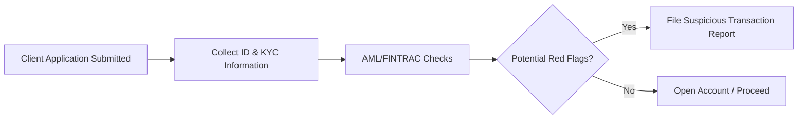

## 17.7 Requirements for Opening and Updating an Account

Opening and maintaining a mutual fund account in Canada requires careful adherence to several key processes and regulatory standards. These procedures ensure that dealers and advisors gather and maintain accurate information, conduct due diligence (including anti-money laundering checks), and protect confidential data. A thorough understanding of these requirements is crucial for Canadian investment professionals, who must balance regulatory compliance with client service and privacy considerations. This section will walk you through fundamental concepts and best practices when opening and updating mutual fund accounts, from collecting initial documentation to ensuring ongoing compliance with regulations such as CIRO rules, the Personal Information Protection and Electronic Documents Act (PIPEDA), and anti‐money laundering (AML) guidelines.

---

### Importance of Know Your Client (KYC) Standards

The foundational principle in opening and maintaining investment accounts is the Know Your Client (KYC) rule. KYC seeks to ensure that advisors and dealers have sufficient information to make suitable investment recommendations and that they maintain a thorough understanding of each client’s personal and financial circumstances.

Key points include:
• Collecting data on client identity, financial status, investment objectives, time horizon, and risk tolerance.  
• Maintaining current and complete records, subject to regular reviews and updates.  
• Ensuring regulatory requirements for client identity verification and AML compliance are met.

---

### Identification Protocols and Anti-Money Laundering (AML) Compliance

According to the Financial Transactions and Reports Analysis Centre of Canada (FINTRAC), all financial institutions and dealers must identify their customers and retain proof of identification. This effort is designed to prevent money laundering and terrorist financing through the financial system.

• Identification Documents: Traditionally, government-issued photo identification (e.g., driver’s license, passport, permanent resident card) serves as proof of identity. In some cases, a combination of documents may be required.  
• Verification Steps: Dealers must record specific information from IDs to confirm authenticity and maintain a paper or electronic record for compliance purposes.  
• AML Checks: As part of the account-opening process, dealers must analyze potential AML red flags (e.g., unusual patterns of deposits or transfers). If suspicious behavior is detected, a report is filed with FINTRAC to allow further investigation.

Below is a simplified overview of the identification and AML checking process.

**Figure 17.1:** Streamlined process for opening a client account with AML compliance checks.

---

### Collecting KYC Information

Properly documenting each client’s personal and financial data is essential, not only for regulatory compliance but also for making suitable investment recommendations. Typical information gathered in the account application includes:

• Full Legal Name and Address  
• Financial and Employment Information  
• Estimated Annual Income and Net Worth  
• Investment Objectives (e.g., growth, income, capital preservation)  
• Risk Tolerance (often assessed via questionnaires)  
• Time Horizon and Liquidity Needs

Trustworthy records help ensure that the dealer can perform ongoing suitability assessments. By having a comprehensive client profile readily available, advisors can align potential mutual fund investments with the client’s long-term financial goals and constraints.

---

### Client Account Applications and Required Forms

When applying for a mutual fund account, clients must complete various documents and forms, which may include:

1. **Client Account Application:** The primary document collecting personal data, contact details, and baseline financial information (income, net worth).  
2. **Risk Profile Questionnaire:** A specialized form to gauge the client’s investment experience, risk preferences, and objectives. Results often influence the targeted asset allocation and any recommended mutual funds.  
3. **Consent Forms for Electronic Communications:** As digital communications become more prevalent, many dealers require clients to sign e-Consent documents permitting electronic messaging and document delivery.  
4. **Disclosure and Consent for Third-Party Information Verification:** Some account applications include clauses or attachments allowing the institution to verify client data (e.g., contacting credit bureaus for identification confirmation).

#### Electronic Signatures

Electronic signatures have gained wide acceptance in Canada, provided they comply with federal and provincial e-commerce and securities laws (e.g., the Uniform Electronic Commerce Act). Many dealers and advisors now offer e-signature solutions, making the account-opening process more convenient. Clients must still confirm they fully understand the documents and disclosures being signed.

---

### KYC Refreshers: Updating Client Information

Maintaining accurate information is essential for ensuring that investment recommendations remain suitable over time. Changes in income, family status, or employment can significantly alter a client’s risk tolerance and investment objectives. Periodic reviews—or “KYC refreshers”—provide an opportunity to:

• Confirm that contact and identification data remain accurate.  
• Update material financial information (e.g., annual income, net worth) and life changes (e.g., marriage, retirement).  
• Reassess investment objectives and risk tolerance, especially if market conditions or personal goals shift.  

The frequency of KYC refreshers varies according to firm policies and regulatory requirements, although an annual or biannual review is common practice. For example, some dealers may prompt clients to confirm or update their KYC details on each statement anniversary.

---

### Confidentiality and Privacy Standards

Firms must protect all collected data in compliance with PIPEDA or equivalent provincial privacy legislation. Confidential client data must be securely stored and only accessed by authorized personnel. Advisors should educate clients on how personal information will be used and protected.

Best practices include:
• Employing secure, encrypted platforms for electronic document exchange.  
• Restricting data access to relevant staff.  
• Instituting robust record-keeping policies that specify storage duration and disposal methods.  
• Monitoring internal systems for unauthorized access or data breaches.

---

### Record-Keeping and Regulatory Requirements

The Canadian Investment Regulatory Organization (CIRO) provides guidance related to maintaining client records, suitability documentation, and ongoing updates. Common requirements for record-keeping include:

• **Storage Duration:** Holding client records for a specified period (often up to seven years) past the account closing date.  
• **Format of Records:** Permitting both paper and electronic storage, as long as the system used is secure and accessible.  
• **Accessibility:** Ensuring that records can be retrieved quickly for audits, regulatory queries, or internal reviews.

---

### Practical Examples and Case Studies

Below are two hypothetical scenarios illustrating how account opening and updates might unfold:

1. **Case Study: RBC Direct Investing Account Opening**  
   A new client, Karl, applies online to open an RBC Direct Investing account. He provides a valid passport and completes an online KYC questionnaire indicating a moderate risk tolerance and a 10-year time horizon. RBC’s system automatically runs AML searches. Given no red flags, RBC provides Karl with an electronic application to sign. Once signed, Karl’s account is activated, and he funds it via electronic transfer.

2. **Case Study: TD Direct Investing KYC Refresher**  
   Sandra, who has been a TD Direct Investing client for several years, receives an email prompting her to review her KYC details. She logs in, notices her income has changed after being promoted, and updates her net worth figures. She also adjusts her risk tolerance from “moderate” to “moderately aggressive.” TD updates her account profile, ensuring any subsequent investment recommendations reflect this new risk profile.

---

### Strategies for Advisors and Clients

• **For Advisors:**  
  - Implement an efficient workflow to handle KYC data collection, storage, and AML checks.  
  - Communicate the importance of accurate and updated information to the client.  
  - Offer educational resources on AML compliance and privacy to build trust.  
  - Use open-source financial planning tools to illustrate how changes in net worth or income might affect asset allocations.

• **For Clients:**  
  - Be transparent and thorough when providing personal and financial information.  
  - Understand your rights regarding data privacy and how personal information is safeguarded.  
  - Promptly communicate any significant life or financial changes to your advisor.  

---

### Common Pitfalls and How to Avoid Them

1. **Incomplete Documentation**  
   Failing to collect or properly record a valid government-issued ID creates compliance vulnerabilities. Advisors should use pre-designed checklists or software solutions to ensure no omissions.

2. **Irregular KYC Updates**  
   Clients experiencing major life changes or advisors overlooking scheduled updates can misalign the portfolio with actual risk tolerance. Maintain a calendar or system reminders for regular refreshers.

3. **Insufficient AML Procedures**  
   Lax AML processes can lead to legal ramifications and reputational damage if a suspicious transaction is missed. Ensure staff training and system checks are continually updated in line with FINTRAC guidelines.

4. **Inadequate Data Protection**  
   Breaches of client data can result in penalties under PIPEDA and loss of trust. Adopt secure encryption methods, strong password policies, and role-based access to sensitive records.

---

### Glossary

• **Client Account Application:** A formal document collecting investor profile details, including identity, financial status, risk tolerance, and investment goals.  
• **KYC Refreshers:** Periodic updates of a client’s KYC information to keep data and suitability assessments accurate.  
• **AML (Anti-Money Laundering) Compliance:** Regulatory measures and internal firm policies that prevent the use of financial systems for money laundering or terrorist financing.  
• **PIPEDA (Personal Information Protection and Electronic Documents Act):** Federal privacy law requiring organizations to protect clients’ personal information and ensure appropriate use.

---

### Additional References and Resources

• **Financial Transactions and Reports Analysis Centre of Canada (FINTRAC):**  
  AML guidelines, forms, and updates on regulatory obligations.  
  Website: [https://www.fintrac-canafe.gc.ca/](https://www.fintrac-canafe.gc.ca/)

• **Privacy Commissioner of Canada:**  
  Guidance on PIPEDA and how businesses must protect personal data.  
  Website: [https://www.priv.gc.ca/](https://www.priv.gc.ca/)

• **Canadian Investment Regulatory Organization (CIRO):**  
  Rules and guidelines on record-keeping, account opening, and ongoing obligations.  
  Website: [https://www.ciro.ca/](https://www.ciro.ca/)

• **CSA (Canadian Securities Administrators):**  
  Provides harmonized regulation of Canadian capital markets.  
  Website: [https://www.securities-administrators.ca/](https://www.securities-administrators.ca/)

• **Institutional Checklists and Orientation Guides:**  
  Many Canadian banks, such as RBC and TD, offer online resources detailing account-opening steps, required documents, and timelines.

---

### Summary

Opening and updating mutual fund accounts in Canada is a multifaceted process that integrates identity verification, AML compliance, ongoing client suitability, and privacy protection. Key steps include collecting robust KYC information, ensuring timely updates, adhering to CIRO and FINTRAC regulations, and stringently following data protection rules under PIPEDA. By successfully implementing these best practices, both advisors and clients can maintain mutually beneficial, trustworthy relationships that fulfill regulatory mandates and align investment solutions with evolving financial goals.

---

## Mastering KYC Compliance for Mutual Fund Accounts: 10-Question Quiz



### Which of the following documents is commonly required to verify a client’s identity when opening a mutual fund account in Canada?

- [x] Government-issued photo ID (e.g., a driver’s license or passport)
- [ ] A high school diploma
- [ ] A utility bill from six years ago
- [ ] A discount coupon from a local retailer

> **Explanation:**( Canadian regulators (such as FINTRAC) require government-issued photo ID for identity verification to prevent fraud and money laundering.)

### Which regulatory body oversees anti-money laundering compliance in Canada?

- [ ] The Privacy Commissioner of Canada
- [x] FINTRAC (Financial Transactions and Reports Analysis Centre of Canada)
- [ ] Canada Mortgage and Housing Corporation (CMHC)
- [ ] Office of the Superintendent of Financial Institutions (OSFI)

> **Explanation:**( FINTRAC is responsible for detecting, preventing, and deterring money laundering by monitoring financial transactions in Canada.)

### What is the primary purpose of a KYC refresher?

- [ ] To eliminate the need for recordkeeping
- [x] To update a client’s personal and financial details, ensuring their portfolio remains suitable
- [ ] To automatically open a margin account for the client
- [ ] To finalize the client’s tax returns

> **Explanation:**( KYC refreshers are conducted to keep the client’s information current, which is essential for accurate suitability assessments.)

### Which of the following best describes an example of a suspicious red flag during AML checks?

- [ ] A client bringing in a valid passport for identification
- [ ] A new client depositing funds from their Canadian employer’s payroll
- [x] A pattern of numerous small cash deposits just under reporting thresholds
- [ ] A client receiving an e-statement

> **Explanation:**( Structured cash deposits just below regulatory thresholds could indicate an attempt to avoid reporting requirements, triggering an AML alert.)

### Why is secure data storage and protection crucial under PIPEDA?

- [x] To ensure clients’ personal and financial data remains confidential and is used appropriately
- [ ] To automatically share personal data with third-party marketers
- [ ] To allow free access to anyone interested
- [ ] Because it is an optional guideline without legal implications

> **Explanation:**( PIPEDA mandates the secure handling of personal information, imposing legal obligations on how data is stored, accessed, and shared.)

### Which organization in Canada sets standards for combining client recordkeeping and ongoing client management for investment dealers?

- [ ] Canada Revenue Agency (CRA)
- [x] Canadian Investment Regulatory Organization (CIRO)
- [ ] The Federal Reserve
- [ ] Statistics Canada

> **Explanation:**( CIRO provides guidelines for how dealers should maintain client records, including information on KYC processes and compliance.)

### Which piece of information is typically included in the client account application for mutual funds?

- [x] Estimated net worth
- [ ] Family tree back to three generations
- [x] Annual income
- [ ] Favorite music genre

> **Explanation:**( Net worth and annual income are essential data points for assessing suitable investments; personal preferences like music genres are irrelevant.)

### What is one recommended practice for advisors ensuring AML compliance?

- [ ] Disregard any unusual transactions if they occur during a weekend
- [x] Conduct regular staff training on AML red flags and reporting procedures
- [ ] Immediately close all accounts after 30 days
- [ ] Share all client transactions on social media

> **Explanation:**( Ongoing staff training ensures advisors and compliance personnel stay updated on AML regulations and detection strategies.)

### When might a KYC refresher be particularly critical?

- [x] When a client experiences a major life event or change in financial circumstances
- [ ] When the client finishes reading a newspaper article on mutual funds
- [ ] When the advisor is on vacation
- [ ] Once every 20 years

> **Explanation:**( Major changes in a client’s life (e.g., marriage, new job, retirement) can alter their financial profile and risk tolerance, warranting a KYC update.)

### True or False: Electronic signatures are increasingly recognized and accepted in the process of opening a mutual fund account in Canada.

- [x] True
- [ ] False

> **Explanation:** Under Canada’s federal and provincial e-commerce laws, electronic signatures are widely accepted, provided they meet legal and regulatory requirements.



---

