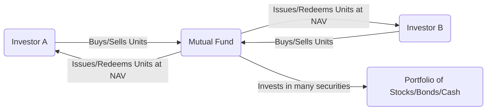

## 18.1 Types of Mutual Funds

Mutual funds are among the most popular investment products in Canada, offering individuals a convenient way to invest in a professionally managed and diversified portfolio of securities. Mutual funds pool money from numerous investors, then deploy these funds in equities, fixed-income securities, money market instruments, or alternative assets, depending on the fund’s mandate. In this section, we explore the basic structure of mutual funds, examine the various types available in Canada, and connect these to real-world examples, regulatory standards, and practical insights for investors.

---

### Key Structural Elements of Mutual Funds

Most mutual funds in Canada are structured as “open-end” funds, meaning new units (or shares) can be created or redeemed at the request of investors based on the fund’s Net Asset Value (NAV). This concept is central to understanding the fluid nature of mutual fund ownership:

• **Open-End Fund**: Unlimited number of units can be issued, and existing units can be redeemed at the current NAV.  
• **NAV (Net Asset Value)**: The total value of the fund’s assets (minus liabilities) divided by the number of outstanding units. This amount fluctuates daily.  

Below is a basic visual representation of an open-end mutual fund structure compared to an investor’s account:

This diagram highlights the constant inflow and outflow of capital. The mutual fund manager invests contributions from all investors in a diversified portfolio of assets such as stocks, bonds, or money-market instruments. When investors redeem their units, the fund adjusts its assets accordingly to meet redemption needs.

---

### Common Categories of Mutual Funds in Canada

The primary characteristic that differentiates one mutual fund from another is the type of securities it invests in and the fund’s investment strategy. As such, mutual funds are typically sorted into several categories, each catering to specific investor goals and risk tolerances.

#### Money Market Funds

• **Investment Focus**: Short-term debt instruments such as Treasury bills (T-bills) and commercial paper.  
• **Objective**: Capital preservation and high liquidity, aiming to minimize volatility.  
• **Typical Returns and Risks**: Historically lower returns compared to equity or bond funds, with correspondingly lower risk.  
• **Real-World Example**: RBC Canadian Money Market Fund or TD Premium Money Market Fund. Both invest in high-quality, short-term debt to preserve capital.  

Money market funds are popular with investors who have short investment horizons or who seek a “cash equivalent” type product. A business or a retiree requiring quick access to funds and stable value might use a money market fund to park idle cash while earning a modest yield.

#### Fixed-Income (Bond) Funds

• **Investment Focus**: Government bonds (e.g., federal, provincial, municipal), corporate bonds, and other debt instruments.  
• **Objective**: Generate steady interest income, though fund value is sensitive to interest rate changes.  
• **Subcategories**:  
  - Short-Term, Medium-Term, and Long-Term Bond Funds (based on maturity length)  
  - Investment-Grade vs. High-Yield Bond Funds (based on credit quality)  
  - Global, U.S., and Emerging Market Bond Funds (geographic focus)  

Bond fund prices typically decrease when interest rates rise, and they usually perform better in lower-rate environments. Institutions such as pension funds may invest in specialized bond funds focusing on secure government bonds to strengthen the fixed-income portion of portfolios.

#### Equity Funds

• **Investment Focus**: Stocks (common shares) of companies, aiming for capital growth over time.  
• **Risk-Return Profile**: Potential for higher returns over the long term, but with greater exposure to market volatility.  
• **Subcategories**:  
  - Large-Cap vs. Small-Cap  
  - Sector Funds (e.g., Technology, Financials, Healthcare)  
  - Dividend Funds  
  - Growth vs. Value Funds  

A well-known example in Canada is the RBC Canadian Equity Fund, which invests predominantly in large, established domestic firms. Another might be a TSX-focused fund that offers exposure to various sectors—financial services, energy, telecommunications—mirroring the Canadian economy.

#### Balanced Funds

• **Investment Focus**: A mix of equities, fixed-income securities, and sometimes cash equivalents.  
• **Objective**: Provide growth and income while mitigating volatility through diversification.  
• **Asset Allocation Approach**: Ratios differ widely but may look like 60% equity and 40% fixed-income, or any other combination that aligns with the fund’s stated objectives.  

Many Canadian investors gravitate toward balanced funds as a one-stop solution for moderate risk and balanced growth. The fund manager can re-allocate assets to respond to market conditions, offering investors a built-in diversification mechanism.

#### Target-Date Funds (Lifecycle Funds)

• **Investment Focus**: A dynamic asset mix, designed around a specific target date—often a retirement year.  
• **Objective**: More aggressive exposure in earlier years, gradually moving into conservative assets as the target date nears.  
• **Who They Benefit**: Investors who prefer a “set it and forget it” approach aligned with a personal timeline (e.g., retirement at 2040, 2050, etc.).  

Target-date funds automatically adjust their equity and bond allocations to reduce risk over time. This approach is useful for investors unsure of how to re-balance their investments or those who prefer automated asset allocation.

#### Index Funds

• **Investment Focus**: Replicate a specific market index (e.g., S&P/TSX Composite).  
• **Management Style**: Passive management; typically lower management fees relative to actively managed funds.  
• **Benefits**:  
  - Broader diversification  
  - Reduced stock selection and style risk  
  - Often more predictable performance relative to the benchmark  

John C. Bogle, founder of The Vanguard Group, championed the virtues of index investing for its simplicity and cost-effectiveness. In Canada, index funds are regulated similarly to other mutual funds but often come with management expense ratios (MERs) that are significantly lower than actively managed counterparts.

#### Industry- or Sector-Specific Funds

• **Investment Focus**: Concentrated in a specific sector such as technology, healthcare, or energy.  
• **Risk Profile**: Higher potential returns if the sector outperforms, but also greater risk because of limited diversification.  
• **Use Case**: Investors who wish to capitalize on sector rotation strategies, moving into or out of sectors depending on economic cycles.  

For instance, a Canadian technology sector fund might invest in companies such as Shopify, CGI, and other emerging tech start-ups to seek above-average growth. However, if the technology sector experiences a downturn, these funds can underperform broad-market funds.

#### Specialty Funds

• **Investment Focus**: Non-traditional asset classes or investment approaches (e.g., real estate, commodities, precious metals, ESG-focused).  
• **Objective**: Offer an avenue for diversifying into assets beyond standard equity and bond markets.  
• **Risks**: Often more volatile due to the nature of the underlying assets or approaches.  

Examples include sustainability-oriented funds, sometimes labeled ESG (Environmental, Social, and Governance) funds, which adhere to ethical or social values while still seeking returns. Some Canadian banks and asset managers have launched specialty funds concentrating on green bonds or renewable energy infrastructure.

---

### Regulatory Framework and Key Disclosures

Mutual funds in Canada are governed by stringent regulations designed to protect investors and ensure transparent operations. The Canadian Securities Administrators (CSA) oversees regulations for investment funds through rules such as:

• **National Instrument (NI) 81-101** – Mutual Fund Prospectus Disclosure  
• **NI 81-102** – Investment Funds  

Additionally, the Canadian Investment Regulatory Organization (CIRO) supervises mutual fund and investment dealers, ensuring consistent standards and best practices. Investors must be provided with “Fund Facts,” a concise, plain-language document that summarizes key information such as fees, historical performance, and investment strategies.

---

### Practical Considerations for Choosing a Mutual Fund

Selecting the right mutual fund goes beyond comparing past performance. Investors should consider:

1. **Investment Objectives**: Assess whether the fund aligns with short-term or long-term goals.  
2. **Risk Tolerance**: Evaluate volatility acceptance. An equity fund can provide higher growth but also greater fluctuations, while a money market fund offers lower risk and lower returns.  
3. **Time Horizon**: For short horizons, conservative or money market funds may be more appropriate. Longer horizons can justify equity or balanced funds.  
4. **Fees and Expense Ratios**: Management Expense Ratio (MER) and trading costs can significantly reduce net returns over time. Index funds generally have lower fees.  
5. **Fund Manager’s Track Record**: Review the manager’s history of navigating various market conditions.  
6. **Tax Implications**: Consider tax-efficient structures like holding funds in Registered Retirement Savings Plans (RRSPs) or Tax-Free Savings Accounts (TFSAs) to optimize returns.

---

### Common Pitfalls and Best Practices

• **Chasing Performance**: Investors who invest solely in last year’s “top performing fund” might be disappointed if market conditions change.  
• **Over-Concentration**: Placing too large a portion of savings into a niche or sector fund increases risk. Balanced or broad-based funds can mitigate this.  
• **Not Reading Fund Facts**: Key information such as fees, redemption costs, or the track record of the manager may go unnoticed if the investor does not review the official documentation.  
• **Neglecting Rebalancing**: Over time, the fund’s asset mix might shift away from the investor’s intended risk level. Consider a strategy to periodically review and adjust holdings.  

A best practice is to treat mutual fund selection as part of a broader financial planning process. Advisors often help clients align individual funds with their overall mix of investments to create a well-structured portfolio.

---

### Step-by-Step Fund Screening and Analysis

For best results, investors can perform the following steps to screen and analyze potential mutual funds:

1. **Define Your Objective**: Begin by specifying your return targets, time horizon, and risk tolerance.  
2. **Research and Compare**: Use tools like Morningstar (https://www.morningstar.ca/) to filter funds by category, fees, and performance.  
3. **Review Fund Facts**: Access “Fund Facts” documents from the CSA website (https://www.securities-administrators.ca/) or the fund issuer’s website to confirm key details.  
4. **Evaluate MER and Fees**: Ensure all costs (management fees, sales charges, etc.) are within acceptable limits, as fees have a direct impact on returns.  
5. **Assess Fund Manager’s Strategy**: Confirm whether the manager employs active or passive strategies. Examine the fund’s consistency in following its mandate.  
6. **Monitor Over Time**: Once invested, regularly track fund performance, industry or market changes, and compliance with your evolving financial goals.  

---

### Real-World Scenario: A Canadian Pension Fund Example

Consider a mid-sized Canadian pension fund wishing to diversify its holdings. It may invest heavily in:

• **Fixed-Income Funds** for stable cash flow and lower volatility.  
• **Canadian Equity Funds** for domestic growth and alignment with broad economic trends.  
• **Global Equity or Specialty Funds** to capture higher growth potential overseas or in emerging sectors.  

By combining multiple mutual funds that focus on different asset classes, the pension fund can balance risk and return while benefiting from the professional expertise of specialized portfolio managers.

---

### References and Additional Resources

1. **National Instrument 81-101 & 81-102** – Detailed guidelines on mutual fund operations in Canada.  
2. **CIRO (Canadian Investment Regulatory Organization)** – Ensures compliance of all mutual fund and investment dealers in Canada.  
3. **CSA Website** (https://www.securities-administrators.ca/) – Access “Fund Facts” documents for thorough disclosure on fund fees, holdings, and risk levels.  
4. **Morningstar** (https://www.morningstar.ca/) – Offers screening tools, fund performance data, and analytical reports.  
5. **“Common Sense on Mutual Funds” by John C. Bogle** – Timeless principles especially relevant for understanding index funds and controlling fees.  

---

### Summary

Mutual funds offer a seamless entry point to the financial markets for Canadian investors. Their professional management, diversified exposure, and flexible structures have made them a cornerstone of many investment portfolios. Understanding the variety of mutual fund categories—from money market funds seeking capital preservation to equity funds targeting long-term growth—empowers investors to align their choices with personal goals and risk tolerance. Critically, always keep regulatory requirements, funding objectives, and cost efficiency in mind when selecting a suitable mutual fund.

---

## Understanding Canadian Mutual Funds: Chapter 18.1 Quiz



### Which feature primarily distinguishes an open-end mutual fund from a closed-end fund?

- [ ] Total number of units is fixed at inception.  
- [ ] Units trade only on stock exchanges.  
- [x] Shares can be issued or redeemed at the fund’s current NAV.  
- [ ] It has no professional management team.  

> **Explanation:**( An open-end mutual fund’s structure enables it to continuously issue or redeem units at the prevailing NAV, while a closed-end fund issues a fixed number of shares and typically trades on an exchange.)

### Why do money market funds generally offer lower returns compared to other mutual funds?

- [ ] They invest heavily in speculative growth stocks.  
- [x] They invest in short-term, low-risk debt instruments that emphasize capital preservation.  
- [ ] Their management fees are typically higher.  
- [ ] They are subject to more frequent regulatory changes.  

> **Explanation:**( Money market funds focus on short-term government and corporate debt that provide stability and liquidity. While this strategy reduces risk, it also leads to lower returns compared to riskier asset classes.)

### Which of the following is a characteristic of balanced funds?

- [ ] They invest exclusively in equities.  
- [x] They blend equities, fixed-income, and sometimes cash equivalents.  
- [ ] They hold assets only in foreign markets.  
- [ ] They redistribute all capital gains annually.  

> **Explanation:**( Balanced funds combine multiple asset classes—equities, bonds, and cash—to achieve moderate returns while mitigating volatility through diversification.)

### What is the primary objective of target-date (lifecycle) funds?

- [ ] To outperform national stock indexes in any economic environment.  
- [x] To automatically adjust their asset mix as a specific retirement date nears.  
- [ ] To focus exclusively on emerging technologies.  
- [ ] To replicate the performance of the S&P/TSX Composite Index.  

> **Explanation:**( Target-date funds gradually shift towards more conservative holdings as the investor’s target date approaches, aligning the fund’s allocation with the investor’s stage in life.)

### An investor who believes actively picking stocks is beneficial but wants to maintain a significant index-based core could choose which approach?

- [x] Core-and-satellite strategy, using index funds as the core and a small portion of active specialty funds.  
- [ ] Investing only in money market instruments for the entire portfolio.  
- [x] Holding a mix of large-cap index funds but also sector-specific active funds.  
- [ ] Switching exclusively to guaranteed investment certificates (GICs).  

> **Explanation:**( A common best practice is to hold a “core” portion of the portfolio in low-cost index funds for broad market exposure, while “satellites” focus on active strategies or specialty funds aiming for alpha.)

### Sector-specific funds tend to exhibit greater risk because:

- [ ] They invest in government bonds.  
- [ ] They use exclusively passive management strategies.  
- [x] Their portfolios concentrate in a single industry, reducing diversification.  
- [ ] They hold excessive levels of cash.  

> **Explanation:**( By concentrating in a single sector, these funds lose the benefit of inter-industry diversification, making them more susceptible to sector downturns.)

### Which Canadian regulatory body oversees mutual fund dealers and investment dealers?

- [ ] The Office of the Superintendent of Financial Institutions (OSFI)  
- [ ] Canadian Securities Institute (CSI)  
- [x] Canadian Investment Regulatory Organization (CIRO)  
- [ ] European Securities and Markets Authority (ESMA)  

> **Explanation:**( CIRO (formerly IIROC/MFDA) oversees both mutual fund dealers and investment dealers in Canada, ensuring compliance and protecting investors.)

### The term “Fund Facts” refers to:

- [ ] An internal analysis prepared exclusively for high-net-worth individuals.  
- [ ] A quarterly press release from the fund manager.  
- [x] A concise regulatory document providing key details about a mutual fund.  
- [ ] A letter from the Canada Revenue Agency approving the fund’s tax status.  

> **Explanation:**( “Fund Facts” is a mandatory, plain-language disclosure document required under Canadian securities regulations, summarizing fees, performance, and risks.)

### When comparing mutual funds, which expense category is most crucial to consider over the long term?

- [x] The Management Expense Ratio (MER)  
- [ ] The cost of government-imposed fees on real estate transactions  
- [ ] Non-resident withholding charges  
- [ ] Subscription fees for financial newsletters  

> **Explanation:**( Over time, higher MERs can significantly erode investment returns, making it one of the most important factors to evaluate when selecting a mutual fund.)

### True or False: A balanced fund’s equity-to-fixed-income ratio remains static throughout different market cycles.

- [ ] True  
- [x] False  

> **Explanation:** Many balanced funds actively manage or periodically rebalance their allocations, changing the ratio of equities to fixed-income depending on market conditions and the fund’s objectives.



---

