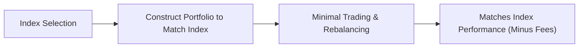

## 18.2 Fund Management Styles

Fund management styles broadly define the strategies that mutual fund managers use to research, select, and rebalance the securities within a portfolio. The management style determines not only the types of securities held but also the level of activity, the core objectives, and the associated costs for investors. In Canada, mutual funds are regulated under National Instrument 81-102 (NI 81-102), which stipulates specific rules around disclosure, investment restrictions, and operational guidelines. Additionally, the Canadian Investment Regulatory Organization (CIRO) oversees the activities of member firms distributing mutual funds and enforces rules surrounding suitability and Know Your Client (KYC) obligations.

Choosing the right fund management style is crucial for Canadian investors seeking alignment with their financial goals, risk tolerance, and investment horizon. Below, we explore the primary fund management styles employed by mutual funds in Canada and highlight key concepts such as management expense ratios (MERs), portfolio turnover, and benchmarks. We also provide examples, practical guidance, and references to Canadian regulations and institutions.

---

## Active Management

Active management involves deep research and continuous monitoring of the market to select securities believed to be undervalued or offering strong growth potential. Fund managers aim to outperform a chosen benchmark, such as the S&P/TSX Composite Index, using various tools:

1.1 Fundamental Analysis  
• Examines financial statements, economic reports, and industry data.  
• Assesses a company’s competitive advantages, growth prospects, and overall quality of management.  
• Commonly involves studying price-to-earnings (P/E) ratios, dividends, earnings growth, balance sheets, and cash flow statements.

1.2 Technical Analysis  
• Reviews historical price patterns, trading volumes, and momentum indicators.  
• Searches for trend lines, support/resistance levels, and chart patterns to make short-term or long-term predictions.  
• May complement fundamental analysis by aiding in timing entry and exit points.

### Potential Benefits and Challenges

• Potential for Outperformance: By carefully selecting investments, an experienced fund manager may beat the market benchmark.  
• Higher Fees: Active funds often incur higher fees (MERs) to compensate for research and portfolio turnover.  
• Greater Portfolio Turnover: Frequent trading can lead to increased transaction costs and taxable distributions for investors.  
• Fund Manager Risk: The fund’s success heavily depends on the skill and insights of the manager; underperformance is possible if the manager’s market assumptions prove incorrect.

### Practical Example (Canadian Context)

• A Canadian Equity Fund that focuses on mid-cap companies listed on the Toronto Stock Exchange (TSX) might use active management. The manager conducts corporate site visits, analyzes financial reports, and actively rebalances positions to capitalize on perceived valuation gaps.  
• Royal Bank of Canada (RBC) might offer such a fund where the manager closely tracks the performance of Canadian mid-cap stocks and rebalances frequently, aiming to outperform the S&P/TSX Completion Index.

---

## Passive Management

Passive management, often known as index investing, involves mirroring the composition of a specific market index, such as the S&P/TSX Composite Index or the S&P 500 (for Canadian investors with U.S. exposure). The goal is to match the market’s performance rather than beat it.

2.1 Key Characteristics  
• Low Fees: Because the portfolio is structured to replicate an index, there is little need for active decision-making and trading.  
• Minimal Turnover: Changes occur primarily when the underlying index updates its constituents.  
• Broad Market Exposure: Investors gain diversified access to the overall market or sector.

2.2 Suitability and Considerations  
• Consistent with Efficient Market Hypothesis: The premise that markets are generally efficient and it is difficult to outperform benchmarks consistently.  
• Tracking Error: Funds aim to replicate index performance but may not perfectly match it due to fees, liquidity constraints, and minor deviations in asset weighting.  
• Lower MER and Transaction Costs: Ideal for cost-conscious investors seeking market returns.

### Diagram: Passive Management Process

In this simplified flowchart:  
• The manager selects a benchmark index (A).  
• The fund is constructed to mimic the index holdings (B) with minimal ongoing trading (C).  
• As a result, the portfolio’s returns closely track the underlying index (D).

### Practical Example (Canadian Context)

• A passive Canadian equity index fund that replicates the S&P/TSX Composite Index.  
• Funds from Canadian banks such as TD and BMO often have index mutual funds or exchange-traded funds (ETFs) with a low MER, appealing to investors who prefer market returns with minimal fees.

---

## Quantitative (Quant) Strategies

Quantitative strategies employ complex algorithms, mathematical models, and vast data sets to identify investment opportunities. By statistically analyzing historical market data, quants attempt to uncover patterns or factors that correlate with future performance.

3.1 Components of Quantitative Methods  
• Factor Models: Evaluate factors like value, momentum, quality, or volatility to select securities expected to outperform.  
• Big Data and Machine Learning: Utilize large data sets, news feeds, social media sentiment, and alternative data to refine predictions.  
• Algorithmic Trading: Automated strategies execute trades at lightning speed, often capturing fleeting market inefficiencies.

3.2 Advantages and Risks  
• Objective Decision-Making: Reduces human biases such as overconfidence or emotional trading.  
• Complexity and Model Risk: Overfitting to historical data, sudden changes in market conditions, or data integrity issues can lead to significant drawdowns.  
• Transaction Costs: High-frequency strategies can incur notable costs if not precisely executed.

### Real-World Case (Canadian Perspective)

• A Canadian quantitative fund might employ a “multi-factor” approach focusing on factors like value, momentum, and low volatility in the TSX. The algorithm continuously scans for opportunities and rebalances frequently.  
• Pension funds, such as the Canada Pension Plan Investment Board (CPPIB), may use quantitative models to manage some portions of their massive portfolio, though they combine it with fundamental strategies as well.

---

## Thematic Investing

Thematic investing centers on macrolevel trends and structural shifts, targeting companies likely to benefit from emerging or ongoing developments. Themes might include:  
• Climate change and clean energy solutions.  
• Aging populations and healthcare demand.  
• Technological innovation, such as artificial intelligence (AI) or blockchain.  
• Demographic shifts in Canada, such as urbanization or immigration-led population growth.

4.1 Approach  
• Identifies a long-term trend (e.g., rising demand for electric vehicles).  
• Selects equities and other securities that align with that theme, such as lithium miners, EV manufacturers, or battery tech developers.  
• May overlap with active or passive strategies, depending on how the fund is constructed.

4.2 Pros and Cons  
• Growth Potential: Early movers can capture significant upside if the theme materializes.  
• Concentration Risk: If the theme faces headwinds or fails to meet expectations, the fund’s performance may suffer.  
• Regulatory Changes: Emerging sectors can have uncertain or rapidly shifting regulatory landscapes.

### Practical Example (Canadian Context)

• An environmentally focused mutual fund investing in companies tied to renewable energy projects in Canada—e.g., hydroelectric or wind farm operators.  
• Government policies encouraging green energy (e.g., tax credits for renewable projects) may support the theme and enhance returns.

---

## Style-Based Funds

Style-based funds concentrate on specific investment styles (e.g., growth or value) that mirror a particular investment philosophy.

### Growth Funds

• Invest primarily in companies expected to experience above-average revenue or earnings growth.  
• Often characterized by higher P/E ratios, as investors may be willing to pay a premium for robust future growth.  
• Common in tech, biotech, or companies with disruptive business models.  
• Might experience higher volatility because of the reliance on future earnings potential.

### Value Funds

• Seek undervalued companies trading at a discount to their intrinsic value based on price-to-earnings, price-to-book, or other valuation metrics.  
• Often look for stable, profitable companies that are temporarily out of favor with the market.  
• Emphasize capital preservation and potential for moderate growth.  
• Historically, value investing has formed the foundation of many Canadian mutual funds, particularly focusing on dividend-paying stocks or blue-chip companies.

---

## Key Concepts in Fund Management

### Management Expense Ratio (MER)

• Represents the total of a fund’s annual management fee, operating expenses, and taxes, expressed as a percentage of the fund’s average net assets.  
• Higher MERs typically correlate with more active strategies, while lower MERs are common in index or passively managed funds.

### Portfolio Turnover

• A measure of how often securities in a fund are bought and sold in a given period.  
• High turnover can lead to elevated trading costs and tax implications, as capital gains distributions increase.  
• Actively managed funds tend to have higher turnover than passive or index funds.

### Benchmark

• A standard measure (often an index) against which a fund’s performance is compared.  
• Helps investors determine if a fund’s returns are attributable to market movement or genuine manager skill.

---

## Applying Fund Management Styles in Practice

Selecting a fund management style largely depends on an investor’s objectives, risk tolerance, and time horizon:

1. **Risk Tolerance**  
   • Aggressive investors might favor active or thematic funds with potential for higher returns—and correspondingly higher risk.  
   • More conservative investors might gravitate toward passive strategies or lower-volatility, value-oriented funds that often feature stable returns.

2. **Cost Concerns**  
   • Passive funds are typically more cost-effective.  
   • Investors who prioritize cost savings may lean towards index mutual funds or ETFs.

3. **Investment Horizon**  
   • Longer horizons allow for greater flexibility in weathering short-term market turbulence (beneficial for growth or thematic funds).  
   • Shorter horizons may favor funds with lower volatility or stable dividends (often found in value funds).

4. **Diversification**  
   • Combining various styles—active, passive, and thematic—can smooth returns and reduce the risk of relying on a single strategy.

---

## Regulatory and Informational Resources

• **NI 81-102**: Governs mutual funds in Canada, outlining requirements on investments, fee disclosures, and operational constraints.  
• **CIRO**: Oversees registered firms dealing with mutual funds, ensuring compliance with regulations and upholding investor protection through KYC and suitability obligations.  
• **SEDAR+**: A central resource where investors can find fund prospectuses, annual information forms, and other regulatory filings.  
• **Canadian Investment Funds Standards Committee (CIFSC)**: Maintains standardized categories for mutual funds, aiding investors in comparing funds with similar objectives.  
• **Open-Source Tools**: Python-based libraries such as pandas and NumPy can help investors analyze historical data for quantitative strategies.  
• **Further Reading**:  
  - “The Intelligent Investor” by Benjamin Graham for foundational value investing principles.  
  - CIRO bulletins and guidelines for ongoing regulatory developments.

---

## Case Study Example: Canadian Growth vs. Canadian Value Fund

A major bank, such as TD Bank, might offer two mutual funds:  
• “TD Canadian Growth Fund”: Focused on high-growth companies, possibly in tech or rapidly expanding industries. Over the last year, it had a turnover rate of 80% and an MER of 2%.  
• “TD Canadian Value Fund”: Targets undervalued or underpriced dividend payers, with a turnover rate of 30% and an MER of 1.2%.  

An investor looking for potentially higher returns and comfortable with volatility may choose the growth fund, while someone seeking stable returns and lower turnover might opt for the value fund.

---

## Best Practices and Common Pitfalls

### Best Practices  
• Align the management style with personal goals, risk profile, and time horizon.  
• Evaluate MERs and turnover ratios to understand fees and tax implications.  
• Look beyond short-term performance; assess consistency and risk-adjusted returns.

### Common Pitfalls  
• Chasing past performance: A fund that performed well historically may not sustain the same results.  
• Ignoring fees: High fees can significantly erode returns over the long term.  
• Lack of diversification: Concentrated bets on a single sector/theme can lead to large drawdowns during sector downturns.

---

## Conclusion and Key Takeaways

Understanding fund management styles is essential for making informed decisions about where and how to invest. Active management promises the potential for higher returns but demands thorough research and higher fees. Passive management delivers suite-like market performance with lower cost and turnover. Quantitative strategies harness data-driven insights, but they carry idiosyncratic risks such as model overfitting. Thematic investing taps into powerful macro-level trends, although these funds can be more volatile. Finally, style-based funds—growth or value—offer two distinct approaches catering to different investor preferences.

Investors should always compare a fund’s objectives, fees, and performance relative to an appropriate benchmark. Leveraging resources such as SEDAR+, CIFSC classifications, and educational materials like “The Intelligent Investor” helps Canadians contextualize their choices. Balancing multiple styles within a well-diversified portfolio, and carefully adhering to regulatory guidelines, can pave the way for a strategic, disciplined approach to mutual fund investing.

---

## Test Your Knowledge: Canadian Mutual Fund Management Styles



### Which of the following best describes an active management approach?  
- [x] Continuously researching and handpicking securities to outperform a benchmark.  
- [ ] Replicating the composition of a given market index.  
- [ ] Seeking specific macro trends in the market.  
- [ ] Using algorithms to identify statistical patterns  

> **Explanation:** Active managers aim to outperform a benchmark by selecting securities based on research and adjustments as market conditions change.

### What is a defining characteristic of passive fund management?  
- [ ] Frequent security trading.  
- [ ] A high Management Expense Ratio (MER).  
- [x] Minimal turnover to match an index’s composition.  
- [ ] Constant short-selling to hedge against market downturns.  

> **Explanation:** Passive funds are designed to mirror a market index with minimal turnover, leading to lower fees and fewer trades.

### Which statement about quantitative (quant) strategies is most accurate?  
- [x] They rely on mathematical models and large data sets to identify opportunities.  
- [ ] They depend solely on fundamental metrics like P/E and dividend yield.  
- [ ] They disregard all statistical analysis and focus on macroeconomic themes.  
- [ ] They cannot incorporate big data and machine learning.  

> **Explanation:** Quantitative strategies use algorithms, statistical methods, and often big data to execute trades and uncover market inefficiencies.

### Thematic investing typically focuses on:  
- [ ] Keeping turnover as low as possible.  
- [ ] Matching a broad index benchmark through replication.  
- [ ] Short-term technical chart patterns.  
- [x] Macrolevel, long-term trends like sustainability or demographic shifts.  

> **Explanation:** Thematic funds base their strategy on prevailing macro themes (e.g., green energy or AI) and invest in companies poised to benefit from these trends.

### Value funds generally invest in:  
- [x] Companies they believe are undervalued relative to fundamentals.  
- [ ] High-flying stocks with high P/E ratios.  
- [x] Enterprises trading below their intrinsic worth.  
- [ ] Only government bonds.  

> **Explanation:** Value funds seek stocks that are undervalued by the market, often with attractive price-to-earnings (P/E) or price-to-book ratios.

### High portfolio turnover in a mutual fund often indicates:  
- [x] More frequent trading and possible higher transaction costs.  
- [ ] A strictly passive indexing strategy.  
- [ ] Long-term buy-and-hold tactics.  
- [ ] No impact on trading costs or taxation.  

> **Explanation:** High turnover involves frequent buying and selling of securities, increasing trading expenses and potentially leading to higher taxable capital gains distributions.

### Under which regulatory framework do most Canadian mutual funds operate?  
- [x] National Instrument 81-102.  
- [ ] Basel III Accord.  
- [x] CIRO guidelines for dealer conduct.  
- [ ] U.S. SEC Regulation.  

> **Explanation:** Canadian mutual funds must adhere to NI 81-102, and CIRO oversees dealers and suitability rules.

### Which of the following is an essential resource for public disclosure of mutual fund documents in Canada?  
- [x] SEDAR+.  
- [ ] Bank of Canada’s monetary policy announcements.  
- [ ] Bloomberg Terminal.  
- [ ] The Canada Revenue Agency’s website.  

> **Explanation:** SEDAR+ is the electronic filing system where mutual fund prospectuses and annual reports are publicly accessible.

### What is a benchmark in the context of mutual funds?  
- [x] A standard measure against which a fund’s performance is compared.  
- [ ] A regulatory penalty imposed by CIRO.  
- [ ] A guaranteed rate of return set by the fund manager.  
- [ ] Another name for the MER.  

> **Explanation:** A benchmark, such as a market index, is used to evaluate whether the fund’s performance is due to general market movement or the manager’s skill.

### True or False: Thematic investing targets specific sectors or industries expected to benefit from sustained macro-level trends.  
- [x] True  
- [ ] False  

> **Explanation:** Thematic investing focuses on major, often long-term trends like clean energy or demographic changes, selecting companies that may flourish under those conditions.



---

