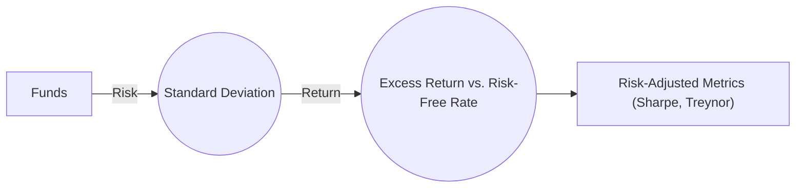

## 18.4 Measuring Mutual Fund Performance

Measuring mutual fund performance is critical for evaluating how effectively the fund’s manager allocates assets and manages risk. Investors need to understand how to read performance reports, interpret risk-adjusted metrics, and relate mutual fund returns to relevant Canadian regulations and market conditions. This section explores the key concepts involved in analyzing mutual fund performance, including rate of return calculations, benchmark comparisons, and the use of risk-adjusted measures such as the Sharpe ratio, Treynor ratio, and Alpha.

---

## The Importance of Performance Measurement

Mutual fund investors—both retail and institutional—seek consistent growth and returns that reflect the fund’s stated objectives. Performance measurement:
• Helps assess if the fund is meeting its investment goals.  
• Evaluates the manager’s skill beyond overall market movements.  
• Compares risk-adjusted returns among peers and against benchmarks.  
• Enables investors to make informed decisions about buying, holding, or selling their mutual fund units.  

In the Canadian financial market, performance reporting must align with the guidelines set by the Canadian Investment Regulatory Organization (CIRO) and the Canadian Securities Administrators (CSA). Fund Facts documents, which are mandated disclosure documents, provide standardized information about a fund’s historical returns, fees, and risks, allowing investors to make apples-to-apples comparisons across funds.

---

## Rate of Return

### Definition and Basic Concepts

A mutual fund’s rate of return represents the percentage increase (or decrease) in the value of the investment over a specific period, typically expressed on a total return basis. A total return includes both price changes (capital gains or losses) and any distributions (dividends, interest, or capital gains) that may be reinvested in the fund.

The formula for a simple holding period return (unannualized) is:

( (Ending Value of Investment – Beginning Value of Investment + Distributions) / Beginning Value of Investment ) × 100%

For example, suppose an investor purchases C$10,000 worth of a mutual fund. Over one year, the fund appreciates to C$10,800, and it distributes C$200 in dividends, which the investor automatically reinvests. The total return would be calculated as:

( (10,800 – 10,000 + 200) / 10,000 ) × 100% = 10%

### Relevance to Investors

• Allows for a straightforward snapshot of how much the investment has grown.  
• Must be evaluated relative to risk, market conditions, and alternative investments.  
• In Canada, certain tax-sheltered accounts like TFSAs (Tax-Free Savings Accounts) and RRSPs (Registered Retirement Savings Plans) can influence after-tax returns. Investors often compare after-tax growth when deciding where to hold different types of mutual funds.  

---

## Benchmark Comparisons

### Why Benchmarks Matter

A benchmark is a standard against which a fund’s returns are measured, typically an index that matches the fund’s investment mandate. Examples include:
• S&P/TSX Composite Index for a Canadian equity fund.  
• FTSE Canada Universe Bond Index for a Canadian bond fund.  
• MSCI World Index for a global equity fund.  

Benchmark comparisons help distinguish market-driven returns from the added value (or detriment) of the fund manager’s decisions.

### Selecting Appropriate Benchmarks

Selecting a relevant benchmark ensures a fair comparison. For instance, if a fund invests primarily in Canadian dividend-paying stocks, the S&P/TSX Composite High Dividend Index would be more appropriate than a broader market average. Canadian investors often reference RBC, TD, or other large financial institutions’ in-house indexes as well, though these are typically used in more specific circumstances.

### Outperformance and Underperformance

• Outperformance (positive “alpha”) indicates the manager has delivered returns exceeding the benchmark’s returns, considering the level of risk taken.  
• Underperformance can occur if the fund lags behind the benchmark or if excessive fees erode returns.  
• CIRO rules require clear and transparent disclosure of performance relative to appropriate benchmarks, often featured in Fact Sheets and Quarterly Reports.  

---

## Risk-Adjusted Performance Measures

Measuring returns alone does not reveal how much risk a fund took to generate those returns. Risk-adjusted measures address this gap, comparing performance against volatility or market risk.

### Sharpe Ratio

The Sharpe ratio measures the excess return above the risk-free rate per unit of total risk (standard deviation). It is calculated as:

Sharpe Ratio = (Fund Return – Risk-Free Rate) / Standard Deviation of Fund Returns

• The higher the Sharpe ratio, the better the fund’s risk-adjusted performance.  
• Risk-free rate: Typically proxied by short-term Government of Canada Treasury bills.  
• Standard deviation: Reflects the variability or volatility of the fund’s returns.

For instance, assume Fund A has an annual return of 8%, a risk-free rate of 2%, and a standard deviation of 10%. Its Sharpe ratio is:

Sharpe Ratio = (8% – 2%) ÷ 10% = 0.6

A Sharpe ratio of 0.6 means the fund earns 0.6% of excess return per 1% of total risk. By comparing this with other funds, investors can see which one is achieving more return for each unit of volatility.

### Treynor Ratio

The Treynor ratio isolates systematic risk (market risk) using beta as the measure of volatility. Beta captures the fund’s sensitivity to movements in a chosen benchmark or market index.

Treynor Ratio = (Fund Return – Risk-Free Rate) / Beta

• If a fund invests in Canadian equities primarily correlated with the S&P/TSX Composite Index, its beta might be close to 1.  
• A Fund Return of 8%, a Risk-Free Rate of 2%, and a Beta of 1.2 results in a Treynor ratio of:

(8% – 2%) ÷ 1.2 = 5%  

Hence, the fund generated 5% of excess return per unit of market risk.

### Alpha

Alpha is the incremental return that exists over and above the expected return due to overall market movement. It is calculated as:

Alpha = Fund Return – (Risk-Free Rate + Beta × (Market Return – Risk-Free Rate))

• A positive alpha indicates value added by the fund manager.  
• A negative alpha suggests underperformance relative to what the market return alone would predict, given the fund’s level of systematic risk.  

---

## Annualized Returns and Rolling Returns

### Annualized (Compound) Returns

Mutual funds commonly report annualized returns for periods like 3 years, 5 years, or 10 years. This converts the total return over a multi-year period into an average annual return, enabling easier comparisons across different investment horizons.

For example, if a fund’s value rose from C$10,000 to C$15,000 over five years (with no additional contributions), the total growth is 50%. The annualized return can be found using the compound growth formula:

(Ending Value / Beginning Value)^(1 / Number of Years) – 1

(15,000 ÷ 10,000)^(1 ÷ 5) – 1 = (1.5)^(0.2) – 1 ≈ 0.08447 → 8.45%

### Rolling Returns

Rolling returns assess performance over overlapping intervals (e.g., monthly, quarterly, or annually) to capture consistency over time. This can help identify patterns or trends that single “point-to-point” returns may overlook.

• Example: A fund’s 3-year rolling return might be computed each quarter. This forms a historical series of 3-year return windows for deeper performance analysis.  
• Consistency in rolling returns can be a hallmark of less volatile funds, which is often appealing to risk-averse Canadian investors.  

---

## Distribution Adjustments

### Distributions in Mutual Funds

Mutual funds distribute dividends, interest income, and realized capital gains to unitholders. In many cases, investors choose to reinvest these distributions, purchasing additional fund units. This reinvestment:

• Enhances the compounding effect over time.  
• Must be included in performance calculations to reflect total returns accurately.  

### Impact of Reinvestment

Reinvesting distributions typically accelerates the growth of an investment. For example, the total return chart for a mutual fund that automatically reinvests distributions will show a higher ending value than one in which distributions are paid out in cash and not reinvested.

### Tax Considerations

Distributions are typically taxable in non-registered accounts, based on their nature (capital gains, dividends, or interest). In registered or tax-sheltered accounts (e.g., RRSPs, TFSAs), taxes on distributions are often deferred or eliminated, affecting net returns.

---

## Real-World Illustrations and Case Studies

### Canadian Equity Fund Example

A well-known fund at a major Canadian bank like RBC or TD might benchmark itself against the S&P/TSX Composite Index, aiming to deliver above-average capital gains and dividends. If RBC Canadian Equity Fund posted a 10% total return last year while the S&P/TSX Composite Index rose 8.5%, investors might point to a positive alpha. But they must also evaluate whether the fund’s higher volatility or fees impacted its net performance.

### Example with Open-Source Tools

Investors can utilize open-source or subscription-based financial tools—such as those from Morningstar (http://www.morningstar.com/)—to retrieve data on a mutual fund’s returns and compare them with benchmarks. Many Canadian investors also examine environmental, social, and governance (ESG) metrics, which can affect how the fund’s performance is viewed in the broader context of sustainable investing.

### Diagram: Simplified View of Risk-Adjusted Performance Comparison

Below is a Mermaid diagram representing different funds plotted against risk (x-axis) and return (y-axis). The risk-free rate is labeled as a separate reference line.

Explanation:  
• Fund performance data flows into the analysis of risk (often standard deviation).  
• We compare the return above the risk-free rate to see if the fund’s risk exposure is justified.  
• Risk-adjusted performance indicators, such as Sharpe and Treynor ratios, become the final product of this chain.

---

## Best Practices and Common Pitfalls

### Best Practices

• Assess Consistency: Look beyond short-term, single snapshots. Examine multi-year and rolling returns.  
• Evaluate Risk Adjusted Metrics: Use Sharpe, Treynor, and alpha to understand how a manager navigates market volatility.  
• Review Benchmarks Carefully: Use an appropriate benchmark. An inappropriate benchmark may misrepresent relative performance.

### Pitfalls to Avoid

• Ignoring Fees: Management Expense Ratios (MERs) and trading costs can significantly impact net returns.  
• Chasing Past Performance: High historical returns do not guarantee future outperformance.  
• Overlooking Risk: A high return in one period might come with elevated risk, leading to unsustainable results over the long term.

---

## Compliance and Regulatory Framework in Canada

• CIRO (Canadian Investment Regulatory Organization) mandates rules around transparent and timely reporting of mutual fund returns.  
• Fund Facts: CSA regulations require mutual funds to provide a concise 2-page Fund Facts document that includes historical performance and risk ratings.  
• Ongoing Disclosure: Monthly or quarterly statements must show cost and market value, distributions, and year-to-date returns.

By following these guidelines, investors and financial advisors remain compliant with Canadian securities regulations and uphold ethical standards for disclosure and transparency.

---

## Glossary

• Sharpe Ratio: A measure of risk-adjusted return, calculated as (Portfolio Return – Risk-Free Rate) ÷ Standard Deviation of Portfolio.  
• Treynor Ratio: A risk-adjusted measure that uses Beta to account for systematic (market) risk.  
• Alpha: The incremental return above what the market would predict given a fund’s Beta.  
• Beta: A measure of how much a fund’s returns move relative to its benchmark. A Beta of 1.0 means the fund typically moves in lockstep with the market.  
• Total Return: Includes both price appreciation (or depreciation) and reinvested distributions over a given period.

---

## Summary

Measuring and evaluating mutual fund performance is fundamental to sound investment decision-making. By examining simple and risk-adjusted returns, comparing results to suitable benchmarks, and adjusting for distributions, investors can better gauge a manager’s contribution to performance. Annualized and rolling returns provide complementary insights, highlighting both long-term growth prospects and consistency of returns. Adherence to Canadian regulatory requirements ensures transparency and clarity when analyzing and reporting these performance metrics.

Stay vigilant to fees, the appropriateness of the benchmark, and the influence of market forces. When combined with prudent portfolio construction and a solid financial plan, an effective mutual fund strategy can fulfill diverse investor needs in the Canadian landscape.

---

## Quiz: Master Mutual Fund Performance in Canada



### Which of the following best describes the total return of a mutual fund?

- [ ] The interest generated only.  
- [x] The change in fund price plus any distributions over a given period.  
- [ ] Only the change in share price from the beginning to the end of the period.  
- [ ] The change in the market value of the fund minus management fees.

> **Explanation:** Total return includes both price changes and any distributions (dividends, interest) that are often reinvested to compound growth.

### Why is a benchmark comparison useful in evaluating mutual fund performance?

- [x] It allows investors to see if the fund manager’s results exceed a relevant market index.  
- [ ] It ensures the fund stays below market returns to minimize taxes.  
- [x] It helps assess the effectiveness of fund management decisions.  
- [ ] It compensates investors directly when the benchmark is outperformed.

> **Explanation:** Benchmark comparisons reveal whether a fund outperforms or underperforms the overall market index, shedding light on the manager’s skill and strategy.

### Which of the following metrics measures a fund’s excess return per unit of total volatility (standard deviation)?

- [ ] Beta  
- [x] Sharpe Ratio  
- [ ] Treynor Ratio  
- [ ] Dividend Yield

> **Explanation:** The Sharpe ratio measures how much return is earned per unit of total risk, defined by standard deviation.

### A Treynor ratio focuses on what kind of risk?

- [ ] Unsystematic risk  
- [ ] Interest rate risk  
- [x] Systematic (market) risk  
- [ ] Default risk

> **Explanation:** The Treynor ratio uses beta—an indicator of systematic risk—to evaluate excess return relative to market risk.

### What is Alpha in mutual fund performance measurement?

- [x] It is the portion of return unexplained by market movement, often reflecting manager skill.  
- [ ] It is the measurement of total market volatility.  
- [x] It is a negative number when the fund outperforms the market.  
- [ ] It is the same as the risk-free rate.

> **Explanation:** Alpha indicates the degree to which the fund’s performance is explained by factors other than broad market movements, offering insight into active management skill.

### Which statement best describes annualized returns?

- [x] They convert multi-year total returns into an average annual rate of growth.  
- [ ] They only measure performance over a single calendar year.  
- [ ] They do not consider the impact of compounding.  
- [ ] They are only used for short-term performance analysis.

> **Explanation:** Annualized returns show the compounded rate of return on an investment over a specified period, allowing straightforward year-over-year comparisons.

### Why might rolling returns be more informative than point-to-point returns?

- [x] They track performance over overlapping intervals, highlighting consistency or volatility trends.  
- [ ] They measure performance from inception only.  
- [x] They ignore fees and taxes to simplify results.  
- [ ] They track only total returns without distributions.

> **Explanation:** Rolling returns capture a fund’s performance across multiple overlapping periods, helping identify periods of high or low performance and overall stability.

### In Canada, which organization enforces rules around performance reporting for mutual funds?

- [ ] FDIC  
- [x] CIRO  
- [ ] IMF  
- [ ] Federal Reserve

> **Explanation:** The Canadian Investment Regulatory Organization (CIRO) is responsible for ensuring that mutual fund performance reporting complies with applicable guidelines.

### Which of the following is considered a best practice in mutual fund performance evaluation?

- [ ] Ignoring short-term volatility entirely.  
- [ ] Always choosing the fund with the highest returns, regardless of risk.  
- [x] Evaluating both returns and risk (via Sharpe, Treynor, or Alpha) over multiple periods.  
- [ ] Relying solely on the fund’s marketing materials for decisions.

> **Explanation:** A comprehensive approach includes looking at risk-adjusted returns, consistency across multiple timeframes, and transparency of reporting.

### Reporting mutual fund distributions within a tax-sheltered account like an RRSP:

- [x] Defers taxes on distributions until funds are withdrawn.  
- [ ] Immediately triggers capital gains tax.  
- [ ] Exempts the investor from any fees.  
- [ ] Is disallowed by the Canada Revenue Agency (CRA).

> **Explanation:** Within an RRSP, taxes on mutual fund distributions are deferred until withdrawal, potentially lowering the overall tax burden for Canadian investors.



---

