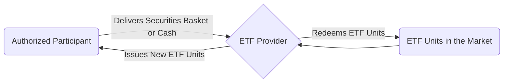

## 19.1 The Regulation and Structure of Exchange-Traded Funds

Exchange-Traded Funds (ETFs) have grown tremendously in popularity among Canadian investors for their low costs, intraday tradability, and broad diversification benefits. From large pension funds to individual retail investors, ETFs play a key role in many portfolios. Their rapid growth has led to an equally robust and evolving regulatory oversight to ensure investor protection and market integrity. This section explores how ETFs are regulated in Canada and examines the essential structures underlying their operations.

---

## Regulatory Framework for ETFs

### Role of the Canadian Securities Administrators (CSA)

In Canada, securities regulation is provincially and territorially based, but these authorities coordinate their efforts under the umbrella of the Canadian Securities Administrators (CSA). The CSA works to:

• Harmonize securities laws across provinces and territories.  
• Create consistent rules and instruments governing investment funds (e.g., National Instrument 81-102).  
• Oversee prospectus requirements and continuous disclosure obligations.  

By following CSA regulations, ETF providers must adhere to uniform standards in areas such as disclosure, reporting, and operations.

### National Instrument 81-102

National Instrument 81-102 is the key regulatory framework for mutual funds and many other types of publicly offered investment funds, including many ETFs. Key requirements include:

• Restrictions on leverage, concentration, and illiquid assets.  
• Requirements for custody arrangements to safeguard assets.  
• Rules around fund governance, fees, and investor disclosure.  

Although ETFs and mutual funds differ in how they trade and price, NI 81-102 imposes similar standards, ensuring the protection of investors through transparent disclosures and well-defined investment policies.

### Listing Requirements on Canadian Exchanges

Since ETFs are listed and traded on exchanges (such as the Toronto Stock Exchange, TSX, or the Canadian Securities Exchange, CSE), they must also comply with the listing requirements of the relevant exchange. Common listing requirements may include:

• Minimum capital or asset thresholds.  
• Sufficient distribution of ETF units among investors (to ensure liquidity).  
• Ongoing compliance with exchange rules regarding corporate governance and public disclosure.  

By listing on the TSX or another Canadian exchange, ETFs gain access to secondary market trading under a regulated and transparent environment. This gives investors the convenience of buying or selling ETF units throughout the trading day.

### Prospectus and Continuous Disclosure

ETFs must register a prospectus, which details:

• The ETF’s investment objectives and strategies.  
• Fees and expenses (such as management fees and operating costs).  
• Risks associated with the ETF’s structure and underlying assets.  

This document provides transparency, ensuring that investors have a clear understanding of the product. ETFs also provide “ETF Facts”—a concise summary of key information for investors—upon purchase, while continuous disclosure obligations require publishing annual and interim reports, management discussion and analysis (MD&A), and financial statements to keep the investing public informed.

---

## Structure of ETFs

### Creation and Redemption Process

At the heart of an ETF’s structure is the creation/redemption mechanism, which helps maintain the ETF’s market price close to its net asset value (NAV). Rather than having to buy or sell shares of the ETF from the general inventory of shares, certain institutions known as “Authorized Participants” (APs) can create or redeem large blocks of ETF units directly with the ETF provider.

• Creation of Units — APs deliver a “basket” of the ETF’s underlying securities (or a cash equivalent) to the ETF provider in exchange for new ETF units.  
• Redemption of Units — APs return ETF units to the provider and receive the underlying basket of securities (or cash) in exchange.

This in-kind process minimizes transaction costs within the ETF and helps keep the ETF’s trading price aligned with the underlying assets. If an ETF’s market price drifts too far above its NAV, APs can step in, create more units (by buying the underlying securities) and sell these in the market. Conversely, if the market price falls below the NAV, APs can redeem large blocks of ETF units to capture the price difference. These arbitrage activities help to ensure the ETF’s price remains near its NAV.

Below is a simplified Mermaid.js diagram illustrating the creation/redemption cycle:

### Role of the Authorized Participant (AP)

APs are typically large financial institutions—such as RBC Dominion Securities or TD Securities—capable of trading large quantities of stocks and managing complex transactions. Because APs have direct access to the ETF provider, they can:

• Efficiently handle creation/redemption orders in large blocks (usually 50,000 units or more).  
• Engage in arbitrage to maintain the ETF’s market price in line with its NAV.  
• Provide liquidity to the marketplace by making ETF units more readily available.

For example, if RBC Dominion Securities perceives a significant premium between an ETF’s market price and its NAV, it might deliver the underlying basket of securities to the ETF provider, create new ETF units, and then sell those units to the market, profiting from the price difference. This action will typically nudge the ETF’s price back toward its NAV.

### Custodians and Transfer Agents

ETFs also rely on third-party service providers to facilitate secure and orderly operations:

• Custodians: Safeguard the ETF’s underlying assets (e.g., stocks, bonds, or other securities). They maintain custody of these assets in segregated accounts to ensure the assets are protected should any financial or operational issues occur with the ETF provider.  
• Transfer Agents: Maintain accurate records of ETF ownership and handle processes such as issuing new unit certificates, cancellations, and transfers.

These functions must be carried out in strict accordance with securities regulations and industry best practices. For the investor, the presence of reputable custodians and transfer agents is crucial to maintaining trust and stability in the ETF market.

---

## Oversight by the Canadian Investment Regulatory Organization (CIRO)

CIRO (the Canadian Investment Regulatory Organization) is the national self-regulatory organization (SRO) overseeing investment dealers, mutual fund dealers, and related marketplaces in Canada. CIRO’s role includes:

• Setting proficiency and ethical standards for investment dealers who market and sell ETFs.  
• Monitoring sales practices, business conduct, and complaint handling.  
• Requiring dealers to maintain proper capital and adhere to strict risk-management practices.

By ensuring that ETF dealers follow stringent guidelines, CIRO helps maintain a healthy marketplace and protects the interests of Canadian investors.

---

## Best Practices, Pitfalls, and Real-World Applications

### Best Practices When Selecting ETFs

• Review the ETF’s prospectus and “ETF Facts” to understand investment objectives, strategies, and costs.  
• Compare the ETF’s historical tracking error—does it closely track its benchmark index?  
• Monitor the ETF’s bid-ask spreads and trading volume to gauge liquidity, especially for large trades.  
• Understand tax implications, such as distributions and the impact of holding ETFs in registered accounts (e.g., RRSPs, TFSAs).

### Common Pitfalls

• Ignoring Fees: While ETFs are generally considered low-cost investments, management fees, trading commissions, and spreads can still erode returns.  
• Trading Indiscriminately: Intraday trading flexibility can tempt investors to make frequent short-term trades, possibly increasing costs and tax obligations.  
• Lack of Diversification: Some ETFs track narrow sectors or niche themes, leading to concentrated exposures. Investors should be mindful of the fund’s underlying constituents.

### Real-World Scenario

Consider a large Canadian pension fund seeking broad exposure to emerging markets. Rather than attempting to buy hundreds of international equities individually, the pension fund might simply purchase units of a TSX-listed emerging markets ETF. Meanwhile, authorized participants—like TD Securities—support the liquidity by creating or redeeming ETF units depending on market demand.

This approach:  
• Saves the pension plan from having to manage numerous cross-border transactions.  
• Ensures a transparent vehicle for emerging market exposure, with the convenience of trading on a Canadian exchange.  
• Offers cost efficiencies and simplified portfolio management.

---

## Step-by-Step Insight: Launching an ETF in Canada

1. Conceptualize the ETF Strategy  
   – Determine the investment objective (e.g., track a broad Canadian equity index, or a specialized theme).  
   – Conduct market research to identify demand, competition, and potential tracking indexes.

2. Secure Regulatory Approval  
   – Work with legal advisors to prepare and file a preliminary prospectus.  
   – Ensure compliance with National Instrument 81-102 and relevant CSA rules.  
   – Address any exchange listing requirements (e.g., on the TSX).

3. Establish Fund Service Providers  
   – Select a custodian for asset safekeeping (potentially a large Canadian bank trust arm).  
   – Engage a transfer agent for handling registration of units.  
   – Partner with authorized participants to enable in-kind creation and redemption.

4. Finalize and File Prospectus  
   – Obtain regulatory clearance.  
   – Publish final prospectus and related disclosure documents (e.g., ETF Facts) for investors.

5. Launch and Listing  
   – List the ETF on a Canadian exchange.  
   – Begin trading.  
   – Continuously monitor performance, market conditions, and compliance requirements.

---

## Additional Resources

• [Canadian Securities Administrators (CSA)](https://www.securities-administrators.ca/) for the latest National Instruments and policy statements.  
• [CIRO](https://www.ciro.ca/) for regulatory updates, dealer guidelines, and best practices.  
• [SEDAR+](https://www.sedarplus.ca/) for official ETF filings, including prospectuses and ETF Facts.  
• Toronto Stock Exchange and Canadian Securities Exchange listing requirements for comprehensive listing guidelines.  
• “The ETF Book” by Richard A. Ferri for a deeper exploration into ETF strategies and mechanics.

---

## Summary

Exchange-Traded Funds in Canada operate under a robust framework that combines securities legislation, exchange listing rules, and self-regulatory oversight by CIRO. Their creation/redemption mechanism ensures pricing efficiency, while stringent disclosure requirements and third-party custodians safeguard investors’ interests. Whether you are an institutional investor or a retail participant, understanding the regulatory and structural underpinnings of ETFs is essential for making informed decisions. By following regulatory guidelines, engaging with knowledgeable service providers, and staying aware of fees and potential risks, investors can maximize the benefits of this increasingly popular instrument.

---

## Quiz: Regulation and Structure of Exchange-Traded Funds in Canada



### Which Canadian organization harmonizes securities regulation across the country and oversees rules for ETFs under its umbrella?
- [ ] CIRO
- [ ] TSX
- [x] CSA
- [ ] CSE

> **Explanation:** The Canadian Securities Administrators (CSA) coordinate and harmonize securities regulation across provinces and territories in Canada.  

### What is a key national instrument governing many Canadian ETFs and mutual funds?
- [ ] National Instrument 45-106
- [x] National Instrument 81-102
- [ ] National Instrument 31-103
- [ ] National Instrument 71-101

> **Explanation:** National Instrument 81-102 sets out rules and requirements for mutual funds and many types of ETFs in Canada.  

### What is the primary role of Authorized Participants (APs) in ETF operations?
- [ ] They directly manage the ETF’s investment strategy.
- [x] They create and redeem ETF units to maintain market price near NAV.
- [ ] They collect shareholder fees on behalf of the ETF.
- [ ] They regulate the ETF industry.

> **Explanation:** Authorized Participants interact directly with the ETF provider to create or redeem large blocks of ETF units, which helps keep the market price in line with the ETF’s net asset value (NAV).  

### Under what circumstances might Authorized Participants redeem ETF units with the provider?
- [ ] When interest rates remain stable.
- [x] When the ETF’s market price is trading below its NAV.
- [ ] When the fund experiences regulatory changes.
- [ ] Only when the ETF is domiciled outside of Canada.

> **Explanation:** APs typically redeem ETF units when the market price falls below the NAV, capturing the spread and thereby driving the ETF’s price back toward NAV.  

### Which of the following entities holds the underlying assets of an ETF to ensure safekeeping?
- [ ] The CSA
- [ ] The ETF provider’s marketing team
- [x] A custodian
- [ ] A market maker

> **Explanation:** A custodian, typically a large financial institution, is responsible for safekeeping the ETF’s underlying assets.  

### Which self-regulatory organization (SRO) provides oversight for investment dealers handling ETF trading conduct?
- [ ] OSFI
- [ ] Bank of Canada
- [x] CIRO
- [ ] FINTRAC

> **Explanation:** CIRO (Canadian Investment Regulatory Organization) oversees the conduct of investment dealers and mutual fund dealers in Canada.  

### What is the key role of a transfer agent in an ETF’s structure?
- [ ] Setting interest rates for portfolio holdings.
- [x] Maintaining ownership records and handling the registration of ETF units.
- [ ] Determining the ETF’s investment strategy.
- [ ] Trading ETF units on the TSX.

> **Explanation:** Transfer agents keep accurate records of ETF unit ownership and manage related activities like issuing and canceling share certificates.  

### A TSX-listed ETF must comply with which additional set of rules aside from CSA regulations?
- [ ] International guidelines from the SEC.
- [ ] Only federal banking statutes.
- [x] Listing requirements of the TSX.
- [ ] None; only CSA rules apply.

> **Explanation:** Besides complying with CSA regulations, TSX-listed ETFs must also satisfy the exchange listing requirements, including minimum capital thresholds and governance practices.  

### How does the creation/redemption mechanism help align an ETF’s market price with its NAV?
- [ ] By imposing trading halts if prices diverge too far.
- [x] Through arbitrage conducted by Authorized Participants.
- [ ] By limiting the investor’s ability to trade intraday.
- [ ] By changing the ETF’s benchmark whenever prices diverge.

> **Explanation:** Authorized Participants exploit price discrepancies by creating or redeeming ETF units, which drives the ETF’s price back toward its NAV.  

### The process of issuing new ETF units by exchanging a basket of underlying assets is known as:
- [x] In-kind creation
- [ ] Market pegging
- [ ] Asset rebalancing
- [ ] Prospectus-exchange

> **Explanation:** In-kind creation refers to the exchange of the underlying basket of securities (or a cash equivalent) for newly issued ETF units.  



---

## For Additional Practice and Deeper Preparation

**Elevate your exam readiness with our comprehensive app, "Securities CA: Mock Exams," designed to challenge and refine your skills.**

* **Master Challenging Questions:** Dive into expertly crafted sample exam questions that go beyond standard references.
* **Scenario-Driven Learning:** Experience scenario-driven case questions and in-depth solutions to build practical expertise.
* **Sharpen Exam Strategies:** Build confidence with step-by-step explanations designed to refine your exam-day tactics.
* **Gain Real-World Insights:** Acquire practical tips and detailed rationales that demystify complex concepts.
* **CIRO and CSI Alignment:** Stay current with CIRO guidelines and CSI’s exam structure, with questions intentionally more challenging than the actual exam.

**Download the App Today:**

> Note: While these courses are specifically crafted to align with the CSC® exams outlines, they are independently developed and not endorsed by CSI or CIRO.
