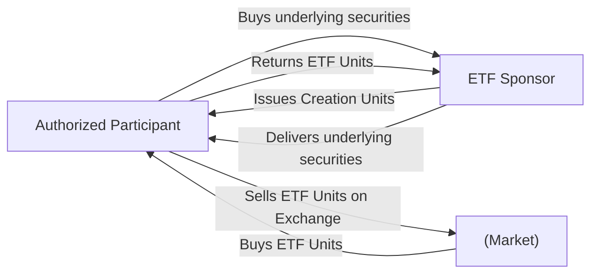

## 19.2 Key Features of Exchange-Traded Funds

An Exchange-Traded Fund (ETF) is an investment fund traded on stock exchanges much like a common stock. ETFs combine certain characteristics of both mutual funds and individual stocks, providing investors with on-exchange liquidity, broad diversification, and lower management costs. In Canada, ETFs have rapidly gained popularity among both retail and institutional investors, with many major banks—such as RBC, TD, and BMO—offering a range of ETF products.

Below is an in-depth look at some of the most important features of ETFs and how they function within the Canadian context.

---

## Lower Management Fees

One of the primary attractions of ETFs is their relatively low Management Expense Ratio (MER). Compared to many actively managed mutual funds, ETFs—especially index-based or “passive” ETFs—tend to carry lower fees because their objective is simply to replicate the performance of a specific index (e.g., S&P/TSX Composite). Lower costs can significantly impact investors’ net returns in the long run.

• Passive vs. Active ETFs: Traditional ETFs are typically passive, meaning they track an index. However, actively managed ETFs are increasingly common, featuring portfolio managers who attempt to outperform a benchmark while retaining some ETF-like qualities (e.g., intra-day trading, transparency).  
• Example: A Canadian equity index ETF might have an MER of 0.05% to 0.30%, whereas a similar actively managed mutual fund might charge 1% to 2% or more.

### Why Lower Fees Matter
Lower fees allow investors to keep more of their gains. Over long investment horizons, small differences in annual expenses can translate into sizable differences in portfolio value. For instance, a $10,000 initial investment earning an average of 5% annually over 25 years at a 0.20% MER versus a 2.00% MER could amount to many thousands of dollars in savings.

---

## Intra-Day Trading

Unlike mutual funds that are priced once a day after the market closes, ETFs trade throughout the trading day on public exchanges (e.g., Toronto Stock Exchange). This flexibility offers the following benefits:

• Real-Time Pricing: Investors see real-time bid/ask prices and can make trades any time the market is open.  
• Trading Strategies: Investors can use limit orders, stop-loss orders, and margin accounts for ETFs—much like they do with stocks.  
• Timely Adjustments: Intra-day trading can be especially valuable during periods of market volatility, when waiting for an end-of-day mutual fund price may disadvantage investors.

### Practical Example
Consider an investor holding a TFSA (Tax-Free Savings Account) at a Canadian brokerage, who wants to quickly reduce equity exposure. With ETFs, they can sell units instantly on the open market, locking in a price close to real-time. By contrast, selling a mutual fund means waiting for the fund’s net asset value (NAV) calculation, typically available after the market close.

---

## Transparency of Holdings

ETFs generally disclose their portfolio holdings on a daily or near-daily basis. Such transparency is invaluable for investors who want to understand exactly what they own:

• Daily Holdings Disclosure: Index-tracking ETFs, like those replicating the S&P/TSX 60, must publish daily data to keep investors informed. This highlights individual security positions and their respective weights.  
• Risk Awareness: Investors can quickly evaluate sector concentration, geographic exposure, or currency risks.  
• Benchmark Tracking: Transparency makes it simpler to assess how well an ETF replicates its underlying index.

### Case Study: RBC iShares ETFs
RBC iShares ETFs provide frequent holdings updates on their websites. For example, RBC Canadian Equity ETFs list all constituent stocks, their proportions, and any recent changes to the portfolio, giving investors an immediate view of their exposures.

---

## Creation and Redemption Mechanism (Liquidity)

A critical feature of ETFs is the creation/redemption mechanism. This structure typically involves “authorized participants” (often large financial institutions or market makers) who can create or redeem large blocks of ETF shares known as “creation units.”

• Creation Process: When ETF demand outstrips supply, authorized participants deliver a designated basket of underlying securities (or cash in some cases) to the ETF sponsor in exchange for new creation units of the ETF.  
• Redemption Process: When ETF supply outstrips demand, authorized participants deliver ETF shares back to the sponsor in exchange for the underlying securities or cash.  
• Liquidity: This mechanism, combined with market makers providing two-sided quotes, helps keep the ETF’s trading price close to its intrinsic net asset value and generally supports robust liquidity.

Below is a simplified Mermaid diagram illustrating the ETF creation/redemption mechanism:

> In this diagram, the Authorized Participant interacts with the ETF Sponsor (fund provider) to either create new ETF units by delivering the underlying securities or redeem ETF units in exchange for those securities.

---

## Market Exposure (Broad-Based or Specialized)

ETFs provide immense flexibility. Investors can choose from an array of offerings—ranging from broad-based ETFs covering the entire equity market to more specialized ones focused on specific sectors, asset classes, or even thematic investing.

• Broad Exposure: For example, a broad-market Canadian ETF might replicate the S&P/TSX Capped Composite Index. This single fund offers exposure to hundreds of Canadian companies in one trade.  
• Sector/Theme Focus: Specialized ETFs can target a narrow niche—like Canadian technology, energy, ESG (Environmental, Social, and Governance) concerns, or global emerging markets.  
• Fixed-Income and Other Alternatives: Beyond equities, fixed-income ETFs (e.g., government bonds, corporate bonds) and even alternative strategy ETFs (e.g., covered call strategies) are widely available.

### Investment Strategy Example
A Canadian pension fund may allocate a portion of its assets to ETF strategies that cover global equities, allowing for international diversification without hiring multiple active managers. By targeting specialized regions (Europe, Asia-Pacific, or Latin America), the fund can quickly adjust geographic allocations using ETFs.

---

## Glossary

Below are key terms that investors will often encounter when dealing with ETFs:

• Market Maker: A firm or individual responsible for providing liquidity by continuously quoting both buy and sell prices in a financial instrument, profiting from the bid-ask spread.  
• Passive vs. Active Management: Passive strategies seek to replicate a specific index, whereas active strategies involve a portfolio manager making asset selection decisions in an attempt to outperform a benchmark.  
• Expense Ratio (MER/TER): The annual fund operating expenses expressed as a percentage of the fund’s average net assets. MER is Management Expense Ratio, and TER is Total Expense Ratio.  
• Intra-day Trading: The act of buying and selling stocks or ETFs during regular trading hours, allowing for fast, real-time liquidity.

---

## Best Practices and Considerations

When selecting ETFs for your portfolio, consider these best practices:

1. Compare Expense Ratios: Low fees can improve net returns, especially over long-term horizons.  
2. Evaluate Liquidity: Heavily traded ETFs or those with strong market maker support typically offer tighter bid-ask spreads.  
3. Assess Tracking Error: The difference between an ETF’s performance and that of its underlying index. Lower tracking error implies better index replication.  
4. Diversify Wisely: Avoid overlapping exposures by selecting ETFs that complement, rather than duplicate, your existing investments.  
5. Monitor Regulatory Guidelines: Review National Instrument 81-102 to ensure you understand aspects such as leverage, concentration limits, and other operational rules.

### Potential Challenges
• Thinly Traded ETFs: Some niche ETFs may have wider bid-ask spreads.  
• Active ETFs’ Higher Costs: While lower in cost than many traditional mutual funds, active ETFs are usually pricier than passive ETFs.  
• Market Timing Risk: Intra-day trading encourages frequent trading, which may not suit all investors.  

---

## Step-by-Step Guidance for Evaluating an ETF

1. Define Your Investment Objective  
   Determine if you need broad market exposure, sector-specific coverage, or a niche thematic focus.

2. Check the Underlying Index or Theme  
   Research the index the ETF tracks and any underlying holdings. Ensure alignment with your investment strategy.

3. Analyze Historical Performance  
   Compare the ETF’s returns to its benchmark. Look for consistency and minimal tracking error.

4. Assess Liquidity and Bid-Ask Spreads  
   A tight bid-ask spread generally suggests strong liquidity.

5. Examine the ETF Structure  
   Some ETFs use derivatives or other structures (e.g., synthetic replication). Understand how the fund achieves exposure.

6. Review Fees and Expenses  
   Compare MER/TERs among similar products. Don’t forget to consider trading commissions.

7. Confirm Regulatory Compliance  
   Consult National Instrument 81-102 or other applicable Canadian regulations and review the ETF’s prospectus.

8. Monitor Ongoing Performance  
   Revisit your ETF choices regularly to ensure they remain consistent with your goals and risk tolerance.

---

## Canadian Regulatory Environment and Additional Resources

In Canada, ETFs are primarily governed under National Instrument 81-102 (Investment Funds), which sets out requirements for mutual funds and exchange-traded funds alike. This regulatory framework outlines permissible investments, custodial arrangements, disclosure obligations, and overall operational standards.

• “A Guide to ETFs” by the Canadian Securities Administrators (CSA) provides a comprehensive overview of ETF characteristics and regulatory considerations.  
• The Canadian Investment Regulatory Organization (CIRO) offers continuing education modules on exchange-traded products, addressing compliance obligations and best practices.  
• The Canadian Securities Institute (CSI) provides specialized courses and certifications, such as the Canadian Securities Course (CSC®), that include ETF analysis and portfolio applications.

---

## Summary

ETFs have revolutionized how Canadians invest, offering lower average fees, intra-day trading flexibility, and transparent holdings disclosure. Their robust liquidity and broad array of sector and geographic options make ETFs highly adaptable to diverse investment strategies. Still, investors should scrutinize liquidity, fees, and tracking error and remain mindful of regulatory constraints and market risks. With proper due diligence, ETFs can play a vital role in both retail and institutional portfolios, from a basic RRSP or TFSA strategy to a large pension fund mandate.

When evaluating or incorporating ETFs into your financial plan:  
• Perform thorough research on the underlying index or holdings.  
• Compare fees, liquidity, and historical performance.  
• Stay updated with Canadian regulations and best practices.  
• Periodically reassess your choices to remain aligned with your financial objectives.

---

## Test Your Knowledge: Key Features of ETFs in Canada Quiz



### Which characteristic typically distinguishes ETFs from traditional mutual funds regarding pricing?
- [ ] ETFs have higher management fees.
- [ ] ETFs are always actively managed.
- [ ] ETFs only price once per day.
- [x] ETFs can be traded intra-day at real-time market prices.

> **Explanation:** Unlike mutual funds, which set their price once per day after the market close, ETFs enable investors to buy and sell units intra-day at real-time market prices.

### What is the primary reason many ETFs have lower management fees than actively managed mutual funds?
- [ ] They only invest in large-cap stocks.  
- [ ] They rely on government subsidies.  
- [x] They often track an index passively, requiring less active portfolio management.  
- [ ] They lack diversification requirements.

> **Explanation:** Because most ETFs are passively managed (tracking an index), they require fewer resources than actively managed mutual funds, leading to lower management fees.

### What function does the “creation/redemption mechanism” serve in ETF markets?
- [x] It helps keep the ETF’s price close to its net asset value.  
- [ ] It allows mutual funds to convert into ETFs.  
- [ ] It removes liquidity from the market.  
- [ ] It sets regulatory fees for ETF sponsors.

> **Explanation:** Through the creation/redemption mechanism, authorized participants deliver baskets of underlying securities for new ETF units (or vice versa), which helps align the ETF’s market price with its underlying asset values.

### How often do most ETFs disclose their holdings?
- [ ] Semi-annually.  
- [ ] Annually.  
- [x] Daily or near-daily.  
- [ ] Only at inception.

> **Explanation:** ETFs generally disclose their holdings on a daily or near-daily basis, which is far more frequent than the monthly or quarterly reporting from other fund structures.

### When selecting an ETF, which of the following factors is most important to consider?
- [x] Expense ratio and tracking error.  
- [ ] The total number of shares outstanding.  
- [x] Liquidity reflected in tight bid-ask spreads.  
- [ ] Whether the ETF is delisted.

> **Explanation:** Investors should focus on the ETF’s expense ratio to understand costs, the tracking error to assess performance relative to its benchmark, and liquidity (which is often evident from tight bid-ask spreads).

### Which statement best describes the difference between active ETFs and passive ETFs?
- [x] Active ETFs attempt to outperform a benchmark, while passive ETFs replicate an index.  
- [ ] There is no difference; “active” and “passive” are used interchangeably.  
- [ ] Active ETFs do not disclose holdings, whereas passive ETFs do.  
- [ ] Passive ETFs cannot be bought in RRSP accounts.

> **Explanation:** Active ETFs have a manager selecting securities to exceed a benchmark’s returns, whereas passive ETFs track a specific index to mimic its performance.

### Which of the following best explains why ETFs typically offer strong liquidity?
- [x] Authorized participants create or redeem ETF units, ensuring supply meets demand.  
- [ ] ETFs only invest in highly liquid large-cap stocks.  
- [x] Market makers provide consistent two-sided quotes.  
- [ ] They are guaranteed by the Canadian government.

> **Explanation:** The creation/redemption mechanism and market makers help maintain sufficient liquidity, keeping the ETF’s trading price aligned with its net asset value and providing a ready market for buyers and sellers.

### Why are ETFs popular within certain Canadian pension funds’ strategies?
- [ ] They are guaranteed not to lose money.  
- [x] They offer efficient broad market exposure and ease of rebalancing.  
- [ ] They have zero expense ratios.  
- [ ] They are restricted to Canadian equities only.

> **Explanation:** Pension funds value ETFs for their diversification and ability to be traded quickly, which aids in dynamic asset allocation and efficient implementation of investment strategies.

### According to Canadian regulations, which National Instrument primarily governs ETFs?
- [ ] National Instrument 81-101.  
- [x] National Instrument 81-102.  
- [ ] National Instrument 81-104.  
- [ ] National Instrument 31-103.

> **Explanation:** National Instrument 81-102 outlines the core regulations for both mutual funds and ETFs, including permissible investments, custodian requirements, and disclosure obligations.

### True or False: Actively managed ETFs in Canada always have the same expense ratios as passive ETFs.
- [x] True  
- [ ] False  

> **Explanation:** While active ETFs usually have lower fees than traditional actively managed mutual funds, they are not always identical to passive ETFs’ fees. However, in certain cases, active ETFs can be quite price-competitive with their passive counterparts.



---

