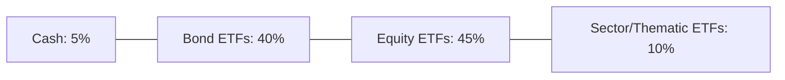

## 19.3 The Various Types of Exchange-Traded Funds

Exchange-Traded Funds (ETFs) have become a cornerstone of modern investment portfolios due to their flexibility, liquidity, and cost-effectiveness. ETFs allow a wide range of investors—from individuals to major Canadian pension funds—to gain exposure to various asset classes and investment strategies. This section explores the principal categories of ETFs in the Canadian market, examining their characteristics, benefits, and potential drawbacks. Real-world Canadian examples, diagrams, and step-by-step guidance will help you choose the right ETFs for different portfolio objectives.

---

## 19.3.1 Index-Based ETFs

### Definition and Key Features
Index-based ETFs are designed to replicate the performance of a specific index, such as an equity market benchmark or a bond index. By purchasing an index-based ETF, investors gain broad market exposure without needing to pick individual stocks or bonds. The ETF provider (such as RBC iShares, BMO Global Asset Management, or Vanguard Canada) will typically hold the underlying securities in the same proportion as the tracked index.

• Common examples in Canada:  
  – S&P/TSX 60 Index ETFs (e.g., iShares S&P/TSX 60 Index ETF).  
  – FTSE Canada Universe Bond Index ETFs (e.g., BMO Aggregate Bond Index ETF).  
• Passive management style.  
• Generally lower management expense ratios (MERs) compared to actively managed funds.  
• Fewer transactions within the ETF, potentially resulting in lower taxable distributions.

### How Index-Based ETFs Work

Below is a simplified mermaid diagram illustrating how an index-based ETF tracks an index:

```mermaid
flowchart LR
    A[Index Provider<br>(e.g., S&P)] --> B[Publishes Index Components]
    B --> C[ETF Provider<br>(e.g., RBC iShares)]
    C --> D[Buys underlying securities<br> in the same proportion as the index]
    D --> E[ETF Created and Listed on Exchange]
    E --> F[Investors buy/sell ETF shares]
```

**Step-by-Step Mechanics**  
1. The index provider (e.g., S&P) publishes a list of securities and their weights.  
2. The ETF provider (e.g., RBC iShares) purchases those securities in that proportion.  
3. The ETF shares are then listed on an exchange, such as the Toronto Stock Exchange (TSX).  
4. Investors can buy or sell ETF shares on the TSX throughout the trading day.

### Practical Example
• An investor bullish on the overall Canadian equity market can buy an S&P/TSX 60 ETF to gain diversified exposure to 60 of Canada’s largest companies.  

### Best Practices and Pitfalls  
• Best Practice: Index-based ETFs work well for core portfolio building.  
• Pitfall: Overconcentration risk can arise in indexes heavily weighted toward a few sectors (e.g., energy or financials in Canada).

---

## 19.3.2 Sector ETFs

### Definition and Key Features
Sector ETFs focus on specific industries such as energy, healthcare, technology, or financial services. These ETFs let investors overweight (or underweight) particular sectors they expect to outperform (or underperform).

• Suitable for tactical asset allocation—investors can tilt portfolios toward certain sectors.  
• Higher volatility if a sector experiences significant disruptions.  
• MERs can be slightly higher than broad-market ETFs due to narrower focus.

### Real-World Canadian Example
– BMO S&P/TSX Capped Energy Index ETF: Allows concentration in Canadian energy companies like Suncor or Canadian Natural Resources.  
– CI First Asset Tech Giants Covered Call ETF: Focuses on large global technology companies.

### Practical Application
• A portfolio manager predicting rising global demand for natural resources might increase exposure to a Canadian energy ETF.  
• Conversely, a retail investor looking to diversify away from energy might invest in a technology-focused ETF.

---

## 19.3.3 Thematic ETFs

### Definition and Key Features
Thematic ETFs center on future-oriented themes, such as artificial intelligence, clean energy, or battery technology. Rather than tracking broad market indexes, these ETFs invest in companies aligned with specific transformative trends.

• Allows investors to capitalize on structural shifts in the global economy.  
• Concentrated holdings can lead to higher volatility.  
• Requires ongoing research to ensure the theme remains relevant.

### Commonly Observed Themes
• Clean technology (e.g., renewable energy manufacturers).  
• Battery technology and electric vehicles.  
• E-commerce and digital payments.  
• Robotics and AI.

### Practical Example
• An ETF focusing on clean energy might hold companies involved in solar or wind power production. As governments worldwide push for reduced carbon emissions, this theme can benefit if those companies thrive.

---

## 19.3.4 Bond ETFs

### Definition and Key Features
Bond ETFs offer exposure to fixed-income markets. They replicate indexes consisting of government, investment-grade corporate, or high-yield bonds. Bond ETFs can vary based on maturity, credit quality, or geographic scope.

• Common indices include the FTSE Canada Universe Bond Index for domestic bond coverage.  
• May hold short-term, medium-term, or long-term bonds, influencing the ETF’s sensitivity to interest rate fluctuations.  
• Corporate or high-yield bonds offer higher yields but carry more credit risk.

### Example: A Canadian Case Study
Consider a risk-averse Canadian retiree who wants steady income with modest volatility. A broad-based Canadian bond ETF that focuses primarily on Government of Canada bonds and high-quality corporate bonds might be suitable to preserve capital and generate regular income.

### Step-by-Step Guidance—Evaluating Bond ETFs  
1. Check the average maturity: Longer duration might be more sensitive to interest rate changes.  
2. Review credit quality: High-yield vs. investment-grade.  
3. Assess management fees and MERs.  
4. Understand liquidity: Bond ETFs generally provide liquidity, but underlying bonds could be less liquid in volatile markets.

---

## 19.3.5 Commodity ETFs

### Definition and Key Features
Commodity ETFs offer exposure to physical commodities or commodity futures. They can be either physically backed (e.g., holding physical gold) or derivatives-based (e.g., using futures contracts).

• Common Canadian example: ETFs backed by gold bullion (such as the iShares Gold Bullion ETF).  
• Provide diversification, as commodities often have low correlation with equities or bonds.  
• Prices can be influenced by geopolitical events, supply-demand imbalances, and currency fluctuations.

### Physical vs. Derivatives-Based Commodity ETFs
• Physical: Holds the physical commodity in secure vaults or warehouses (commonly used for precious metals).  
• Derivatives-Based: Utilizes futures contracts; offers exposure but may introduce tracking error due to rolling futures positions.

---

## 19.3.6 Currency-Hedged ETFs

### Definition and Key Features
Currency-hedged ETFs mitigate the impact of exchange rate movements by periodically entering into currency hedging contracts (often forward contracts). This helps reduce foreign exchange risk for investors.

• Especially relevant for Canadians investing in U.S. or international equities.  
• Cost of hedging may reduce net returns.  
• Hedging effectiveness depends on market conditions and the frequency of hedge rebalancing.

### Practical Example
• An investor keen on U.S. tech stocks but worried about CAD/USD fluctuations might choose a currency-hedged U.S. equity ETF. If the Canadian dollar appreciates, the hedging strategy protects against losses from currency conversion.

---

## 19.3.7 Leveraged and Inverse ETFs

### Definition and Key Features
Leveraged ETFs aim to magnify the daily returns of an underlying index by a set multiple (e.g., 2× or 3×). Inverse ETFs seek to provide the opposite daily return of an index.

• High risk and typically used for short-term tactical trading.  
• The daily reset feature can cause performance over time to diverge from the index’s long-term returns, especially in volatile markets.  
• Not appropriate for buy-and-hold investors seeking long-term growth due to compounding effects and higher expense ratios.

### Example
• Horizons BetaPro S&P/TSX 60 2x Daily Bull ETF: Seeks to double the daily returns of the TSX 60.  
• Horizons BetaPro S&P/TSX 60 Inverse ETF: Aims to provide returns inversely correlated to the TSX 60.

### Cautionary Note
• Leveraged and inverse ETFs can experience amplified losses. A 2× leveraged ETF that aims for double the daily performance of an index can also generate double the losses on any negative movement.

---

## 19.3.8 Active ETFs

### Definition and Key Features
Active ETFs are managed by a portfolio manager or team that makes discretionary buy-and-sell decisions with the goal of outperforming a benchmark. Unlike most index-based ETFs, active ETFs do not strictly follow an index’s constituents but rely on the manager’s expertise.

• Potential for alpha generation, but also the risk of underperformance.  
• Typically higher MERs than passive ETFs.  
• Can take advantage of market opportunities and adapt more quickly to changing conditions.

### Practical Example: Canadian Banks
• An active ETF might overweight certain Canadian banks (e.g., RBC, TD) if the manager foresees strong earnings growth in the financial sector, while underweighting other sectors under pressure from economic factors.

---

## Key Glossary

• **Thematic Investing:** An approach focusing on long-term structural trends, investing in companies whose core business models align with those themes.  
• **High-Yield Bonds:** Bonds rated below investment-grade, offering higher yields in exchange for higher credit risk.  
• **Inverse ETF:** A type of ETF designed to move in the opposite direction of its benchmark index.  
• **Leveraged ETF:** A type of ETF that aims to provide a multiple (e.g., 2× or 3×) of the daily performance of a specific underlying index.

---

## Best Practices and Potential Challenges

• Conduct thorough due diligence: Understand the underlying holdings, strategies, and risks of each ETF type before investing.  
• Monitor liquidity: While many ETFs are liquid, niche ETFs may have thinner trading volumes.  
• Consider costs: Expense ratios, trading commissions, and other fees can erode returns.  
• Align with investment objectives: Match your choice of ETF—whether passive or active, broad-based or thematic—to your risk tolerance, time horizon, and overall goals.  
• Regulatory compliance: In Canada, ETFs are subject to regulations under National Instrument 81-102, which governs investment funds. Be aware of how these rules influence product structure and investor protections.

---

## Real-World Applications and Case Studies

• Canadian Pension Funds: Large institutions like the Canada Pension Plan Investment Board (CPPIB) often use index-based ETFs to gain quick exposure to equities or fixed income while they adjust asset allocations in-house.  
• Retail Investors: An individual saving for retirement might load up on broad-market equity and bond ETFs in a Registered Retirement Savings Plan (RRSP) for tax-deferred growth, adding sector or thematic ETFs as small tactical plays.  
• Canadian Banks: Asset management arms of major banks (RBC, TD, BMO, CIBC, Scotiabank) all offer a suite of ETFs, from passive index trackers to specialized thematic and active strategies.

---

## Strategies for Choosing ETFs

1. **Define Your Objective**: Are you seeking broad diversification, sector-specific growth, fixed-income stability, or short-term tactical plays?  
2. **Analyze Costs**: Compare MERs, trading fees, and the bid-ask spread.  
3. **Assess Fund Size and Liquidity**: Larger ETFs often have tighter spreads; niche ETFs may be less liquid.  
4. **Examine the Underlying Index or Strategy**: Understand the methodology and holdings behind the ETF.  
5. **Review Historical Performance**: While past performance is not predictive, it can provide insights into the ETF’s risk-return profile.  

---

## Diagrams for ETF Allocation

Below is a simple mermaid diagram showing a potential ETF allocation within a moderately conservative portfolio:



• Bond ETFs form the core stable portion.  
• Equity ETFs provide growth.  
• A small allocation to sector/thematic ETFs for specific opportunities.  
• Cash remains for liquidity and opportunistic buys.

---

## References and Additional Resources

• [Prosper Canada](https://www.prospercanada.org/) and Government of Canada resources on commodity investing and general financial education.  
• Research from Cass Business School on factor-based and thematic investing approaches.  
• “Canadian ETF Watch” for coverage of new and innovative ETF structures.  
• National Instrument 81-102, which governs the regulation of mutual funds and ETFs in Canada, ensures compliance and investor protection.  

---

## Summary of Key Points

1. **Index-Based ETFs**: Ideal for passive, cost-effective exposure to broad markets or bond indexes.  
2. **Sector ETFs**: Short-term or tactical plays focusing on specific industries.  
3. **Thematic ETFs**: Capitalize on emerging trends such as AI, clean energy, or e-commerce.  
4. **Bond ETFs**: Offer diversified fixed-income exposure across varying credit qualities and maturities.  
5. **Commodity ETFs**: Provide a way to invest in commodities like gold or agricultural products, either physically or through futures.  
6. **Currency-Hedged ETFs**: Mitigate foreign exchange risk for cross-border investors.  
7. **Leveraged and Inverse ETFs**: Expose investors to amplified gains—or losses—as they seek multiples or inverse performance of an index.  
8. **Active ETFs**: Feature a portfolio manager aiming to outperform a benchmark, often at a higher cost.

ETFs have wide-ranging possibilities, allowing investors to shape portfolios that meet diverse objectives—whether seeking stability, growth, or precise sector exposure. Always conduct proper research, align your choice of ETF with specific financial goals, and stay informed about market and regulatory developments.

---

## Test Your Knowledge: Different Types of ETFs in Canada Quiz



### Which type of ETF is designed to closely track a specific market index with minimal deviation?

- [x] Index-based ETF
- [ ] Leveraged ETF
- [ ] Thematic ETF
- [ ] Active ETF

> **Explanation:** Index-based ETFs replicate the performance of a named benchmark index, such as the S&P/TSX 60, by holding the underlying securities in the same proportion.

### Sector ETFs primarily do which of the following?

- [x] Focus on a particular industry or segment of the market
- [ ] Provide a fully diversified portfolio across multiple sectors
- [x] Offer concentrated exposure to a specialized theme
- [ ] Mimic an entire stock market index

> **Explanation:** Sector ETFs allow exposure to a specific industry or theme. They can be considered “focused” or “concentrated,” though many sector ETFs now also include broader thematic elements.

### What is the main purpose of a currency-hedged ETF for a Canadian investor?

- [x] To protect against currency fluctuations in foreign investments
- [ ] To amplify returns during market downturns
- [ ] To track Canadian-only indices without foreign risk
- [ ] To invest solely in precious metals

> **Explanation:** A currency-hedged ETF uses hedging strategies like forward contracts to mitigate exchange rate risk for holdings in foreign-denominated assets.

### Which type of ETF incorporates the investment manager’s active decisions rather than strictly tracking an index?

- [x] Active ETF
- [ ] Bond ETF
- [ ] Index-based ETF
- [ ] Inverse ETF

> **Explanation:** Active ETFs rely on portfolio managers to select securities, seeking to outperform a benchmark rather than mimic it.

### When might an investor consider a Bond ETF?

- [x] When seeking stable income and relative capital preservation
- [ ] When aiming for 2× the daily return of a broad equity index
- [x] When wanting immediate sector rotation opportunities
- [ ] When primarily investing in commodity futures

> **Explanation:** Bond ETFs are frequently used for income generation and lower volatility, serving as a core or stabilizing asset in a portfolio.

### What is one main caution with Leveraged ETFs?

- [x] They can experience amplified losses and are typically not for long-term buying and holding
- [ ] They guarantee a positive return if the underlying index moves upward
- [ ] They have zero expense ratios
- [ ] They perfectly track an index over the long term with no tracking error

> **Explanation:** Leveraged ETFs aim at multiplying daily returns (or losses) and often exhibit a compounding effect that can diverge from the underlying index performance over time.

### Thematic ETFs are best suited for which kind of investor?

- [x] Those wanting exposure to emerging or trending sectors with higher potential growth
- [ ] Those seeking guaranteed returns with zero risk
- [x] Those only interested in short-term currency speculation
- [ ] Those seeking broad, passive market exposure

> **Explanation:** Thematic ETFs focus on companies aligned with particular long-term trends (e.g., green energy, blockchain). They can offer higher growth potential but come with greater risk.

### Which of the following ETF types most commonly invests in precious metals?

- [x] Commodity ETF
- [ ] Sector ETF
- [ ] Inverse ETF
- [ ] Active ETF

> **Explanation:** Commodity ETFs often invest in physical precious metals (like gold and silver) or futures contracts related to them.

### For an investor worried about daily market fluctuations and potential downward movements, which ETF might be used as a short-term hedge?

- [x] Inverse ETF
- [ ] Bond ETF
- [ ] Index-based ETF
- [ ] Currency-hedged ETF

> **Explanation:** An inverse ETF moves in the opposite direction of its benchmark, potentially offsetting losses in a standard equity portfolio if prices decline.

### True or False: Active ETFs always have significantly lower fees than index-based ETFs.

- [x] True
- [ ] False

> **Explanation:** This is a trick question. The statement is generally false. Active ETFs often charge higher fees due to the costs of active management.  



---

## For Additional Practice and Deeper Preparation

**Elevate your exam readiness with our comprehensive app, "Securities CA: Mock Exams," designed to challenge and refine your skills.**

* **Master Challenging Questions:** Dive into expertly crafted sample exam questions that go beyond standard references.
* **Scenario-Driven Learning:** Experience scenario-driven case questions and in-depth solutions to build practical expertise.
* **Sharpen Exam Strategies:** Build confidence with step-by-step explanations designed to refine your exam-day tactics.
* **Gain Real-World Insights:** Acquire practical tips and detailed rationales that demystify complex concepts.
* **CIRO and CSI Alignment:** Stay current with CIRO guidelines and CSI’s exam structure, with questions intentionally more challenging than the actual exam.

**Download the App Today:**

[](https://apps.apple.com/us/app/securities-ca-mock-exams/id1667869674)
[](https://play.google.com/store/apps/details?id=ca.tokenizer.cscexams)


> Note: While these courses are specifically crafted to align with the CSC® exams outlines, they are independently developed and not endorsed by CSI or CIRO.
