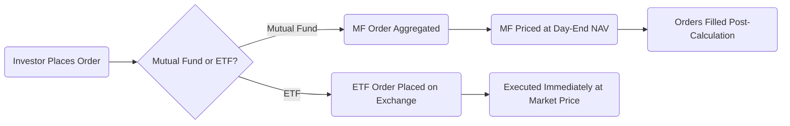
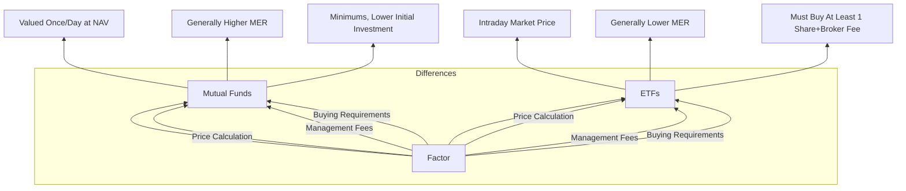

## 19.5 Comparing Exchange-Traded Funds and Mutual Funds

In the Canadian investment landscape, exchange-traded funds (ETFs) and mutual funds serve as two of the most popular pooled investment vehicles. Both allow investors to benefit from professionally managed, diversified portfolios. However, key differences—such as pricing, trading mechanics, fee structures, transparency, and tax implications—can significantly impact the suitability of each product depending on the investor’s financial goals and preferences. This section provides an in-depth exploration of these differences, equipping you with the knowledge needed to make informed decisions when selecting between ETFs and mutual funds.

---

## Pricing and Trading

A prominent distinction between ETFs and mutual funds is how their shares or units are priced and traded.

### Mutual Funds: Single Daily Pricing
• Mutual fund transactions (buys and sells) are typically executed once per trading day at the net asset value (NAV), calculated after the market closes (usually 4:00 p.m. ET).  
• Investors place orders throughout the day, but the price at which the order executes is determined at the close of business when the fund’s assets are priced.  
• Mutual funds can be purchased directly from the fund company or through a broker, and some mutual funds have minimum investment thresholds, which can be as low as $500 or $1,000.

### ETFs: Intraday Trading
• ETFs trade on a stock exchange similarly to common shares, offering intraday liquidity.  
• Prices fluctuate in real-time based on market conditions, supply, and demand—just like a stock.  
• Investors can utilize limit orders, stop-loss orders, or other trading strategies to control the purchase or sale price. This creates opportunities to react quickly to market conditions.  
• ETFs often require paying a brokerage commission or trading fee for purchases and sales, although some Canadian online brokers now offer zero-commission ETF trades for certain products.

#### Visual Overview of ETF vs. Mutual Fund Trading

In this diagram, you can see that mutual fund orders wait for day-end pricing. ETF orders move directly to an exchange, where they are executed in real-time.

---

## Management Fees

### ETF Fee Structure
ETFs generally have lower management expense ratios (MERs) compared to mutual funds, particularly if the ETF is passively managed (e.g., it tracks a broad market index like the S&P/TSX Composite). Lower fees can be advantageous for cost-conscious investors or those who want to hold a position for a longer time horizon. However, not all ETFs are low-cost; some sector-based or actively managed ETFs may have higher expense ratios.

### Mutual Fund Fee Structure
Mutual funds, especially those providing active management, often charge higher MERs. This can be justified if the fund manager consistently outperforms the market or offers specific expertise in niche sectors. However, many actively managed mutual funds struggle to outperform their benchmark indices over the long term after fees are accounted for. Mutual funds may also impose sales charges (front-end loads, back-end loads, or deferred sales charges) that can increase the overall cost to investors.

---

## Transparency

### Daily Disclosure in ETFs
Most ETFs disclose their full portfolio holdings every trading day. This frequent disclosure helps mitigate pricing discrepancies and provides transparency that can be valuable for investors who want to know precisely what they hold.

### Periodic Disclosure in Mutual Funds
Mutual funds generally disclose their holdings quarterly or monthly, though some choose to disclose more often. This reduced frequency of disclosure can limit your visibility into the fund’s underlying securities at any given time. However, mutual funds with strong track records and trustworthy management teams might still be an excellent choice for long-term strategies, despite less frequent updates.

---

## Minimum Investment Requirements

### ETF Purchase Amount
• To purchase an ETF, you generally need enough capital to buy at least one share plus any brokerage commission.  
• If the market price of an ETF is $30 per share, a minimum investment for one share would be $30, not including trading fees. Over time, this can add up significantly for larger positions, but there is flexibility in how many shares you buy.

### Mutual Fund Minimums
• Mutual funds often have set minimum purchase requirements, such as $1,000 or $5,000, though in some cases this can be as low as $500.  
• Investor platforms with pre-authorized contribution plans (PACs) may allow smaller subscription increments after an initial investment.  
• Depending on your broker, smaller regular monthly contributions can also be arranged, especially useful in Registered Retirement Savings Plans (RRSPs) or Tax-Free Savings Accounts (TFSAs).

---

## Tax Efficiency

### ETF Creation and Redemption Mechanism
A key tax advantage for many ETFs is the in-kind creation/redemption mechanism. Large investors, known as authorized participants, can exchange baskets of securities for ETF shares (and vice versa). Because these are often in-kind transactions, ETFs can minimize realized capital gains that would otherwise be distributed to shareholders in non-registered accounts.

### Mutual Fund Distributions
Mutual funds often distribute capital gains to unitholders at year-end. In non-registered accounts, these gains are taxed in the hands of the investor, potentially increasing the total tax liability. While the actual impact depends on the level of trading within the fund, higher turnover strategies can lead to more frequent distributions.

---

## Practical Example: RBC vs. TD Products

Consider two scenarios from major Canadian financial institutions:

• RBC iShares ETF: An investor looking to track the S&P/TSX Composite Index can purchase the corresponding ETF and benefit from intraday trading, lower MER, and daily portfolio transparency. Over a 10-year holding period, the investor may save a significant amount in fees relative to a comparable actively managed mutual fund.

• TD Canadian Equity Mutual Fund: An investor who prefers the expertise of a seasoned portfolio manager at TD may choose an actively managed Canadian equity mutual fund. While the MER might be higher for active management, the investor hopes that the manager’s focus on superior security selection will yield above-benchmark returns.

This comparison highlights the importance of aligning investment preferences—whether they are fees, performance expectations, or market-tracking strategies—with the right fund structure.

---

## Best Practices and Common Pitfalls

• Do your homework on fees: Over time, even a difference of 0.5% in annual fees can significantly impact returns.  
• Pay attention to trading costs: Cost savings from a low MER can be offset by frequent trading commissions if you rebalance the ETF portion often.  
• Evaluate tax implications: If you hold funds in a non-registered account, consider how distributions might affect your annual tax burden. Using RRSPs and TFSAs can help to minimize these tax consequences.  
• Continually monitor holdings: Whether daily (ETFs) or quarterly (mutual funds), staying informed can help you adjust your portfolio when market conditions change or when personal financial goals shift.

---

## Step-by-Step Guidance for Evaluating ETFs vs. Mutual Funds

1. Identify your financial goals: Determine your investment horizon, risk tolerance, and performance expectations.  
2. Compare fees: Look at the management expense ratio, trading commissions, and any sales charges. A fund facts document (required under National Instrument 81-101) must clearly disclose these costs.  
3. Assess convenience: Decide if daily intraday trading or occasional rebalancing best suits your approach.  
4. Analyze tax impact: In a non-registered account, inquire about the fund’s distribution history and turnover rate.  
5. Evaluate the fund’s track record: Look beyond short-term performance—particularly how the fund manager performs in volatile markets.  
6. Review disclosure practices: If transparency is essential, lean toward ETFs with daily holdings data. If you’re comfortable with monthly or quarterly updates, a mutual fund might suffice.  
7. Consult professional advice: If uncertain, consider reaching out to a qualified financial advisor or conducting further research through CIRO and CSI educational resources.

---

## Glossary

• **In-Kind Transactions:** The exchange of actual securities (rather than cash) for ETF shares, which can reduce tax events in some situations.  
• **Capital Gains Distributions:** Mandatory distributions of realized gains to shareholders, typically taxed if the fund is held in a non-registered account.  
• **MER (Management Expense Ratio):** The annual fee that covers fund management, administration, and other costs.  
• **NAV (Net Asset Value):** The per-unit (or per-share) value of a fund’s assets after liabilities. Mutual fund transactions are executed at NAV; ETFs trade at market prices that may slightly differ from NAV.

---

## Diagrams and Tables

Below is a simple table illustrating some key differences:

---

## References and Additional Resources

• National Instrument 81-101 (Mutual Fund Prospectus Disclosure) – Provides guidance on fund facts disclosures.  
• Canadian Investment Regulatory Organization (CIRO) course modules: Explores different fund structures and their regulatory requirements.  
• Canadian Securities Institute (CSI) – Offers detailed case studies and materials comparing ETF and mutual fund strategies.  
• RBC and TD websites – Showcase actual ETF and mutual fund offerings that highlight the differences in fee structures and investment approaches.

---

## Summary

Exchange-traded funds and mutual funds share the common objective of providing diversified exposure to various markets. However, their distinct features—intraday pricing vs. once-a-day pricing, generally lower vs. higher fees, more frequent vs. less frequent transparency, and different tax efficiencies—can significantly influence an investor’s results. By carefully weighing management fees, trading costs, transparency needs, and tax considerations, investors can select the product best aligned with their personal objectives, risk profile, and investment horizon.

---

## Test Your Knowledge: Comparing ETFs and Mutual Funds in Canada



### Which statement best describes how ETFs are traded compared to mutual funds?

- [ ] Mutual funds and ETFs both offer intraday trading.  
- [x] ETFs trade throughout the day at market prices, while mutual funds are bought or sold at the NAV at the close.  
- [ ] Both ETFs and mutual funds can be purchased only once a day after the market closes.  
- [ ] ETFs have no market-driven price because they are purchased directly from the fund provider.  

> **Explanation:** ETFs trade on an exchange throughout the day, driven by supply and demand. Mutual fund transactions occur at the fund’s NAV, which is set once at the end of the trading day.

### Which factor can lead to lower capital gains distributions for ETFs compared to mutual funds?

- [ ] Higher daily turnover of shares.  
- [x] The ETF’s creation/redemption mechanism that often involves in-kind transactions.  
- [ ] Lack of regular portfolio rebalancing.  
- [ ] Frequent distribution of dividends.  

> **Explanation:** Many ETFs use in-kind transactions to assemble or liquidate underlying portfolios. By exchanging securities rather than cash, they can avoid realizing capital gains that would otherwise be distributed.

### What is a potential trade-off with mutual funds disclosing their holdings less frequently than ETFs?

- [x] Reduced visibility into the fund’s composition for investors.  
- [ ] Better price efficiency due to fewer public disclosures.  
- [ ] Higher management fees across all mutual funds.  
- [ ] Inability to engage in active management.  

> **Explanation:** Mutual funds typically disclose holdings monthly or quarterly, offering less immediate transparency than ETFs, which often post holdings daily.

### Which of the following costs can partially offset the low MER advantage of ETFs?

- [x] Brokerage commissions on ETF trades.  
- [ ] Annual high-water mark performance fees.  
- [ ] Redemption fees set by the fund provider.  
- [ ] Transfer taxes payable on each share sold.  

> **Explanation:** Even if an ETF has a low MER, trading commissions can accumulate, especially for investors who trade frequently.

### Which of these scenarios reflects a best practice when choosing between ETFs and mutual funds?

- [x] Evaluating differences in fees, liquidity, and tax consequences before investing.  
- [ ] Choosing the product with the largest management team regardless of fees.  
- [x] Considering your specific investment goals and risk tolerance.  
- [ ] Automatically assuming that all mutual funds charge the same fees.  

> **Explanation:** Due diligence on fees, liquidity, and tax aspects ensures you pick the vehicle that aligns with your financial goals and risk profile.

### When do mutual funds typically calculate and publish their NAV?

- [ ] Continuously throughout the trading day.  
- [ ] Every hour during the trading day.  
- [x] Once a day, after the market closes.  
- [ ] Only when there are significant market fluctuations.  

> **Explanation:** Mutual funds are priced once daily, after market close, based on the value of their underlying assets.

### How do many brokerages in Canada encourage ETF investments?

- [x] By offering zero-commission ETF trades for certain products.  
- [ ] By increasing the MER of rival mutual funds.  
- [x] By enabling the purchase of fractional ETF shares.  
- [ ] By eliminating the need for any capital to start investing.  

> **Explanation:** Many brokerages now provide commission-free trading on specific ETFs, reducing barriers to entry and encouraging investors to adopt ETF-based strategies.

### For an investor aiming for daily transparency of holdings, which pooled investment product is generally more suitable?

- [x] ETFs  
- [ ] Mutual funds  
- [ ] Segregated funds  
- [ ] Closed-end funds  

> **Explanation:** ETFs typically disclose their holdings daily, while mutual funds may disclose monthly or quarterly.

### What is one benefit of holding an ETF or mutual fund inside a Tax-Free Savings Account (TFSA)?

- [x] Any capital gains or distributions are not subject to Canadian taxation.  
- [ ] All losses can be used to offset future gains outside the TFSA.  
- [ ] Investors automatically receive an extra 1% MER discount.  
- [ ] The fund must fully disclose its holdings daily.  

> **Explanation:** Gains and distributions in a TFSA are sheltered from Canadian tax, allowing funds to grow tax-free.

### True or False: An actively managed ETF can never have a higher MER than a passive mutual fund.

- [x] True  
- [ ] False  

> **Explanation:** While many ETFs are viewed as low-cost investments, actively managed ETFs can have higher MERs than some passive or low-fee mutual funds. The specific fund structure does not guarantee a lower fee if the strategy is complex or actively managed.



---

## For Additional Practice and Deeper Preparation

**Elevate your exam readiness with our comprehensive app, "Securities CA: Mock Exams," designed to challenge and refine your skills.**

* **Master Challenging Questions:** Dive into expertly crafted sample exam questions that go beyond standard references.
* **Scenario-Driven Learning:** Experience scenario-driven case questions and in-depth solutions to build practical expertise.
* **Sharpen Exam Strategies:** Build confidence with step-by-step explanations designed to refine your exam-day tactics.
* **Gain Real-World Insights:** Acquire practical tips and detailed rationales that demystify complex concepts.
* **CIRO and CSI Alignment:** Stay current with CIRO guidelines and CSI’s exam structure, with questions intentionally more challenging than the actual exam.

**Download the App Today:**

> Note: While these courses are specifically crafted to align with the CSC® exams outlines, they are independently developed and not endorsed by CSI or CIRO.
