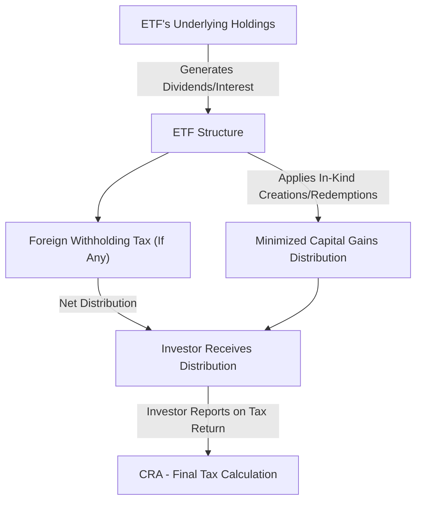

## 19.6 Taxation of Investors in Exchange-Traded Funds

Exchange-Traded Funds (ETFs) have grown in popularity among Canadian investors for their cost-effectiveness and ease of trading. Similar to other investment vehicles, ETFs generate various forms of taxable income for unitholders. Understanding how ETFs are taxed is crucial for making informed investment decisions and ensuring compliance with Canadian tax regulations.

In this section, we will cover:  
• How ETF distributions are taxed (interest, dividends, and capital gains)  
• The impact of the ETF structure on tax efficiency  
• Issues related to foreign withholding taxes  
• Tax implications of holding ETFs within registered and non-registered accounts  
• Best practices and strategies to maximize tax efficiency  

---

## Overview of Taxation for ETF Investors

ETF taxation in Canada follows many of the same principles that apply to mutual funds and other pooled investments. However, there are nuances to keep in mind:

1. ETFs distribute income to investors in the form of dividends or interest from the underlying holdings.  
2. Capital gains may arise through sales of ETF units by the investor, or through capital gains distributions from the fund.  
3. Strategies used by ETF managers—such as in-kind creations and redemptions—often reduce turnover within the fund, contributing to fewer realized capital gains distributions.  

By understanding these points, investors can better anticipate the tax consequences of owning ETF units and make more informed investment decisions.

---

## Dividend and Interest Distributions

### Dividend Income

If an ETF holds Canadian dividend-paying stocks, unitholders will typically receive cash distributions that qualify as Canadian dividends. These dividends may be subject to the dividend gross-up and dividend tax credit mechanism. In Canada, eligible dividends receive a higher gross-up rate and a corresponding dividend tax credit, resulting in a more favorable tax treatment than non-eligible dividends.

If an ETF holds foreign stocks that pay dividends, the distributions are usually considered foreign income for Canadian tax purposes. Foreign dividends do not qualify for the dividend tax credit and are typically taxed at the investor’s marginal tax rate. Some ETFs employ strategies to reclaim or offset foreign withholding tax charges and distribute the net amount to investors.

### Interest Income

ETFs that hold fixed-income securities, such as government bonds, corporate bonds, or mortgage-backed securities, will distribute interest income to unitholders. In a non-registered account, this income is taxed at the investor’s marginal tax rate, which can be comparatively high if the investor’s personal tax bracket is large.

### Example: Dividend and Interest Distribution

• Suppose an ETF from RBC invests primarily in dividend-paying Canadian blue-chip stocks (e.g., banks and energy companies). At the end of each quarter, the ETF pays out eligible dividends to its unitholders, who then claim a dividend gross-up and receive a corresponding tax credit on their tax returns.  
• Another example might be a bond ETF from TD, which invests in Government of Canada bonds and higher-grade corporate debt. This ETF regularly distributes interest income, which is fully taxable at the investor’s marginal tax rate if the investor holds it in a non-registered account.

---

## Capital Gains Distributions and Realizations

### Capital Gains Arising from Investor Transactions

When investors sell their ETF units for a price higher than their adjusted cost base (ACB), a capital gain is realized. Conversely, selling below one’s ACB results in a capital loss. The general formula to compute a capital gain or loss is:

( Selling Price – Adjusted Cost Base ) – Transaction Costs  
= Realized Capital Gain or Loss

In Canada, only 50% of a capital gain is taxable. This means that if you trigger a $1,000 capital gain, $500 would be considered taxable income. Similarly, capital losses can be used to offset current or future capital gains, subject to specific tax rules.

### Capital Gains Distributions from the ETF

Occasionally, the ETF itself may distribute capital gains to its unitholders. These gains typically result from the fund’s internal trading activities—selling securities that have appreciated in value. When an ETF distributes capital gains, each investor receives a T3 or T5 slip (depending on the ETF’s structure), reflecting their share of these gains. Investors must report these amounts on their tax returns.

### In-Kind Redemption Mechanism

A key benefit of ETFs is their use of the in-kind redemption mechanism. ETFs often reduce their taxable capital gains distributions using in-kind creations and redemptions, meaning that market participants contribute or redeem baskets of securities rather than selling them in the open market. This mechanism tends to limit taxable events within the fund, enhancing the ETF’s tax efficiency relative to some mutual funds.

---

## Foreign Withholding Taxes

### Definition and Application

Foreign withholding tax is levied by certain countries on dividends or interest payments made to non-resident investors. For Canadian investors who hold foreign assets through an ETF, the foreign government may withhold a portion of the dividend or interest at source before the net proceeds are paid to the ETF.

### Structuring ETFs to Minimize Withholding Taxes

Some ETF providers create structures or sub-funds that allow them to reduce, eliminate, or reclaim a portion of this withholding tax. If an ETF invests in U.S. equities, for instance, the tax withheld at source is generally 15% under the Canada-U.S. tax treaty (assuming certain conditions are met). The ETF might claim a foreign tax credit, which can pass through to Canadian investors. However, the details vary depending on whether the ETF is held in a registered or non-registered account.

### Example of a U.S. Equity ETF

Consider a large Canadian ETF holding U.S. dividend-paying stocks. The U.S. imposes a 15% withholding tax on dividends paid to Canadian residents. If the ETF is properly structured, it may pass a foreign tax credit through to investors, who can then use the credit on their tax returns to offset Canadian taxes payable. However, if the ETF is in an RRSP, the withholding tax might not be deducted due to Canada-U.S. treaty benefits, depending on how the particular ETF is structured.

---

## Registered vs. Non-Registered Accounts

### Registered Retirement Savings Plan (RRSP)

An RRSP is a tax-deferred plan. Any income (interest, dividends, or capital gains) generated by ETFs held in an RRSP is not immediately taxed, allowing for compounding without annual tax erosion. Tax is deferred until the funds are withdrawn from the RRSP, at which point withdrawals are taxed as regular income at the investor’s marginal tax rate. While U.S.-source dividends held in an RRSP are often exempt from the 15% withholding tax under the Canada-U.S. tax treaty, certain structural or cross-border considerations may still apply.

### Tax-Free Savings Account (TFSA)

In a TFSA, investment income—whether dividends, interest, or capital gains—accumulates tax-free. Withdrawals are also tax-free. However, foreign withholding taxes are generally not recoverable for holdings in a TFSA. Thus, if an ETF invests in foreign securities, the investor may lose the withheld amount permanently if they hold the ETF in a TFSA.

### Non-Registered Accounts

In a non-registered account, investors are subject to all regular rules on dividend taxation, interest taxation, and capital gains or losses. If properly executed, an ETF with a tax-efficient design can help minimize distributions subject to higher tax rates, benefiting investors who want to retain more after-tax returns.

---

## Key Considerations and Best Practices

### Keeping Accurate Records

• Track your Adjusted Cost Base (ACB): Accurate record-keeping ensures you correctly calculate capital gains or losses.  
• Maintain records of all distributions: Dividend, interest, and capital gains distributions are critical for proper annual reporting.

### Selecting Tax-Efficient ETFs

• Low Turnover: ETFs designed with minimal turnover can lead to fewer realizations of capital gains within the fund.  
• Foreign Withholding Tax: ETFs employing structures that mitigate foreign withholding taxes may be more tax-efficient overall.

### Asset Location Strategies

Effective asset location entails holding certain asset classes within the most appropriate account type. For example:  
• Interest-bearing ETFs in RRSPs or other tax-deferred accounts to shelter high-tax-rate income.  
• Canadian dividend-paying ETFs in taxable accounts to benefit from the dividend tax credit.  
• International equity ETFs in RRSPs (where applicable) to mitigate or eliminate foreign withholding tax on dividends.

### Periodic Reassessment

• Changes in personal tax circumstances or in an ETF’s strategy may alter the vehicle’s tax efficiency.  
• Review your portfolio at least annually, or more frequently if significant market or personal financial changes occur.  

---

## Visualizing the Taxation Workflow

Below is a simplified diagram illustrating how distributions flow from ETF holdings to the end investor, including potential foreign withholding taxes and the final calculation of taxes owed:

Explanation:  
• An ETF’s underlying holdings produce dividends or interest.  
• The ETF aims to reduce capital gains distributions through in-kind mechanisms.  
• Any foreign withholding tax may be deducted at source before arriving to the ETF and ultimately passed on to the investor.  
• Finally, investors include distributions on their tax returns, and the Canada Revenue Agency (CRA) calculates the tax implications.

---

## Common Pitfalls

1. Failing to Track the Adjusted Cost Base (ACB): Underreporting capital gains can lead to audits and penalties.  
2. Neglecting Foreign Withholding Taxes in TFSAs: Investors often assume all distributions remain fully tax-free, overlooking unrecoverable withholding taxes.  
3. Overlooking Required Accounting for Reinvested Distributions: If you participate in a dividend reinvestment plan (DRIP), you still need to account for the distributions as income.  

---

## Strategies and Challenges

• Use Asset Allocation Strategically: Position interest-bearing ETFs in RRSPs to shelter from high marginal rates.  
• Diversify Across Multiple Accounts: Consider placing equities in TFSAs to capture tax-free growth, especially if growth potential is substantial.  
• Verify ETF Structures: Some foreign-asset ETFs are more tax-efficient than others.  
• Rebalance with an Eye on Tax Events: Rebalancing in a registered account can avoid triggering immediate capital gains.

---

## Additional Tools and Resources

• Canada Revenue Agency (CRA):  
  https://www.canada.ca/en/revenue-agency.html  
  The CRA website offers guidance on taxation of investment fund distributions, including relevant forms and instructions.

• “Tax-Efficient Investing in Canada”:  
  A wide range of Canadian personal finance blogs provide insights on structuring one’s portfolio effectively.

• White Papers from Major ETF Providers:  
  Vanguard, BlackRock (iShares), BMO, and others regularly publish guides on tax considerations for their products.

• Online Calculators and Portfolio Trackers:  
  Several free and subscription-based financial planning tools help you estimate taxes, track ACB, and run hypothetical scenarios.

---

## Summary

ETFs can be a tax-efficient vehicle for both short- and long-term investment strategies, thanks to features like in-kind creations and redemptions. Nevertheless, tax considerations differ depending on whether distributions are dividends, interest, or capital gains—and whether the investor holds the ETF in a registered or non-registered account.

Key Takeaways:  
• Keep accurate records of your Adjusted Cost Base.  
• Pay attention to the type of distribution (interest, dividends, capital gains).  
• Understand the implications of foreign withholding taxes, especially in a TFSA.  
• Strategically locate ETFs in registered accounts where appropriate.  
• Stay informed about changing tax regulations and ETF structures.

By focusing on tax awareness and efficient allocation strategies, investors can achieve better after-tax returns while complying with Canadian tax law.

---

## Quiz: Understanding ETF Taxation Rules in Canada



### Which type of ETF distribution typically offers the most favorable tax treatment for Canadian non-registered investors?

- [ ] Interest income
- [x] Eligible dividends
- [ ] Return of capital
- [ ] Foreign dividends

> **Explanation:** Eligible dividends in Canada receive a dividend gross-up and corresponding tax credit, making them more tax-efficient than interest income and foreign dividends in a non-registered account.

### When does an investor realize a capital gain on an ETF investment?

- [ ] When the ETF’s market price decreases.
- [x] When the investor sells the ETF units at a price above the purchase price.
- [ ] When the ETF announces a distribution.
- [ ] When the ETF market experiences a downturn.

> **Explanation:** Capital gains occur when the selling price exceeds the adjusted cost base (purchase price, adjusted for fees and distributions). Simply owning the ETF or seeing it rise in market value does not trigger a taxable capital gain until sold in a non-registered account.

### Which attribute of ETFs often contributes to fewer capital gains distributions compared to traditional mutual funds?

- [x] In-kind creation and redemption process.
- [ ] Higher management expense ratios (MERs).
- [ ] Smaller investment mandates.
- [ ] Exclusive use of bonds.

> **Explanation:** ETFs utilize in-kind transfers of securities for creations and redemptions, reducing the need to sell securities internally. This process typically leads to fewer capital gains distributions.

### What is a disadvantage of holding foreign dividend-paying ETFs in a TFSA?

- [x] Withheld foreign taxes are generally not recoverable.
- [ ] No tax savings at all in a TFSA.
- [ ] The investor must pay annual capital gains tax.
- [ ] There is no likelihood of growth in a TFSA.

> **Explanation:** While dividends and capital gains are tax-free in a TFSA, foreign withholding taxes still apply and cannot be reclaimed inside a TFSA.

### In Canada, what proportion of a realized capital gain is taxable in a non-registered account?

- [x] 50%
- [ ] 75%
- [x] 50%
- [ ] 100%

> **Explanation:** Currently, Canada imposes tax on 50% of capital gains. This means that half of the gain is added to an investor’s taxable income.

### Which account type generally provides a complete tax shelter for CanadianDividend income and capital gains until withdrawal?

- [x] RRSP
- [ ] Non-registered account
- [ ] Trust account
- [ ] Cash account

> **Explanation:** An RRSP allows investment income to grow tax-deferred. Taxes on income are only levied upon withdrawal, which can be advantageous for compounding.

### Which key step should investors take to accurately calculate capital gains or losses on ETF sales?

- [x] Track the adjusted cost base (ACB).
- [ ] Ignore all transaction fees.
- [x] Track the adjusted cost base (ACB).
- [ ] Report the gross amount of the sale only.

> **Explanation:** It is essential to track all purchases, distributions, and transactions to determine a correct ACB. Failing to track the ACB can lead to miscalculation of gains or losses.

### How can ETF investors offset taxable capital gains?

- [x] By using capital losses from other investments.
- [ ] By avoiding all ETF investments.
- [ ] By purchasing only dividend-paying ETFs.
- [ ] By reporting negative interest income.

> **Explanation:** Capital losses can be used to offset current or future capital gains, reducing the overall tax payable. The CRA allows loss-carry-forwards or back to specific prior years.

### Which of the following statements about tax-efficient ETF selection is most accurate?

- [x] ETFs with minimal portfolio turnover tend to produce fewer taxable capital gains distributions.
- [ ] All ETFs are equally tax-efficient.
- [ ] Bond ETFs will never distribute interest income.
- [ ] Foreign equity ETFs always eliminate withholding taxes.

> **Explanation:** Low turnover ETFs seldom need to sell underlying securities, resulting in fewer capital gains distributions. At the same time, foreign withholding taxes and interest income still apply in other scenarios.

### Under the Canada-U.S. tax treaty, U.S. withholding tax on dividends can often be reduced to 0% if held in an RRSP.

- [x] True
- [ ] False

> **Explanation:** Under the Canada-U.S. tax treaty, properly structured U.S. dividend-paying securities in an RRSP may be exempt from the standard 15% withholding tax, enhancing the overall tax efficiency.



---

## For Additional Practice and Deeper Preparation

**Elevate your exam readiness with our comprehensive app, "Securities CA: Mock Exams," designed to challenge and refine your skills.**

* **Master Challenging Questions:** Dive into expertly crafted sample exam questions that go beyond standard references.
* **Scenario-Driven Learning:** Experience scenario-driven case questions and in-depth solutions to build practical expertise.
* **Sharpen Exam Strategies:** Build confidence with step-by-step explanations designed to refine your exam-day tactics.
* **Gain Real-World Insights:** Acquire practical tips and detailed rationales that demystify complex concepts.
* **CIRO and CSI Alignment:** Stay current with CIRO guidelines and CSI’s exam structure, with questions intentionally more challenging than the actual exam.

**Download the App Today:**

> Note: While these courses are specifically crafted to align with the CSC® exams outlines, they are independently developed and not endorsed by CSI or CIRO.
