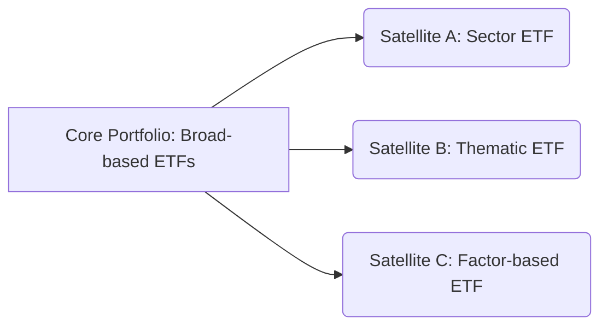

## 19.7 Investment Strategies Using Exchange-Traded Funds

Exchange-Traded Funds (ETFs) have emerged as a flexible, cost-effective, and accessible vehicle for both individual and institutional investors. Their ability to trade on stock exchanges throughout the day, combined with the diversification they offer, makes them particularly appealing for building sophisticated portfolios. This section explores key ETF-based strategies, including the Core and Satellite approach, Dollar-Cost Averaging (DCA), Tactical Asset Allocation, and Hedging. We will also discuss the Canadian financial context, highlighting how these strategies may fit into investment plans governed by local regulations and tax considerations.

---

### Core and Satellite Approach

One of the most popular ways to incorporate ETFs into a portfolio is through the Core and Satellite approach:

• **Core Holding:** The central portion of the portfolio, designed to deliver stable, market-based returns. Typically, this involves ETFs that track broad market indexes such as the S&P/TSX Composite Index in Canada, or global benchmarks like the MSCI World Index.  
• **Satellite Holding:** Smaller, more targeted allocations intended to enhance returns or manage specific risks. Satellite ETFs might focus on industry sectors (e.g., technology), geographic regions (e.g., emerging markets), or themes (e.g., clean energy).

Below is a simple diagram illustrating the Core and Satellite approach:

#### Practical Example:  
• A Canadian investor uses an ETF tracking the S&P/TSX 60 as the core. This broad index provides exposure to 60 large Canadian companies (e.g., RBC, TD, Canadian National Railway).  
• The investor then selects smaller positions in satellite ETFs, such as a technology-focused ETF and a thematic clean energy ETF. The technology ETF might enhance returns during a bull market, while the clean energy ETF adds a sustainability tilt.

#### Key Benefits:  
• **Diversification:** The core reduces unsystematic risk by investing broadly.  
• **Tactical Opportunity:** Satellites allow the investor to capitalize on specific market segments.  
• **Simplicity and Cost Control:** ETFs are generally low cost, and the core helps manage overall portfolio complexity.  

---

### Dollar-Cost Averaging (DCA) with ETFs

Dollar-Cost Averaging (DCA) is a systematic strategy that involves investing a fixed amount of money at regular intervals, regardless of the ETF’s price. This method helps reduce the impact of short-term market fluctuations and eliminates the need to time the market.

#### How DCA Works:  
• Choose a Fixed Investment Amount (e.g., C$1,000/month).  
• Purchase ETF shares every month. When prices are high, you buy fewer shares; when prices are low, you buy more shares.  
• Over time, the plot of your average cost tends to smooth out.

#### Example in Practice:  
• Suppose you invest C$500 each month into a Canadian equity ETF that tracks the S&P/TSX Composite Index. In months when the market is down, you will accumulate more shares. In times of market surges, you will buy fewer shares, mitigating the risk of investing a lump sum at an inopportune moment.

#### Benefits and Considerations:  
• **Reduced Market Timing Risk:** Market forecasts are notoriously difficult, and DCA helps avoid costly mistakes.  
• **Disciplined Savings:** Encourages regular saving and investing habits.  
• **Volatility Exposure:** DCA benefits from volatility (buying more units when prices dip), but it also means you maintain a substantial idle cash position if you are initially well funded.

---

### Tactical Asset Allocation with ETFs

While many investors maintain a long-term strategic asset allocation, some opt to adjust their portfolio weights in response to market conditions, a practice known as Tactical Asset Allocation (TAA). ETFs make it relatively easy to implement short-term shifts because you can quickly and cost-effectively sell one ETF (e.g., equity-based) and buy another (e.g., bond-based).

#### Implementation Steps:  
1. **Market View:** Formulate a hypothesis (e.g., belief that Canadian equity markets may outperform global markets).  
2. **ETF Selection:** Select suitable ETFs to reflect that hypothesis (e.g., an ETF focusing on Canadian large-cap stocks).  
3. **Rebalancing and Monitoring:** Set target time horizons and continually review performance and market conditions to decide when to revert to the baseline allocation.

#### Risks to Consider:  
• **Timing Risk:** While TAA can boost returns, incorrect market-timing calls can reduce them.  
• **Increased Trading Costs:** Commission fees and bid-ask spreads from frequent ETF trades can erode gains.  
• **Behavioural Bias:** Emotional decisions can result in buying high and selling low.

---

### Portfolio Diversification

**Diversification** is a hallmark of prudent investing, and ETFs significantly simplify the process. Rather than individually purchasing numerous stocks and bonds, a single ETF can offer exposure to an entire market subset. Canadian investors, for example, can look at ETFs for:

- **Canadian Stocks:** S&P/TSX 60, S&P/TSX Composite  
- **U.S. Stocks:** S&P 500, NASDAQ-100  
- **Global Markets:** MSCI World, EAFE (Europe, Australasia, Far East)  
- **Bonds:** Canadian government bonds, corporate bonds, high-yield bonds  
- **Sectors/Themes:** Energy, financials, technology, commodities (gold, oil, etc.)

Access to diversified holdings helps reduce unsystematic risk—risks associated with individual companies or sectors—and creates a more stable overall portfolio return.

---

### Hedging and Risk Management

#### Currency-Hedged ETFs  
Canadian investors venturing into international markets often face currency risk. As the Canadian dollar fluctuates relative to foreign currencies (e.g., USD, EUR), the value of overseas investments can rise or fall independently of market performance. Currency-hedged ETFs mitigate this risk by using currency derivatives (forwards or futures) to lock in exchange rates.

• **Benefit:** More stable returns in CAD terms if the chosen currency-hedged ETF is accurately managed.  
• **Drawback:** Hedge might reduce potential currency gains if the Canadian dollar weakens, plus there are costs associated with hedging.

#### Inverse or Leveraged ETFs  
Inverse ETFs aim to replicate the *opposite* performance of a certain index. For instance, if the S&P/TSX Composite goes down by 1% on a given day, an inverse ETF might go up by about 1%. Leveraged ETFs attempt to magnify daily returns by factors of 2 or 3.

• **Tactical Use:** Hedging or short-term speculation.  
• **Risk:** Due to daily rebalancing, these products can diverge significantly from their stated objectives over longer periods.

#### Other Risk Management Techniques  
• **Stop-Loss Orders:** Investors can predefine exit points to limit losses on ETF positions.  
• **Option Strategies:** Covered calls or protective puts on ETF holdings can sometimes limit downside risk or generate additional income.

---

### Glossary

• **Core Holding:**
  A primary or foundational investment in a portfolio that typically tracks the broad market or major asset class.

• **Satellite Holding:**
  A secondary, smaller investment meant to boost returns or tilt a portfolio in a specific direction (e.g., small-cap equities, thematic trends).

• **Dollar-Cost Averaging (DCA):**
  Investing a consistent amount of money over regular intervals, potentially reducing the average cost per share over time.

---

### Best Practices and Considerations

1. **Match ETFs to Objectives:** Whether your goal is income, growth, or risk mitigation, be sure the ETF’s holdings align with your investing horizon and risk tolerance.  
2. **Monitor Tax Implications:** In Canada, holding foreign equity ETFs in certain registered accounts (e.g., RRSP) can be more tax-efficient than holding them in non-registered accounts. Conversely, interest income from bond ETFs is fully taxable in non-registered accounts and might be better suited for registered or tax-free accounts like TFSAs.  
3. **Stay Informed on Regulatory Changes:** Rules from the Canadian Investment Regulatory Organization (CIRO) and other bodies can affect ETF disclosures, advisor obligations, and investor reporting requirements.  
4. **Review Management Expense Ratios (MERs):** Low-fee ETFs can significantly enhance long-term returns, but always check if any specialized ETF has extra costs due to active management or complex strategies.  

---

### Putting It All Together: A Step-by-Step Example

Below is a hypothetical process to illustrate a comprehensive implementation strategy for a Canadian investor:

| Step | Action | Example |
|-----:|:------ |:------- |
| **1** | Determine Investment Objective | Retirement savings in 20 years. Target annual return ~6%. |
| **2** | Set Core Allocation | 50% in a broad Canadian equity ETF (S&P/TSX 60) for market exposure. 30% in a Canadian bond ETF for stability. |
| **3** | Consider Satellites | 10% in a technology-focused ETF + 10% in a global small-cap ETF for enhanced returns. |
| **4** | Decide on DCA | Invest C$1,000 monthly per instrument in proportion to the target allocation. |
| **5** | Monitor & Rebalance | Every 6–12 months, check if allocations drift by more than 5% from targets. Rebalance if needed. |
| **6** | Hedging (Optional) | With concerns of rising CAD, invest 50% of U.S. equity portion in a currency-hedged ETF. |
| **7** | Ongoing Review | Keep an eye on economic indicators, interest rates, and personal circumstances. Adjust tactically if justified. |

This structure offers a clear roadmap for achieving diversification and growth potential while managing risks.

---

### References and Additional Resources

• **“Asset Allocation and ETFs,”** an online module by the Canadian Securities Institute (CSI).  
• **CFA Institute Webinars:** Various sessions that explore advanced ETF strategies and global market perspectives.  
• **“Common Sense on Mutual Funds” by John Bogle:** While focused on mutual funds, many principles—especially regarding indexing—apply to ETFs.  
• **Government of Canada – Financial and Consumer Agency of Canada:** Offers resources on RRSPs, TFSAs, and fundamental investment concepts.  

---

## Master Your ETF Investment Strategies: A Comprehensive Quiz



### Which statement best describes the core and satellite approach to building an ETF portfolio?

- [x] Using broad-market ETFs as the portfolio foundation and sector or thematic ETFs for smaller, targeted allocations  
- [ ] Buying only broad-market ETFs and avoiding sector-specific ETFs  
- [ ] Focusing on inverse ETFs to hedge all market risks and reduce volatility  
- [ ] Replacing mutual funds entirely with multiple bond ETFs  

> **Explanation:** The core and satellite approach typically uses broad-based ETFs as the main “core” portion of the portfolio, with smaller “satellite” allocations in more specialized ETFs.

### One primary advantage of Dollar-Cost Averaging (DCA) with ETFs is:

- [x] It reduces the impact of short-term market volatility  
- [ ] It guarantees the highest possible returns  
- [ ] It only works when markets are trending upward  
- [ ] It requires frequent trading decisions at uncertain times  

> **Explanation:** DCA systematically invests a fixed amount at regular intervals, which helps mitigate the effects of volatile prices and removes the need for market timing.

### Tactical Asset Allocation (TAA) with ETFs primarily involves:

- [x] Adjusting portfolio weights to capitalize on anticipated market changes  
- [ ] Completely withdrawing investments during market volatility  
- [ ] Buying every ETF in the market  
- [ ] Avoiding equities and focusing only on fixed income  

> **Explanation:** TAA uses short-term shifts in portfolio allocation to exploit perceived opportunities or manage risk, facilitated by the flexibility and liquidity of ETFs.

### Which of the following is NOT typically a reason for using currency-hedged ETFs in Canada?

- [x] To earn extra income from hedging premiums  
- [ ] To protect investments from fluctuations in CAD relative to foreign currencies  
- [ ] To reduce currency-related volatility in a portfolio  
- [ ] To stabilize returns when investing in international markets  

> **Explanation:** Currency-hedged ETFs are used to mitigate FX risk, not to generate additional income from hedging costs. Normally, hedging has an associated cost.

### Inverse ETFs can be effectively used to:

- [x] Hedge a portfolio or speculate on market declines  
- [ ] Gain double the returns of the underlying index  
- [ ] Guarantee a steady dividend yield  
- [ ] Eliminate the need for maintaining a core portfolio  

> **Explanation:** Inverse ETFs aim to produce returns opposite to that of a chosen index, often for hedging purposes, but do not guarantee double returns, dividends, or replace a core approach.

### What is the primary benefit of making fixed contributions to an ETF portfolio at regular intervals?

- [x] It can lower the average cost per share by buying more shares when prices are lower  
- [ ] It guarantees maximum profits when markets are volatile  
- [ ] It locks in a single entry price for all investments  
- [ ] It eliminates management fees  

> **Explanation:** Dollar-Cost Averaging (DCA) invests consistently, potentially reducing an investor’s average cost due to purchasing more shares during market dips.

### Which of the following best illustrates a “satellite” holding?

- [x] A small-cap technology ETF purchased to enhance growth potential beyond a broad Canadian equity ETF  
- [ ] A large index ETF that tracks the entire S&P/TSX Composite  
- [ ] Government of Canada bond ETF making up 60% of the investor’s portfolio  
- [ ] Currency-hedged ETF representing 50% of the portfolio  

> **Explanation:** By definition, satellite allocations are smaller, focused investments meant to complement or enhance the returns of the core holdings.

### In a Core and Satellite portfolio design, the core portion usually focuses on:

- [x] A broad index or broad market exposure  
- [ ] A single sector ETF that swings widely  
- [ ] Speculative futures on commodities  
- [ ] Only short-term money market instruments  

> **Explanation:** Core holdings generally track a broad market index like S&P/TSX or MSCI World to provide stable, diversified exposure.

### When rebalancing a tactical ETF portfolio:

- [x] Adjust holdings back to the predetermined target weights if they deviate beyond set thresholds  
- [ ] Sell all holdings after a market rally to lock in profits  
- [ ] Buy more of the highest-performing asset only  
- [ ] Always eliminate any bond allocation  

> **Explanation:** Rebalancing typically involves bringing the portfolio back to defined allocations if one component becomes too large or too small relative to the target.

### True or False: Leveraged ETFs are generally optimized for long-term investing.

- [x] True  
- [ ] False  

> **Explanation:** This statement is tricky: while leveraged ETFs can be used for specific short-term strategies, they are generally NOT recommended for long-term buy-and-hold investing due to daily rebalancing issues and performance drift. However, some investors—though rare—may keep them long-term if they fully understand their mechanics and are prepared for higher risk. Most industry experts advise caution for long-term use.



---

## For Additional Practice and Deeper Preparation

**Elevate your exam readiness with our comprehensive app, "Securities CA: Mock Exams," designed to challenge and refine your skills.**

* **Master Challenging Questions:** Dive into expertly crafted sample exam questions that go beyond standard references.
* **Scenario-Driven Learning:** Experience scenario-driven case questions and in-depth solutions to build practical expertise.
* **Sharpen Exam Strategies:** Build confidence with step-by-step explanations designed to refine your exam-day tactics.
* **Gain Real-World Insights:** Acquire practical tips and detailed rationales that demystify complex concepts.
* **CIRO and CSI Alignment:** Stay current with CIRO guidelines and CSI’s exam structure, with questions intentionally more challenging than the actual exam.

**Download the App Today:**

> Note: While these courses are specifically crafted to align with the CSC® exams outlines, they are independently developed and not endorsed by CSI or CIRO.

---

By applying these core and satellite strategies, DCA, and diverse hedging techniques in the Canadian context, you can optimize your portfolio for various market conditions. Always remain prudent, stay updated on regulatory changes, and consider consulting with licensed professionals for personalized advice.
