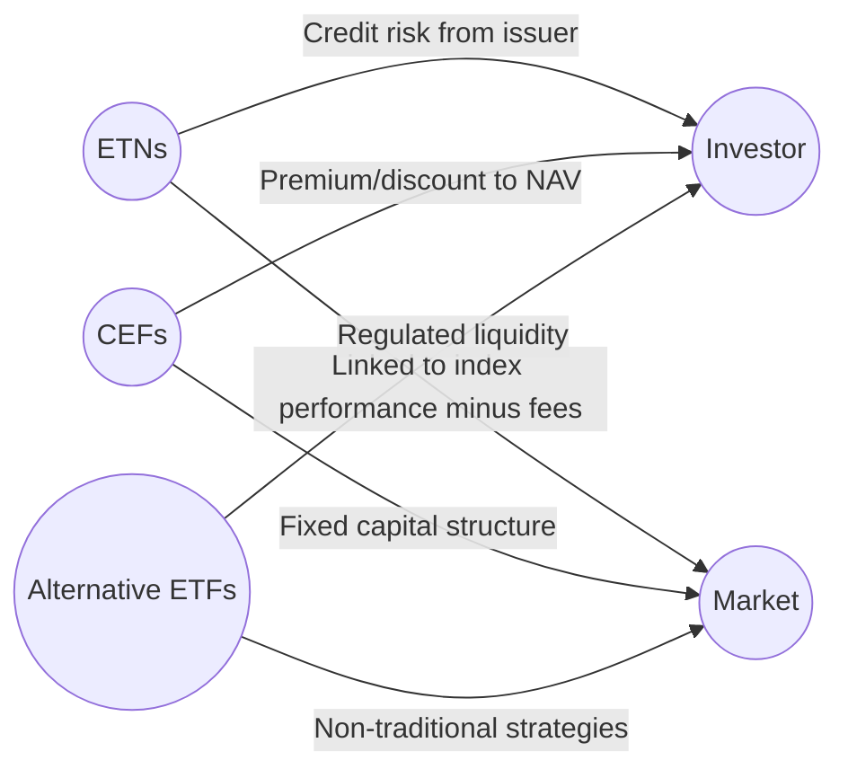

## 19.8 Other Related Products

In the previous sections of this chapter, we have explored the structure, regulation, and varieties of exchange-traded funds (ETFs) in depth. However, ETFs represent only one segment of a broader universe of publicly traded investment products. This section will delve into three major categories often discussed alongside or in comparison to ETFs:

1. Exchange-Traded Notes (ETNs)  
2. Closed-End Funds (CEFs)  
3. Alternative ETFs (sometimes referred to as “liquid alternatives”)  

Each product type offers unique benefits, risks, and structural nuances that can influence an investor’s portfolio composition and risk profile. Throughout this section, we will discuss their key features, common use cases in the Canadian market, and regulatory considerations to keep top of mind.

---

## Exchange-Traded Notes (ETNs)

### What Are ETNs?
Exchange-Traded Notes (ETNs) are debt obligations issued by financial institutions such as banks. They are designed to provide investors with a return tied to the performance of a specific underlying benchmark or index, minus fees. ETNs trade on an exchange, similar to equities and ETFs, which allows for intraday liquidity.

However, ETNs differ from ETFs in one key aspect: credit risk. Because ETNs are unsecured debt obligations, the solvency and creditworthiness of the issuing institution can significantly impact the ETN’s viability. If the issuing bank or financial institution defaults, investors may only receive partial or no return on the ETN, regardless of how the underlying index performs.

### Key Structural Features
• Principal Protection: Most ETNs are not principal-protected. While some may advertise limited downside protection, investors should carefully read the offering documents.  
• No Tracking Error Risk: Because ETNs promise to deliver the total return of the reference index (minus fees), they do not hold a basket of securities as ETFs do. This structure typically results in minimal tracking error but introduces credit risk.  
• Fees: ETNs generally have ongoing fees (often deducted from the note’s value) and possibly redemption fees for early redemption prior to maturity. These fees must be accounted for when evaluating long-term returns.  

### Real-World Example
Suppose RBC issues an ETN directly tied to the performance of the S&P/TSX 60 Index. If the S&P/TSX 60 increases by 10% over one year, and the ETN charges a 1% annual fee, the gross payoff to ETN holders (excluding credit risk considerations) would be roughly 9%. However, if RBC faces a significant credit event, the ETN’s value may plummet, even if the S&P/TSX 60 remains robust.

### Considerations Within Canadian Investment Portfolios
• Credit Risk Management: Check the issuer’s credit rating through agencies such as DBRS, Fitch, Moody’s, or S&P.  
• Regulatory Observations: Although primarily regulated under debt securities frameworks, ETNs also come under the purview of the Canadian Securities Administrators (CSA) for market rules.  
• Portfolio Positioning: ETNs can offer access to hard-to-reach asset classes or esoteric indexes. However, Canadian advisors must weigh the trade-off between potential lack of tracking error and the added credit risk.  

---

## Closed-End Funds (CEFs)

### Defining Closed-End Funds
Closed-End Funds (CEFs) are similar to ETFs in that they pool money from investors to invest in a diversified portfolio of securities. However, unlike traditional ETFs, CEFs do not continuously create or redeem shares based on supply and demand. Instead, CEFs often go through an initial public offering (IPO) to raise capital, after which their shares trade on the stock exchange. 

A defining characteristic of CEFs is that they may trade at a premium or discount relative to the fund’s net asset value (NAV). This discrepancy arises from market supply and demand dynamics—if there are more buyers than sellers, it can drive the share price above NAV, creating a premium; the reverse situation can lead to a discount.

### Key Structural Features
• Fixed Capital Structure: The number of shares outstanding is typically fixed, which can result in price fluctuations independent of NAV.  
• Portfolio Freedom: Because CEFs do not face daily creation/redemption pressures, managers may have more freedom to invest in less liquid or specialized markets such as private credit, real estate, or frontier markets.  
• Distributions: CEFs often distribute dividends or interest payments, making them potentially attractive for income-focused investors.  

### Premiums and Discounts
The phenomenon of trading at a premium or discount can be attributed to multiple factors, including market sentiment, the fund’s investment strategy, liquidity levels, and the reputation of the fund manager. In the Canadian market, some CEFs focusing on niche sectors (e.g., real estate investment trusts, private debt) exhibit longer periods of trading at a discount or premium depending on investor demand and perceived asset value.

### Example: Canadian Real Estate CEF
A hypothetical CEF that invests in high-yield Canadian real estate assets—say, mortgage-backed securities from provinces like Ontario or British Columbia—might trade at a discount during periods of economic uncertainty or rising interest rates. Conversely, if the real estate outlook is positive and demand is high, shares could command a premium over NAV.

### Regulatory Considerations
• Listing Requirements: Like most exchange-traded products, CEFs must meet standard exchange listing requirements set by regulators.  
• Disclosures: Managers must provide regular updates, including NAV calculations and holdings data.  
• Oversight: CSA’s National Instruments (for instance, NI 81-101 or NI 81-106) outline disclosure and operational guidelines for funds, which also apply to certain aspects of closed-end structures.  

---

## Alternative ETFs (Liquid Alternatives)

### Introduction to Alternatives and “Liquid Alts”
“Alternative ETFs” or “Liquid Alternatives” refer to ETFs that utilize non-traditional investment strategies and/or asset classes. These can include hedge-fund-like strategies such as long/short equity, market-neutral, managed futures, or multi-strategy approaches. Although hedge funds often face liquidity restrictions, alternative ETFs are structured to offer daily liquidity and are subject to regulatory frameworks designed for retail investment vehicles.

### Common Alternative Strategies
• Long/Short Equity: Employs short selling in addition to long positions, aiming to capitalize on both rising (long) and falling (short) security prices.  
• Market-Neutral: Attempts to profit from relative mispricings in securities while maintaining minimal net market exposure.  
• Global Macro or Multi-Strategy: Deploys multiple techniques, often involving commodities, currencies, and derivatives, seeking absolute returns.

### Canadian Regulatory Environment for Liquid Alts
The Canadian Securities Administrators introduced amendments to National Instrument 81-102 (Investment Funds) in January 2019, which paved the way for liquid alternative funds accessible to retail investors. These new guidelines allow asset managers more latitude in leveraging, short selling, and investing in derivatives, but within regulated limits to control risk.

### Practical Uses in Canadian Portfolios
Alternative ETFs can diversify and potentially reduce overall portfolio correlations to traditional asset classes. For instance, a Canadian-based alternative ETF that invests in long/short U.S. equities may hedge part of its currency exposure to CAD. When RBC or TD invests client assets in such ETFs, the goal is often to enhance risk-adjusted returns, particularly during periods of market volatility.

### Case Study: Long/Short Canadian Equity ETF
Imagine an ETF that holds a basket of top Canadian banks (going long on shares of RBC, TD, BMO) while shorting a basket of weaker or overvalued Canadian industrial stocks. This strategy aims to generate alpha from both upward and downward price movements. It remains subject to liquidity regulations, ensuring that retail investors can buy or sell ETF units on the TSX without facing the gating or lock-up periods often encountered in traditional hedge funds.

---

## Comparing ETNs, CEFs, and Alternative ETFs

To better visualize how these products differ on key factors such as structure, liquidity, and risk, consider the following diagram:

1. ETNs (A) are debt obligations of an issuing bank and pass along index-based returns (D) to the investor (B), but come with issuer credit risk.  
2. CEFs (C) have a fixed capital structure, which can cause their market prices (D) to diverge from NAV.  
3. Alternative ETFs (E) use alternative strategies (long/short, market-neutral, derivatives) subject to stricter regulations and daily liquidity, bridging the gap between traditional mutual funds and hedge funds.  

---

## Best Practices and Key Takeaways

When evaluating ETNs, CEFs, or alternative ETFs in the Canadian market:

1. Conduct Thorough Due Diligence  
   • For ETNs, verify the issuing bank’s credit rating and financial stability.  
   • For CEFs, examine historical discounts or premiums to NAV, and understand the liquidity of underlying assets.  
   • For alternative ETFs, ensure compliance with relevant regulations (e.g., NI 81-102) and confirm the fund manager’s track record in alternative strategies.

2. Understand the Risks  
   • Credit Risk (ETNs).  
   • Illiquidity and Pricing Disparities (CEFs).  
   • Leverage and Strategy Complexity (alternative ETFs).  

3. Align Products with Investment Objectives  
   • Evaluate how each product type fits your or your client’s risk tolerance, time horizon, and goals.  
   • Consider holding ETNs for short- to medium-term strategies only if you are comfortable assuming the issuer’s credit risk.  
   • Review the discount/premium patterns of a CEF if looking for potential entry/exit points.  
   • Use alternative ETFs to hedge or diversify risk in a portfolio dominated by conventional equities or bonds.

4. Stay Informed on Regulatory Updates  
   • The Canadian Investment Regulatory Organization (CIRO) and CSA often issue bulletins or updates that can influence product structuring.  
   • Monitor changes to National Instruments (e.g., NI 81-102) to ensure compliance with leverage, derivative usage, and liquidity requirements for alternative funds.

---

## References and Additional Resources

• CSA Guidelines and National Instruments Regulating Non-Traditional Funds:  
  – National Instrument 81-102 and 81-104 for mutual funds and alternative funds.  
• CIRO Bulletins on Structured Products and Alternative ETFs:  
  – Relevant bulletins provide guidance for advisors on the suitability of these instruments.  
• “Alternative Mutual Funds and ETFs” – A Resource on Liquid Alt Regulations in Canada.  

By exploring the differences and common features of ETNs, CEFs, and alternative ETFs, Canadian investors and advisors can diversify their strategies, manage risk, and optimize portfolio returns in an ever-evolving financial landscape. This knowledge empowers you to make more informed decisions when recommending or selecting investment products, ensuring alignment with personal or client-specific objectives.

---

## Master Your Knowledge: Other ETF-Related Products Quiz



### Which statement best describes an Exchange-Traded Note (ETN)?

- [x] It is an unsecured debt obligation issued by a financial institution that tracks an underlying index.  
- [ ] It is a pool of securities continuously created and redeemed by fund managers.  
- [ ] It is a mutual fund registered under NI 81-101 with daily liquidity.  
- [ ] It is similar to a closed-end fund with permanent capitalization.

> **Explanation:**( An ETN is an unsecured debt security issued by a bank or financial institution. It aims to track an underlying benchmark or index, minus fees, but carries the issuer’s credit risk.)

### What is a unique risk factor for ETNs compared to ETFs?

- [ ] ETFs can be more expensive to trade.  
- [x] ETNs carry the credit risk of the issuing bank.  
- [ ] ETNs incur higher trading costs.  
- [ ] ETFs always have greater price fluctuations.

> **Explanation:**( ETNs are essentially debt obligations of the issuing financial institution. If the issuer defaults, ETN holders face potential total or partial loss, making credit risk a key concern.)

### Closed-End Funds (CEFs) can trade at:

- [ ] Exactly their NAV in all market conditions.  
- [x] A discount or premium to their NAV based on market sentiment.  
- [ ] Only a discount to their NAV.  
- [ ] Only a flat price set by the issuer.

> **Explanation:**( CEFs have a fixed number of shares, and their market price is determined by supply and demand, which can lead to trading at either a discount or a premium to NAV.)

### Which of the following is a typical characteristic of a Closed-End Fund?

- [x] It has a fixed number of shares outstanding.  
- [ ] It is continuously creating and redeeming units during the trading day.  
- [ ] It cannot ever pay distributions.  
- [ ] It is principal-protected.

> **Explanation:**( Unlike ETFs, CEFs typically offer a fixed number of shares and do not continuously create or redeem shares, which often causes their share price to deviate from NAV.)

### Which of the following correctly distinguishes an alternative ETF from a traditional ETF?

- [x] Alternative ETFs can use hedge-fund-like strategies, such as leverage, short selling, or derivatives, within prescribed regulatory limits.  
- [ ] Alternative ETFs have no regulatory constraints regarding leverage or derivatives use.  
- [x] Alternative ETFs must offer a guaranteed minimum return.  
- [ ] Alternative ETFs typically avoid all derivatives and synthetic instruments.

> **Explanation:**( Alternative ETFs gained greater flexibility with recent Canadian regulatory changes, allowing the use of derivatives or short selling, similar to hedge funds, but under strict oversight.)

### A key advantage of ETNs over many ETFs is:

- [x] ETNs usually have minimal tracking error for the underlying index.  
- [ ] ETNs offer guaranteed returns protected by government insurance.  
- [ ] ETNs have no credit risk.  
- [ ] ETNs are always more liquid than ETFs.

> **Explanation:**( Because an ETN promises index returns minus fees (without needing to hold actual underlying assets), the tracking error is often lower, at least in theory. However, the trade-off is exposure to issuer credit risk.)

### Under what market conditions might a closed-end fund trade at a deep discount to its NAV?

- [x] When investors are pessimistic about the fund’s portfolio or asset class, resulting in more sellers than buyers.  
- [ ] When there is overwhelming enthusiasm for the fund’s strategy.  
- [x] When the fund’s underlying asset class is experiencing high liquidity and lower returns.  
- [ ] Closed-end funds do not trade at a discount to NAV.

> **Explanation:**( A CEF can move to a significant discount if investor sentiment is negative, the underlying assets are illiquid, or economic factors are unfavourable for its portfolio holdings.)

### Which best defines “liquid alternatives” in the Canadian context?

- [ ] Hedge funds with annual redemption windows.  
- [x] Investment products using alternative strategies but offering daily liquidity under NI 81-102 or similar regulation.  
- [ ] Private equity funds that never list on exchanges.  
- [ ] GICs offering capital protection.

> **Explanation:**( Liquid alternatives are regulated vehicles, accessible to retail investors, that employ alternative (hedge-fund-like) strategies but remain subject to daily redemption and regulatory oversight.)

### A potential benefit of adding alternative ETFs to a portfolio is:

- [x] They can reduce correlation to traditional asset classes, potentially improving diversification.  
- [ ] They are entirely risk-free.  
- [ ] They always outperform during market downturns.  
- [ ] They do not have to comply with any Canadian Securities Administrator regulations.

> **Explanation:**( Alternative ETFs can provide diversification benefits by employing strategies that are less correlated to traditional equity or fixed-income assets. However, they still carry risks and comply with CSA regulations.)

### True or False: In Canada, ETNs are insured by the Canada Deposit Insurance Corporation (CDIC) if issued by a major Canadian bank.

- [x] False  
- [ ] True  

> **Explanation:** ETNs are not covered by CDIC. They are unsecured debt obligations and carry the full credit risk of the issuer. CDIC protection typically extends to eligible deposits, not to investment products like ETNs.



---

