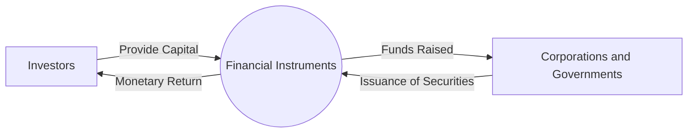

## 2.2 The Financial Instruments

Financial instruments are central to modern capital markets, enabling individuals, institutions, and governments to raise capital, manage risk, and pursue investment opportunities. In Canada, these instruments operate within a robust regulatory ecosystem overseen by bodies such as the Canadian Investment Regulatory Organization (CIRO) and provincial securities commissions (e.g., the Ontario Securities Commission). This section introduces the primary categories of financial instruments—debt, equity, derivatives, and structured products—and examines their characteristics, risk profiles, and the ways they are issued and traded in the Canadian marketplace.

---

## Overview of Financial Instruments

At their core, financial instruments are essentially contracts or documents with monetary value that can be bought, sold, or otherwise traded in financial markets. They provide a structured means for market participants to engage with capital. An investor may purchase these instruments for a variety of reasons: generating returns, hedging against losses (risk management), speculating on price movements, or fulfilling long-term financial objectives like retirement savings.

Key features of financial instruments include:
• A monetary value or exposure to market conditions.  
• A legal or contractual framework guiding rights, obligations, and payouts.  
• A degree of risk that corresponds to the potential reward or return.

Below is a conceptual diagram illustrating how financial instruments connect various market participants (e.g., corporations, governments, financial intermediaries, and investors).

In this diagram:  
• Investors supply capital, which is packaged into financial instruments.  
• Corporations and governments offer these financial instruments to raise funds for operations, expansions, infrastructure projects, and more.

---

## Categories and Characteristics of Financial Instruments

Financial instruments typically fall under four broad categories—debt, equity, derivatives, and structured products. Each category carries unique risk, return, and liquidity dimensions.

### Debt Instruments

Debt instruments represent loans that investors (creditors) provide to an issuer (borrowers, such as companies or governments). In exchange, the issuer agrees to pay interest (the “coupon”) and return the principal on a specified maturity date. Common examples include:

• Government Bonds and T-Bills:  
  - T-Bills (Treasury Bills) are short-term debt obligations issued by the Government of Canada. They have maturities of one year or less, typically with very low risk due to strong government backing.  
  - Government bonds have longer maturities and pay regular coupon interest. They are considered relatively low-risk investments, though long-term issues can face greater interest rate risk.

• Corporate Bonds:  
  - Issued by companies (e.g., banks such as RBC, TD, or manufacturing corporations like Magna International). They come with varying levels of credit risk that reflect the issuer’s creditworthiness.  
  - Higher yields often compensate for higher default risk.

• Debentures:  
  - A type of corporate bond not secured by physical assets but rather by the debtor’s general creditworthiness.  
  - Often have higher yields because they carry higher risk than secured bonds.

Debt instruments generally experience lower price volatility compared to equities, but they remain subject to risks including credit/default risk, interest rate risk, and inflation risk. For instance, when interest rates rise, the prices of existing bonds typically fall.

---

### Equity Instruments

Equity instruments represent ownership in a company or enterprise. The most common forms of equity instruments in Canada include:

• Common Shares:  
  - Confer voting rights in corporate decisions.  
  - Potential returns come from dividends (if declared by the company) and capital gains when share prices appreciate.  
  - Share prices fluctuate according to market sentiment, company performance, economic conditions, and other factors.

• Preferred Shares:  
  - Represent partial ownership but typically without voting rights.  
  - Offer fixed or floating dividends (paid out before dividends to common shareholders).  
  - Often behave somewhat like bonds, but they still carry equity risk. Preferred shares can be an attractive option for investors seeking fixed income with possible tax advantages, as dividends in Canada are taxed more favourably than interest income.

Equity shareholders may see higher potential returns than bondholders, but with higher volatility. Equity investments expose shareholders to business risk, market risk, and event risk (like mergers, acquisitions, or regulatory changes).

---

### Derivative Instruments

Derivatives derive their value from an underlying asset, rate, or index—such as a stock, bond, commodity, or currency. They are often used for hedging or speculating. Key types include:

• Options:  
  - Contracts granting the buyer the right (but not obligation) to buy (call option) or sell (put option) an underlying asset at a specified strike price by a certain expiry date.  
  - Allows investors to leverage small sums to control large volumes of underlying assets, enhancing potential gains but also posing considerable risk.

• Futures and Forwards:  
  - A futures contract is a standardized agreement to buy or sell an underlying asset at a predetermined price and date, traded on an organized exchange.  
  - A forward contract is similar but privately negotiated (over-the-counter), offering customization of quantity, delivery date, and other terms, albeit with higher counterparty risk.

• Swaps:  
  - Private agreements to exchange cash flows in the future (e.g., interest rates, currency exposures).  
  - Often used by institutions to manage or hedge specific financial risks.

Combining these instruments in various ways can align specific investment or hedging objectives. Derivatives require careful risk management due to their potentially high leverage and sensitivity to rapid price movements.

---

### Structured Products

Structured products combine elements of debt, equity, and derivatives to tailor specific risk-return profiles:

• Principal-Protected Notes (PPNs):  
  - Promise to return the principal at maturity.  
  - Often linked to an underlying index or basket of assets (e.g., equity indices).  
  - Suit conservative investors seeking upside exposure while preserving principal—though there may be liquidity constraints or fees.

• Market-Linked GICs:  
  - Function like traditional Guaranteed Investment Certificates but with a variable return tied to a market index.  
  - Pay a guaranteed minimum return plus a possible bonus based on equity or commodity performance.

• Other Structured Investments (e.g., Collateralized Loan Obligations, Split Shares):  
  - Offer unique cash flow structures or credit enhancements, but can be complex and less liquid than standard debt or equity.

Structured products in Canada are regulated in accordance with provincial securities laws. Prospective investors should carefully review the product’s legal documents and disclosures, given the potential complexity of embedded fees, call features, and performance triggers.

---

## The Risk-Return Spectrum

Financial instruments can be visualized along a continuum correlating risk and potential return. Typically, money market instruments like T-bills carry the lowest risk—and therefore the lowest returns—while derivatives and certain structured products can offer high returns with correspondingly higher risk. Below is a simplified diagram:

• T-Bills are low-risk, low-return.  
• Bonds and debentures offer moderate returns and moderate risk.  
• Equities present the possibility of higher returns but greater volatility.  
• Derivatives and certain structured products can significantly amplify risk and return.

---

## How Instruments Are Issued and Traded

### Issuance in Primary Markets

New securities are created and sold to investors in primary markets, often mediated by investment dealers and underwriters. In Canada:

• Public Offerings:  
  - Involves a prospectus filing with provincial securities commissions (e.g., OSC).  
  - A prospectus disclosure provides details about the issuer, financial health, and risks.  
  - Once approved, securities can be offered to the public.

• Private Placements:  
  - Sold privately to a limited group of sophisticated investors (e.g., institutional investors, accredited investors).  
  - Typically have fewer regulatory requirements but are not widely available to the public.

### Trading in Secondary Markets

After initial issuance, securities trade on secondary markets:

• Stock Exchanges (e.g., Toronto Stock Exchange - TSX):  
  - Provide liquidity through continuous buying and selling.  
  - Listing requirements ensure a level of transparency and disclosure.

• Over-the-Counter (OTC) Markets:  
  - Decentralized marketplaces for instruments like bonds and derivatives.  
  - Less standardized, and liquidity can vary.

• Electronic Trading Platforms:  
  - Often used for derivatives or specialized instruments (e.g., swaps).  
  - Regulated by CIRO and/or provincial regulators, depending on the instrument.

Investors in Canada often rely on real-time data feeds (e.g., Yahoo Finance) or market data offered by brokerage platforms to track market prices, bid/ask spreads, and other key trading metrics.

---

## Practical Applications and Examples

• Canadian Pension Funds and Bonds:  
  - Large pension funds (e.g., Ontario Teachers’ Pension Plan) often hold sizeable bond portfolios to generate steady income and match long-term liabilities.  
  - Strategies can include laddering bond maturities to manage interest rate risk.

• Major Canadian Banks (RBC, TD) and Equity Issuance:  
  - Banks occasionally issue new shares to strengthen their capital positions or fund expansion.  
  - Investors in common shares benefit from dividends (if declared) and potential price appreciation.

• Hedging Currency Risk with Derivatives:  
  - A Canadian exporter might use currency futures or options to lock in an exchange rate, mitigating foreign exchange volatility.  
  - Similarly, large institutional investors with global portfolios often use forward contracts to hedge currency exposures.

• Structured Products in a Registered Account:  
  - Products like Principal-Protected Notes can be held in Registered Retirement Savings Plans (RRSPs) or Tax-Free Savings Accounts (TFSAs).  
  - The tax treatment may differ, so consult official guidance or a qualified professional for clarity.

---

## Best Practices, Common Pitfalls, and Strategies

1. Perform Due Diligence:  
   - Thoroughly examine the issuer’s credit quality when investing in bonds or debentures.  
   - Review company fundamentals before purchasing equity securities.

2. Understand Product Complexity:  
   - Structured products and derivatives can be intricate. Read the prospectus or offering memorandum, paying close attention to embedded fees and payout formulas.

3. Diversify Across Instruments:  
   - Balancing bonds, equities, and, in some cases, derivatives or structured products can help mitigate risk.  
   - Over-concentration in a single category or issuer can heighten portfolio volatility.

4. Monitor Regulatory Changes:  
   - Keep abreast of updates from bodies like CIRO and the OSC that impact disclosure requirements, capital rules, or trading practices.

5. Align with Personal or Institutional Objectives:  
   - Each instrument should serve a defined purpose in a broader investment strategy—whether income generation, capital appreciation, tax optimization, or risk hedging.

---

## Step-by-Step Guidance: Evaluating a Financial Instrument

Consider the following process when analyzing a potential investment:

1. Define Your Objective:  
   - Are you seeking steady income, capital growth, or hedging? Identify how this instrument fits within your overall strategy.

2. Review the Instrument’s Fundamentals:  
   - For bonds, check the issuer’s credit rating, coupon rate, maturity date, and yield to maturity.  
   - For equities, assess the company’s financial statements, dividend history, and competitive landscape.

3. Evaluate Risks:  
   - Identify the primary risks (credit, market, liquidity, currency) and decide if the potential rewards justify exposure.

4. Compare Market Alternatives:  
   - Benchmark the instrument's yield, price, or index to similar offerings.  
   - Use free tools like Yahoo Finance or subscription-based analytics platforms for comparisons.

5. Verify Regulatory Compliance:  
   - Confirm that you and your dealer or advisor follow relevant CIRO regulations and guidelines.  
   - Check for any reporting or prospectus requirements.

6. Monitor Ongoing Performance:  
   - Prices, yields, and credit ratings can change over time.  
   - Adjust holdings as necessary to maintain your target asset allocation.

---

## Resources and Further Learning

• CIRO Regulations and Notices:  
  - https://www.ciro.ca/regulatory/notices-circulars  
  Offers up-to-date guidelines and investor-protection information on how various financial instruments are regulated.  

• Ontario Securities Commission (OSC):  
  - https://www.osc.ca/  
  Comprehensive resource for prospectus filings, enforcement actions, and investor education materials.

• Open-Source Financial Tools:  
  - “Yahoo Finance” (https://finance.yahoo.com/) for real-time quotes on equities, bonds, and derivatives.  
  - “Investopedia Simulator” (https://www.investopedia.com/simulator/) to practice trading in a risk-free environment.

• Additional Reading:  
  - “Options, Futures, and Other Derivatives” by John C. Hull for advanced coverage on derivatives usage and pricing.  
  - “Bond Markets, Analysis, and Strategies” by Frank J. Fabozzi for deeper exploration of fixed-income instruments.

• Online Courses for Deeper Insights:  
  - “Fixed Income Fundamentals” on edX covers bond valuation, yield calculations, and risk management.

---

## Summary

Financial instruments power modern capital markets. In the Canadian context, they seamlessly integrate the investment goals of individuals and institutions with the capital-raising needs of corporations and government entities. Understanding the features, risks, and regulations associated with different instruments—whether debt, equity, derivatives, or structured products—is crucial for constructing a balanced, goal-oriented portfolio.

By grasping how these instruments fit within the risk-return spectrum and learning the steps to evaluate them effectively, investors can make more informed decisions aligned with their financial objectives. Whether you seek stable income or higher-growth potential, the Canadian securities market offers a wide array of instruments to accommodate diverse investment strategies.

---

## Test Your Knowledge: Top Financial Instruments in Canada Quiz



### Which of the following types of financial instrument represents a loan from the investor to a corporation or government?

- [x] Debt instrument
- [ ] Equity instrument
- [ ] Derivative
- [ ] Structured product

> **Explanation:** A debt instrument is a borrowing arrangement where the issuer (corporation or government) promises to pay the investor interest and repay the principal at maturity.

### What is a key characteristic of preferred shares?

- [x] They often have a fixed dividend but typically lack voting rights.
- [ ] They pay no dividends.
- [x] They always appreciate in value faster than common shares.
- [ ] They lack any claim on assets in the event of liquidation.

> **Explanation:** Preferred shares usually have a fixed or floating dividend that is paid before dividends on common shares. They typically do not carry voting rights. While they can provide a more stable dividend income, there is no guarantee that they always appreciate faster than common shares.

### Which of the following financial instruments is usually considered the safest in terms of credit risk?

- [x] Government of Canada Treasury Bill
- [ ] Corporate bond
- [ ] Preferred share
- [ ] High-yield bond

> **Explanation:** Government of Canada T-bills are backed by the Canadian government, thus they carry minimal default risk and are generally regarded as among the safest investments in Canada.

### What is the main difference between a futures contract and a forward contract?

- [x] Futures are standardized and traded on an exchange; forwards are privately negotiated.
- [ ] Futures usually have higher credit risk.
- [ ] Forwards are exclusively used for corporate bonds; futures are for equity.
- [ ] They are identical in every aspect, including standardization.

> **Explanation:** Futures contracts are standardized agreements traded on exchanges, reducing credit risk via a clearinghouse. Forward contracts are private, over-the-counter agreements with customized terms but carry higher credit (counterparty) risk.

### How does a principal-protected note (PPN) differ from a regular bond?

- [x] A PPN typically ties its return to an underlying asset's performance while guaranteeing principal at maturity.
- [ ] A PPN pays a higher coupon than most bonds.
- [x] A PPN is an equity instrument.
- [ ] A PPN is a short-term government security.

> **Explanation:** Principal-protected notes guarantee the initial investment if held to maturity and often link additional returns to an underlying market index or asset, differentiating them from plain vanilla bonds that pay a fixed or variable coupon.

### The risk-return spectrum suggests that which of the following typically offers both high risk and high potential reward?

- [x] Derivatives and certain structured products
- [ ] T-bills
- [ ] Government bonds
- [ ] Guaranteed Investment Certificates

> **Explanation:** Derivatives are leveraged instruments and can magnify gains or losses. Structured products, depending on their composition, can also offer elevated risk-return profiles.

### Where do investors purchase newly issued common shares for the first time?

- [x] The primary market
- [ ] The secondary market
- [x] The stock exchange’s resale market
- [ ] Over-the-counter only

> **Explanation:** Newly issued securities (including common shares) are initially sold to investors in the primary market. Subsequently, they trade among investors in the secondary market.

### Which of the following is a valid reason for a Canadian exporter to use derivatives?

- [x] To hedge currency risk on future USD receivables
- [ ] To remove regulatory hurdles and pay fewer taxes
- [ ] To diversify directly into real estate
- [ ] To increase credit ratings with bondholders

> **Explanation:** By using currency futures, forwards, or options, a Canadian exporter can lock in an exchange rate, thus mitigating the risk of adverse currency moves between the CAD and USD.

### What is the primary purpose of reading a prospectus when investing in an IPO?

- [x] To understand the company’s financial health, risks, and the terms of the offering
- [ ] To buy shares at a discount on the secondary market
- [ ] To receive early dividends before the IPO is complete
- [ ] To guarantee a short-term profit

> **Explanation:** The prospectus provides background on the company’s finances, management, risk factors, and other essential details, helping investors make informed decisions.

### Structured products like market-linked GICs guarantee the principal but can limit potential upside. True or False?

- [x] True
- [ ] False

> **Explanation:** Market-linked GICs guarantee the principal if held to maturity but may cap or limit the return based on the linked index’s performance, often resulting in less upside potential compared to direct equity investment.



---

