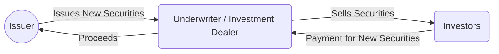
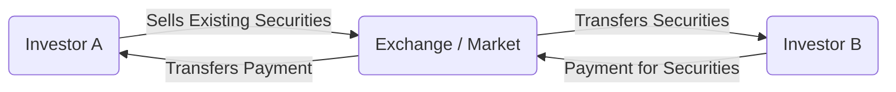
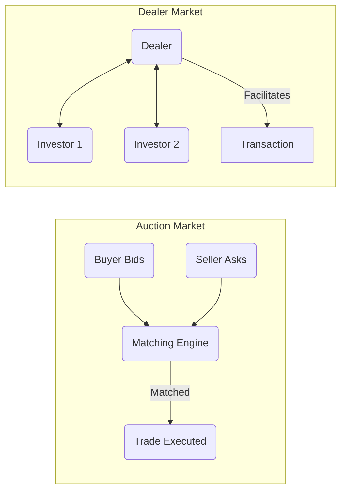

## 2.3 The Financial Markets

Investment markets form the heartbeat of the Canadian financial system, facilitating the flow of capital from savers to borrowers and offering a platform where securities of all types—equities, fixed-income products, derivatives, and more—are bought and sold. This section focuses on understanding how these markets are structured and regulated, how participants interact, and how different market types affect price discovery and liquidity.

Canada’s financial markets are shaped by a combination of regulatory frameworks, technological innovation, and a diverse set of market participants. By mastering the distinctions within the market structure, you will be better equipped to evaluate investments, navigate different trading venues, and understand the broader context around how securities move from issuers to end investors.

---

## Primary vs. Secondary Markets

### Primary Market

The primary market is where new securities—such as stocks or bonds—are issued and sold to investors for the first time.  
• In an equity context, an Initial Public Offering (IPO) is a classic example: a private company offers its shares publicly for the first time.  
• Proceeds from these sales go directly to the issuer (e.g., the company or government).  
• Issuers in Canada must comply with strict regulatory requirements, often involving the submission of a prospectus to the relevant provincial or territorial securities commission (e.g., the Ontario Securities Commission or the Autorité des marchés financiers in Québec).  
• Underwriters (often investment dealers) lead the issuance process, pricing, and marketing the securities to investors.  

Below is a simplified diagram illustrating the flow of funds and securities in the primary market context:

#### Real-World Example:  
A major Canadian bank, such as RBC or TD, might underwrite a new issuance of corporate bonds for a blue-chip Canadian company. The bank works with the company to structure the bond, finalize the interest rate (coupon), and distribute the bonds to institutional and retail investors who purchase them for the first time in the primary market.

### Secondary Market

Once securities have been issued, they begin trading in the secondary market, where investors buy and sell these existing securities among themselves.  
• The majority of stock and bond trading volume takes place here.  
• Secondary markets provide liquidity, so investors can enter or exit positions without dealing directly with the issuing entity.  
• Exchanges like the Toronto Stock Exchange (TSX) provide the physical or (more commonly) electronic platform for these transactions.  
• Prices in the secondary market evolve constantly based on supply, demand, company performance, macroeconomic factors, and investor sentiment.

The following diagram provides a simplified overview:

#### Case Study:  
A pension fund that purchased shares in a major Canadian corporation at the IPO stage might decide to sell a portion of its holdings on the TSX two years later. The buyer in this trade might be another institutional investor, a mutual fund, or a retail investor—showing how the secondary market facilitates ongoing liquidity and price discovery, all without additional involvement from the issuing corporation.

---

## Auction Markets vs. Dealer Markets

### Auction Markets

In an auction market, buyers and sellers place competing bids and offers, with trades executed when there is a match.  
• The Toronto Stock Exchange (TSX) is an auction market where a central order book displays buy orders (bids) and sell orders (asks).  
• These orders are matched based on price priority (the highest buy bid matches the lowest sell offer) and time priority (earlier orders at the same price get matched first).  
• This setup provides transparency, as current bid/ask prices and trade volumes are publicly visible.

### Dealer Markets (OTC)

In dealer or over-the-counter (OTC) markets, individual dealers (sometimes referred to as market makers) quote bid and ask prices.  
• The dealer handles the execution by buying or selling from its own inventory.  
• Many fixed-income securities, such as corporate bonds and some provincial or municipal bonds, trade primarily in OTC markets in Canada.  
• While liquidity can be substantial, the process is generally less transparent than an auction market because quotes are not centralized in one order book.  

The following diagram compares these two market structures:

---

## Electronic Trading Systems

Technology continues to reshape financial markets, accelerating trade matching and fostering new platforms.

### Equity Markets
• Electronic order books, or “matching engines,” execute trades in fractions of a second.  
• Alternative Trading Systems (ATS) allow market participants to execute large or specialized orders outside traditional exchange structures, seeking better prices or mitigating market impact.  
• “Dark pools” are private ATS venues where large institutional blocks can be traded with minimal disclosure of trading intentions.  

#### Practical Example:  
Algorithmic trading strategies are widely used by large Canadian institutions. RBC, for instance, might use sophisticated algorithms for block trading on TSX or ATS platforms. An asset manager seeking to acquire a large block of shares can place an order on a dark pool to avoid revealing its full intention to the broader market.

### Fixed-Income Markets
• Government of Canada bonds and some highly liquid corporate bonds trade via electronic request-for-quote systems, where institutions can solicit multiple quotes from dealers simultaneously.  
• Many trades still occur through direct communication (telephone or chat) with dealers—particularly for less liquid bonds or structured fixed-income products.  
• Specialized electronic bond trading platforms provide real-time quotes and improved transparency, though uptake is often more robust for government securities than for corporate issues.

---

## Regulatory and Disclosure Requirements

### Oversight

Canada’s financial market regulation is somewhat decentralized, managed at the provincial and territorial level. However, several national bodies set consistent standards.  
• The Canadian Investment Regulatory Organization (CIRO) oversees conduct and operational standards for investment dealers.  
• Provincial regulators (e.g., the Ontario Securities Commission, the British Columbia Securities Commission) supervise marketplace operations and issuer disclosures.

### Best Execution and Market Transparency

Dealers and advisors face a fiduciary or regulatory duty to seek the best possible price and execution terms for their clients. This concept is commonly referred to as “best execution.”  
• CIRO Trading Conduct Rules require that participating firms maintain robust policies and procedures to ensure they consistently strive for best execution.  
• Real-time data feeds (Level I, Level II quotes) help investors and dealers gauge price and market depth.  
• Regulators balance transparency with confidentiality for larger block trades to prevent market distortions.  

### Disclosure and Reporting

Firms are required to:  
• Provide trade confirmations to clients, detailing execution prices, commissions, and any relevant fees.  
• Maintain records that can be audited or examined by regulators.  
• Disclose relevant conflicts of interest or material information that may affect trading behavior or market prices.

---

## Market Intermediaries and Participants

### Brokers

Brokers act as agents for clients, executing trades on their behalf. They do not generally hold an inventory of securities but charge a commission or fee for their services.  
• Full-service brokers may offer research, advice, and financial planning, while discount brokers primarily focus on execution.

### Dealers (Market Makers)

Dealers, sometimes called market makers, can buy and sell from their own inventories, profiting from the spread between the bid price and the ask price.  
• In an OTC bond market, a dealer quotes both bid and ask prices.  
• In an exchange-traded equity market, designated market makers may also be obligated to provide liquidity under certain conditions.

### Institutional Investors

Institutions such as pension funds, mutual funds, insurance companies, or hedge funds often trade large volumes.  
• They can significantly influence pricing and liquidity due to the size of their orders.  
• Many institutions use algorithmic and high-frequency trading to optimize execution strategies.

### Retail Investors

Individual investors quite often trade through discount brokers or online platforms, utilizing resources like research reports, charting tools, and robo-advisors.  
• While their individual orders are typically smaller, retail investor sentiment can have a noticeable influence on market momentum and liquidity over time.

---

## Step-by-Step Guidance: Navigating the Markets

1. Identify Your Objectives: Determine if you are buying newly issued securities (primary market) or established ones (secondary market).  
2. Choose a Market Venue: Decide whether you’ll trade on an auction market (e.g., TSX) or via a dealer market (common for bonds).  
3. Select a Broker or Dealer: Research if a full-service, discount brokerage, or direct dealing with a bond dealer best suits your needs.  
4. Consider Electronic Platforms: Explore whether electronic order books or ATS could offer better pricing or execution, especially for large or specialized trades.  
5. Comply with Regulatory Requirements: Ensure your trades meet disclosure obligations and that you or your broker follow best execution guidelines.  
6. Monitor Market Data: Use real-time quotes, historical charts, and news feeds to stay updated.  
7. Evaluate After Trade Execution: Review trade confirmations, validate pricing, and track performance.

---

## Best Practices, Pitfalls, and Challenges

• Stay Informed of Regulatory Developments: As regulations evolve, being aware of changes in market conduct rules or listing requirements helps maintain compliance.  
• Mind Liquidity in Dealer Markets: Not all bonds or thinly traded stocks are equally liquid. Recognize the implications of wide bid-ask spreads.  
• Exercise Caution with Dark Pools and ATS: While they can minimize market impact, reduced transparency may pose risks in terms of price discovery.  
• Implement Robust Risk Management: Employ stop-loss orders or portfolio diversification to protect against sudden price swings.  
• Conduct Thorough Due Diligence: Firms or intermediaries should only recommend products and strategies suitable for your objectives and risk tolerance.

---

## Glossary of Key Terms

• **Primary Market:** The market in which new securities are offered to the public for the first time.  
• **Secondary Market:** The market where existing securities are traded among investors.  
• **Auction Market:** A market where orders from buyers and sellers compete directly, such as the TSX.  
• **Dealer Market (OTC):** A decentralized network where dealers quote bid and ask prices and trade from their inventories.  
• **Alternative Trading System (ATS):** An electronic trading venue functioning outside traditional exchanges, matching buy and sell orders privately.

---

## References and Additional Resources

• **CIRO Trading Conduct Rules:**  
  Visit [https://www.ciro.ca/](https://www.ciro.ca/) for comprehensive guidelines on best execution, order protection, and marketplace operations.  

• **Montreal Exchange (Bourse de Montréal):**  
  [https://www.m-x.ca/](https://www.m-x.ca/) provides information on Canada’s derivatives market and trading opportunities.  

• **Bank of Canada Market Indicators:**  
  [https://www.bankofcanada.ca/rates/](https://www.bankofcanada.ca/rates/) offers key insights into bond yields, interest rates, and other macroeconomic data.  

• **Open-Source Tools:**  
  • [QuantLib](https://www.quantlib.org/) for modeling and pricing of financial instruments (e.g., bonds, options) in various market settings.  
  • Python-based frameworks like “backtrader” for simulating portfolios and algorithmic trading strategies.  

• **Further Reading:**  
  • “Trading and Exchanges” by Larry Harris for detailed coverage of market microstructure.  
  • “Market Microstructure Theory” by Maureen O’Hara for deeper insights into order flow, information asymmetry, and price formation.  

• **Online Courses:**  
  • Coursera’s “Global Financial Markets and Instruments” for an international perspective.  
  • “Algorithmic Trading and Finance Models with Python” (EPAT by QuantInsti) for practical training in algorithmic trading.

---

## Conclusion

Understanding the different market structures—primary vs. secondary, auction vs. dealer, electronic vs. voice brokerage—is essential for making informed investment decisions in Canada. By choosing the right platform, remaining mindful of regulatory stipulations, and leveraging modern trading technologies, market participants can strive for optimal execution and effective capital allocation.

Whether you are an individual investor looking to expand your portfolio or a large institution managing millions in assets, appreciating the nuances of Canada’s financial markets can help you navigate complexities and seize opportunities.

---

## Test Your Knowledge: Canadian Financial Markets Quiz



### Which statement best describes the primary market?  
- [x] It is where newly issued securities are first offered to investors.  
- [ ] It is the market where investors buy and sell previously issued securities.  
- [ ] It is a secondary venue where stock splits take place.  
- [ ] It is an unregulated platform for corporate bonds.  

> **Explanation:**( The primary market is dedicated to the initial offering of new securities (e.g., IPOs). By contrast, previously issued securities trade on the secondary market.)

### Which of the following is an advantage of the secondary market?  
- [x] It provides liquidity for investors who wish to buy or sell existing securities.  
- [ ] It eliminates all transaction costs for large block trades.  
- [ ] It guarantees the issuer profits on every trade.  
- [ ] It replaces all regulatory oversight.  

> **Explanation:**( The main advantage of the secondary market is that it offers liquidity, enabling investors to exit or enter positions without needing to interact directly with the issuer.)

### In an auction market, how are trades primarily matched?  
- [ ] By calling a licensed dealer to negotiate a price.  
- [x] By matching bid and ask orders in a central order book.  
- [ ] Through a private agreement between institutional investors.  
- [ ] Based solely on the highest trading volume.  

> **Explanation:**( Auction markets use a central order book where orders from buyers (bids) and sellers (asks) compete, and trades occur when these prices align.)

### Which type of market structure are most Canadian government bonds traded in?  
- [ ] Pure auction on major exchanges.  
- [x] Dealer markets (often over-the-counter).  
- [ ] Fixed commission-based exchanges.  
- [ ] Proprietary high-frequency exchanges only.  

> **Explanation:**( Although some electronic platforms exist, most bond trading—especially corporate and certain government bonds—occurs in OTC dealer markets in Canada.)

### What describes the function of an ATS (Alternative Trading System)?  
- [x] It is an electronic system allowing private matching of buy and sell orders.  
- [ ] It is the centralized exchange for all IPOs in Canada.  
- [x] It offers potential benefits like reduced market impact for large trades.  
- [ ] It is a system that completely bypasses regulatory oversight.  

> **Explanation:**( ATSs are electronic networks that facilitate trade matching outside traditional exchanges. They can help institutions execute large trades with less public visibility.)

### What is “best execution” for a securities dealer?  
- [x] Ensuring clients’ orders receive the most advantageous price and terms under prevailing conditions.  
- [ ] Offering trades only on the TSX, regardless of other market venues.  
- [ ] Guaranteeing the lowest possible commission rate.  
- [ ] Prioritizing dealer profits above client interests.  

> **Explanation:**( “Best execution” requires dealers to diligently pursue the best possible outcome (price, speed, and terms) for their clients under current market conditions.)

### Which participant is typically responsible for quoting bid-ask prices in a dealer market?  
- [x] The dealer acting as a market maker.  
- [ ] A third-party clearing house.  
- [x] Retail investors on an electronic limit order book.  
- [ ] The provincial securities commission.  

> **Explanation:**( In dealer (or OTC) markets, the dealer provides bid and ask prices from its inventory. )

### Which statement accurately describes dark pools?  
- [x] They are private venues where large trades can be executed with minimal disclosure.  
- [ ] They are exclusively used for government bond trading.  
- [ ] They broadcast real-time trade sizes to all market participants.  
- [ ] They are illegal in Canada.  

> **Explanation:**( Dark pools provide anonymity for institutional investors placing large block orders to avoid significant market impact, making them neither publicly illegal nor exclusively for bonds.)

### Which best reflects the role of provincial regulators in Canada’s financial markets?  
- [x] They oversee securities issuance, trading conduct, and enforce disclosure requirements within their jurisdictions.  
- [ ] They handle all monetary policy decisions for the country.  
- [ ] They set interest rates for all federally regulated banks.  
- [ ] They issue primary market securities on behalf of corporations.  

> **Explanation:**( Provincial regulators like the Ontario Securities Commission supervise how securities are issued and traded, ensuring transparent and fair markets.)

### True or False: A broker typically trades securities from its own inventory to earn a spread.  
- [x] False  
- [ ] True  

> **Explanation:** Brokers generally act as agents executing trades on behalf of clients. Dealers or market makers, on the other hand, trade from their own inventory.



---

## For Additional Practice and Deeper Preparation

**Elevate your exam readiness with our comprehensive app, "Securities CA: Mock Exams," designed to challenge and refine your skills.**

* **Master Challenging Questions:** Dive into expertly crafted sample exam questions that go beyond standard references.
* **Scenario-Driven Learning:** Experience scenario-driven case questions and in-depth solutions to build practical expertise.
* **Sharpen Exam Strategies:** Build confidence with step-by-step explanations designed to refine your exam-day tactics.
* **Gain Real-World Insights:** Acquire practical tips and detailed rationales that demystify complex concepts.
* **CIRO and CSI Alignment:** Stay current with CIRO guidelines and CSI’s exam structure, with questions intentionally more challenging than the actual exam.

**Download the App Today:**

> Note: While these courses are specifically crafted to align with the CSC® exams outlines, they are independently developed and not endorsed by CSI or CIRO.
