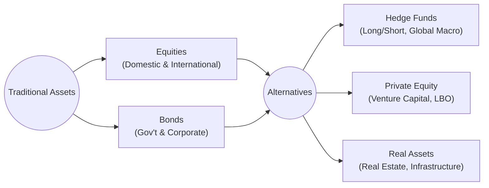

## 20.2 Investing in Alternatives — Benefits and Risks

Alternative investments, which can include hedge funds, private equity, real estate partnerships, infrastructure projects, and other non-traditional assets or strategies, have gained growing acceptance as legitimate portfolio diversifiers among institutional and retail investors in Canada. Unlike conventional mutual funds and exchange-traded funds (ETFs) that focus on equities or bonds, many alternative funds deploy advanced techniques such as short-selling, leverage, or derivatives to achieve their objectives.

In the Canadian context, alternative investments are governed by regulators such as the Canadian Investment Regulatory Organization (CIRO) and the Canadian Securities Administrators (CSA). Instruments like alternative mutual funds (sometimes referred to as “liquid alts”) are subject to National Instrument 81-102, which governs mutual fund structures but allows for more flexible investment strategies compared to traditional funds. This section explores the key benefits, risks, and suitability considerations involved in investing in alternative products.

---

## Diversification Benefits

### Potential for Lower Portfolio Volatility

Conventional equity and fixed-income assets often exhibit periodic correlation, particularly during times of market stress. Incorporating alternative assets or strategies that have a low or negative correlation to broader market movements can help smooth out overall returns. For example, a hedge fund specializing in merger arbitrage may generate returns based primarily on deal-specific factors rather than broad market trends. This can mitigate total portfolio volatility:

• When equity markets decline, uncorrelated alternative strategies might still generate positive returns or smaller losses.  
• Investors may reduce the “drawdown risk” (peak-to-trough decline) by diversifying into alternative products.

### Broader Opportunity Set

Alternative managers often have greater flexibility in their investment mandates. They may pursue specialized areas such as:

• Distressed debt: Buying deeply discounted bonds from companies facing bankruptcy or restructuring in anticipation of a corporate turnaround or liquidation payouts.  
• Real estate: Investing in properties or Real Estate Investment Trusts (REITs) that focus on commercial, residential, or industrial assets.  
• Arbitrage strategies: Exploiting pricing discrepancies across markets, such as convertible arbitrage or merger arbitrage.  
• Niche themes: Tapping into emerging trends like renewable energy, biotech, or cybersecurity through private equity vehicles.

These approaches can uncover opportunities that are less accessible to traditional mutual funds or index-tracking ETFs. For instance, a Canadian pension fund might allocate a percentage of its portfolio to infrastructure projects (e.g., toll roads, renewable power plants) to gain stable, inflation-linked cash flows and reduce dependence on public markets.

---

## Potential for Enhanced Returns

### Alpha Generation

One of the main appeals of alternative investments is their potential to deliver “alpha,” or outperformance relative to a benchmark. Skilled alternative managers might identify market inefficiencies and implement sophisticated techniques (e.g., short-selling, derivatives overlays) to capitalize on them. By contrast, a typical long-only equity fund is largely exposed to market beta (the broad market’s directional risk).

• Hedge funds specializing in long/short equity can profit from both rising and falling stocks, provided their research accurately identifies overvalued and undervalued securities.  
• Private equity projects can pursue hands-on operational improvements in portfolio companies, striving for returns that exceed public market equivalents.

### Access to Emerging Trends

Some alternative products focus on industries or projects with a higher growth potential but also elevated risk. Examples might include:

• Technology startups: Early-stage venture capital investments in disruptive software or biotech firms.  
• Real estate development: Investing in properties requiring extensive work before reaching profitability (e.g., brownfield site redevelopment).  
• niche renewable energy projects: Wind farms, solar power, and other “green” initiatives that may benefit from regulatory incentives, but could also face technological or legislative risks.

While these strategies can deliver strong returns, they also expose investors to concentrated risks such as project failure, regulatory changes, or sudden shifts in market sentiment.

---

## Risks of Alternative Investments

### Liquidity Risk

Many alternative strategies involve assets or contracts that are not as easily traded as publicly listed stocks and bonds. As a result, investors may face:

• Lock-Up Periods: A hedge fund might impose a one-year lock-up, preventing redemptions within the initial year of investment.  
• Redemption Gates: During times of market distress, some funds may temporarily limit redemptions to protect the fund’s liquidity.  
• Early Withdrawal Penalties: Investors who redeem prematurely might incur significant fees that reduce net returns.

### Leverage and Derivatives Usage

Alternative funds often use leverage—borrowed money or derivative contracts—to boost potential returns. While this can magnify gains, it also amplifies losses when markets move against a position. For example:

• A fund employing high leverage in energy futures might incur dramatic losses if oil prices collapse unexpectedly.  
• Option-based strategies can give rise to large, sudden drawdowns if volatility spikes or underlying assets shift in the opposite direction from the manager’s forecast.

This inherent complexity underscores the importance of robust risk management and thorough due diligence.

### Complexity Risk

Unlike buying a straightforward equity or bond, investing in an alternative vehicle often requires evaluating:

• Complex investment strategies (e.g., merger arbitrage, managed futures, or global macro).  
• Manager track records that can be difficult to interpret due to shorter performance histories or less standardized reporting.  
• Unique fee structures, such as performance fees that charge a percentage of profits above a hurdle rate.

Retail investors without specialized expertise may find it difficult to assess the true risk-reward profile of an alternative investment, increasing the chance of misallocating capital.

### Regulatory Risk

Although alternative mutual funds (liquid alts) are increasingly governed by frameworks such as National Instrument 81-102, privately offered funds may be subject to less rigorous regulatory oversight. Potential pitfalls include:

• Mismanagement or fraud: Some private funds have historically been implicated in scandals due to weak investor protections.  
• Evolving regulations: Changes in securities or tax legislation can affect the structure, distribution, or profitability of certain alternative products.  
• Jurisdictional complexity: Cross-border investments might require compliance with multiple regulatory regimes, adding administrative burdens.

### Transparency Risk

Compared to publicly traded securities that disclose detailed financials and quarterly reports, alternatives often provide less frequent or more limited transparency. This can pose challenges for due diligence:

• Hedge funds may offer only quarterly or semi-annual updates, limiting insight into monthly performance fluctuations.  
• Private equity funds often give minimal disclosures due to the proprietary nature of their deals.  
• Illiquid projects, such as infrastructure or real estate developments, might release only high-level details on timelines and costs.

---

## Suitability Considerations

### Investor Sophistication and Risk Tolerance

Before recommending an alternative product, advisors must ensure it aligns with a client’s risk profile, financial goals, and understanding of complex strategies. CIRO guidelines stress the importance of Know Your Client (KYC) and assessing whether the investor can tolerate the potential for significant losses, illiquidity, and short-term volatility.

### Time Horizon

Many alternative strategies require a longer holding period to offset their higher costs, slower liquidity, or potential drawdowns. For instance:

• Private equity funds typically require commitments of seven to ten years.  
• Distressed debt or real estate investments may need multiple years for turnaround or renovation projects to materialize.  

Investors with short-term liquidity needs may not be well-suited to certain alternative vehicles.

### Portfolio Construction

Incorporating alternative investments into a broader portfolio typically involves careful asset allocation and rebalancing. Some best practices include:

1. Allocating a modest percentage (e.g., 5%–20%) of the portfolio to alternatives, based on risk tolerance and return objectives.  
2. Monitoring exposure to leverage and derivatives to manage embedded risks.  
3. Diversifying across multiple strategies or sectors—e.g., combining global macro, real estate, and private equity to offset underperformance if one strategy falters.

The following diagram illustrates how various alternative strategies can fit into a hypothetical Canadian balanced portfolio:

By strategically blending alternatives with core equity and bond holdings, investors may achieve better diversification and risk-adjusted returns.

---

## Glossary

• **Alpha:** The excess return of an investment relative to the return of a benchmark index.  
• **Long/Short Strategy:** An investment approach that takes long positions in undervalued securities and short positions in overvalued securities to profit from both upward and downward price movements.  
• **Leverage:** The use of borrowed capital or derivatives to increase a position’s market exposure beyond the cash invested.  
• **Lock-Up Period:** A contractual time frame during which investors cannot redeem or sell their shares in a fund.  

---

## References and Additional Resources

• CIRO’s Regulations on Leveraged Products and Derivatives (www.cirolaw.ca)  
• CSA’s Rules on Non-Traditional Funds, including National Instrument 81-102 (www.securities-administrators.ca)  
• “Managing Investment Portfolios: A Dynamic Process” by the CFA Institute  
• Yahoo Finance and TMX Money (https://money.tmx.com) for performance tracking and research  
• Articles from the Canadian Securities Administrators (CSA) relating to alternative investment suitability and risk disclosure  

---

## Quiz: Alternative Investments: Benefits and Risks



### Which of the following best describes the main diversification benefit of adding alternative investments to a traditional portfolio?

- [ ] They always produce higher returns than stock markets.  
- [x] They often have low or negative correlation with stocks and bonds.  
- [ ] They are completely risk-free investment vehicles.  
- [ ] They eliminate the need for traditional equity and bond holdings.  

> **Explanation:**( Alternative investments can reduce portfolio volatility when they exhibit lower or negative correlations with standard asset classes such as equities and fixed income.  )

### A hedge fund using long/short equity strategies aims to:

- [x] Profit from both rising and falling prices by going long undervalued stocks and shorting overvalued stocks.  
- [ ] Invest solely in fixed-income securities to earn coupons.  
- [ ] Avoid all forms of derivatives or leverage.  
- [ ] Guarantee performance regardless of market conditions.  

> **Explanation:**( Long/short equity funds look for undervalued opportunities to go long and overvalued stocks to short, potentially benefiting from both upward and downward price movements.  )

### What is one prominent risk of alternative investments that arises from limited secondary markets?

- [ ] Higher tax deductions.  
- [ ] Guaranteed capital appreciation.  
- [x] Limited liquidity, making it challenging to exit investments quickly.  
- [ ] Government protection from losses.  

> **Explanation:**( Alternative investments frequently have lock-up periods and limited liquidity, leading to potential difficulties if investors suddenly need to redeem funds.  )

### Which of the following is an example of a complex alternative strategy that may require specialized expertise?

- [ ] Buying blue-chip dividend-paying stocks and holding them long term.  
- [x] Merger arbitrage, which profits from discrepancies in company valuations during M&A.  
- [ ] Investing in government Treasury bills for short-term liquidity.  
- [ ] Purchasing Canada Savings Bonds.  

> **Explanation:**( Merger arbitrage typically requires deep knowledge of corporate transactions, legal frameworks, and event-driven market behavior.  )

### What must advisors assess before recommending alternative investments to a client?

- [x] The client's risk tolerance, time horizon, and investment knowledge.  
- [ ] The client's interest in local cultural events.  
- [x] The client's readiness to handle potential lock-up periods.  
- [ ] The client’s ability to guarantee results.  

> **Explanation:**( Advisors have a fiduciary duty to evaluate a client’s financial objectives, risk profile, knowledge, and liquidity needs to confirm that alternatives are suitable.  )

### Compared to traditional funds, alternative funds are more likely to:

- [x] Use complex instruments such as derivatives for leveraging returns.  
- [ ] Invest only in Canadian blue-chip equities.  
- [ ] Avoid all forms of short-selling or arbitrage.  
- [ ] Offer immediate liquidity with no redemption restrictions.  

> **Explanation:**( Hedge funds, alternative mutual funds, and private equity managers often employ leverage and derivatives as part of their investment strategy, subject to regulatory limits and guidelines.  )

### One of the primary reasons for utilizing leverage in a hedge fund is to:

- [x] Amplify potential returns by increasing exposure with borrowed capital.  
- [ ] Guarantee no risk of loss.  
- [x] Enhance risk levels without any chance of profits.  
- [ ] Minimize volatility to zero.  

> **Explanation:**( Leverage can boost the return potential of a trade, but it also magnifies losses, making risk management a critical component of hedge fund operations.  )

### When constructing a diversified portfolio, it is generally recommended to allocate:

- [x] A moderate percentage (e.g., 5–20%) to alternatives based on the investor’s risk-return profile.  
- [ ] 100% of capital to alternatives for maximum diversification.  
- [ ] All funds to risk-free government bonds only.  
- [ ] Exactly 80% of capital to alternative strategies.  

> **Explanation:**( Alternatives can enhance diversification but should typically be a measured portion of a portfolio, tailored to the investor's goals and tolerance for complexity.  )

### Which of the following describes the “liquidity gate” mechanism in some alternative investments?

- [x] Limits or temporarily suspends redemptions during periods of market stress.  
- [ ] Guarantees daily redemptions with no fees.  
- [ ] Eliminates all investment risks.  
- [ ] Provides immediate conversion of shares to cash.  

> **Explanation:**( Liquidity gates let fund managers restrict investor redemptions to protect the fund’s assets or align with illiquid underlying holdings.  )

### An investor in a private equity fund should expect:

- [x] Potentially higher returns but longer lock-up periods and less liquidity.  
- [ ] Complete elimination of risk through diversification.  
- [ ] Immediate daily liquidity at no cost.  
- [ ] Investment strategies limited only to publicly traded stocks.  

> **Explanation:** Private equity involves lengthy lock-up periods and restricted liquidity, although returns can be significant if the fund’s portfolio companies perform well.  



---

