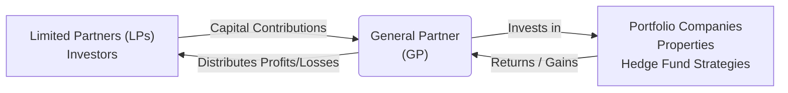

## 20.3 Alternative Investment Structures

Alternative investments—ranging from hedge funds and private equity to real estate partnerships—often employ distinct legal and operational structures that differ significantly from the typical mutual fund or exchange-traded fund (ETF). As the Canadian investment landscape continues to evolve, these structures can present attractive opportunities for diversification, potentially higher returns, and uncorrelated strategies. However, with that potential comes varying degrees of complexity, regulatory oversight, and risk considerations. In this chapter section, we explore common legal structures, fee arrangements, regulatory obligations, and the tax implications within the Canadian context.

---

## Overview of Common Legal Structures

### Limited Partnerships

A limited partnership (LP) is a prevalent structure used by hedge funds, private equity managers, and real estate investment partnerships due to its flexibility. The LP typically consists of:

• General Partner (GP):  
  – Manages the day-to-day operations of the partnership.  
  – Often holds unlimited liability, meaning it can be liable for all debts and obligations of the partnership if things go awry.  
  – Provides strategic direction, manages investments, and makes operational decisions.

• Limited Partners (LPs):  
  – Passive investors with liability generally limited to the amount they have contributed to the partnership.  
  – Have no significant influence on daily operations or management decisions, although they receive periodic updates on the fund’s performance and strategy.

Limited partnerships are especially popular for private equity and hedge fund structures because they allow sophisticated investors to pool capital while restricting liability and concentrating management authority in the hands of the GP. In Canada, limited partnerships are typically governed by provincial legislation—such as the Ontario Limited Partnerships Act—and must be registered with the relevant provincial authorities.

Below is a simplified diagram illustrating the relationship between GPs, LPs, and the underlying investments:

In this structure, the GP typically receives a management fee and a portion of the profits (often referred to as the “carried interest” in private equity contexts). Because the GP is directly exposed to the risk of unlimited liability, general partners often form a separate corporation or limited liability entity that acts as the GP to further shield individual managers from personal liability.

### Corporations and Trusts

Many alternative mutual funds in Canada—commonly referred to as liquid alternatives—structure themselves as corporations or trusts. This approach is primarily used to meet the regulatory standards set out by the Canadian Securities Administrators (CSA) for public distribution (e.g., NI 81-101 and NI 81-102). Under these rules, funds available to retail investors must publish simplified or detailed prospectuses, follow prescribed investment restrictions, and comply with continuous disclosure obligations.

• Corporate Structure:  
  – The fund is established as a corporate entity, with investors buying shares in the corporation.  
  – Offers distinct tax considerations, often employing a “switch corporation” design that permits easy movement between different fund classes for investors.  
  – Subject to specialized rules for distributing dividends and capital gains to shareholders.

• Trust Structure:  
  – The fund is established as a trust, with investors as unitholders.  
  – The trustee manages the assets on behalf of the unitholders, often delegating day-to-day operations to an external manager.  
  – Income in the trust is generally flowed through to investors, which can yield tax efficiencies but also make the tax treatment more complex.

### Offshore Structures

Some alternative investment managers—particularly hedge funds with global client bases—opt for offshore domiciles (e.g., Cayman Islands, Bermuda, or the British Virgin Islands). Offshore structures may offer:

• Tax neutrality for non-Canadian investors.  
• Regulatory environments that allow certain aggressive strategies, short selling, or leveraging practices difficult to replicate under more stringent Canadian regulations.  
• Greater privacy and flexible fund governance.

However, investing in offshore funds can result in unique tax implications for Canadian residents, such as foreign accrual property income (FAPI) rules or withholding taxes. Canadian investors should be cognizant of these regulatory and tax complexities when considering an offshore alternative fund. Consultation with legal and tax professionals is strongly advised.

---

## Fee Structures in Alternative Investments

Fees are a critical consideration in alternative investments, as they can significantly erode returns if not carefully understood and managed. Common fee components include:

### Management Fee

The management fee is typically an annual charge based on a percentage of the fund’s net asset value (NAV). For instance, a hedge fund might charge a 2% management fee on total assets.

• Purpose: Covers operational expenses such as salaries, research, and administration.  
• Calculation: Generally applied monthly or quarterly based on the stated NAV.  
• Variation: Fee percentages vary considerably based on the fund’s strategy, size, and performance track record (some charge as low as 1%; others 3% or more).

### Performance or Incentive Fee

Many hedge funds and private equity funds charge a performance-based fee once returns exceed a benchmark or hurdle rate. The classic model is referred to as “2 and 20”: a 2% management fee and a 20% share of the investment gains above the hurdle.

• Hurdle Rate: The minimum return level (e.g., 5%) that the manager must exceed before taking performance fees.  
• Crystallization: The frequency (often annually) at which performance fees are calculated.  
• Optional Clauses: Some funds offer “clawback” features, returning performance fees if future performance dips below prior levels.

### High-Water Mark

A high-water mark ensures that investors do not pay performance fees twice on the same gains. If a fund dips below its previous high-water mark, management must recover those losses before charging performance fees again.

• Example:  
  – Assume a fund’s NAV per share was $100 when last performance fees were paid, then it drops to $80.  
  – The high-water mark remains at $100, meaning the fund must return to above $100 per share before it can charge a new performance fee.  
• Investor Protection: This structure aligns manager compensation with consistent, positive performance over time.

---

## Regulation and Offering Documents

Alternative investments in Canada may be sold either as prospectus-offered funds (e.g., alternative mutual funds) or as exempt market products (e.g., hedge funds offered by Offering Memorandum). The chosen distribution method heavily influences disclosure, compliance, and ongoing reporting obligations.

### Offering Memorandum (OM)

For privately placed funds (e.g., hedge funds targeting accredited investors), an Offering Memorandum (OM) often takes the place of a prospectus. The OM outlines:

• Fund Strategy and Objectives: Detailed description of investment approach, target markets, geographic focus, and asset classes.  
• Risks and Conflicts of Interest: Identification of primary risk factors, such as leverage, liquidity constraints, or sector concentration.  
• Fund Terms and Fees: Disclosure of all fees, redemption schedules, lock-up periods, and distribution policies.  
• Legal Provisions: Investor eligibility criteria, subscription processes, limitation of liability clauses, etc.

Accredited investors must acknowledge receipt and understanding of the OM before subscribing. Each province has distinct rules under CSA’s National Instrument 45-106 specifying who qualifies for OM distributions.

### Prospectus

Alternative mutual funds distributed broadly to retail investors must file a simplified or long-form prospectus in compliance with National Instrument 81-101 and 81-102.

• Objective: Ensure full, true, and plain disclosure of all material facts to protect retail investors.  
• Key Sections: Contains fund name, manager details, investment strategies, risk disclosure, fees, redemption rights, distribution policy, and historical performance data.

### Continuous Disclosure Obligations

Funds are generally subject to “continuous disclosure” requirements, which include:

• Financial Statements: Annual and interim reports detailing net assets, returns, and ongoing performance.  
• Material Change Reports: Timely updates regarding significant changes to investment objectives, management, or operations.  
• Management Discussion & Analysis (MD&A): Discussion on fund performance, investment strategies, market conditions, and outlook.

CIRO (Canadian Investment Regulatory Organization) guidelines also govern interactions with investors, requiring robust compliance systems for distribution and disclosure, particularly under the exempt market dealer or investment dealer channels.

---

## Typical Strategies within Different Structures

The choice of structure often corresponds directly to the investment strategy, leverage usage, and target investor base.

### Hedge Fund Structures

Hedge funds frequently utilize LP or offshore structures to perform strategies that may not be feasible under regular mutual fund constraints, such as:

• Market-Neutral: Balances long and short positions to limit market exposure.  
• Arbitrage: Exploits price discrepancies between related instruments (e.g., convertible arbitrage, fixed-income arbitrage).  
• Event-Driven: Focuses on special corporate events such as mergers, acquisitions, or restructurings.  
• Global Macro: Takes directional positions on interest rates, currencies, commodities, and global equity markets.

Because hedge fund strategies can involve greater leverage and short selling, these structures must incorporate risk controls and meet certain investor qualification thresholds.

### Private Equity Structures

Private equity managers typically employ limited partnerships funded by sophisticated or institutional investors such as pension funds, endowments, and high-net-worth individuals. They invest in privately held companies, aiming to improve operational efficiency, governance, and market positioning before exiting through an initial public offering (IPO) or sale.

• Investment Horizon: Often spans several years, making liquidity a major consideration for investors.  
• Value Creation: Focuses on active management, restructuring, or strategic acquisitions to boost company value.  
• Distribution of Proceeds: Profits from exits are allocated among limited partners according to predetermined waterfall structures.

### Real Estate Investment Structures

Real estate offers the potential for stable income and capital appreciation. Common structures include:

• Direct Ownership or Partnerships: Investors pool funds to acquire properties.  
• Real Estate Investment Trusts (REITs): Corporations or trusts holding income-producing real estate, offering more liquidity than private partnerships.  
• Real Estate Limited Partnerships: Similar to private equity, aiming to develop or improve properties over a multi-year period.

Groups such as the Real Property Association of Canada (REALPAC) provide guidelines on best practices, reporting, and ESG (environmental, social, and governance) considerations within these real estate frameworks.

---

## Tax Implications

### Flow-Through Entities

A significant advantage of certain alternative structures (e.g., limited partnerships, trusts) is their nature as “flow-through” entities. This means profits and losses are passed on directly to the investor without incurring taxes at the partnership or trust level—though some exceptions apply.

• Capital Gains and Losses: Investors may receive allocations of capital gains or losses, which can affect their personal tax return.  
• Depreciation and Deductions: Depending on the nature of the underlying assets (e.g., real estate properties), flow-through deductions can reduce taxable income.

### Withholding Taxes and Cross-Border Investments

Investors participating in offshore funds or investing in cross-border opportunities must be aware of potential withholding taxes. For example:

• U.S. Real Property Gains: U.S. foreign investor regulations may impose withholding on property-related income.  
• Foreign Accrual Property Income (FAPI): Canadian residents who invest in certain offshore vehicles may be subject to FAPI rules, requiring immediate taxation of passive income earned in offshore jurisdictions.  
• Double Taxation Treaties: Canada has treaties with several countries, and proper structuring can help mitigate double taxation.

Prior consultation with tax professionals and reference to Canada Revenue Agency (CRA) guidelines is highly recommended before committing to cross-border alternative investment structures.

---

## Glossary

Below is a quick reference for some of the key terms in alternative investment structures:

• **General Partner (GP):** Manager of a limited partnership, responsible for strategic and operational decisions, and typically bearing unlimited liability.  
• **Limited Partner (LP):** Passive investor in a limited partnership whose liability is capped at their total contribution.  
• **High-Water Mark:** The highest fund NAV previously achieved, ensuring performance fees are charged only on net new gains.  
• **Offshore Domicile:** Jurisdiction outside Canada, often chosen for tax-neutral or flexible regulatory environments.  
• **Offering Memorandum (OM):** Detailed document provided to accredited investors in private or exempt offerings.  
• **Prospectus:** A regulatory document required for public distribution of mutual funds or alternative products in Canada, fulfilling disclosure requirements under NI 81-101 and NI 81-102.

---

## Best Practices and Challenges

• Diversification: Evaluate how an alternative structure might complement an existing portfolio.  
• Thorough Due Diligence: Assess fund strategy, GP experience, fees, liquidity, and regulatory compliance.  
• Tax Efficiency: Consider how flow-through benefits—or lack thereof—affect personal or corporate tax obligations.  
• Regulatory Compliance: Careful adherence to NI 81-101, NI 81-102, and CIRO guidelines to ensure distribution practices and fund operations are transparent and compliant.  
• Liquidity Constraints: Understand lock-up periods and redemption terms that differ from traditional mutual funds.  
• Ongoing Monitoring: Maintain engagement with reports and financial disclosures to adapt to market or regulatory changes.

---

## Conclusion

Alternative investment structures offer sophisticated investors diverse opportunities to meet enhanced return objectives, reduce correlation, and leverage active investment strategies within and outside Canada. With an array of legal frameworks—limited partnerships, corporations, and trusts—fund managers tailor structures to optimize tax efficiency, risk management, and regulatory compliance. For investors, navigating the complexities of fees, disclosure obligations, tax implications, and strategic alignment is critical. By combining thorough due diligence with clear investment objectives, Canadian individuals and institutions can incorporate alternative investments into a well-rounded portfolio.

As the Canadian regulatory environment evolves, structures like liquid alternatives (sometimes called “alt funds”) become more accessible to a broader investor base. Whether accessing a private equity LP or a retail-oriented alternative fund under NI 81-102 rules, success hinges on balancing opportunity with prudent risk management, tax awareness, and compliance with applicable regulations.

---

## Test Your Knowledge: Canadian Alternative Investment Structures Quiz



### Which of the following is a defining feature of a limited partnership structure used by Canadian hedge funds?

- [ ] All partners share unlimited liability.  
- [ ] Only the limited partners manage the fund day-to-day.  
- [x] General partners manage the fund and assume liability; limited partners have limited liability.  
- [ ] Limited partners cannot receive profit distributions.  

> **Explanation:**( In limited partnerships, the general partner (GP) manages day-to-day operations and typically carries unlimited liability. Limited partners (LPs) are passive investors with liability limited to the amount of their investment.)

### In a performance fee structure with a "high-water mark," which of the following statements is true?

- [ ] The fund charges a performance fee every time it has any positive returns.  
- [x] The fund must surpass its previous peak NAV before charging a new performance fee.  
- [ ] No performance fee can be charged if a fund experiences any losses during the year.  
- [ ] High-water marks only apply when the hurdle rate is below 0%.  

> **Explanation:**( A high-water mark ensures that if a fund’s NAV declines, it must recover those losses and exceed the prior NAV peak before charging subsequent performance fees.)

### A Canadian alternative mutual fund intended for broad retail distribution is most likely required to provide which of the following?

- [x] A simplified prospectus compliant with NI 81-101 and NI 81-102.  
- [ ] Only an Offering Memorandum.  
- [ ] An annual notice filed with the Ontario Limited Partnerships Act.  
- [ ] No documentation is required for retail distribution.  

> **Explanation:**( Alternative mutual funds offered to retail investors in Canada must comply with National Instrument 81-101 (for the simplified prospectus) and NI 81-102 (for investment rules and restrictions).)

### Which statement best describes a typical private equity investment structure?

- [ ] It invests solely in public equities with daily liquidity.  
- [x] It pools investor capital via a limited partnership to acquire and manage private companies.  
- [ ] It uses corporate debt exclusively to generate returns.  
- [ ] It invests only in offshore holding companies.  

> **Explanation:**( Private equity vehicles commonly use limited partnership structures to invest in privately held companies with a multi-year horizon before exiting through IPO or sale.)

### Which strategy is generally associated with hedge fund structures rather than traditional mutual funds?

- [ ] Index replication.  
- [ ] Long-only equity investing with no leverage.  
- [x] Market-neutral or arbitrage strategies utilizing leverage and short selling.  
- [ ] Simple bond ladders with no derivative use.  

> **Explanation:**( Hedge funds frequently employ leverage, short selling, and advanced strategies like market-neutral or arbitrage, which traditional mutual funds often cannot replicate under standard regulations.)

### When investing in funds domiciled offshore, Canadian residents could be subject to:

- [x] Foreign accrual property income (FAPI) rules.  
- [ ] Simplified prospectus requirements under NI 81-101.  
- [ ] The same tax treatment as a TFSA.  
- [ ] Mandatory deposit insurance by the Canada Deposit Insurance Corporation (CDIC).  

> **Explanation:**( Canadian residents investing in certain offshore funds may face FAPI treatment, causing passive income to be taxed immediately in Canada. NI 81-101 and CDIC coverage do not apply to offshore hedge funds, and TFSAs have different rules.)

### In a "flow-through" entity like a Canadian limited partnership, which of the following is true?

- [ ] The fund pays corporate income tax on all capital gains.  
- [x] Profits and losses are passed through directly to the investors.  
- [ ] The GP is required to repay investor capital before any profit distributions.  
- [ ] All taxes are paid at the fund level only.  

> **Explanation:**( Flow-through entities do not typically pay taxes at the fund level; instead, they pass profits and losses onto investors, who report them on their individual tax returns.)

### Which of these Canadian regulatory instruments governs alternative mutual funds?

- [x] NI 81-101 and NI 81-102.  
- [ ] NI 45-106 exclusively.  
- [ ] The U.S. Investment Company Act of 1940.  
- [ ] The Canada Business Corporations Act only.  

> **Explanation:**( NI 81-101 and NI 81-102 set the rules for mutual funds (including liquid alternatives) in Canada. NI 45-106 deals largely with private placements (Offering Memoranda).)

### A real estate limited partnership that aims to develop property over multiple years primarily offers:

- [ ] Daily liquidity and redemption options.  
- [x] Long-term potential for both lease income and capital appreciation.  
- [ ] Guaranteed principal protection.  
- [ ] A government-backed covenant for full return of capital.  

> **Explanation:**( Real estate limited partnerships generally invest over multi-year horizons, focusing on earning rental (lease) income and capital appreciation, with no guarantee of principal.)

### Are limited partnerships and offshore funds both commonly used in the alternative investments industry?

- [x] True  
- [ ] False  

> **Explanation:** Alternatives such as hedge funds, private equity, and real estate often use limited partnerships for domestic investors and offshore structures for global clients or tax advantages.



---

---

By combining knowledge of legal structures, fee arrangements, disclosure requirements, and tax considerations, you will be better prepared to make informed decisions about alternative investment opportunities in Canada. With a thorough understanding of the fundamental frameworks, you can leverage alternative strategies for effective portfolio diversification and risk-adjusted returns.
