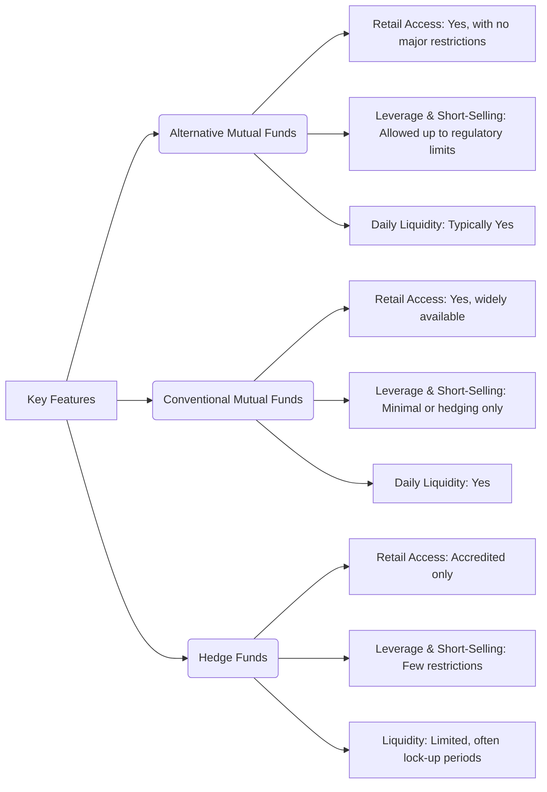

## 20.4 Comparing Alternative Mutual Funds with Conventional Mutual Funds and Hedge Funds

In recent years, the Canadian landscape for investment funds has evolved significantly. Among the most notable changes are the expanded regulatory rules allowing for “liquid alternatives,” commonly referred to as “alternative mutual funds.” These products combine some of the advanced strategies traditionally used by hedge funds—such as short-selling, the use of derivatives for leverage, and access to non-traditional assets—but within the more transparent and regulated framework of mutual funds accessible to Canadian retail investors. 

In this section, we compare alternative mutual funds, conventional mutual funds, and hedge funds, considering their regulatory constraints, investment strategies, fee structures, performance reporting requirements, and suitability for different investor segments.

---

## Regulatory Environment and Accessibility

### Alternative Mutual Funds 
• Governed at the federal level under the Canadian Securities Administrators (CSA) and subject to National Instrument 81-102.  
• Allowed to employ certain advanced strategies—for example, short-selling (within set limits), leverage up to a specified ratio, and exposure to non-traditional assets (e.g., commodities via derivatives).  
• Regulated to ensure protections for retail investors—similar disclosure obligations as conventional mutual funds under National Instrument 81-106 for continuous disclosure.

Due to these regulations, many investors who previously found it challenging to access broad-based alternative strategies in a liquid, regulated environment can now do so without requiring high-net-worth or “accredited investor” status.

### Conventional Mutual Funds
• Typically invest in equities, bonds, or money market instruments; reined in by more restrictive concentration limits and limited leverage possibilities.  
• Highly regulated under National Instrument 81-102, providing daily liquidity and continuous disclosure documents (e.g., Simplified Prospectus, Fund Facts, Management Reports of Fund Performance).  
• Accessible to any retail investor without any minimum net worth or specific financial sophistication requirements.

### Hedge Funds
• Generally open to accredited investors, high-net-worth individuals, or institutional clients.  
• Less regulated than mutual funds and not subject to the same concentration or leverage limits; this allows for broader and more aggressive investment strategies but carries higher risk.  
• Often distributed via offering memoranda rather than a full prospectus, which may limit the transparency of operations.

---

## Strategy Differences

### Alternative Mutual Funds
• May use derivatives and long/short strategies within stricter guidelines than hedge funds. For instance, short-selling can be used to hedge market risk or to enhance returns, but regulatory deadlines and coverage requirements limit the amount of leverage.  
• Allowed to invest in asset classes that conventional funds cannot easily access (e.g., commodities futures, derivatives on currencies, etc.), potentially offering better diversification to retail investors.  
• Common strategies include market-neutral and long/short equity approaches designed to maintain liquidity and meet daily redemption requirements.

### Conventional Mutual Funds
• Typically pursue long-only strategies within a mandate focusing on a specified asset class (e.g., equity, balanced, fixed income).  
• Use of derivatives is often limited to hedging or efficient portfolio management with minimal leverage.  
• Usually avoid riskier assets or illiquid investments to preserve daily liquidity for retail investors.

### Hedge Funds
• Employ a wide range of investment strategies, including but not limited to global macro, event-driven, distressed assets, private lending, and more.  
• Can take concentrated positions, freely employ significant leverage (often beyond what regulations allow for mutual funds), and short-sell without the same set limits.  
• Strategies can be highly complex and may require specialized expertise to manage effectively.

---

## Fee and Liquidity Considerations

### Alternative Mutual Funds
• Typically charge a Management Expense Ratio (MER) that can be slightly higher than conventional funds due to the specialized complexity of alternative strategies.  
• Must offer regular (often daily) liquidity to investors; thus, these funds cannot hold extremely illiquid investments as easily as hedge funds might.  
• May include performance fees in rare cases, but most follow the standard mutual fund MER structure.

### Conventional Mutual Funds
• Typically provide daily liquidity and have a standard MER structure, although some funds use different classes of shares (e.g., Series A, Series F, etc.) with varying fee schedules.  
• Frequently offer both front-end, deferred sales charge (DSC), and no-load options (though DSCs have largely fallen out of favor).  
• Management and operating fees are typically lower than those of hedge funds, especially in passively managed or index-tracking mutual funds.

### Hedge Funds
• Common fee model is “2 and 20,” i.e., a 2% management fee plus 20% performance fee on profits above a certain benchmark or “high-water mark.”  
• May impose lock-up periods, redemption gates, or limited redemption windows (e.g., quarterly or annually) to maintain strategy integrity and prevent sudden large outflows.  
• While hedging strategies can attract higher potential returns, they also come with greater risk and lower liquidity.

---

## Performance Reporting and Transparency

### Alternative Mutual Funds
• Subject to the same reporting requirements as conventional mutual funds under National Instrument 81-106, ensuring monthly or quarterly updates, annual financial statements, and Management Reports of Fund Performance (MRFP).  
• Investors receive transparency in the form of simplified prospectuses and continuous disclosure about holdings, strategies, and risks.

### Conventional Mutual Funds
• Deliver standardized disclosure documents, Fund Facts, interim and annual financial statements, and MRFP.  
• Provide a high degree of transparency into their holdings, performance, fees, and risks.  
• Routinely scrutinized by both regulators and industry self-regulatory organizations like the Canadian Investment Regulatory Organization (CIRO).

### Hedge Funds
• Usually outside of the mainstream regulatory framework; thus, they are not obliged to publish full disclosure documents in the same format.  
• Offer monthly or quarterly statements and detailed performance data only to existing investors.  
• Rely on limited disclosure, typically via an offering memorandum that is distributed only to qualified investors.

---

## Suitability and Access

### Alternative Mutual Funds
• Available to retail investors who want non-traditional strategies but still desire the oversight and transparency associated with mutual funds.  
• May fit investors looking for enhanced diversification, lower correlation to standard equity and bond markets, or strategies aimed at mitigating market volatility.  
• Minimum investment amounts are typically lower than those required by hedge funds.

### Conventional Mutual Funds
• Suitable for the broadest segment of retail investors, often providing simplicity and familiarity.  
• Explore a range of risk profiles, from conservative fixed-income funds to high-risk emerging markets funds.  
• Favored by advisors looking to match straightforward, easy-to-understand strategies with a wide client base.

### Hedge Funds
• Usually restricted to high-net-worth or accredited investors with the sophistication and risk tolerance for the strategies employed.  
• The inherent complexity, potential for illiquidity, and higher investment minimums make them less accessible to the average retail investor.  
• Attractive to institutional investors such as pension funds, endowments, or philanthropic foundations seeking more sophisticated growth or hedging drivers.

---

## Practical Financial Example

Imagine a scenario where a major Canadian pension fund, such as the Ontario Teachers’ Pension Plan, is looking for strategies to diversify beyond traditional equities and fixed income. The plan could invest in a specialized alternative mutual fund that employs a market-neutral strategy, pairing long positions in undervalued Canadian bank shares and short positions in comparatively overvalued equities within the same sector. 

For instance, the fund might be long Royal Bank of Canada (RBC) while shorting a basket of regional North American banks perceived as overvalued, aiming to profit from the difference in performance. While a hedge fund might take significantly larger leveraged bets on the same strategy, an alternative mutual fund must adhere to regulatory leverage caps and daily liquidity requirements, lowering direct exposure to extreme volatility.

---

## Case Study: Comparing Funds from a Canadian Bank

Consider alternative investments offered by a large Canadian institution like TD Bank:

1. TD Alternative Strategies Fund (hypothetical example)  
   - Uses long/short credit and equity strategies.  
   - Leverage is capped at fixed multiples of net assets.  
   - Discloses top holdings and strategy insights every quarter.  
   - Has a daily redemption policy with anticipated settlement within a few days.

2. TD Active Equity Fund (conventional mutual fund example)  
   - Invests primarily in Canadian and U.S. equities with limited use of derivatives for hedging.  
   - Follows typical mutual fund fees and daily liquidity.  
   - Discloses significant holdings and performance metrics through MRFPs.

3. TD Hedge Strategy LP (hypothetical)  
   - Available only to accredited investors meeting eligibility criteria.  
   - Charges a 2% management fee plus a 20% performance fee over a certain benchmark.  
   - May have quarterly redemption periods with possible lock-up terms.

In this simplified example, the alternative mutual fund provides a balance between the relative simplicity of a conventional fund and the strategic flexibility of a hedge fund, yet within the oversight and transparency demanded by mutual fund regulations.

---

## Visual Comparison

The following Mermaid diagram illustrates the features of each type of fund side by side:

### Diagram Explanation
• “Alternative Mutual Funds” and “Conventional Mutual Funds” both offer daily liquidity and are available to a wide range of retail investors, although “alternative” products may employ limited leverage and short-selling.  
• “Hedge Funds” are typically restricted to accredited investors, and while they enjoy few regulatory restrictions on strategy, they often impose significant minimum investments, lock-up periods, and higher fees.

---

## Best Practices, Challenges, and Strategies for Investors

• Thorough Due Diligence: Review fund prospectuses (via Sedar+ at https://www.sedarplus.ca) and regulatory filings to understand strategy, fees, performance, and risks.  
• Risk-Adjusted Return Analysis: Compare alternative mutual funds to relevant benchmarks; evaluate risk metrics such as standard deviation and Sharpe ratios.  
• Mind the Fees: For alternative mutual funds, check for additional layers of fees. For hedge funds, pay close attention to performance-based fees.  
• Time Horizon and Liquidity Needs: Ensure that the investor’s capacity for illiquidity matches the fund’s liquidity structure.  
• Regulatory Compliance: Stay informed on CSA, CIRO, IIROC, and OSC bulletins regarding new rules on short-selling (see “An Investor’s Guide to Short-Selling” from the OSC at https://www.osc.ca).  
• Diversification: Alternative mutual funds can help reduce portfolio volatility by introducing lower correlation assets or non-traditional strategies.

---

## Summary

Alternative mutual funds occupy a middle ground between conventional mutual funds and hedge funds in the Canadian investment landscape. They grant retail investors exposure to advanced strategies—such as modest leverage, short-selling, and derivatives—within a regulated, transparent, and daily-liquid environment. While they share many characteristics with conventional funds (such as continuous disclosure requirements and retail availability), they also adopt some hedge fund techniques to potentially generate enhanced returns or reduce market correlation. 

For investors seeking a blended approach—combining diversification and regulatory oversight—alternative mutual funds can represent a sensible option. Understanding their specific strategies, fee structures, and risks is essential for assessing suitability. Meanwhile, hedge funds remain the province of accredited or institutional investors willing to accept less transparency, higher fees, and more complex strategies.

---

## Mastering Alternative Mutual Funds, Conventional Funds, and Hedge Funds Quiz



### Which of the following best describes the primary regulatory difference between an alternative mutual fund and a conventional mutual fund in Canada?

- [x] Alternative mutual funds can employ greater leverage and short-selling within prescribed limits.
- [ ] Conventional mutual funds are not regulated by National Instrument 81-102.
- [ ] Alternative mutual funds can avoid continuous disclosure requirements.
- [ ] Conventional mutual funds are only available to accredited investors.

> **Explanation:**( Both are regulated by National Instrument 81-102; however, alternative mutual funds have expanded rules allowing for more advanced strategies such as leverage and short-selling beyond the limits applied to conventional mutual funds.)

### What is one characteristic often associated with hedge funds but typically not allowed in conventional mutual funds?

- [x] High levels of leverage without set regulatory caps.
- [ ] Long-only equity strategies.
- [ ] Monthly or quarterly disclosure of holdings.
- [ ] Daily redemption by retail investors.

> **Explanation:**( Hedge funds often use significant leverage without the regulatory caps seen in mutual funds. Conventional mutual funds have strict limits on leverage to protect retail investors.)

### Which fee structure is most commonly attributed to hedge funds?

- [ ] MER of approximately 1.5% plus a redemption fee.  
- [ ] 3% front-end load, but no annual fee.  
- [x] “2 and 20” (2% management fee and 20% performance fee).  
- [ ] Fee waived for the first year.

> **Explanation:**( Hedge funds are known for charging management fees (often around 2%) plus performance fees (around 20%), particularly if certain return hurdles are achieved.)

### What is a common advantage of alternative mutual funds compared to hedge funds for retail investors?

- [ ] No regulatory oversight whatsoever.  
- [ ] Access to unlimited leverage.  
- [ ] Lower risk of any market-related losses.  
- [x] Greater transparency and daily liquidity under National Instrument 81-106.

> **Explanation:**( Alternative mutual funds must follow standard mutual fund continuous disclosure rules, which offer transparency. They also typically afford daily liquidity, whereas hedge funds often impose lock-up periods.)

### Which investment product is typically available to the widest range of Canadian retail investors?

- [x] Conventional mutual funds.  
- [ ] Hedge funds.  
- [x] Alternative mutual funds.  
- [ ] Private equity partnerships.

> **Explanation:**( Both conventional and alternative mutual funds are accessible to retail investors, while hedge funds and private equity partnerships often require accredited investor status.)

### A redemption gate in a hedge fund is best described as:

- [x] A mechanism limiting the amount investors can redeem at a given time.  
- [ ] A minimum threshold of returns before the manager is paid.  
- [ ] A market hedge that prevents drawdowns.  
- [ ] A structuring tool for conventional mutual funds only.

> **Explanation:**( A redemption gate restricts how much capital can be liquidated from a hedge fund by its investors during a specific redemption period, ensuring the fund can maintain stable strategy execution.)

### How do alternative mutual funds typically report performance data?

- [x] Through continuous disclosure documents mandated by National Instrument 81-106.  
- [ ] Exclusively on an annual basis to institutional investors.  
- [x] Active daily announcements by the manager.  
- [ ] Only through the fund’s offering memorandum.

> **Explanation:**( Alternative mutual funds follow the disclosure requirements akin to conventional funds, providing monthly or quarterly statements, annual reports, and MRFP documentation to investors.)

### What is a defining limitation for conventional mutual funds regarding short-selling?

- [ ] They can short-sell without limit if the manager has deemed it suitable.  
- [x] They have stringent rules limiting short-selling activities to small portions or hedging.  
- [ ] They cannot short-sell government securities under any condition.  
- [ ] There are no explicit restrictions on short-selling.

> **Explanation:**( Under NI 81-102, conventional mutual funds face strict controls on short-selling and often can only short for hedging purposes or up to a minimal portion of net asset value.)

### A typical reason for a higher Management Expense Ratio (MER) in alternative mutual funds is:

- [x] The more complex strategies and specialized expertise required.  
- [ ] The lack of regulatory oversight and random fee structures.  
- [ ] The fund’s immediate redemption policies.  
- [ ] The identical management style to conventional funds.

> **Explanation:**( Alternative mutual funds often employ strategies that demand specialized managers, research, and risk controls. This complexity can lead to higher operating costs and slightly higher MERs.)

### In Canada, alternative mutual funds must produce:

- [x] True
- [ ] False

> **Explanation:** They must provide regular, standardized reporting, including the Simplified Prospectus and MRFP, similar to conventional mutual funds under CSA regulations.



---

