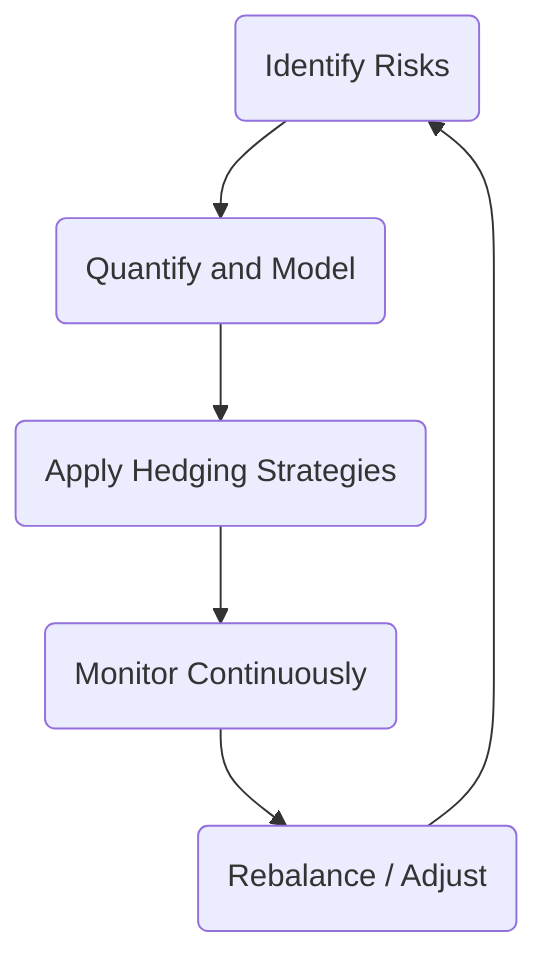

## 21.1 Alternative Investment Strategies

Alternative investment strategies encompass a broad variety of approaches that extend beyond the traditional realms of long-only equity or bond investments. They are frequently sought out for their potential to enhance returns, reduce overall portfolio volatility, and provide uncorrelated performance relative to conventional markets. This section introduces some of the most common alternative strategies — including hedge funds, alternative mutual funds (often referred to as “liquid alts” in Canada), private equity, venture capital, real estate, infrastructure, managed futures, and more — while focusing on their role in investor portfolios and the regulatory environment in Canada.

---

### The Spectrum of Alternative Investments

A wide range of investment vehicles and approaches fall under the umbrella of “alternative investments”:

1. Hedge Funds  
   - Typically open only to accredited investors and involve sophisticated techniques such as short selling, leverage, and derivative instruments.  
   - Strategies may vary widely from global macro to event-driven approaches.

2. Alternative Mutual Funds (Liquid Alts)  
   - Mutual funds registered under National Instrument 81-102 but permitted to use certain hedge fund–like techniques.  
   - Often available to retail investors with fewer restrictions than traditional hedge funds.  
   - Subject to strict regulations on leverage, liquidity, concentration, and disclosure to protect investors.

3. Private Equity and Venture Capital Funds  
   - Involves direct investments in private companies, often focusing on startups, growth capital, or buyouts.  
   - May have longer holding periods and less liquidity, but offers the potential for substantial returns if successful.

4. Real Estate and Infrastructure Funds  
   - Provide avenues to invest in property, infrastructure projects, and other tangible assets.  
   - May offer stable cash flows (e.g., from rent or operational tolls) and potential inflation protection.

5. Managed Futures / CTAs  
   - Feature systematic or discretionary trading of futures and forward contracts.  
   - Employ trend-following or mean reversion models in commodities, currencies, equities, and bond markets.

---

### Common Strategies in Hedge Fund–Style Alternatives

Alternative managers often seek absolute returns, meaning they aim to generate positive performance regardless of broader market direction. Below are some of the most prevalent hedge fund–style strategies:

#### Long/Short Equity
• Managers aim to profit from both rising and falling markets by taking long positions in perceived undervalued equities and short positions in overvalued equities.  
• Fundamental analysis and stock selection often drive positions, but technical or quantitative models can be used.  
• A manager could, for instance, go long on technology stocks trading below peers on a price-to-earnings basis while shorting stocks deemed overpriced in other sectors. This approach can reduce overall market exposure.

#### Event-Driven Strategies
• Focuses on exploiting mispricings or opportunities stemming from corporate events, such as mergers, acquisitions, spinoffs, bankruptcies, or restructurings.  
• A merger arbitrage strategy might involve buying shares of a target company while shorting shares of the acquiring company if the manager believes the deal terms are mispriced.  
• Tends to be highly research-intensive and dependent on the success or failure of the event itself.

#### Relative Value Arbitrage
• Attempts to profit from price discrepancies between related securities while neutralizing broad market risk.  
• For example, managers may buy convertible bonds while shorting the issuer’s stock to exploit mispricing in the convertible’s implied volatility.  
• Often uses derivatives to hedge interest rates, currency exposure, or market beta.

#### Global Macro
• Focuses on top-down analysis of macroeconomic and geopolitical events to identify mispriced assets across currencies, interest rates, commodities, and equity indices on a global scale.  
• Canadian institutional investors—like certain divisions of RBC or TD Asset Management—may employ macro strategies to rotate capital among global markets, currency positions, and sovereign bonds based on interest rate or economic trend forecasts.  
• Can be discretionary (manager-driven outlook) or systematic (model-driven), with broad flexibility in asset classes.

#### Managed Futures (CTAs)
• Emphasizes trading futures and forward contracts on commodities, indices, bonds, or currencies using either trend-following or contrarian strategies.  
• May use quantitative models to identify market breakouts, momentum shifts, or reversion patterns.  
• Typically uses significant leverage due to the notional value of futures contracts.

#### Market Neutral
• Aims to generate absolute returns regardless of broader market movements by offsetting long and short positions so overall net exposure is near zero.  
• Managers scrutinize correlations, factors, and sector exposures to eliminate broad market risk.  
• Strategy success hinges on security selection and precise hedging.

---

### Key Techniques: Leverage and Short Selling

Most alternative investment strategies rely heavily on two methods that can magnify returns but also significantly increase risk:

1. **Leverage**  
   - Borrowing funds or using derivatives to gain market exposure in excess of the capital invested.  
   - Amplifies both gains and losses, requiring carefully managed risk controls such as margin limits and stress testing.

2. **Short Selling**  
   - Borrowing securities and selling them immediately, hoping to repurchase them later at a lower price.  
   - Provides opportunities to profit in falling markets, but losses can theoretically be unlimited if the shorted security’s price rises significantly.

---

### Risk Management Practices

Alternative managers typically prioritize risk management techniques, given the potential for significant capital at risk due to leverage and short selling. Common practices include:

• **Stop-Loss Orders:** Automatically close positions if losses exceed a predefined threshold.  
• **Dynamic Hedging:** Adjust hedge ratios in real time based on changing market conditions.  
• **Position Sizing and Limits:** Cap how large any one trade or asset class exposure can be to avoid concentration risk.  
• **Diversification Across Uncorrelated Strategies:** Maintain a portfolio of strategies with low correlation to reduce overall volatility.  
• **Scenario and Stress Testing:** Assess performance under extreme market conditions, such as unexpected liquidity crises or drastic interest rate changes.

Below is a simplified Mermaid diagram that outlines a potential risk management framework used by an alternative investment manager:

**Diagram Explanation:**  
• Step A: Identify potential risks, including market, credit, liquidity, and operational risks.  
• Step B: Quantify exposures using tools like Value-at-Risk (VaR) or stress tests.  
• Step C: Apply techniques such as options or short positions to hedge.  
• Step D: Continuously monitor positions to ensure risk limits remain within acceptable levels.  
• Step E: Rebalance or adjust strategies based on real-time market conditions, creating a continuous feedback loop.

---

### Regulatory Context in Canada

#### National Instrument 81-102 and Liquid Alts

Alternative mutual funds in Canada that aim for retail distribution must comply with National Instrument 81-102, which regulates:

• **Leverage Limits:** Caps total leverage exposure, restricting the total amount of borrowed or notional exposure.  
• **Concentration Limits:** Ensures the fund is not overly exposed to a single issuer or security.  
• **Liquidity Requirements:** Funds must keep enough liquid assets to meet daily redemption needs.  
• **Disclosure Requirements:** Must detail the fund’s strategy, risks, and fees.

#### Hedge Funds
• Typically offered under exemptions for accredited investors, high-net-worth individuals, or institutional clients.  
• Subject to CSA (Canadian Securities Administrators) and CIRO (Canadian Investment Regulatory Organization) oversight, but with more flexibility in strategies and leverage than liquid alts.  
• Must comply with National Instrument 31-103 for registration and ongoing compliance obligations.

#### Private Equity and Other Exempt Market Offerings
• Usually offered through the exempt market, meaning they are not distributed by prospectus to retail investors.  
• Target high-net-worth or institutional investors subject to minimum investment thresholds.  
• Restrictions on marketing, reporting, and resale reflect the illiquid nature and higher risk profile of these investments.

---

### Practical Canadian Examples

1. **Pension Fund Allocation**  
   - The Canada Pension Plan Investment Board (CPPIB) invests in private equity deals, infrastructure, and real estate to diversify away from public markets and enhance returns.  
   - They use a global macro perspective to guide currency hedging and asset rotation.

2. **Banking Giants Enter Hedge Fund Space**  
   - Certain Canadian banks, like RBC or TD, may have alternative assets divisions offering hedge-fund-like strategies to institutional investors.  
   - These divisions often deploy capital across global macro and event-driven strategies, leveraging the bank’s research capabilities.

3. **Liquid Alternative Mutual Funds**  
   - Retail investors can now access alternative strategies through products such as alternative mutual funds launched by Canadian asset managers.  
   - These funds must comply with National Instrument 81-102 and often highlight strategies that aim for reduced volatility or correlation relative to traditional benchmarks.

---

### Applying Alternative Strategies in a Portfolio

1. **Diversification Benefits**  
   - Adding an uncorrelated alternative strategy may smooth returns when traditional equity or bond markets underperform.  
   - Advisors often incorporate a measured allocation to hedge funds or liquid alts to help reduce overall portfolio drawdown.

2. **Performance Attribution**  
   - Evaluate how much of a portfolio’s return stems from alpha (manager skill) vs. market beta.  
   - Tools like the “PerformanceAnalytics” package in R can help isolate manager contribution from general market movements.

3. **Portfolio Construction**  
   - Mix long/short equity strategies with event-driven or macro-focused funds to reduce concentration risks.  
   - Continually monitor correlations, drawdowns, and liquidity profiles to ensure the portfolio remains balanced.

Consider this simple table showing how a balanced portfolio might include multiple alternative strategies:

| Asset Class          | Approx. Allocation | Objective                            |
|----------------------|--------------------|--------------------------------------|
| Canadian Equities    | 30%               | Growth and dividends                 |
| Canadian Fixed Income| 25%               | Stability and income                 |
| Global Equities      | 20%               | International growth opportunities   |
| Alternatives         | 15%               | Diversification and absolute returns |
| Cash/Short-Term      | 10%               | Liquidity and operational needs      |

---

### Tools and Resources for Further Insight

• **Regulatory Bodies and References**  
  – CIRO: <https://www.ciro.ca/>  
  – Canadian Securities Administrators (CSA): <https://www.securities-administrators.ca/>  
  – National Instrument 81-102: Governs mutual funds and alternative mutual funds in Canada.  
  – National Instrument 31-103: Outlines registration requirements for dealers and advisers.

• **Open-Source Financial Tools & Frameworks**  
  – Python libraries: NumPy, pandas, matplotlib for quantitative modeling of hedge fund strategies.  
  – R packages: “PerformanceAnalytics” for analyzing performance metrics (e.g., Sharpe ratios, drawdowns).  

• **Books & Articles**  
  – “Hedge Fund Market Wizards” by Jack D. Schwager.  
  – “Alternative Investments: CAIA Level I” by the CAIA Association.  
  – CFA Institute’s research publications on hedge funds and alternative strategies.

• **Online Courses & Resources**  
  – CAIA (Chartered Alternative Investment Analyst) Program: <https://caia.org/>  
  – Coursera specialization in Investment Management.  
  – Bloomberg Market Concepts (BMC) to learn about derivatives and global financial markets.

---

### Summary and Best Practices

Alternative investment strategies, whether through hedge funds, liquid alts, or specialized private funds, offer investors the prospect of enhanced returns and diversified sources of alpha. However, these opportunities come with heightened complexity and risk. Managing leverage, carefully selecting strategies, and adhering to Canadian regulatory requirements are critical steps for success.

Key takeaways:  
• Understanding the scope and objectives of different strategies is essential for prudent allocation.  
• Leverage and short selling, though powerful, demand robust risk controls.  
• Liquid alts under National Instrument 81-102 make some hedge fund–like strategies accessible to retail investors in Canada.  
• Ongoing vigilance in monitoring performance, stress testing positions, and complying with regulations is paramount.  
• Always consider the broader portfolio context, ensuring that each alternative strategy is cohesive with long-term financial objectives and risk tolerance.

---

## Master Your Knowledge: Alternative Investment Strategies in Canada



### Which of the following best describes a Long/Short Equity strategy?

- [x] Taking both long and short positions in different equities to profit from price rises and declines.
- [ ] Investing only in the long-term growth potential of undervalued stocks.
- [ ] Exclusively using derivatives to hedge currency risks.
- [ ] Buying a basket of government bonds and shorting junk bonds.

> **Explanation:** The hallmark of Long/Short Equity strategies is simultaneously holding long positions in stocks believed to be undervalued and shorting stocks believed to be overvalued to generate returns from multiple market directions.

### In an Event-Driven strategy, managers typically look for opportunities in which of the following situations? (Select all that apply.)

- [x] Mergers and acquisitions.
- [ ] High-volume day trading on a single stock exchange.
- [x] Corporate restructurings.
- [ ] Central bank monetary policy announcements with no corporation involved.

> **Explanation:** Event-Driven managers focus on corporate events such as mergers, acquisitions, bankruptcies, and restructurings that can create temporary stock mispricings.

### Which regulatory instrument in Canada outlines the rules specific to alternative mutual funds (or “liquid alts”)?

- [ ] National Instrument 31-103.
- [ ] National Instrument 81-101.
- [x] National Instrument 81-102.
- [ ] National Instrument 51-102.

> **Explanation:** National Instrument 81-102 sets the regulatory framework for mutual funds in Canada, including specific provisions for alternative mutual funds.

### What is the main objective of a Market Neutral strategy?

- [x] Generate returns regardless of overall market direction by offsetting market exposure.
- [ ] Invest exclusively in high-volatility tech stocks.
- [ ] Maximize exposure to currency fluctuations.
- [ ] Eliminate all types of risk exposure.

> **Explanation:** Market Neutral strategies seek to offset market risk through matching long and short positions, allowing them to focus on generating returns due to stock selection rather than broad market moves.

### Which of the following are key risk management tools often used by hedge funds? (Select all that apply.)

- [x] Stop-loss orders.
- [ ] Guarantee of principal.
- [x] Dynamic hedging.
- [ ] Elimination of derivatives.

> **Explanation:** Hedge funds frequently use stop-loss orders and dynamic hedging to limit downside risk and adapt to changing market conditions. They do not guarantee principal, and they regularly employ derivatives.

### How does short selling contribute to an alternative portfolio strategy?

- [x] It allows managers to profit from declining securities prices.
- [ ] It eliminates the need for risk management.
- [ ] It guarantees a profit in rising markets.
- [ ] It provides unlimited downside protection.

> **Explanation:** Short selling is a technique in which managers can profit from falling security prices, but it also introduces additional risk since losses can be significant if prices rise.

### Which of the following is true about Managed Futures/CTAs? (Select all that apply.)

- [x] They can trade futures and forward contracts on multiple asset classes.
- [ ] Their only permissible trading venue is the Toronto Stock Exchange (TSX).
- [x] They may use systematic trend-following models.
- [ ] They focus exclusively on short selling equities.

> **Explanation:** Managed Futures or Commodity Trading Advisors (CTAs) typically trade across multiple markets, including commodities, currencies, equities, and bonds, often using systematic approaches.

### Why might an investor consider adding alternative investments to a balanced portfolio?

- [x] To diversify risk and potentially reduce overall portfolio volatility.
- [ ] To avoid compliance with any Canadian regulations.
- [ ] To ensure guaranteed positive returns.
- [ ] To avoid fundamental analysis altogether.

> **Explanation:** One principal reason to include alternatives is to diversify a portfolio’s sources of risk and return, which may help stabilize performance during market fluctuations.

### Under National Instrument 81-102, which of the following measures is used to protect retail investors in Canadian alternative mutual funds?

- [x] Restrictions on the amount of leverage an alternative mutual fund can employ.
- [ ] Unlimited latitude to concentrate investments in a single issuer.
- [ ] Mandatory short selling of at least 50% of the fund’s assets.
- [ ] No requirement for liquidity of assets.

> **Explanation:** NI 81-102 imposes limits on leverage and concentration to guard against excessive risk exposures in alternative mutual funds accessible to retail investors.

### A Global Macro strategy might involve taking positions in interest rates, currencies, and commodities based on macroeconomic trends. True or False?

- [x] True
- [ ] False

> **Explanation:** Global Macro managers analyze macroeconomic data and geopolitical events worldwide, positioning themselves in any asset class (e.g., currencies, commodities, bonds) that they feel offers potential profit based on these insights.



---

## For Additional Practice and Deeper Preparation

**Elevate your exam readiness with our comprehensive app, "Securities CA: Mock Exams," designed to challenge and refine your skills.**

* **Master Challenging Questions:** Dive into expertly crafted sample exam questions that go beyond standard references.
* **Scenario-Driven Learning:** Experience scenario-driven case questions and in-depth solutions to build practical expertise.
* **Sharpen Exam Strategies:** Build confidence with step-by-step explanations designed to refine your exam-day tactics.
* **Gain Real-World Insights:** Acquire practical tips and detailed rationales that demystify complex concepts.
* **CIRO and CSI Alignment:** Stay current with CIRO guidelines and CSI’s exam structure, with questions intentionally more challenging than the actual exam.

**Download the App Today:**

> Note: While these courses are specifically crafted to align with the CSC® exams outlines, they are independently developed and not endorsed by CSI or CIRO.
