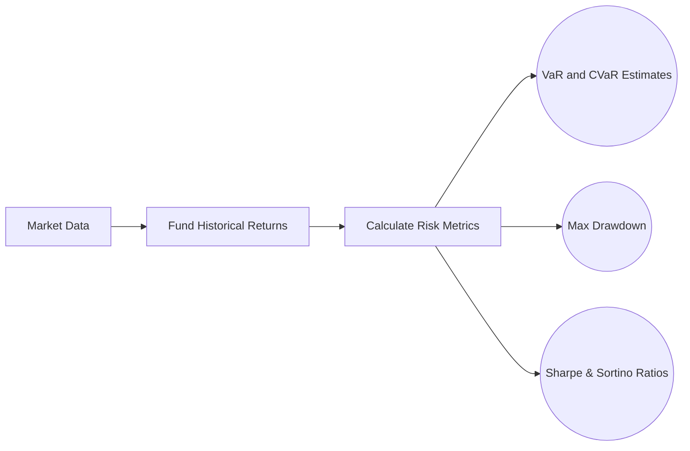

## 21.2 Alternative Strategy Fund Performance Measurement

Measuring the performance of alternative strategy funds is inherently more complex than evaluating traditional equity or bond funds. The incorporation of leverage, derivatives, short positions, and often illiquid assets poses unique challenges for portfolio transparency and risk management. In Canada, alternative strategy funds (sometimes referred to as “liquid alternatives” when offered under National Instrument 81-102) must conform to a stricter regulatory regime than private hedge funds, but the data and analytics required for robust performance evaluation remain sophisticated and multifaceted. This section addresses key metrics, benchmark considerations, and best practices for accurately measuring performance, while highlighting real-world examples and Canadian regulatory guidelines.

---

### Why Performance Measurement Is More Complex for Alternatives

Unlike traditional stocks and bonds that generally exhibit consistent market beta exposures, alternative strategy funds often have dynamic or variable market sensitivity. For instance, a long/short equity strategy may assume only partial market exposure, while a market-neutral fund may seek to maintain zero beta to traditional equity benchmarks. Furthermore, certain alternative funds may hold illiquid or private assets, such as real estate investments or private equity stakes, which complicate valuation and generate non-standard return distributions. These complexities necessitate specialized metrics beyond simple total return or traditional measures like standard deviation and tracking error.

---

### Key Metrics for Evaluating Alternative Strategy Funds

#### Sharpe Ratio

The Sharpe Ratio is one of the most well-known measures of risk-adjusted return. It calculates how much excess return (above the risk-free rate, typically taken as yields on Government of Canada Treasury Bills) a fund generates per unit of volatility:  
 

\text{Sharpe Ratio} = \frac{(\text{Annualized Return} - \text{Risk-Free Rate})}{\sigma_\text{excess}}


Where:  
• Annualized Return is usually the fund’s geometric return over a full calendar year (or annualized period).  
• Risk-Free Rate is a short-term government yield (e.g., three-month T-Bill).  
• σ₍excess₎ is the standard deviation of the fund’s excess returns over that risk-free rate.  

High Sharpe Ratios indicate that the fund is generating attractive excess returns relative to volatility. However, it does not differentiate between upside and downside volatility, treating both equally.

#### Sortino Ratio

The Sortino Ratio refines the Sharpe Ratio by isolating downside volatility (downside deviation) instead of total volatility:


\text{Sortino Ratio} = \frac{(\text{Annualized Return} - \text{Risk-Free Rate})}{\text{Downside Deviation}}


Because the Sortino Ratio only penalizes downside volatility, many hedge fund managers prefer it when their strategy targets asymmetrical return distributions (e.g., option-selling or managed futures strategies). A high Sortino Ratio can signal that the fund effectively avoids large drawdowns.

#### Alpha

Alpha measures the portion of a fund’s return that cannot be explained by general market movements (beta). In practical terms, alpha is the “value-added” or manager skill component. Many hedge funds rely on absolute-return strategies that aspire to generate positive alpha across varying market conditions. However, for alpha estimates to be accurate, you need an appropriate benchmark or factor model. Traditional alpha calculations might use a standard equity index (e.g., S&P/TSX Composite). But alternative funds employing multi-asset strategies sometimes construct customized benchmarks—such as weighted blends of bond, equity, and alternative indices—to capture all underlying exposures.

#### Beta and Correlation

Beta measures a fund’s sensitivity to broad market movements. A fund with a beta of 1.0 to a particular index implies that if the index moves up or down by 1%, the fund also tends to move by about 1% in the same direction. Alternatives, and especially hedge funds, may adapt their beta exposure over time.  
• A “variable-beta” strategy can actively adjust its market exposure based on market conditions or tactical outlook.  
• Correlation measures how closely two return series move together. Low correlation to equity or bond benchmarks is often a key selling point for alternative strategy funds, given the potential diversification benefits.

#### Maximum Drawdown (MDD)

Maximum Drawdown (MDD) quantifies the most significant interim loss that an investor would have faced from a previous peak to a trough. This metric is especially important in alternative funds where tail risk can be substantial, potentially exacerbated by leverage or short-selling. For example, a global macro fund using derivatives may see sharp drawdowns during sudden market dislocations. By regularly monitoring MDD, investors gain insight into the risk of large cumulative losses and how quickly (or slowly) the fund recovers.

#### Value-at-Risk (VaR) and Conditional VaR (CVaR)

Value-at-Risk (VaR) is a statistical approach estimating the potential loss at a specified confidence level (e.g., 99%) over a particular time horizon (e.g., one day or one month). Conditional VaR (also known as Expected Shortfall) goes further by estimating the average loss that might occur beyond that confidence threshold. For an alternative strategy fund, VaR and CVaR highlight the magnitude of extreme losses under stressed market conditions. However, these measures can be heavily model-dependent and rely on historical data, which may not fully account for once-in-a-generation market events.

Figure: Simplified flow chart for capturing and analyzing alternative fund risk metrics.

---

### Benchmarking Challenges and Solutions

Selecting the right benchmark is vital for proper performance measurement. Traditional indexes (such as the S&P/TSX Composite for Canadian equities or the FTSE Canada Universe Bond Index for fixed income) may not suit multi-strategy hedge funds that combine global equities, futures, swaps, and private credit. Potential solutions include:

1. **Peer Group Comparisons:** Evaluating a fund relative to a group of hedge funds with similar mandates, such as the HFRI (Hedge Fund Research) indices. However, be mindful of survivorship bias and backfill bias.  
2. **Custom Benchmarks:** Managers may construct a blend of index exposures that approximate the fund’s strategy mix (e.g., 40% equity, 30% commodity, 30% fixed income).  
3. **Absolute Return Targets:** Some alternative managers emphasize generating positive returns in all market environments, making absolute return or risk-free-plus-a-spread benchmarks relevant.

---

### Survivorship and Backfill Bias

Hedge fund databases can suffer from both survivorship and backfill bias:

• **Survivorship Bias:** Poor-performing or failed funds drop out of the database, overstating historical returns.  
• **Backfill Bias:** Successful funds that start reporting after strong early results artificially inflate performance averages.  

Because of these biases, any index or peer group used for benchmarking should be scrutinized. This issue has prompted Canadian regulators to emphasize transparent reporting standards, encouraging consistent and frequent data disclosure for investment funds to help reduce misrepresentation.

---

### Fees and Performance Measurement

A defining characteristic of many alternative strategies is their fee structure, often composed of a management fee (for example, 2% of assets under management) plus a performance fee (often around 20% of gains). Some key features that affect net returns include:

1. **High-Water Mark:** Ensures performance fees are only paid when the fund surpasses its previous highest net asset value.  
2. **Hurdle Rates:** Sometimes a manager must exceed a certain benchmark (e.g., T-Bills + 3%) before incentive fees apply.  
3. **Management Fees vs. Net Performance:** Evaluating net performance (after all fees) is essential for a realistic view of a fund’s value proposition.  

These fees can significantly erode returns if the manager underperforms. For example, RBC Global Asset Management may offer a specialized alternative fund that charges standard mutual fund-type management fees for retail investors, but an institutional class might have a performance-based fee structure with a high-water mark.

---

### Regulatory Disclosure Requirements in Canada

Canadian liquid alternative funds operate under the auspices of National Instrument (NI) 81-102, which prescribes disclosure obligations similar to those for mutual funds, plus additional reporting on leverage, derivatives exposure, and short-selling strategies. Key elements include:

- **Fund Facts Documents:** Provide clear, concise descriptions of the fund’s strategy, risk factors, and historical performance.  
- **Ongoing Reporting:** Must regularly disclose material changes in investment strategy, portfolio composition, fees, and conflicts of interest.  
- **CIRO Oversight:** Registrants selling alternative funds to retail and institutional clients must adhere to the standards set by the Canadian Investment Regulatory Organization (CIRO), especially concerning suitability and Know Your Client (KYC) obligations.  
- **CSA and AMF Guidelines:** The Canadian Securities Administrators (CSA) and Quebec’s Autorité des marchés financiers (AMF) release staff notices that offer guidance on continuous disclosure, ensuring robust reporting practices across Canada.

---

### Practical Performance Analysis Techniques

#### Using Open-Source Tools

• **R’s PerformanceAnalytics:** An extensive package that simplifies the calculation of metrics (e.g., Sharpe Ratio, Sortino Ratio, VaR).  
• **Python’s pyfolio:** A library for analyzing performance and risk in trading algorithms, useful for robust backtesting.  
• **QuantConnect:** A cloud-based platform enabling quantitative researchers to code, test, and deploy multi-asset strategies with real-time data.

#### Backtesting and Scenario Analysis

Backtesting historical data helps managers evaluate how the strategy might have performed under previous market conditions. Scenario analysis involves applying stress tests or hypothetical market shocks—like the 2008 financial crisis or the COVID-19 liquidity crunch—to gauge potential drawdowns.

#### Attribution Analysis

Where possible, managers break down returns by various sources (e.g., sector exposure, hedging activities, derivative overlays). This allows investors to see whether alpha is driven by genuine skill, or if it stems from unidentified factor exposures.

---

### Real-World Example

Consider a hypothetical alternative fund offered by TD Asset Management. The “TD Alpha Opportunities Fund” (a fictitious name) employs a long/short equity strategy focused on North American stocks. To measure performance:

1. **Benchmark Selection:** The manager uses a 50% S&P 500 and 50% S&P/TSX Composite blend to approximate their geographic exposures.  
2. **Risk Measures:** The fund publishes a monthly Sharpe Ratio and Sortino Ratio. They also provide quarterly VaR estimates and a rolling one-year Maximum Drawdown statistic to illustrate risk.  
3. **Fee Structure:** They charge a 1.5% management fee plus a 15% performance fee, subject to a high-water mark. This ensures repeat performance is needed to justify multiple rounds of incentive fees.  
4. **Disclosure:** As per NI 81-102, the fund issues Fund Facts that detail the use of short selling and derivatives. The portfolio manager files monthly statements with updated performance metrics.

By analyzing these data points, retail and institutional clients can make a more informed investment decision regarding how this alternative strategy aligns with their risk tolerance and diversification goals.

---

### Best Practices, Pitfalls, and Strategies for Success

1. **Use Complementary Metrics:** Combine multiple measurements (Sharpe, Sortino, Max Drawdown, Beta, and Correlation) for a full picture of performance.  
2. **Consider Fees Carefully:** High performance fees may diminish net returns; ensure you know the impact of the fee structure before investing.  
3. **Monitor Liquidity:** Many alternative funds hold illiquid assets. Illiquid portions of a portfolio can lead to valuation uncertainties.  
4. **Account for Survivorship Bias:** If comparing a fund to a hedge fund index, remember that underperforming funds may have dropped out.  
5. **Ongoing Due Diligence:** Alternative strategies require continuous monitoring. Review monthly and quarterly fund updates to keep appraised of portfolio changes and manager commentary.  
6. **Align with Investment Objectives:** Ensure the chosen alternative strategy fits into your broader asset allocation plan, potentially as a diversifier or for absolute-return enhancement.

---

### Additional Resources

• **Regulatory Bodies and References**:  
  – Canadian Securities Administrators (CSA) Staff Notices on fund performance and continuous disclosure.  
  – Quebec’s Autorité des marchés financiers (AMF) for French-language guidelines on fund performance.  
  – CIRO regulations governing approved persons who offer alternative strategies to clients.

• **Open-Source Financial Tools & Frameworks**:  
  – R’s PerformanceAnalytics or Python’s pyfolio for backtesting and performance analytics.  
  – QuantConnect (https://www.quantconnect.com/) – an online platform for coding and testing quantitative strategies.

• **Books & Articles**:  
  – “Practical Portfolio Performance Measurement and Attribution” by Carl R. Bacon.  
  – CAIA Association’s research materials on advanced performance evaluation.

• **Online Courses & Resources**:  
  – CFA Institute’s continuing education modules on performance evaluation for alternative strategies.  
  – EdX or Coursera academic lectures on risk analysis and performance measurement.

---

## Summary

Performance measurement of alternative strategy funds requires a nuanced approach, considering metrics like Sharpe Ratio, Sortino Ratio, alpha, beta, and drawdown statistics. Benchmarks may need to be custom-built; standard benchmarks often fail to capture the complexities of multi-asset, leverage-driven, or market-neutral strategies. Moreover, fees and biases in indices (such as survivorship and backfill biases) can distort the true picture of a fund’s historical track record. When evaluating these funds within the Canadian landscape, investors must pay particular attention to regulatory disclosure requirements under NI 81-102 and the guidelines of the Canadian Securities Administrators and CIRO. Through a combination of thorough metrics, diligent due diligence, and a solid grasp of regulatory requirements, investors and advisors can make more informed decisions about integrating alternative strategy funds into portfolios.

---

## Master Your Knowledge: Alternative Strategy Fund Performance Measurement



### Which of the following best explains why alternative strategy fund performance measurement is more complex than that of traditional funds?

- [x] They use leverage, derivatives, short selling, and often illiquid assets.  
- [ ] They rely only on high-yield bonds.  
- [ ] They avoid standard risk metrics.  
- [ ] They employ no benchmarks at all.  

> **Explanation:**( Alternative funds often involve complex strategies, including leverage, short selling, and illiquid holdings, rendering traditional return and volatility metrics insufficient.)

### What additional insight does the Sortino Ratio provide over the Sharpe Ratio?

- [x] It isolates downside risk by using downside deviation.  
- [ ] It only measures performances against a high-water mark.  
- [ ] It removes the risk-free rate from calculations.  
- [ ] It replaces volatility with historical drawdown in the formula.  

> **Explanation:**( The Sortino Ratio focuses on downside deviation, ignoring upside volatility, thus penalizing the fund only for negative performance variance.)

### In the context of hedge funds, “alpha” is commonly defined as:

- [x] The return earned above or below what could be explained by market-related factors.  
- [ ] The difference in total assets versus peer funds.  
- [ ] The measure of correlation to the S&P/TSX Index.  
- [ ] The historical high-water mark used for incentive fees.  

> **Explanation:**( Alpha measures the value-added portion of returns, factoring out broad market movements to identify genuine manager skill.)

### Why is Maximum Drawdown (MDD) a critical metric for alternative funds?

- [x] It captures the largest cumulative loss from peak to trough, highlighting tail risk.  
- [ ] It calculates correlation with global markets.  
- [ ] It measures the annualized return net of fees.  
- [ ] It isolates only downside volatility.  

> **Explanation:**( MDD provides insight into potential worst-case losses, an essential consideration when leverage and short positions can magnify drawdowns.)

### Which bias results from newly added funds reporting only after strong performance?

- [x] Backfill Bias  
- [ ] Survivorship Bias  
- [x] Both of the above  
- [ ] None of the above  

> **Explanation:**( Backfill bias occurs when performance data is not reported until after a track record of good results is established, potentially skewing average returns upward. Survivorship bias occurs when poor-performing funds drop out of the database.)

### A strategy with “variable beta” implies:

- [x] The fund’s sensitivity to market movements can shift over time.  
- [ ] The fund’s risk is strictly fixed to 1.0.  
- [ ] The fund only invests in short positions.  
- [ ] The fund invests in fixed income alone.  

> **Explanation:**( Variable beta means the fund adjusts its exposure to the market depending on market conditions or tactical decisions, which is common in many alternative strategies.)

### Which is the best description of Value-at-Risk (VaR) for an alternative strategy fund?

- [x] A statistical estimate of potential loss at a given confidence level.  
- [ ] A measure of tax efficiency.  
- [x] Also includes the average loss beyond that threshold when combined with CVaR.  
- [ ] A replacement for beta.  

> **Explanation:**( VaR estimates potential loss at a specified probability, while CVaR (Conditional VaR) measures the average loss beyond that threshold, useful in stress scenarios.)

### Which regulatory framework in Canada generally governs liquid alternative funds?

- [x] National Instrument 81-102  
- [ ] Basel III  
- [ ] U.S. SEC Regulation D  
- [ ] IFRS 9  

> **Explanation:**( Liquid alternative funds in Canada typically operate under NI 81-102, which covers mutual funds and alternative funds designed for retail investors.)

### How do high-water marks affect performance-based fees in alternative funds?

- [x] Fund managers receive incentive fees only after exceeding the previous peak NAV.  
- [ ] Fund managers always earn a fee on gross gains, regardless of prior performance.  
- [ ] Fund managers’ fees are lowered once the portfolio experiences negative returns.  
- [ ] High-water marks eliminate fixed management fees entirely.  

> **Explanation:**( A high-water mark ensures that managers do not repeatedly charge incentive fees if the fund is recovering from a drawdown, protecting investors from paying multiple times for the same gains.)

### True or False: “An alternative strategy fund must disclose its use of short selling and derivatives to investors under NI 81-102.”

- [x] True  
- [ ] False  

> **Explanation:** Under NI 81-102, liquid alternative funds must provide transparency regarding any short positions or derivatives usage, including leverage ratios, to help investors evaluate risk exposures.



---

## For Additional Practice and Deeper Preparation

**Elevate your exam readiness with our comprehensive app, "Securities CA: Mock Exams," designed to challenge and refine your skills.**

* **Master Challenging Questions:** Dive into expertly crafted sample exam questions that go beyond standard references.
* **Scenario-Driven Learning:** Experience scenario-driven case questions and in-depth solutions to build practical expertise.
* **Sharpen Exam Strategies:** Build confidence with step-by-step explanations designed to refine your exam-day tactics.
* **Gain Real-World Insights:** Acquire practical tips and detailed rationales that demystify complex concepts.
* **CIRO and CSI Alignment:** Stay current with CIRO guidelines and CSI’s exam structure, with questions intentionally more challenging than the actual exam.

**Download the App Today:**

> Note: While these courses are specifically crafted to align with the CSC® exams outlines, they are independently developed and not endorsed by CSI or CIRO.
