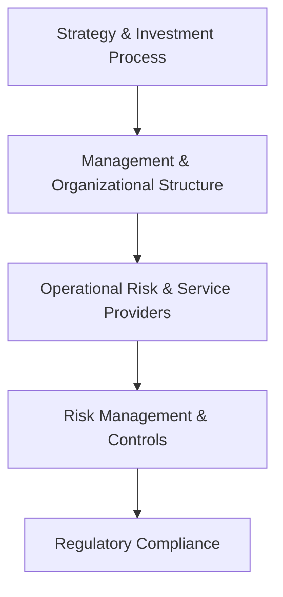

## 21.3 Due Diligence and Suitability of Alternative Strategies

Alternative investments, such as hedge funds, private equity, venture capital, real estate funds, and other non-traditional mechanisms, continue to expand their presence in Canadian and global capital markets. While these investment vehicles can offer enhanced diversification and potential for higher returns, they come with a unique set of risks and complexities. Therefore, investors and advisors must conduct robust due diligence and ensure the product’s suitability for each client’s risk tolerance, financial goals, and regulatory context.

In this section, we delve into the core processes and best practices for performing due diligence on alternative strategies and ensuring they are appropriate (i.e., “suitable”) for an investor’s profile under Canadian regulations. We also address ongoing monitoring, as well as various structural and regulatory considerations, including National Instrument 81-102 for “liquid alternatives” and the accredited investor regime under National Instrument 45-106.

---

## The Importance of Due Diligence

Due diligence is the investigative process through which investors or advisors assess an alternative fund’s operations, risks, and compliance to determine if it meets their objectives. Unlike many traditional investment vehicles (e.g., mutual funds tracking common equity benchmarks), alternative strategies often engage in short-selling, leverage, and complex derivatives that introduce unique operational and counterparty risks.

### General Due Diligence Framework

A comprehensive due diligence framework covers five core pillars:

1. Strategy and Investment Process  
2. Management and Organizational Structure  
3. Operational Risk and Service Providers  
4. Risk Management and Controls  
5. Regulatory Compliance

Below is an illustrative diagram showing these pillars and their interconnections:

Each pillar supports the next, and thorough analysis in one area often leads to deeper questions in another. For example, the complexity of a fund’s investment strategy (A) may directly influence the experience required of its management team (B), as well as the controls (D) it needs to mitigate potential missteps.

---

## Strategy Assessment

### Review of Fund Documentation

The first step in strategy assessment involves reviewing the fund’s offering memorandum, audited financial statements, and any available regulatory filings. Offering memoranda typically detail:

• The fund’s investment strategy  
• Use of leverage or derivatives  
• Any liquidity constraints (e.g., lock-up periods, gating provisions)  
• Fee structures, including management and performance fees  
• Redemption procedures that could affect the investor’s cash flow needs  

Audited financial statements are also crucial. They shed light on whether the fund’s historical returns align with its stated strategy and targets. If the fund consistently deviates from its declared approach, this raises questions about transparency and consistency in management.

### Evaluating Performance Track Record

Performance track record is another vital aspect to consider. Questions include:

• How long has the core strategy been in place?  
• Is the track record attributable to the current fund manager or a predecessor?  
• Does the fund outperform benchmarks when adjusted for risk, or does it rely on market momentum?

When studying the performance, also verify if longer time horizons (e.g., five or more years) are available to smooth out short-term volatility. Analysis of rolling return windows can help determine how the fund reacts in various market conditions such as economic downturns or phases of rising interest rates.

---

## Management and Organizational Assessment

### Manager Experience and Stability

Assessing the fund manager’s expertise is pivotal. Look for:

• Prior successes or failures, including both bull and bear market performance  
• Relevant industry experience, specialized credentials (e.g., CFA®, CAIA, or specific domain knowledge)  
• Supporting cast of analysts, traders, and risk managers, plus staff turnover rates  

Significant changes in key personnel or high turnover can disrupt the fund’s performance continuity. Stability of the core team provides confidence that the fund will maintain its stated strategy and preserve institutional knowledge crucial for decision-making.

### Third-Party Service Providers

Alternative funds typically rely on various service providers:

• Auditors: Reputable, recognized firms that independently verify the fund’s financial statements  
• Prime Brokers: Major banks or brokerage firms providing securities lending, margin, and other financing services  
• Custodians: Entities holding fund assets in segregated accounts  
• Administrators: Firms handling accounting, NAV calculations, investor communications  

When recognized and reputable third parties are involved, it instills greater investor confidence. Perform basic checks (e.g., consult the Big Four accountants, established banks like RBC or TD as prime brokers or custodians) to reduce operational risk.

---

## Operational Risk and Control Practices

### Operational Policies

Operational due diligence dives into how funds handle routine procedures and potential disruptions. Key questions:

• Who are the signatories on the fund’s bank accounts?  
• Are there adequate IT systems and cybersecurity protocols?  
• Is there a formal disaster recovery plan or business continuity strategy?

### Liquidity Terms

• Lock-Up Period: A specified window during which investors cannot redeem their shares. This helps managers deploy funds strategically but restricts investor liquidity.  
• Gates: Allow the fund to limit the proportion of assets redeemed at any one time, typically during market stress.  
• Side Pockets: A mechanism to segregate illiquid or hard-to-value assets from the main portfolio.

An investor unable to tolerate a prolonged lock-up or gating restrictions should reconsider the fund’s suitability.

---

## Risk Management and Controls

### Portfolio-Level Risk Oversight

Alternative funds can employ leverage or derivatives, magnifying both gains and losses. Effective risk management includes:

• Scenario Analysis and Stress Testing: Tools like Excel or Google Sheets add-ons (Solver) can perform scenario analyses to measure exposures under different conditions (e.g., equity downturn or interest rate spikes).  
• Value-at-Risk (VaR) Calculations: Commonly used models to quantify potential losses over a given timeframe.

### Regulatory Compliance and Investor Transparency

In Canada, regulated funds must adhere to guidelines set by the Canadian Investment Regulatory Organization (CIRO) and provincial regulators such as the OSC. For instance:

• National Instrument 81-102 sets parameters for “liquid alternative” funds distributed to retail investors.  
• Hedge funds structured as exempt products must comply with National Instrument 45-106, limiting access to accredited investors.  

Reviewing a fund’s historical compliance records and any previous sanctions or disciplinary actions is essential.

---

## Suitability Considerations

### Client Risk Tolerance

Alternative investments typically have higher volatility, use leverage, and can be less transparent or illiquid than traditional products. Clients must be comfortable with the potential for substantial drawdowns. Under CIRO rules, fulfilling Know-Your-Client (KYC) obligations is paramount to gauge a client’s risk-bearing capacity.

### Time Horizon and Liquidity Needs

• Long-Term Outlook: Investors willing to lock-in capital (5–7 years or more) might benefit from real estate funds or private equity funds, where lock-up periods match the underlying assets’ liquidity profile.  
• Short-Term Liquidity: If a client might need funds in the near term, a liquid alternative under NI 81-102 (e.g., a “liquid alt” mutual fund) could be more suitable than a locked private fund with gating policies.

### Regulatory Constraints

In Canada, certain sophisticated alternative strategies are only offered to “accredited investors” who meet income or net worth thresholds. Retail clients might instead opt for liquid alt products with fewer restrictions but also stricter regulatory oversight. The advisor must confirm that the client meets eligibility requirements before recommending private placements or exempt market products.

### Disclosure and KYC Requirements

CIRO mandates the collection of detailed client information—financial objectives, investment knowledge, risk tolerance, net worth, etc.—to ensure net new recommendations remain suitable. Full disclosure of fund features, potential conflicts of interest, and performance expectations is vital in building trust with clients.

---

## Ongoing Monitoring and Portfolio Alignment

Due diligence does not stop once the investment is made. Ongoing performance evaluation, calls with fund managers, changes in management or key staff, and updated regulatory filings should be monitored regularly. Should the fund’s strategy drift or risk exposure escalate, an advisor must reassess the investment’s compatibility with the client’s objectives.

---

## Practical Example: Monitoring a Canadian Hedge Fund

Consider an investor who places capital in a hedge fund managed by “ABC Alternative Strategies,” which uses a market-neutral approach. Upon initial investment, the manager emphasized minimal equity market beta.

• Six months later, performance significantly trailed expectations due to a shift in strategy to higher-volatility plays without notifying investors.  
• Quarterly statements revealed a reduction in short positions, essentially making the fund net long equities and thus more vulnerable to market downturns.  

In this example, due diligence extends beyond initial onboarding. An advisor who detects strategy drift must evaluate whether the new approach aligns with the client’s risk tolerance. If it does not, partial or full redemption might be necessary.

---

## Comparison Table: Key Due Diligence Components

Below is a simplified table summarizing key aspects, actions, and potential red flags:

| Component                   | Actions                                      | Red Flags                                                                   |
|-----------------------------|----------------------------------------------|-----------------------------------------------------------------------------|
| Investment Strategy         | • Validate offering memo                     | • Strategy drastically differs from stated approach                         |
| Manager’s Track Record      | • Investigate historical returns            | • Unexplained performance anomalies                                        |
| Operational Setup           | • Confirm third-party providers             | • Unapproved in-house administration                                       |
| Liquidity Terms             | • Review lock-up and redemption policies    | • Excessive gating and no redemption flexibility                           |
| Fee Structure               | • Evaluate management/performance fees      | • Hidden payouts or unclear expense ratios                                 |
| Regulatory Compliance       | • Check CIRO/OSC filings                    | • Previous sanctions or poor transparency                                 |

---

## References and Additional Resources

Below are reputable sources for further study and tools to enhance your due diligence process:

1. **Canadian Investment Regulatory Organization (CIRO) Guidance**  
   Official rules on KYC, product due diligence, and suitability obligations.  
   https://www.ciro.ca/

2. **Ontario Securities Commission (OSC)**  
   Guidelines on the exempt market (NI 45-106) and accredited investor definitions.  
   https://www.osc.ca/

3. **Open-Source Financial Tools**  
   • Microsoft Excel or Google Sheets add-ons (Solver) to run portfolio risk-return optimizations.  
   • Quandl (https://www.quandl.com/) for fundamental or quantitative data analytics.

4. **Books & Articles**  
   • “Private Capital Investing: The Handbook of Private Debt and Private Equity” by Roberto Ippolito.  
   • “Investment Manager Analysis” by Frank J. Travers.

5. **Online Courses & Resources**  
   • CAIA Association modules on hedge fund operational due diligence.  
   • Canadian Securities Institute (CSI) courses on compliance and regulatory standards for alternative funds.  
   • CFA Society Canada webinars on alternative funds oversight and investor protection.

---

## Summary

Due diligence and suitability evaluation for alternative investment strategies require a systematic approach that spans an in-depth look at the investment’s design, the integrity of fund managers, operational protocols, and alignment with Canadian regulations. Advisors must also ensure the product matches each client’s risk profile, time horizon, and liquidity needs, updating their analysis through ongoing monitoring.

By applying these principles, investors can fully realize the potential advantages of alternative strategies—such as diversification and absolute return prospects—while mitigating the inherent complexities and risks. This thorough analysis fosters strong relationships and greater confidence between advisors and their clients, supporting healthier, more resilient investment portfolios.

---

## Test Your Knowledge of Due Diligence & Suitability in Alternative Investments



### Which Canadian regulatory body sets parameters for “liquid alternative” funds targeted at retail investors?  
- [ ] The Canadian Bankers Association (CBA)  
- [x] The Canadian Investment Regulatory Organization (CIRO) through National Instrument 81-102  
- [ ] The Department of Finance  
- [ ] The Investment Industry Association of Canada (IIAC)  

> **Explanation:** While multiple entities regulate financial activities in Canada, it is National Instrument 81-102 that governs the distribution of traditional mutual funds and liquid alternative funds, and CIRO plays a key role in overseeing compliance and dealer-member responsibilities.

### When reviewing a hedge fund’s track record, which of the following considerations is most critical?  
- [x] Whether the same management team was responsible for the performance  
- [ ] The fund manager’s geographic location  
- [ ] The prime broker’s corporate culture  
- [ ] The brand power of the fund’s marketing campaign  

> **Explanation:** Consistency is paramount. The main concern is whether the same investment professionals produced the historical results and whether changes in the managerial team might disrupt this performance in the future.

### What is a lock-up period in the context of alternative funds?  
- [ ] A time when investors are required to add additional capital  
- [ ] A statutory requirement for daily liquidity  
- [x] A timeframe during which investors cannot redeem their shares  
- [ ] A discount period for management fees  

> **Explanation:** The lock-up period is a defined interval during which investors cannot withdraw capital. It allows the manager to deploy assets without sudden redemption pressures.

### Which statement about side pockets is correct?  
- [ ] Side pockets limit investor redemptions by imposing mandatory small payouts  
- [x] Side pockets segregate illiquid or hard-to-value assets from the main portfolio  
- [ ] Side pockets are optional interest-bearing accounts for fund managers  
- [ ] Side pockets are short-term overnight deposits that pay a higher yield  

> **Explanation:** Side pockets are used to isolate problematic or illiquid assets within a fund so that they do not jeopardize the liquidity of the entire portfolio during redemption periods.

### Under Canadian securities law, what is an accredited investor primarily defined by?  
- [x] Meeting certain income or net worth thresholds  
- [ ] A government certification for investment knowledge  
- [x] Professional affiliation with a regulatory body  
- [ ] A minimum age requirement of 65 years  

> **Explanation:** An accredited investor typically qualifies under criteria related to net worth, annual income, or professional credentials, per NI 45-106. This status allows them access to exempt market offerings not generally available to the broader public.

### What should investors consider regarding a fund’s service providers?  
- [x] Reputation and reliability (e.g., recognized auditors, stable prime brokers)  
- [ ] Strictly the geographic location of these service providers  
- [ ] The political orientation of the auditing firm  
- [ ] Whether the custodian is seeking to upgrade software  

> **Explanation:** Recognized, stable service providers—such as auditors, custodians, prime brokers—help ensure operational integrity and reduce the likelihood of misconduct or fraud.

### If an investor requires high liquidity and minimal risk, what type of alternative fund might be most suitable?  
- [x] A liquid alt fund structured under National Instrument 81-102  
- [ ] A private equity fund with a 7-year lock-up  
- [x] A venture capital trust  
- [ ] Any fund that invests in infrastructure or real estate  

> **Explanation:** Liquid alternatives structured under NI 81-102 typically offer more frequent redemption opportunities and are more accessible for retail investors, aligning with the need for liquidity. (Note that venture capital trusts might still be highly illiquid.)

### Which scenario might signal a need to re-evaluate an alternative fund’s suitability for a client?  
- [x] The portfolio manager drastically changes the investment strategy  
- [ ] The fund outperforms benchmarks in a bull market quarter  
- [ ] The fund appoints a new marketing director  
- [ ] A competitor launches a similar product  

> **Explanation:** A sudden strategic pivot can alter the fund’s risk-return profile. Advisors should re-assess whether the new approach still aligns with the client’s objectives and tolerance for risk.

### Why is ongoing monitoring critical after investing in an alternative strategy?  
- [x] To ensure continued alignment with the client’s risk tolerance and objectives  
- [ ] To guarantee a minimum return rate  
- [ ] To prevent the manager from trading in foreign exchanges  
- [ ] To eliminate all volatility in the portfolio  

> **Explanation:** Alternative strategies can evolve over time, and changes in leadership, market conditions, or the fund’s chosen strategy can affect suitability. Ongoing monitoring ensures the investment remains a suitable fit.

### Due diligence is a legal requirement set by Canadian regulators. True or False?  
- [x] True  
- [ ] False  

> **Explanation:** While not always termed “due diligence” in regulatory texts, a combination of CIRO and Canadian provincial rules place strong obligations on firms and advisors to thoroughly investigate the products they recommend (product due diligence) and match them to client profiles (suitability).



---

## For Additional Practice and Deeper Preparation

**Elevate your exam readiness with our comprehensive app, "Securities CA: Mock Exams," designed to challenge and refine your skills.**

* **Master Challenging Questions:** Dive into expertly crafted sample exam questions that go beyond standard references.
* **Scenario-Driven Learning:** Experience scenario-driven case questions and in-depth solutions to build practical expertise.
* **Sharpen Exam Strategies:** Build confidence with step-by-step explanations designed to refine your exam-day tactics.
* **Gain Real-World Insights:** Acquire practical tips and detailed rationales that demystify complex concepts.
* **CIRO and CSI Alignment:** Stay current with CIRO guidelines and CSI’s exam structure, with questions intentionally more challenging than the actual exam.

**Download the App Today:**

> Note: While these courses are specifically crafted to align with the CSC® exams outlines, they are independently developed and not endorsed by CSI or CIRO.
