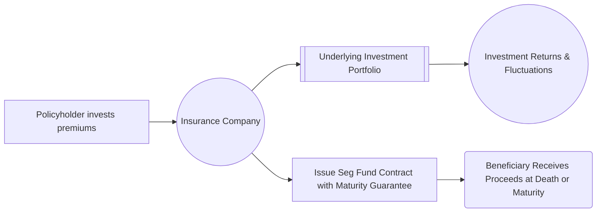

## 22.1 Segregated Funds

Segregated funds—often referred to as “seg funds”—are investment vehicles offered by life insurance companies. Although they resemble mutual funds in many respects, segregated funds are technically insurance contracts and thus fall under provincial insurance legislation as well as the governance of the Office of the Superintendent of Financial Institutions (OSFI) for federally regulated insurers. This dual nature provides unique benefits (such as potential estate bypass) and guarantees not typically available with conventional mutual funds. In this section, we delve into how segregated funds are structured, the maturity guarantees they offer, their regulatory environment, fees, tax considerations, and how investors and advisors can utilize them in portfolio planning.

---

## Overview and Key Characteristics

Segregated funds blend the growth potential of market-based investments (equities, bonds, or balanced portfolios) with specific protective features found in insurance products. A life insurance company issues a contract to the investor, known as the policyholder. The underlying assets are professionally managed, akin to mutual fund strategies; however, it is the insurer that retains legal ownership of the fund’s underlying assets. The investor receives participation and returns but also benefits from a variety of insurance-related guarantees.

Key features include:
• Maturity Guarantee: Often set at 75% or 100% of the principal invested, accessible upon contract maturity (commonly 10 years) or upon the death of the annuitant.  
• Death Benefit Guarantee: The value of the contract at the annuitant’s death may be guaranteed up to a certain percentage.  
• Beneficiary Designation: The policyholder can name beneficiaries directly in the contract, potentially allowing the proceeds to bypass probate.  
• Protective Reset Provisions: Depending on the policy, investors can “reset” their guaranteed amount if the market value of the holdings rises above the previous guaranteed figure.

---

## Insurance Contract Framework

Unlike mutual funds that are governed solely by securities regulation, segregated funds are principally subject to provincial insurance legislation. Insurers must also comply with the federal Insurance Companies Act (Canada) if they operate under federal charter. Because these products are deemed insurance contracts, they include provisions for beneficiary designations and potential estate bypass, meaning the proceeds may not form part of the deceased’s estate for probate purposes if structured correctly.

### Beneficiary Designation and Estate Bypass

One compelling reason investors consider segregated funds is the ability to name a beneficiary. Upon the annuitant’s death, proceeds can flow directly to the named individual(s) without going through probate, which speeds up the settlement process and may reduce estate settlement costs. This feature is particularly valued by older investors seeking to ensure a swift and straightforward transfer.

### Regulatory Authorities

• Provincial Insurance Regulators: Each province enforces its own insurance act. For instance, the Financial Services Regulatory Authority of Ontario (FSRA) supervises insurance providers in Ontario.  
• Federal Regulation via OSFI: The Office of the Superintendent of Financial Institutions oversees federally regulated insurers.  
• Voluntary Codes and Industry Guidelines: The Canadian Life and Health Insurance Association (CLHIA) publishes guidelines and consumer resources on best practices for segregated funds.

Because segregated funds involve elements of insurance and investment, advisors should be mindful of their regulatory obligations to ensure compliance with both securities and insurance guidelines. The Canadian Investment Regulatory Organization (CIRO) also provides rules on how registrants should address insurance-related products when dealing with clients.

---

## Maturity Guarantee

A defining element of segregated funds, the maturity guarantee protects a specified percentage—commonly 75% or 100%—of the capital invested. This guarantee is typically available on the policy’s maturity date (often 10 years from inception) or at the death of the annuitant, whichever comes first. The maturity guarantee appeals to conservative investors who wish to participate in market growth without assuming full downside risk.

### How the Guarantee Works

1. Investor purchases a segregated fund contract for a specified amount.  
2. The insurer calculates a “guaranteed amount” based on the policy’s stated coverage (e.g., 75% or 100%) of the initial investment.  
3. Should the market value of the fund be lower than the guaranteed amount at the contract’s maturity or the annuitant’s death, the insurer will “top up” the difference.  
4. If the market value is higher, the investor (or beneficiary) naturally benefits from the increased value, subject to any policy fees or redemption costs.

---

## Reset Features

Many segregated funds offer “reset” provisions, enabling investors to lock in a new guarantee level if the fund’s market value rises above the original guarantee. This helps protect gains in a rising market, resetting the contract’s minimum payout to a higher floor. 

• Frequency: Contracts often allow one or more resets per year, or over specific intervals—this can vary widely.  
• Age Restrictions: Some policies disallow resets beyond a certain annuitant age (e.g., age 80).  
• New Maturity Date: A reset usually triggers a new maturity date, extending the contract term.  

---

## Management and Investment Strategies

Structurally, segregated funds resemble mutual funds: they can invest in equities, fixed income securities, or a blend of asset classes. Management styles range from passive index tracking to active, fundamental-driven strategies. Management Expense Ratios (MERs) for segregated funds can be notably higher than for comparable mutual funds, owing to extra insurance fees and specialized guarantee structures.

• Investment Pool: Policyholders’ capital is pooled and invested according to the fund’s mandate.  
• Professional Advisors: Many insurers hire portfolio managers or use in-house teams with expertise similar to that of mutual fund managers.  
• Transparency: While segregated funds produce semi-annual or annual statements, the communication can be less frequent or detailed than that of mutual funds. Always review contract documents for specifics on reporting frequency and quality.

---

## Fees, Costs, and Redemption Charges

Segregated funds often come with several layers of fees, including:

1. Management Expense Ratio (MER): Covers day-to-day portfolio management, administrative costs, and distribution fees.  
2. Insurance Fee: An extra charge reflecting the cost of providing the maturity and death benefit guarantees.  
3. Early Redemption Fees: Some policies impose surrender charges if redeemed before a certain period.  
4. Additional Administrative Charges: Potential fees for certain transactions, contract amendments, or other administrative services.

Because fees can be higher than those of standard mutual funds, investors must weigh the relative value of insurance protection and estate bypass features against these added costs.

---

## Tax Considerations

Segregated funds can be used in both registered (e.g., RRSPs, TFSAs, RRIFs) and non-registered accounts. Although they may generate income, capital gains, and distributions similarly to mutual funds, certain tax implications differ:

• Year-End Allocations: Some segregated funds attribute gains and losses at the contract level.  
• Probate Benefits: If the contract bypasses the estate, there might be savings on probate fees; however, regular income tax obligations on capital gains or distributions still apply for the taxpayer.  
• Death of Annuitant: Any death benefit top-up is not taxable in itself; it simply forms part of the proceeds delivered to the beneficiary, though final tax returns may still need to account for deemed dispositions of growth in the fund.

As tax rules are complex, investors should consult a qualified tax professional or financial planner to understand how segregated fund contributions, transfers, and withdrawals interact with broader financial and estate goals.

---

## Suitability and Use Cases

Segregated funds are often positioned to investors who:

• Desire capital protection but still want market exposure.  
• Value estate planning efficiencies—particularly those wishing to bypass probate on assets.  
• Suit more conservative profiles but can also satisfy moderate to balanced growth objectives through carefully chosen portfolio mandates.  
• Appreciate the option to lock in heightened guarantees after market increases.

However, prospective investors should carefully evaluate whether the additional insurance fees, potential surrender charges, and other policy restrictions outweigh the benefits. 

---

## Practical Example: Locking in Gains

Consider an investor, age 55, who places $100,000 into an equity-focused segregated fund with a 75% maturity guarantee and a 10-year term. Within three years, the market rallies, boosting the fund’s market value to $130,000. The investor can use the policy’s reset feature to lock in $130,000 as the new “guaranteed amount,” effectively resetting the policy’s maturity date another 10 years. If at the new maturity date the fund’s value drops below $130,000, the insurer will cover the difference up to the new guaranteed amount.

From a retirement-planning standpoint, or in the event of the investor’s death, this reset feature could prove extremely valuable, especially in sharply fluctuating markets.

---

## Case Study: Estate Planning with a Major Canadian Insurer

Imagine Alice, 70, who invests in a segregated fund offered by a large Canadian insurer such as RBC Insurance—using it to provide her grandchildren with a direct inheritance. She designates them as beneficiaries of her contract. Upon her passing, the fund’s proceeds, including any guaranteed top-up, are disbursed directly to her grandchildren, bypassing probate. While her estate remains subject to other taxes or liabilities, the segregated fund portion avoids the probate process, expediting distribution and potentially saving on fees.

---

## Common Pitfalls and Challenges

1. Underestimating Costs: Investors may focus heavily on the insurance features without fully accounting for elevated MERs or additional insurance fees.  
2. Illiquidity or Surrender Charges: Exiting a segregated fund prematurely can trigger stiff redemption fees, reducing actual returns.  
3. Misaligned Time Horizon: Contracts often mandate a 10-year holding period. Investors with shorter-term objectives may not benefit fully from the maturity guarantee.  
4. Regulatory Complexity: Advisors must be licensed to sell these products, and rules can differ across provincial jurisdictions.

---

## Best Practices for Advisors and Investors

• Assess Suitability: Ensure segregated funds match the client’s risk tolerance, retirement timeline, and estate planning needs.  
• Disclose All Fees: Provide transparent information about MERs, insurance fees, and redemption charges.  
• Document Rationales: In line with CIRO guidelines, record how the product meets the client’s objectives and constraints.  
• Stay Current: Monitor provincial and federal insurance regulations, as frameworks may evolve and new product features may emerge in the marketplace.  
• Encourage Professional Advice: Engage professional tax and estate planning specialists to elucidate potential benefits and implications of segregated fund products.

---

## Visual Representation of Segregated Fund Flows

Below is a Mermaid diagram illustrating the structure and flow of a segregated fund contract:

Explanation:  
• The policyholder invests premiums in the segregated fund contract offered by the insurance company.  
• The insurer pools these funds into an underlying investment portfolio.  
• The portfolio’s returns, positive or negative, accrue to the policy value.  
• Thanks to the insurance contract structure, the policyholder (or beneficiary) may enjoy insurance guarantees such as maturity and death benefits.  
• At death or the contract’s maturity, proceeds, including any guaranteed amount, are distributed to the beneficiary or the policyholder.

---

## Additional Resources and References

• Insurance Companies Act (Canada) – Governs federally chartered insurers and outlines solvency and operational rules.  
• Provincial Insurance Acts (e.g., Ontario’s Insurance Act, supervised by FSRA) – Detailed legislation for insurance products.  
• CIRO (https://www.ciro.ca/) – The Canadian Investment Regulatory Organization, providing rules for advisors dealing with insurance-based investment products.  
• CLHIA (https://www.clhia.ca/) – The Canadian Life and Health Insurance Association, offering best practices, educational materials, and advocacy.  
• “Segregated Funds in Canada” by Greg Nott – A specialized reference that explores segregated fund offerings in depth.  
• Canadian Institute of Financial Planners – Additional professional guidance on estate planning structures using insurance products.  

---

## Summary

Segregated funds cater to individuals seeking to combine the return potential of market-driven investments with insurance-based guarantees and estate-planning benefits. They offer features uncommon in mutual funds, such as a contractual maturity guarantee and beneficiary designations that may bypass estate processes. The trade-off for these protections often takes the form of higher fees, surrender charges, and more complex regulatory oversight. Advisors and investors alike should weigh these benefits and drawbacks carefully, ensuring transparency around costs, contract terms, and the client's broader financial goals.

---

## Test Your Knowledge: Segregated Funds Guarantees and Estate Benefits



### Which of the following best describes the maturity guarantee offered by segregated funds?

- [ ] It is a legislative requirement that all mutual funds must abide by.
- [x] It is a contractual guarantee by the insurer ensuring a minimum portion of the principal is protected at maturity.
- [ ] It guarantees full principal protection only if the policy is in force for less than five years.
- [ ] It guarantees ongoing dividend payments, irrespective of market fluctuations.

> **Explanation:**( The defining characteristic of a segregated fund is the insurer’s contractual commitment to cover a percentage (often 75% or 100%) of the investor’s initial investment at the contract’s maturity or at death.)

### Which administrative authority primarily regulates segregated funds, given their nature as insurance contracts?

- [ ] Provincial securities regulators exclusively.
- [ ] Only the Canada Revenue Agency.
- [ ] The Investment Industry Regulatory Organization of Canada (IIROC).
- [x] Provincial insurance regulators, with federal oversight by OSFI for federally licensed insurers.

> **Explanation:**( Since segregated funds are insurance contracts, they fall primarily under provincial insurance legislation, while the Office of the Superintendent of Financial Institutions (OSFI) oversees federally regulated insurers.)

### Which feature allows an investor to lock in gains by periodically updating the guaranteed amount?

- [ ] Death Benefit Riders
- [ ] Surrender Charges
- [ ] Probate Fee Waivers
- [x] Reset Feature

> **Explanation:**( Reset features in segregated funds allow investors to lock in a new guaranteed amount if the investment’s market value exceeds the previously guaranteed floor, thereby preserving gains against future market downturns.)

### How does beneficiary designations in segregated funds offer potential estate planning advantages?

- [ ] The beneficiary can claim unlimited tax deductions.
- [x] The proceeds may bypass probate, facilitating a faster and cost-efficient estate settlement.
- [ ] The beneficiary can provide unlimited debt forgiveness.
- [ ] The beneficiary receives tax credits from the insurer.

> **Explanation:**( The insurance structure allows segregated fund proceeds to bypass the estate for probate purposes, yielding faster settlement and potentially reducing fees.)

### What is a common drawback of segregated funds compared to standard mutual funds?

- [ ] There are no legal contract agreements to protect investors.
- [ ] They cannot be held within registered accounts like RRSPs.
- [x] They typically have higher fees due to insurance guarantees and additional features.
- [ ] They offer strictly lower returns than mutual funds.

> **Explanation:**( Segregated funds generally have higher Management Expense Ratios and insurance fees because they provide maturity guarantees and death benefits.)

### In terms of regulatory compliance, which approach should advisors take when recommending segregated funds?

- [x] Disclose all fees, compare product features with client needs, and follow insurance legislation and CIRO guidelines.  
- [ ] Only provide a quick estimate of fees and check if the client wants life insurance.  
- [ ] Make decisions without the client’s input since it is an advisor product.  
- [ ] Discuss only the investment returns; do not focus on contract details or estate benefits.

> **Explanation:**( Advisors must conduct thorough due diligence, comparing segregated funds’ features and fees to client objectives and risk tolerance. Proper disclosure aligns with CIRO and insurance regulations.)

### If an investor fears their segregated fund value might drop below the guaranteed floor before the policy matures, which strategy might help retain any market gains?

- [ ] Liquidate the entire position immediately.
- [x] Exercise a reset option, if available, to lock in the current higher value.
- [ ] Transfer to a high-risk equity fund.
- [ ] Cancel the insurance contract outright.

> **Explanation:**( Resetting the contract’s guarantee amount helps safeguard realized gains against future market downturns.)

### Which statement best describes the tax implications of segregated funds?

- [ ] They are tax-free vehicles.
- [ ] No capital gains taxes apply to segregated funds.
- [ ] They cannot be used in registered accounts. 
- [x] They may have distributions similar to mutual funds but are treated as insurance contracts, adding estate bypass benefits and specific tax considerations.

> **Explanation:**( Although segregated funds are structured as insurance, they still generate taxable events (like capital gains or income distributions) similar to mutual funds. The difference lies in insurance-specific benefits like estate bypass.)

### A segregated fund contract typically matures how many years from its inception, offering the maturity guarantee?

- [ ] 1 year
- [ ] 5 years
- [x] 10 years
- [ ] 25 years

> **Explanation:**( Many segregated fund contracts offer a standard 10-year term for the maturity guarantee (though specific terms can vary by product).)

### True or False: One advantage of segregated funds is that their proceeds can bypass the estate, potentially avoiding probate fees.

- [x] True
- [ ] False

> **Explanation:** A unique benefit of insurance-based investment vehicles like segregated funds is that naming a beneficiary can allow proceeds to be distributed directly, avoiding the estate for probate purposes.



---

## For Additional Practice and Deeper Preparation

**Elevate your exam readiness with our comprehensive app, "Securities CA: Mock Exams," designed to challenge and refine your skills.**

* **Master Challenging Questions:** Dive into expertly crafted sample exam questions that go beyond standard references.
* **Scenario-Driven Learning:** Experience scenario-driven case questions and in-depth solutions to build practical expertise.
* **Sharpen Exam Strategies:** Build confidence with step-by-step explanations designed to refine your exam-day tactics.
* **Gain Real-World Insights:** Acquire practical tips and detailed rationales that demystify complex concepts.
* **CIRO and CSI Alignment:** Stay current with CIRO guidelines and CSI’s exam structure, with questions intentionally more challenging than the actual exam.

**Download the App Today:**

> Note: While these courses are specifically crafted to align with the CSC® exams outlines, they are independently developed and not endorsed by CSI or CIRO.
