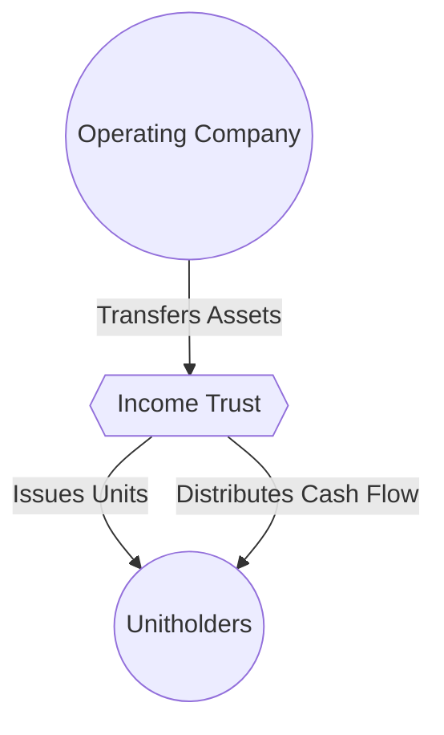

## 22.4 Income Trusts

Income trusts are a popular investment vehicle in Canada, widely considered by investors who seek reliable cash distributions and potential for capital appreciation. Historically, these trusts have been structured to pass earnings from underlying businesses or assets directly to investors (unitholders), bypassing significant corporate-level taxation in many cases. However, legislative changes—particularly the introduction of the Specified Investment Flow-Through (SIFT) rules—have reshaped their tax treatment, and investors should understand both the benefits and challenges these vehicles present.  

This section provides a comprehensive look at income trusts, covering their structure, taxation, risks, and suitability for different types of investors. We will explore the variations of income trusts—such as business income trusts, energy trusts, and Real Estate Investment Trusts (REITs)—and discuss key considerations, real-world examples, and practical steps for analyzing and investing in these income-generating products.

---

## Overview of Income Trusts

### What is an Income Trust?

An income trust is a legal structure in which investors (unitholders) pool their funds to own one or more underlying operating businesses or assets. The trust typically transfers substantially all distributable cash flows—arising from the operating entities—directly to unitholders. These distributions can include income, return of capital, and sometimes capital gains, allowing for a high level of tax efficiency (subject to certain rules).  

The primary allure of income trusts is consistent and relatively high distributions, making them popular among investors seeking immediate income, such as retirees or institutions looking to complement fixed-income portfolios.

### Basic Structure: From Business to Investor

To understand the income trust structure, consider the following simplified diagram:

1. The Operating Company transfers its assets to the Income Trust.  
2. The Income Trust issues units to investors (unitholders) in exchange for the capital raised.  
3. Operating income or cash flows generated by the underlying business flows from the Operating Company to the Trust.  
4. The Trust makes scheduled distributions (monthly, quarterly, or otherwise) to unitholders.

---

## Types of Income Trusts

There are several types of income trusts operating in Canada, each reflecting the nature of the underlying assets or businesses.  

### Business Income Trusts

• Business income trusts hold one or more operating businesses. Typical industries include manufacturing, consumer goods, or even service-based enterprises.  
• Cash flow depends on the profitability and operational performance of the business.  
• Investors may face sector-specific dangers (e.g., economic downturns, management changes).  

### Energy Trusts

• Often referred to as “energy royalty trusts,” these trusts focus on oil, natural gas, or other resource-extraction assets.  
• Cash flow can be highly volatile due to fluctuating commodity prices, regulatory changes, and operational risks in exploration and production.  
• The Canadian Association of Petroleum Producers provides considerable insights on risk mitigation, operational best practices, and regulatory requirements for energy assets.  

### Real Estate Investment Trusts (REITs)

• REITs invest primarily in real estate properties—commercial, residential, industrial, or a combination thereof—and distribute rental income to unitholders.  
• Often qualify for more favorable tax treatment if they adhere to specific distribution and property ownership criteria set out in the Income Tax Act (Canada).  
• They remain a dominant segment of the Canadian real estate marketplace, with oversight and resources from REALPAC (Real Property Association of Canada) and the Canadian Real Estate Association (CREA).

---

## Taxation and the SIFT Rules

### Historical Context

Income trusts gained popularity in Canada during the late 1990s and early 2000s due to preferential tax treatment. Unitholders enjoyed distribution income that had not been significantly taxed at the trust level (unlike dividends distributed by corporations, which are subject to corporate tax before dividends are paid).

### Introduction of SIFT Rules

In 2006, the federal government introduced the Specified Investment Flow-Through (SIFT) rules to address growing concerns over lost tax revenues and perceived unfair advantages of the trust structure. These rules effectively began taxing most publicly traded trusts in a manner similar to corporations.  

A trust that meets the SIFT criteria (e.g., it is publicly listed and invests primarily in non-REIT-qualifying assets) now faces an entity-level tax on its income. Unitholders also face tax consequences, making the overall tax regime more comparable to a traditional corporate structure.  

### REIT Exemptions

REITs can remain exempt from SIFT rules if they meet set criteria under the Income Tax Act (Canada), which generally requires:  
• Substantially all (i.e., at least 90%) of the trust’s property to be real property;  
• At least 75% of REIT revenue must originate from rent, mortgage interest, or real property capital gains;  
• Other restrictions designed to ensure REITs focus on real-estate-related activities.  

For investors, the primary takeaway is that REITs often maintain a tax advantage if they fulfill these conditions.  

---

## Distribution Policy and Cash Flow

One of the most appealing aspects of an income trust is its distribution policy—often monthly or quarterly. Investors can enjoy a steady stream of income, potentially higher than corporate dividends from conventional shares. However, distributions are not guaranteed:  

• A downturn in the underlying business, changes in commodity prices, or recessions can reduce cash-flow potential.  
• Some trusts may suspend or reduce distributions to conserve capital, especially during crises or if obligated to reinvest in capital expenditures.  

### Potential Components of Distributions

1. **Operating Cash Flow:** Income from the trust’s core business or assets.  
2. **Return of Capital (ROC):** A distribution that returns part of the investor’s original investment. While not taxable immediately, it generally lowers the investor’s adjusted cost base (potentially raising capital gains in the future upon sale).  
3. **Capital Gains:** If the trust sells portions of its property or if revaluations trigger gains.  

---

## Liquidity Considerations

The liquidity of income trust units depends on whether they are publicly listed, typically on the Toronto Stock Exchange (TSX). Key factors include:

• **Trading Volume:** Even if a trust is listed, the trading volume might be relatively low, affecting investors’ ability to buy or sell large positions quickly.  
• **Price Volatility:** Thinly traded trusts may experience higher price volatility. Unexpected distribution cuts or business developments can significantly impact market valuations.  
• **Secondary Market Impact:** Large block trades by institutional investors (e.g., pension funds, banks like RBC or TD ’s asset management divisions) can move the market for particular income trusts.

---

## Suitability for Investors

Income trusts, particularly those in specific industries like energy or real estate, can be attractive for income-seeking investors. However, the following considerations are crucial:  

1. **Stability of Distributions:** Assess historical distribution history and coverage ratios. Look at the trust’s financial statements (available via SEDAR+: https://www.sedarplus.ca/) to ensure the trust generates sufficient operating cash flow to sustain payouts.  
2. **Tax Implications:** Understand how distributions are taxed—whether as ordinary income, return of capital, or dividends. Consult official Income Tax Act (Canada) guidelines or speak to a tax professional.  
3. **Industry Risks:**  
   • Energy trusts are sensitive to commodity market fluctuations.  
   • REITs face real estate market cycles and interest rate risk.  
   • Business income trusts have operational and management risks specific to their industry.  
4. **Regulatory Compliance and Disclosure:** Trust structures must adhere to CIRO (Canadian Investment Regulatory Organization) guidelines, covering product suitability, risk disclosure, and investor protection.  
5. **Financing Needs:** Some businesses need to reinvest in capital expenditures or growth projects. Large reinvestment requirements could reduce available distributions.  
6. **Portfolio Diversification:** Income trusts can serve as a useful component of a diversified portfolio, offering exposure to sectors like real estate or energy.

---

## Analyzing an Income Trust: A Step-by-Step Approach

Below is a practical framework for evaluating a potential income trust investment:

1. **Review the Trust Agreement and Structure**  
   - Identify whether it is a business income trust, energy trust, or REIT.  
   - Confirm if it is subject to SIFT rules or qualifies for REIT exemptions.  

2. **Examine Financial Statements**  
   - Look for stable revenues, healthy coverage of distributions, and strong free cash flow.  
   - Pay attention to any significant debt, capital expenditures, or obligations that might erode distributable income.  

3. **Assess Management Expertise**  
   - For energy trusts, examine the operational track record in exploration and production.  
   - For REITs, examine the property portfolio, geographic concentration, and tenancy profile.  

4. **Tax and Regulatory Environment**  
   - Identify how distributions are classified and taxed.  
   - Stay up to date on legislative changes (or proposals) that could affect trust taxation or sector-specific regulations.  

5. **Conduct Financial Forecasts**  
   - Model expected cash flows under different scenarios (e.g., changes in commodity prices, interest rate shifts, or occupancy rates in real estate).  
   - Use open-source financial tools (e.g., spreadsheets, free modeling software) to forecast returns over multiple scenarios.  

6. **Evaluate Liquidity and Market Performance**  
   - Examine the daily trading volume, potential spreads, and historical volatility.  
   - Compare performance to relevant benchmarks or indexes (e.g., S&P/TSX Capped REIT Index for REITs).  

7. **Ongoing Monitoring**  
   - Revisit investment theses regularly, especially if there are major changes in the business environment or distribution policy.  

---

## Potential Challenges and Common Pitfalls

Despite their benefits, income trusts carry unique risks:

1. **Distribution Cuts:** A decline in the underlying business or an unexpected increase in expenses may lead to reduced payouts.  
2. **Regulatory Changes:** SIFT rules and any updates to trust taxation can materially change the investment’s attractiveness.  
3. **Commodity Price Exposure:** Particularly relevant for energy trusts.  
4. **Leverage and Refinancing Risks:** High debt levels can jeopardize distribution stability.  
5. **Market Sentiment:** Negative news on the sector or trust may sharply impact unit price.  

---

## Real-World Example: Energy Trust Volatility

Between 2014 and 2016, a dramatic decline in global oil prices forced several Canadian energy trusts to reduce or suspend distributions. Investors who believed distribution levels would remain steady faced significant losses. Conversely, trusts with hedging strategies and lower debt fared better.  

For instance, a hypothetical trust named “ABC Energy” initially drew significant investor interest for its high monthly payouts. Following a sudden oil price collapse, ABC Energy’s distributions shrank, leading to a dramatic drop in unit price. This example illustrates how changes in commodity markets can quickly affect operating cash flow, distributions, and investor returns.

---

## Industry Resources and Regulatory References

• **Income Tax Act (Canada):** Defines taxation rules for trusts, including SIFT provisions and exemptions for qualifying REITs.  
• **SEDAR+ (https://www.sedarplus.ca/):** Repository of publicly filed financial statements, distribution details, and management discussion and analysis (MD&A).  
• **CIRO:** Formerly IIROC and the MFDA—provides guidelines for product suitability, sales practices, and risk disclosure.  
• **REALPAC:** Offers guidance and industry updates for Canadian REITs.  
• **Canadian Association of Petroleum Producers:** Relevant for energy trust developments and regulation.  
• **Canadian Real Estate Association:** Offers insights into real estate market trends and brokerage regulations.

---

## Summary

Income trusts remain an appealing component for portfolios seeking regular cash flow and sector-specific exposure, ranging from real estate to energy. However, investor due diligence is paramount. Since legislative changes under the SIFT rules, trust structures more closely resemble corporate taxation, with notable exceptions for properly structured REITs. Investors must evaluate distribution stability, potential tax consequences, market volatility, sector-specific risks, and liquidity concerns.  

By applying thorough analysis—from reviewing trust agreements and financial statements to stress-testing economic conditions—investors can make informed decisions aligned with their risk tolerance and income objectives. Ongoing monitoring and awareness of legislative updates ensure that an income trust continues to fit a given investment strategy.

---

## Test Your Knowledge: Canadian Income Trusts and REITs



### Which key Canadian legislation introduced a tax for certain publicly listed income trusts, making their structure more similar to corporations?
- [ ] The Capital Markets Act
- [x] The Specified Investment Flow-Through (SIFT) rules
- [ ] The Business Trust Act
- [ ] The National Lock-In Regulation

> **Explanation:** The SIFT rules were introduced by the federal government to address the tax advantages many income trusts enjoyed, effectively treating those trusts more like corporations from a tax perspective.

### What is a primary benefit of REITs over other types of income trusts under the SIFT regime?
- [x] REITs may remain exempt from the SIFT tax if they meet specific property-related criteria.
- [ ] REITs have unlimited distribution capabilities without tax liabilities.
- [ ] REITs are allowed to invest heavily in foreign assets without penalties.
- [ ] REITs are exempt from all Canadian tax regulations.

> **Explanation:** REITs can qualify for exemptions if they fulfill criteria set forth in the Income Tax Act, making them more tax-efficient compared to other SIFT trusts.

### In an energy trust, which external factor most significantly affects distribution stability?
- [ ] Seasonal market sentiment shifts
- [ ] Canadian housing market changes
- [x] Commodity price fluctuations (e.g., oil, natural gas)
- [ ] Changes in the retail sector

> **Explanation:** Because energy trusts derive income from the production and sale of resources, fluctuations in commodity prices directly affect their cash flow and ability to maintain distributions.

### Which organization provides enforcement and guidance for product suitability and risk disclosure for income trusts in Canada?
- [ ] Canada Revenue Agency (CRA)
- [ ] The Canadian Real Estate Association (CREA)
- [ ] Transport Canada
- [x] CIRO (Canadian Investment Regulatory Organization)

> **Explanation:** CIRO, formerly IIROC and the MFDA, sets and enforces rules regarding the distribution and suitability of investment products for Canadian investors.

### Which type of distribution reduces the investor’s adjusted cost base rather than being taxed immediately as income?
- [x] Return of Capital (ROC)
- [ ] Capital Gains
- [ ] Dividend Income
- [ ] Accrued Interest Payment

> **Explanation:** Return of Capital lowers the investor’s adjusted cost base, deferring tax consequences until the time of disposition, thus providing potential tax advantages.

### If an income trust has a low trading volume and is thinly traded, which risk does an investor face most prominently?
- [ ] Over-distribution risk
- [ ] Frequent capital gains distributions
- [ ] Smaller capital gains potential
- [x] Difficulty exiting large positions without affecting the price

> **Explanation:** Low liquidity can make it challenging to sell large blocks of trust units quickly, potentially causing significant price fluctuations.

### A potential investor examining a business income trust should look primarily at which financial metric to determine the sustainability of distributions?
- [ ] Gross Revenue
- [x] Free Cash Flow
- [ ] Management Bonuses
- [ ] Accumulated Depreciation

> **Explanation:** Distributions come from actual cash flow that remains after required expenses, making free cash flow a critical metric for evaluating distribution sustainability.

### Which step is essential in ongoing monitoring of an income trust investment?
- [ ] Ignoring quarterly reports to avoid bias
- [x] Reviewing updated financial statements and distribution coverage ratios
- [ ] Relying solely on the original investment thesis
- [ ] Selling all units once distributions are reduced

> **Explanation:** Ongoing assessment of financial statements and coverage ratios is crucial for ensuring the trust still aligns with an investor’s objectives and risk tolerance.

### What is a best practice when analyzing industry-specific risks, such as those affecting energy trusts or REITs?
- [x] Consulting trade associations, regulatory resources, and industry reports for sector trends
- [ ] Assuming sectors behave identically regardless of macroeconomic conditions
- [ ] Avoiding external data and focusing only on the trust’s internal performance
- [ ] Using only technical stock charts without fundamental data

> **Explanation:** Accessing high-quality, sector-specific data (e.g., from the Canadian Association of Petroleum Producers or REALPAC) aids in more accurate risk assessment.

### Income trusts are suitable primarily for risk-averse investors seeking capital growth rather than income.
- [ ] True
- [x] False

> **Explanation:** Income trusts have typically appealed to investors seeking regular cash distributions, not just pure capital growth. While they can offer some capital appreciation, their design focuses on generating ongoing cash yield.



---

---

By understanding the structure, tax considerations, and risk factors of income trusts, as well as adopting a rigorous due diligence process, investors can benefit from their steady distributions and sector-specific opportunities. Effective and continuous monitoring remains key: As market conditions or government regulations evolve, so too should your strategy.
