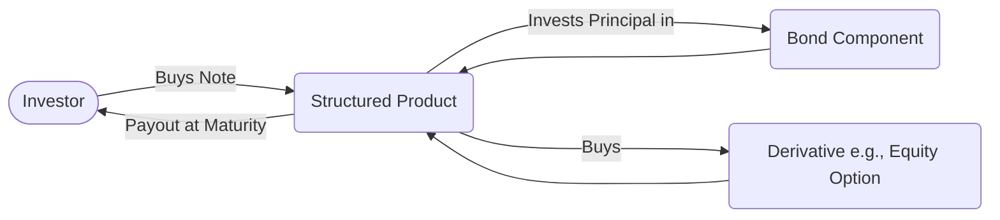

## 23.1 Overview of Structured Products

Structured products represent a powerful set of financial instruments that combine conventional underlying assets—such as equities, bonds, commodities, or currencies—with derivative contracts to create a tailored payoff profile. Many Canadian investors seek these solutions to address specific portfolio objectives like capital protection, risk management, yield enhancement, and diversification. This chapter examines why structured products have become increasingly relevant in the modern marketplace, how they are constructed, which regulatory frameworks govern their distribution, and what considerations investors should weigh before adding them to their portfolios.

---

### Defining Structured Products

Structured products are essentially pre-packaged investment strategies designed to offer returns tied to the performance of an asset—or basket of assets—but with unique characteristics such as:
• Principal protection (partial or full).  
• Enhanced returns or leverage.  
• Customized exposure to multiple asset classes.  
• Unique payoff structures or risk-return profiles.  

Investment dealers regulated by the Canadian Investment Regulatory Organization (CIRO) often distribute these products. The structure typically involves combining conventional underlying securities (e.g., stocks, bonds) with derivatives (e.g., options or swaps) to achieve specific objectives.

#### Key Benefits and Potential Uses
• Risk Management and Capital Protection: Investors seeking protection of principal can benefit from structured products that guarantee a portion or all of the initial investment at maturity.  
• Yield Enhancement: Certain structures will aim to deliver higher coupon rates or additional yield relative to a straightforward fixed-income or equity investment.  
• Diversification: Structured products can provide exposure to unusual or complex assets (e.g., a mix of currencies and commodities) that would otherwise be difficult to replicate in a traditional portfolio.  

#### Practical Canadian Examples
A Canadian investor at RBC Dominion Securities wanting exposure to emerging market equities but concerned about volatility might purchase a structured note that combines an equity index option (linked to an emerging market index) with Government of Canada bonds. The bond component seeks to protect principal, while the option offers market exposure. If the index increases in value, the investor may receive a percentage of that growth. If it declines, the guaranteed portion helps minimize losses at maturity.

---

### Components and Mechanisms

When analyzing a structured product, it is helpful to break it down into its core components.

#### Underlying Assets
Underlying assets are the securities or indexes on which the derivative components are based. Common examples include:  
• Equity Indexes: For instance, the S&P/TSX Composite Index for Canadian equities.  
• Baskets of Equities: A curated selection of technology or healthcare stocks.  
• Fixed-Income Securities: Government of Canada bonds or corporate bonds might serve as the interest-bearing component.  
• Commodities: Such as gold, oil, or a broad commodity index.  
• Currencies: Single currency exchange rates or a currency basket (CAD/USD/EUR).

#### Derivative Instruments
Derivatives are used to customize the final return profile. Examples include:  
• Options: Calls or puts to participate in upside or hedge downside.  
• Futures or Forwards: To lock in specific exposure or handle currency hedging.  
• Swaps: Often used to exchange fixed for floating interest rates or to gain leverage on an underlying index.

#### Payoff Structures

Payoff structures determine how the investor’s return is calculated.  
• Participation Rate: The percentage of the underlying asset’s gains passed through to the investor.  
• Caps: A limit on the maximum return.  
• Floors: A protective mechanism minimizing the downside below a certain threshold.  
• Leverage Factor: Provides amplified exposure to underlying gains (though losses can also be magnified if the product is not principal-protected).

---

### Principal Protection and Risk Considerations

One of the hallmarks of many structured products is partial or full capital protection, which can appeal to conservative investors. However, principal protection is often contingent upon holding the investment to maturity. If a product is sold before maturity:  
• The secondary market price may be lower or higher than the intrinsic value.  
• Liquidity can be limited, leading to wide bid-ask spreads.  
• Early redemption fees may diminish returns.

#### Types of Principal Protection

Structured products typically offer one of two main categories of principal protection:  
1. 100% Principal Protection: Ensures that if held to maturity, the investor will get the entire principal back, regardless of market performance.  
2. Partial Principal Protection: Only a portion (e.g., 80–90%) of the initial investment is guaranteed. The remainder risks loss but can enable higher upside participation.

---

### Early Redemption and Liquidity

Although some structured products can be redeemed before maturity, the secondary market can be volatile due to:  
• Interest Rate Movements: Rising interest rates can erode the bond component’s value.  
• Volatility Levels: Higher volatility can increase or diminish the value of embedded options.  
• Dealer Spreads: Limited buyers and thin markets can cause the product to trade at discounts or premiums.  

Careful consideration of holding periods and redemption features is crucial. Investors need to thoroughly review a product’s term sheet and offering documents to understand all associated redemption costs.

---

### Regulatory Framework in Canada

#### Role of CIRO
The Canadian Investment Regulatory Organization (CIRO) oversees investment dealers, enforcing suitability and disclosure requirements. CIRO wants to ensure advisors thoroughly understand structured products before recommending them. Important considerations include:  
• Assessing client risk tolerance and matching it to product complexities.  
• Conducting due diligence on the underlying instruments.  
• Delivering clear, plain-language product disclosures to investors.

#### Prospectus Requirements: CSA
The Canadian Securities Administrators (CSA) set forth rules on prospectus exemptions, short-form prospectus usage, and shelf prospectus availability. Depending on the product’s structure and scope, issuers might use the short-form prospectus system to expedite market entry.  
• National Instrument 81-102 (Investment Funds) outlines key rules for publicly offered investment funds, some of which share structural similarities to certain packaged products.  
• National Instrument 91-102 (Prohibition of Binary Options) and National Instrument 94-101 (Mandatory Central Counterparty Clearing of Derivatives) provide broader frameworks on derivatives usage in Canada.

#### Transparent Disclosure
Canadian securities laws require that structured products have comprehensive offering documents, which may include a short-form prospectus or a supplement that clearly describes:  
• Terms and Conditions (e.g., maturity, underlying index, call/put features).  
• Pricing Details (e.g., how the derivative is valued, internal costs).  
• Risk Factors (e.g., market risk, credit risk, interest rate risk).  
• Fees (e.g., advisory fees, underwriting fees).  
• Tax Treatment (e.g., capital gains vs. income, potential withholding).  

A product’s Information Statement and term sheet should highlight the costs and potential scenarios (best case, baseline, worst case) of the investment’s performance.

---

### Common Structures in the Canadian Marketplace

#### Market-Linked GICs
Often issued by Canadian banks (e.g., TD or RBC), market-linked GICs combine a guaranteed principal with an equity index option. The investor benefits if the index rises but may have limited upside potential due to caps or participation rates.

#### Principal-Protected Notes (PPNs)
PPNs are a form of structured product that often offer 100% principal protection, with returns tied to underlying assets such as a stock basket or a commodities index. These notes are usually held until maturity to realize the protection feature.

#### Split Shares
Split share corporations divide an underlying portfolio’s returns into separate share classes—one focusing on dividends (preferred shares), and the other on capital appreciation (capital shares). Though not always marketed as a “structured product,” they share many structural traits: combining a fixed-return element with a growth-oriented share class.

---

### Best Practices for Evaluating Structured Products

Before investing in structured products, consider the following best practices:

1. Clarify Investment Objectives: Pinpoint the reason for the investment—capital preservation, yield enhancement, or broad diversification.  
2. Read the Term Sheet and Prospectus: Identify payoff structures, key features, fees, and redemption terms.  
3. Understand the Underlying Assets: Evaluate the potential volatility and correlation of these assets with the rest of your portfolio.  
4. Assess the Credit Risk: Structured products are often secured by bonds or issued through a bank’s credit. Consider the issuer’s creditworthiness.  
5. Match with Time Horizon: Structured products may require locking in capital until maturity for full benefits.  
6. Consult Regulatory Filings: Examine regulatory documents and guidelines by the CSA, CIRO, and relevant National Instruments.  
7. Forum for Questions: Discuss complexities and potential scenarios with an advisor well-versed in structured investments.

---

### Step-by-Step Illustration

Below is a mermaid diagram illustrating a simplified structure:

1. The investor purchases the structured product through an investment dealer.  
2. The issuer invests most of the proceeds in a bond component (often high-grade bonds or GIC-like instruments).  
3. A portion of the proceeds is allocated to derivatives for market upside potential.  
4. At maturity, the bond guarantees the principal (or portion of principal), while the derivative drives the additional return (if any).

---

### Common Pitfalls and Challenges

• Complexity of Payoffs: Without a thorough understanding, investors may misunderstand potential upside or risk exposure.  
• Early Redemption Penalties: Redeeming early can erode any principal protection and can lock in losses.  
• Illiquidity in the Secondary Market: Certain structured products may only be marketable through the issuer.  
• Credit Risk of Issuer: Even a significantly hedged position can be jeopardized if the issuing bank or entity defaults.  

Staying vigilant about these challenges is key to preventing costly mistakes and ensuring that the structured product remains aligned with an investor’s goals.

---

### Additional Resources

Learning more about structured investments involves reading product-specific documentation and staying current with regulatory developments. Consider the following resources:

• [Canadian Securities Administrators (CSA)](https://www.securities-administrators.ca/) – for rules on derivatives and structured investments.  
• [CIRO](https://www.ciro.ca/) – to understand guidelines and conduct standards for financial advisors and investment dealers.  
• Books such as:  
  – “Structured Products and Related Credit Derivatives: A Comprehensive Guide for Investors,” by Brian P. Lancaster.  
  – “Handbook of Structured Financial Products” (Frank Fabozzi series).  
• National Instrument 81-102, 91-102, and 94-101 – for regulations on different types of investment funds and derivative products.  

Structured products can be an innovative and potentially rewarding element of a well-rounded investment strategy when used responsibly. With an understanding of how the underlying assets, derivatives, and market forces come together—and guided by knowledgeable advisors—Canadian investors can better harness these financial solutions to meet their long-term goals.

---

## Quiz: Structured Products in the Canadian Investing Landscape



### When constructing a structured product, which component is most often used to protect the principal at maturity?

- [ ] Common equities  
- [x] Fixed-income or bond instruments  
- [ ] Commodity contracts  
- [ ] Mutual fund units  

> **Explanation:** A significant portion of the principal is generally allocated to high-grade bond instruments or similar fixed-income securities, which help ensure a set principal guarantee at maturity.

### One of the primary advantages of certain structured products is:

- [x] The potential for full or partial principal protection.  
- [ ] Unlimited liquidity for early redemption.  
- [ ] Guaranteed returns above market benchmarks.  
- [ ] Complete immunity from issuer credit risk.  

> **Explanation:** Structured products often aim to offer some degree of principal protection, though issuer credit risk and market factors must still be evaluated carefully.

### Which of the following is a risk factor specifically associated with early redemption of a structured product?

- [ ] The investor may receive more than the intrinsic value.  
- [x] Additional costs or discounted pricing may diminish the product’s value.  
- [ ] All structured products guarantee a premium to the investor.  
- [ ] Redeeming early has no impact on investor returns.  

> **Explanation:** Early redemption may lead to added costs or discounted pricing, reducing the potential benefits of a structured product’s payoff structure.

### In Canada, which regulatory body directly oversees the activities of investment dealers selling structured products?

- [ ] Canada Revenue Agency  
- [x] Canadian Investment Regulatory Organization (CIRO)  
- [ ] Bank of Canada  
- [ ] Department of Finance Canada  

> **Explanation:** CIRO’s oversight ensures dealers follow rules and guidance around product suitability, transparency, and disclosure for structured products.

### If an investor wants leveraged exposure through a structured product, which element would typically enable higher participation in the underlying asset's growth?

- [x] A leverage factor within the payoff structure  
- [ ] A 100% principal guarantee  
- [x] Embedded derivatives such as options  
- [ ] A diversified basket of mutual funds  

> **Explanation:** Leverage factors and options can amplify returns (or losses), providing leveraged exposure to the underlying asset’s performance.

### Which documentation is crucial for understanding the specifics of a structured product’s fees, risks, and underlying assets?

- [x] Term sheet and prospectus  
- [ ] Bank statement only  
- [ ] Equity research report  
- [ ] Credit union membership form  

> **Explanation:** The term sheet and prospectus detail the product’s structure, fees, derivatives, risk factors, and obligations of the issuer.

### Market-linked GICs typically offer:

- [x] A guarantee of principal if held to maturity  
- [ ] Unlimited upside potential with no cap  
- [x] Partial or full participation in an equity or index performance  
- [ ] Zero correlation with any market movements  

> **Explanation:** Market-linked GICs use a portion of the yield to purchase index or equity exposure, while the principal amount is guaranteed if held to maturity.

### Which factor most significantly impacts the value of a derivative embedded in a structured product?

- [ ] The credit rating of an unrelated corporation  
- [x] The volatility of the underlying asset  
- [ ] Agricultural output in the Canadian prairies  
- [ ] The ratio of debt to equity in the issuing bank  

> **Explanation:** Derivative pricing is directly influenced by volatility in the underlying asset, among other factors like interest rates and time to maturity.

### Which consideration is most relevant for Canadian investors looking to place structured products in registered plans like RRSPs or TFSAs?

- [ ] Whether the product is sold exclusively on foreign exchanges  
- [x] Whether the product qualifies under plan rules and provides the right tax treatment  
- [ ] If the product has minimal correlation to any market  
- [ ] The presence of no fees  

> **Explanation:** Investors must ensure the structured product is eligible (e.g., must be Canadian-domiciled and meet registration criteria) and clearly understand the tax implications.

### Do structured products always guarantee no loss of principal?

- [x] No, only certain structures offer partial or full protection if held to maturity.  
- [ ] Yes, structured products are risk-free by definition.  

> **Explanation:** Not all structured products provide principal protection. Some expose investors to partial or full capital loss. Protection terms depend on the specific product design.



---

