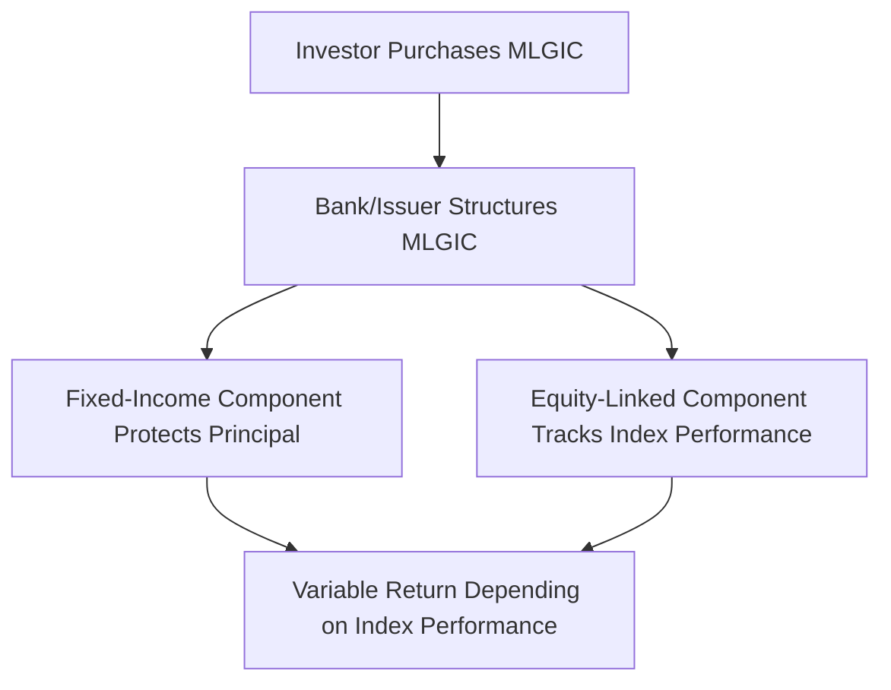

## 23.3 Market-Linked Guaranteed Investment Certificates (GICs)

Market-Linked Guaranteed Investment Certificates (MLGICs) deliver a unique hybrid of traditional GIC principal protection aligned with the opportunity for higher returns based on the performance of an underlying market index or basket of securities. This section delves into the fundamental traits, typical structures, and key considerations relevant to MLGICs within the Canadian financial market. It also contrasts MLGICs against similar structured products, explains common terms like participation rates and cap rates, and highlights regulatory aspects, including coverage by the Canada Deposit Insurance Corporation (CDIC).

-------------------------------------------------------------------------------
### Introduction

MLGICs have gained popularity among Canadian investors seeking the safety traditionally associated with GICs while capturing some of the upside potential of equity or other market performances. Typically issued by Canadian deposit-taking institutions—such as RBC, TD, or other Schedule I banks—MLGICs offer:

• 100% principal protection when held to maturity, much like a standard GIC.  
• Returns tied to the performance of one or more underlying market indices (e.g., S&P/TSX Composite, S&P 500, or international indexes).  
• Potentially higher earnings than fixed-rate GICs, subject to specific participation or cap rates.

While MLGIC structures are often straightforward, important nuances—such as calculation methods, early withdrawal limitations, and payout formulas—require careful analysis to understand the product’s real return potential.

-------------------------------------------------------------------------------
### Key Features of Market-Linked GICs

Below is a summary of common characteristics and considerations:

| Feature                   | Description                                                                                                                                          |
|---------------------------|------------------------------------------------------------------------------------------------------------------------------------------------------|
| Principal Protection      | Typically 100% of the principal is guaranteed if held until maturity. This guarantee may be backed by the issuing institution and possibly covered by CDIC (subject to eligibility). |
| Potential for Higher Return | Returns depend on the linked index’s performance. Investors participate in gains up to a specified cap, or as determined by a participation rate.                                           |
| Term to Maturity          | Generally ranges from 1 to 5 years, although some products may extend beyond 5 years.                                                                |
| Liquidity Constraints     | Early redemption is often restricted. If redemption is allowed, it may incur penalties or result in reduced returns.                                |
| CDIC Coverage             | Many MLGICs qualify for coverage up to the CDIC limits if they meet all deposit classification requirements. Confirm eligibility with the issuer.    |

-------------------------------------------------------------------------------
### How Market-Linked GICs Work

The basic mechanism involves linking the investor’s return to a specific benchmark or basket of assets:

1. The investor purchases an MLGIC from a deposit-taking institution.  
2. The principal is allocated by the issuer into two components:  
   • A fixed-income component (often zero-coupon bonds or short-term instruments).  
   • An equity-linked or index-linked derivative component, providing exposure to the chosen market index.  
3. At maturity, the investor receives:  
   • 100% of the initial principal.  
   • A variable return calculated on the basis of the underlying index performance, subject to terms (e.g., participation rate, index averaging, or cap rate).

Below is a simplified flow diagram illustrating the process:

#### Participation Rate
The participation rate determines the proportion of the index’s positive return credited to the investor. For instance, if the underlying index grows by 10% and the participation rate is 70%, the investor’s credited return would be 7%.

#### Cap Rate
A cap rate imposes an upper limit on returns. For example, if the cap rate is set at 12%, even if the index increases by 20%, the investor’s maximum return is 12%.

#### Index Growth Calculation
Issuers may determine index movement in various ways, such as:  
• Point-to-point: Compares the index at the issue date and the final date.  
• Averaging: Uses the average index level over a certain period (e.g., monthly or quarterly).  
• Daily compounding: Factors daily changes, though this is less common in retail MLGIC products.

-------------------------------------------------------------------------------
### Example Case Studies

1. RBC Market-Linked GIC – S&P/TSX Composite  
   • Maturity: 3 years.  
   • Participation Rate: 80%.  
   • Cap: 15%.  
   • Calculation Method: Point-to-point.  
   • If the index increases by 20%, the investor’s return is 16%. If the index surges above 20%, the return is capped at 15%.

2. TD Market-Linked GIC – Global Equity Basket  
   • Maturity: 5 years.  
   • Participation Rate: 70%.  
   • No explicit cap, but subject to averaging over the final 12 months.  
   • If the global equity index basket grows by 25%, the investor’s credited return is 17.5%. Because the product uses averaging, major market swings late in the term are dampened.

These scenarios highlight variability in MLGIC structures. Always review the term sheet and offering documents to fully understand the calculation method and possible outcomes.

-------------------------------------------------------------------------------
### Comparison with Principal-Protected Notes (PPNs)

While both MLGICs and Principal-Protected Notes (PPNs) safeguard the principal if held to maturity and offer a market-linked return, their differences include:

• Issuer: MLGICs are typically issued by deposit-taking institutions (e.g., banks), often qualifying for CDIC insurance. PPNs can be issued by investment dealers or banks outside the standard CDIC deposit classification.  
• Credit Risk: MLGICs are generally considered deposits of the issuing institution; some are insured by CDIC to its prescribed limits. PPNs often rely more heavily on the note-issuing entity’s creditworthiness.  
• Structural Complexity: MLGICs may have simpler, more standardized terms and straightforward payout formulas. PPNs can feature more intricate structures (e.g., multiple underlying assets, complex derivatives).  
• Marketing and Disclosure: MLGIC offerings must adhere to both deposit product regulations and CIRO/CSI guidelines, ensuring transparent disclosure of features and risks. PPNs are often sold under different disclosure requirements.

-------------------------------------------------------------------------------
### Glossary of Important Terms

• **Index Growth Calculation**: The methodology by which the underlying index performance is measured (e.g., point-to-point or averaging).  
• **Participation Rate (MLGIC)**: The percentage of the index’s gains credited to the investor. If the index rises 10% and the participation rate is 70%, the investor gets 7%.  
• **Cap Rate**: A preset maximum return on the MLGIC, ensuring the issuer manages its risks and costs.  
• **CDIC Coverage**: Coverage provided by the Canadian Deposit Insurance Corporation. Eligible deposits are generally insured up to CDN $100,000 per insured category at each member institution, though terms may change over time. Consult the CDIC (https://www.cdic.ca/) for up-to-date information.

-------------------------------------------------------------------------------
### Best Practices and Considerations

1. **Align with Investment Objectives**: Confirm that MLGICs’ risk-return profile supports your overall portfolio strategy and timeframe.  
2. **Evaluate Fees and Costs**: While MLGICs generally do not carry explicit management fees, there may be embedded derivative costs.  
3. **Understand Early Redemption**: Check the terms for penalties or reduced returns when redeeming prior to maturity.  
4. **Review Credit Quality**: Even with CDIC coverage, ensure you are comfortable with the issuer’s creditworthiness and repayment ability.  
5. **Compare Alternatives**: Consider other structured or fixed-income solutions (e.g., traditional GICs, PPNs) to ensure MLGICs are the best match for your goals.  
6. **Stay Up to Date with the Regulatory Landscape**: Regulations can evolve, especially around deposit insurance or structured product disclosures. Check newer guidelines from CIRO, CDIC, and other applicable agencies.

-------------------------------------------------------------------------------
### Step-by-Step Guidance on Evaluating an MLGIC

1. **Identify Your Objective**  
   Decide whether your overarching goal is preserving capital, earning fixed income, or participating in equity markets.

2. **Check the Term**  
   Ensure the maturity date aligns with your liquidity needs. Locking funds in an MLGIC for 3 to 5 years might limit access to capital.

3. **Examine Return Structure**  
   Look at the participation rate, potential cap, and index averaging or point-to-point calculations.

4. **Verify CDIC Coverage**  
   Confirm whether the MLGIC is eligible for coverage, and check the current CDIC limit per deposit category.

5. **Assess Historical Performance**  
   Estimate potential returns by examining historical index trends. Past performance is not guaranteed to continue, but it provides context.

6. **Review Documentation**  
   Read the product’s information statement, fact sheet, or term sheet carefully to understand fees, early redemption conditions, and disclaimers.

7. **Consult with an Advisor**  
   Seek professional advice from a licensed Canadian investment advisor familiar with MLGICs, especially for complex structures or large investments.

-------------------------------------------------------------------------------
### Conclusion

Market-Linked Guaranteed Investment Certificates provide an appealing option for investors seeking principal protection with the possibility of higher returns linked to equity or other market performances. Although the basic premise resembles a traditional GIC, the variability in payout formulas and underlying market benchmarks introduces additional considerations. By thoroughly understanding elements such as participation rates, cap rates, and potential liquidity constraints, Canadian investors can harness MLGICs to diversify their portfolio while still benefiting from principal protection. Always verify CDIC eligibility and stay informed regarding product disclosures and regulatory changes affecting deposit-taking institutions and their structured offerings.

-------------------------------------------------------------------------------

## Maximize Returns with Market-Linked GICs: A Comprehensive Quiz for Canadian Investors



### Which statement best describes a Market-Linked GIC?

- [x] A GIC where returns are tied to an underlying market index, with principal guaranteed at maturity.
- [ ] A bond that allows partial participation in equity returns.
- [ ] A high-risk share offering from a Canadian bank.
- [ ] A GIC product that always outperforms inflation.

> **Explanation:**( MLGICs link the investor’s return to an external market index, while sharing traditional GIC traits such as principal protection.)

### What is the role of a participation rate in a Market-Linked GIC?

- [x] It determines the proportion of an index’s gain that is credited to the investor.
- [ ] It specifies the amount of interest that is taxed at source.
- [ ] It is a guarantee that ensures investor returns will match the index.
- [ ] It measures how often an investor can redeem the product before maturity.

> **Explanation:**( The participation rate is the percentage of an index’s gain that the investor will receive if the index increases.)

### A cap rate on a Market-Linked GIC serves to:

- [x] Limit the maximum possible return the investor can earn.
- [ ] Guarantee the investor a minimum return in the event of losses.
- [ ] Eliminate credit risk entirely.
- [ ] Ensure the interest is blended and paid as a lump sum.

> **Explanation:**( A cap rate restricts the maximum gain credited to the investor, allowing issuers to control risk and potential payouts.)

### CDIC coverage for Market-Linked GICs usually depends on:

- [x] Eligibility of the MLGIC as an insured deposit and adherence to CDIC rules.
- [ ] Only the performance of the underlying market index.
- [ ] The investor’s prior account history with the institution.
- [ ] The Bank of Canada’s monetary policy stance.

> **Explanation:**( CDIC coverage applies if the MLGIC meets deposit classification requirements, up to CDIC’s prescribed limits.)

### Which of the following is a valid comparison between MLGICs and Principal-Protected Notes (PPNs)?

- [x] MLGICs are typically issued by deposit-taking banks; PPNs can be issued under various structures by banks or other financial entities.
- [ ] PPNs always offer CDIC coverage; MLGICs never do.
- [x] MLGICs often have simpler payout formulas; PPNs can be more complex.
- [ ] Both are exclusively sold via traditional brokerage accounts.

> **Explanation:**( MLGICs are technically deposits, often eligible for CDIC coverage and simpler in structure compared to PPNs, which may rely on the issuer’s credit rating and can be more complex.)

### In a point-to-point calculation for an MLGIC, the return is most often based on:

- [x] The difference in the index level between the issue date and the maturity date.
- [ ] The weighted average of daily stock prices during the final month.
- [ ] The average of the index at the end of each quarter.
- [ ] The sum of all dividend payments reinvested into the index.

> **Explanation:**( A point-to-point method looks specifically at the valuation of the index at the issue date and compares it to the final date to determine the performance.)

### When considering an MLGIC with a 70% participation rate and the S&P/TSX Composite increasing by 15%, the investor’s approximate gain is:

- [x] 10.5%
- [ ] 15%
- [x] 70%
- [ ] 0%

> **Explanation:**( 70% of a 15% index gain is 10.5%.  )

### Which factor could reduce actual returns on a Market-Linked GIC even if the benchmark index performs well?

- [x] Averaging or smoothing mechanisms in calculating the index return.
- [ ] Immediate reinvestment of dividends in the index.
- [ ] The presence of monthly coupon payments.
- [ ] No term limits on the certificate.

> **Explanation:**( Some MLGICs employ averaging or smoothing calculations, leading to a lower effective return than the raw index performance.)

### One advantage of MLGICs over regular GICs is:

- [x] Access to potentially higher returns if the reference index performs strongly.
- [ ] Guaranteed above-inflation returns in all market conditions.
- [ ] Ability to redeem at any time without penalty.
- [ ] Unlimited upside on the reference index growth.

> **Explanation:**( MLGICs may provide increases beyond a fixed rate when the index performs well, though they often feature a cap or participation rate that may limit total returns.)

### Certain Market-Linked GICs embedded with complex derivative structures:

- [x] True
- [ ] False

> **Explanation:** While MLGICs are generally simpler than many other structured products, they still rely on derivatives (e.g., options) to link returns to the performance of a market index.



-------------------------------------------------------------------------------

## For Additional Practice and Deeper Preparation

**Elevate your exam readiness with our comprehensive app, "Securities CA: Mock Exams," designed to challenge and refine your skills.**

* **Master Challenging Questions:** Dive into expertly crafted sample exam questions that go beyond standard references.
* **Scenario-Driven Learning:** Experience scenario-driven case questions and in-depth solutions to build practical expertise.
* **Sharpen Exam Strategies:** Build confidence with step-by-step explanations designed to refine your exam-day tactics.
* **Gain Real-World Insights:** Acquire practical tips and detailed rationales that demystify complex concepts.
* **CIRO and CSI Alignment:** Stay current with CIRO guidelines and CSI’s exam structure, with questions intentionally more challenging than the actual exam.

**Download the App Today:**

> Note: While these courses are specifically crafted to align with the CSC® exams outlines, they are independently developed and not endorsed by CSI or CIRO.
