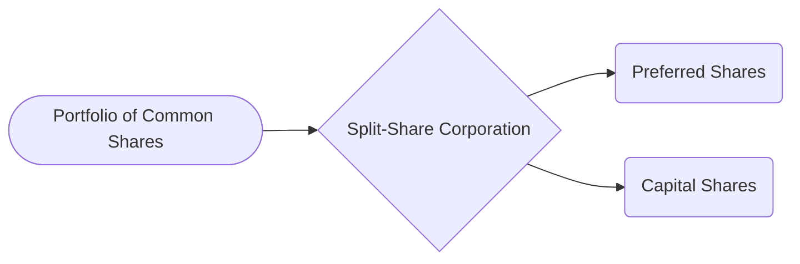

## 23.4 Split Shares

Split shares are a unique form of structured product designed to divide the investment characteristics of a common share—namely, dividend income and capital appreciation—into two distinct securities. These securities cater to different types of investors based on their risk tolerance and income requirements. In Canada, split shares are issued through special-purpose entities called split-share corporations, which hold a portfolio of underlying common shares. The corporation then issues two classes of shares:

• Preferred Shares (or Preferred Securities)  
• Capital Shares (or Class A Shares)

The structural division allows each class to appeal to a specific type of investor: those seeking more stable dividend income (preferred shares) and those seeking leveraged exposure to capital gains (capital shares).

Below, we explore the mechanics, benefits, risks, and regulatory considerations associated with investing in split shares in the Canadian market.

---

## Introduction to Split Shares

### Basic Concept

A split-share corporation acquires a portfolio of one or more common shares—often of well-known, blue-chip Canadian companies such as RBC, TD, or other large-cap equities. This portfolio’s dividends and capital gains are then “split” into two sets of securities:

• Preferred Shares:  
  - Entitled to a fixed, cumulative dividend.  
  - Have a priority claim on the corporation's underlying assets (the portfolio) up to a certain redemption value.  
  - Generally suitable for income-oriented investors who want predictable cash flows and reduced market risk.

• Capital Shares (often Class A Shares):  
  - Entitled to receive all residual gains after the obligations to preferred shareholders are met.  
  - Potentially higher volatility and higher risk.  
  - Appeal to growth-oriented investors with higher risk tolerance, especially those seeking leveraged exposure to price changes in the underlying portfolio.

### Typical Objectives for Investors

• Income-Seeking Investors:  
  Investors looking for steady income, similar to traditional preferred shares, often choose the preferred portion of the split-share structure. These investors benefit from stable dividend payments backed by the underlying portfolio’s dividends.

• Growth-Seeking Investors:  
  Investors seeking to benefit from rising share prices of the underlying portfolio purchase capital shares. Their returns can be magnified (both on the upside and downside) because preferred shareholders have a priority claim on dividends and redemption proceeds.

---

## Structure of a Split-Share Corporation

The structural design of a split-share corporation can be visualized as follows:

• The corporation (**B**) holds a basket of common shares (**A**).  
• Investors purchase either preferred shares (**C**) or capital shares (**D**) from the corporation.  

In effect, the underlying portfolio’s dividends and capital gains are allocated differently:

1. Dividend Priority: Preferred shareholders typically receive dividends first. If sufficient income remains, capital shareholders may receive additional dividends (depending on the structure).  
2. Capital Appreciation (Gains): Any increase in the value of the underlying portfolio is allocated to capital shareholders after the preferred shareholders’ entitlements (including principal and accrued dividends) are covered.

---

## Classes of Split Shares

### Preferred Shares (Preferred Securities)

• Fixed Dividend: Preferred shares pay a fixed dividend that is funded by the dividend income from the underlying portfolio.  
• Priority Claim: If the underlying portfolio’s dividend stream decreases or if the split-share corporation is wound up, preferred shareholders have the first claim on the portfolio assets, up to the redemption value of their shares.  
• Lower Volatility: Because of their claim on dividends and asset coverage, preferred shares generally exhibit lower price volatility than capital shares.

A real-world example is RBC’s role as an underlying asset in numerous Canadian split-share corporations. The stable dividend history of RBC can help ensure consistent payments to preferred shareholders, which makes these shares appealing to income-focused investors.

### Capital Shares (Class A Shares)

• Leverage Effect: Capital shareholders benefit from residual cash flow and capital appreciation once the preferred shareholders' dividend and redemption rights have been satisfied. This structure can magnify profits if the underlying shares' prices rise; however, it also magnifies losses if the prices decline.  
• Higher Volatility: Because they absorb the first and largest share of downside risk, capital shares are significantly more volatile.  
• Potential Dividends: Depending on the structure, capital shareholders might receive dividends if the underlying portfolio’s dividend stream exceeds the amount needed to pay preferred dividends and when net asset value (NAV) thresholds are maintained.

---

## Key Considerations for Split Shares

### Market Risk

The most significant risk pertains to the underlying common shares' market performance. A sustained decline in the portfolio’s share prices can rapidly erode the value of capital shares. Preferred shares are somewhat cushioned, but still face the possibility of default on dividend payments or a shortfall in the redemption value if market conditions turn exceptionally poor.

### Dividend Policy and Stability

• Preferred Share Dividends: Generally predictable, subject to the underlying companies’ continued regular dividend payments. If the underlying companies reduce or eliminate dividends, the ability of the split-share corporation to continue paying fixed dividends to preferred shareholders is compromised.  
• Capital Share Dividends: Typically only paid if there's surplus income after preferred obligations and expenses are covered. In many cases, capital shares may not receive dividends at all, especially if the portfolio’s dividend income is modest.

### Term and Redemption

Split-share corporations often have a finite lifespan. Common features include:

• Definite Term: Many split-share corporations have a set maturity date, at which time the portfolio is liquidated. The proceeds are distributed to preferred shareholders first (up to their redemption value), and then to capital shareholders.  
• Possible Term Extensions: Boards of directors can propose a term extension, usually requiring approval by both classes of shareholders. This allows the corporation to continue operating if market conditions are favorable or if shareholders deem the extension beneficial.

### The Leverage Effect

For capital shares, the leverage effect acts as a double-edged sword. When the underlying portfolio appreciates, capital shareholders can enjoy larger percentage gains relative to direct ownership of the underlying stocks. Conversely, if the portfolio declines, capital shareholders bear most of the loss, potentially even losing their entire capital if the underlying shares dip significantly below the threshold required to maintain preferred share obligations.

---

## Regulatory and Compliance Aspects

### Prospectus Requirements

Split-share offerings are typically accompanied by a prospectus that outlines:

• The underlying portfolio composition.  
• Dividend policies and historical dividends of the companies in the underlying portfolio.  
• Risk factors, including market volatility, liquidity, and specific risks faced by each class of shares.  
• The redemption terms, including how each class of share is prioritized upon wind-up.

Prospective investors should carefully read these documents. In Canada, detailed filings can be found on:

• [SEDAR+](https://www.sedarplus.ca/): Provides public access to financial statements, prospectuses, and other disclosures for split-share corporations.  

### Applicability of National Instrument 81-101

In certain cases, split-share structures may be offered under “National Instrument 81-101 Mutual Fund Prospectus Disclosure” if they meet the criteria of an investment fund. This can impose additional disclosure rules and standards for marketing materials and risk classification based on regulatory guidelines.

### CIRO Guidance on Risk Disclosure

The Canadian Investment Regulatory Organization (CIRO) underscores the importance of thorough risk disclosure for structured products like split shares. Advisors must ensure clients understand:

• The differing risk profiles of preferred and capital shares.  
• The potential for significant capital loss with leveraged exposures.  
• The terms of redemption, maturity, and any possibility of an extension.

---

## Practical Examples in the Canadian Market

When evaluating a split-share corporation, investors often look at large, stable Canadian companies such as:

• Royal Bank of Canada (RBC)  
• Toronto-Dominion Bank (TD)  
• BCE Inc.  
• Enbridge Inc.

A typical scenario might involve the corporation holding a diversified portfolio of these shares. The stability of their dividend streams supports the preferred shares, while any capital appreciation benefits the capital shares.

### Case Study: Canadian Pension Fund Perspective

A hypothetical Canadian pension fund with a moderate risk appetite might choose to invest in the preferred shares of a split-share corporation focused on bank stocks. The pension fund would benefit from regular, stable dividend income. Meanwhile, a separate growth-oriented mutual fund may invest in the capital shares of the same corporation, seeking greater potential capital gains.

---

## Valuation Metrics and Analysis

Both preferred and capital shares in a split-share corporation can trade at prices influenced by:

• Net Asset Value (NAV) of the corporation.  
• The market outlook for the underlying companies.  
• Interest rate changes (particularly relevant for preferred share valuations).  
• General market sentiment toward structured products.

### NAV Impact

Analysts frequently examine the split-share corporation’s NAV to determine if preferred and capital shares are trading at premiums or discounts. Because of the structural priority, the NAV must first cover the preferred share obligations before any equity is allocated to capital shares. For example:

• If the NAV is barely above the preferred redemption amount, capital shares might have very limited upside or could even be worthless if the NAV falls below preferred obligations.  
• If the NAV significantly exceeds preferred obligations, capital shares would see greater intrinsic value, reflecting higher upside potential.

### Dividend Coverage Ratios

Given that preferred share investors rely on the dividends generated by the underlying portfolio, it’s crucial to evaluate:

• The aggregate dividend payout from the companies in the portfolio.  
• Expenses associated with the split-share corporation (e.g., management fees, operating costs).  

A strong coverage ratio indicates a higher likelihood that the preferred dividends can be fully funded over the term of the structure.

---

## Common Pitfalls and Best Practices

### Insufficient Understanding of Leverage

• Many investors underestimate the negative impact of leverage on capital shares. Before investing in capital shares, conduct scenario analyses of market downturns to understand the potential losses.  

### Overlooking Liquidity

• Liquidity can be relatively low for split shares compared to the underlying equities. During adverse market conditions, getting in or out of a position may be challenging without disturbing the market price.

### Ignoring Term Limits

• Because most split-share corporations have a finite term, ensure that the maturity date and potential extension terms align with your investment goals and timeline.

### Failing to Review Prospectus Disclosures

• Always read the corporation’s prospectus and continuous disclosure documents (available on [SEDAR+](https://www.sedarplus.ca/)) for details on structure, fees, risks, and historical performance.

---

## Strategies for Investors

### Matching Risk Appetite

• Conservative Investors: May use preferred shares as an alternative to traditional preferred stock or fixed-income instruments.  
• Aggressive Investors: May use capital shares to speculate on rising stock prices, acknowledging the heightened risk.

### Diversification Through Allocation

• Splitting allocations between preferred and capital shares can create a balanced strategy, though the portfolio’s overall risk profile must be carefully monitored.  
• Including split shares among other asset classes—like bonds, REITs, or equities—can help optimize portfolio diversification.

### Tax Considerations

• Dividends from preferred shares may benefit from the Canadian dividend tax credit if certain conditions are met.  
• Capital gains or losses derived from capital shares should be assessed as per general Canadian capital gains taxation rules.  
• Consult with a tax professional or refer to the latest Canada Revenue Agency (CRA) guidelines for up-to-date tax treatments.

---

## Summary and Key Takeaways

Split shares offer a nuanced way to invest in the Canadian equity market. By dividing the dividend and capital appreciation components into two distinct securities, investors can more precisely target their desired risk and return objectives. However, it’s essential to recognize both the potential for steady income (preferred shares) and the magnified volatility (capital shares). The finite term and structural prioritization of preferred shareholders heavily influence capital share valuations.

Before investing, carefully study the offering documents, ensure alignment with personal or institutional objectives, and be mindful of the risks associated with leverage. Knowledge of Canadian regulatory requirements, including prospectus disclosures and CIRO’s risk guidance, is crucial for informed investment decisions.

---

## Split Shares in the Canadian Market: Test Your Knowledge



### What is the primary goal of issuing split shares through a split-share corporation?

- [x] To separate a stock’s dividend and capital growth attributes into two types of securities.  
- [ ] To convert all equity into debt instruments.  
- [ ] To eliminate all investment risks through hedging.  
- [ ] To provide exclusive access to foreign markets.  

> **Explanation:** A split-share corporation allows investors to choose between income-oriented preferred shares and growth-oriented capital shares, thereby separating dividend income from capital appreciation.

### Which class of split shares has the priority claim on dividends and assets?

- [ ] Capital shares  
- [x] Preferred shares  
- [ ] Common shares  
- [ ] Convertible debentures  

> **Explanation:** Preferred shares receive a fixed dividend first and have priority in asset redemption when the corporation is wound up.

### What is one of the key risks of holding capital shares?

- [ ] Lack of dividend entitlement in all market scenarios  
- [ ] Guaranteed losses when the underlying shares increase  
- [x] Magnified losses if the underlying shares’ prices decline  
- [ ] Immunity from market-related risks  

> **Explanation:** Capital shares carry leveraged exposure to the underlying portfolio, meaning that if prices fall, their losses are also magnified.

### How do split-share corporations typically conclude their operations?

- [ ] They merge with a traditional mutual fund.  
- [x] They liquidate their portfolio on a predetermined maturity date.  
- [ ] They automatically convert all shares into unsecured bonds.  
- [ ] They operate indefinitely without any redemption feature.  

> **Explanation:** Most split-share corporations have a set term. When they reach maturity, the portfolio is liquidated and proceeds are distributed according to each class’s priority.

### Which regulatory body’s guidance is crucial for risk disclosure in structured products like split shares in Canada?

- [ ] The U.S. Securities and Exchange Commission (SEC)  
- [x] The Canadian Investment Regulatory Organization (CIRO)  
- [ ] The European Central Bank (ECB)  
- [ ] The World Bank  

> **Explanation:** In Canada, CIRO oversees rules and guidance for investment industry participants, including requirements for adequate risk disclosure.

### From which public repository can investors access prospectuses and financial statements for split-share corporations?

- [x] SEDAR+  
- [ ] EDGAR  
- [ ] TSX Database  
- [ ] Canada School of Public Service  

> **Explanation:** SEDAR+ (System for Electronic Document Analysis and Retrieval) is the official site for publicly available financial documents of Canadian issuers.

### Why might a preferred share of a split-share corporation be considered lower risk than its corresponding capital share?

- [ ] It includes voting rights that capital shares do not.  
- [ ] It is guaranteed by the Bank of Canada.  
- [x] It has a priority claim on both dividends and asset redemptions.  
- [ ] It always trades at a premium to the net asset value of the corporation.  

> **Explanation:** Preferred shares are contractually entitled to dividends before capital shares and have priority on redemption proceeds, thus providing greater downside protection.

### What is the “leverage effect” in the context of split shares?

- [ ] The advantage gained by transferring shares off-exchange.  
- [x] The multiplied impact on capital share returns due to the structure’s prioritization of preferred shares.  
- [ ] An arbitrage strategy used by hedge funds.  
- [ ] The effect of compounding interest rates in leveraged ETFs.  

> **Explanation:** Capital shares experience amplified gains and losses because preferred share obligations must be met first, leaving capital shares to absorb residual fluctuations.

### When might a split-share corporation consider extending its term?

- [ ] When the underlying portfolio’s shares become permanently delisted.  
- [x] When shareholders approve and market conditions are favorable for continuation.  
- [ ] Never; terms cannot be extended.  
- [ ] Only if they merge with another corporation.  

> **Explanation:** A split-share corporation may extend its original maturity date by majority approval of shareholders, typically if it’s advantageous for investors or the corporation’s objectives.

### True or False: Preferred share dividends in a split-share structure are always guaranteed, regardless of the underlying portfolio’s performance.

- [x] True  
- [ ] False  

> **Explanation:** They are considered “fixed” but rely on dividend income from the underlying portfolio. While this payment has priority, if the portfolio’s dividends or value plummet, there may be insufficient funds to meet all obligations. In practice, many issuers label them “guaranteed” in structure, but not in the strict sense that external insurance or a guarantee is always in place. Investors should verify the sustainability of underlying cash flows.



---

