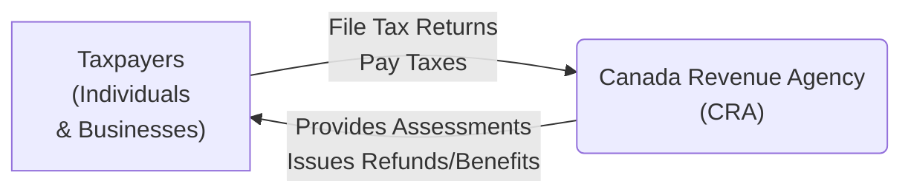
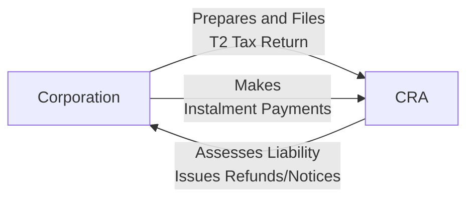

## 24.1 The Canadian Taxation System

Canada’s taxation system is grounded in the self-assessment principle, wherein both individual taxpayers and corporate entities calculate and remit their own taxes to government authorities. This framework is heavily influenced by the federal Income Tax Act (ITA) and administered by the Canada Revenue Agency (CRA). Additionally, each provincial or territorial government levies income tax following its own specific rates and regulations. The result is a multifaceted tax environment that requires diligence, record-keeping, and awareness of ever-evolving regulations.

To effectively navigate this system, one must thoroughly understand how taxable income is determined, which deductions or credits apply, and how best to meet compliance requirements. This section provides a comprehensive look at the Canadian taxation system, detailing its major components, processes, and best practices for individuals and businesses.

---

## Key Components of Canada’s Taxation System

### Federal Income Tax Act and the Role of the CRA

Canada’s tax laws are primarily derived from the federal Income Tax Act (ITA), a central piece of legislation outlining what is taxable, how it is taxed, and which deductions or credits are permissible. The Canada Revenue Agency (CRA) is the primary authority responsible for:

• Administering tax laws for the Government of Canada and for most provinces and territories.  
• Processing tax returns, issuing refunds, and assessing tax liabilities.  
• Enforcing compliance through audits, penalties, and interest charges when necessary.  
• Delivering various social and economic benefits, such as the Canada Child Benefit (CCB) and the GST/HST credit.

Below is a simple diagram showing how the CRA interacts with taxpayers:

### Provincial and Territorial Taxes

Alongside federal income taxes, every province and territory has the authority to levy additional income taxes, typically calculated as a percentage of federal taxable income or through parallel provincial tax brackets. While the mechanics are broadly similar across different regions, specific rates, bracket thresholds, and credits vary. For instance:

• Ontario imposes multiple tax brackets, starting at lower rates for entry-level incomes and rising to higher rates for top earners.  
• Quebec administers its own parallel system with different calculations and remission processes via Revenu Québec.  
• In some provinces, there are surtaxes—additional taxes charged once income exceeds certain thresholds.

---

## Personal Income Taxation

### The Progressive Tax Rate Structure

Canada employs a graduated (progressive) tax system for individuals. Tax rates rise as taxable income increases, ensuring that higher-income earners pay a larger proportion of their income in taxes relative to lower-income individuals. Personal income includes:

• Employment income (salary, wages, commissions, tips).  
• Business or professional income for self-employed individuals.  
• Investment income from dividends, interest, or other returns.  
• Capital gains derived from the sale of investments or property.  
• Rental or royalty income.  

Once total income is determined, deductions (e.g., RRSP contributions, certain child care expenses) are subtracted to arrive at “taxable income.” Then, federal and provincial (or territorial) rates are applied.

Below is a generalized example of how progressive (federal) tax brackets might look (fictional rates for illustrative purposes):

| Tax Bracket (Federal) | Taxable Income Range         | Tax Rate   |
|-----------------------|------------------------------|------------|
| 1st Bracket           | $0 – $50,000                 | 15%        |
| 2nd Bracket           | $50,000 – $100,000           | 20%        |
| 3rd Bracket           | $100,000 – $150,000          | 26%        |
| 4th Bracket           | Over $150,000                | 29%        |

To this, you would add a province’s applicable rates. For instance, in Ontario, you might pay 5.05% on your first bracket of taxable income, rising as income increases. Therefore, an Ontarian taxpayer typically pays a combined rate (federal + provincial) on each income slice.

### Deductions and Credits

Both deductions and credits reduce your tax burden, but they do so differently:

1. **Deductions:** Directly reduce the taxable income amount. Examples include:  
   • Registered Retirement Savings Plan (RRSP) contributions.  
   • Moving expenses (if eligible).  
   • Child care expenses. 

2. **Credits:** Directly reduce the amount of tax owed. Some credits are non-refundable (reducing your tax owing to zero but cannot go negative), while others are refundable (the excess is refunded to you if your credits exceed your owed tax). Examples include:  
   • Basic Personal Amount.  
   • Charitable donation tax credits.  
   • GST/HST credit.  

### Employment Insurance and Pension Contributions

In addition to income taxes, most Canadian workers pay into Employment Insurance (EI) and the Canada Pension Plan (CPP) or Québec Pension Plan (QPP). These are payroll taxes deducted at source by the employer:

• **EI Premiums:** Cover unemployment benefits in the event of job loss.  
• **CPP/QPP Contributions:** Provide retirement, disability, and survivor benefits.

Employers match or exceed certain portions of these contributions, effectively sharing the tax burden. Failure to pay these premiums can trigger additional penalties and interest.

---

## Corporate Taxation

### Types of Business Structures

When considering taxation, businesses in Canada can operate under multiple structures:

1. **Sole Proprietorship:** The individual business owner reports business income and expenses on their personal tax return.  
2. **Partnership:** Each partner reports their share of partnership income or loss on their personal or corporate return (if incorporated).  
3. **Corporation:** A separate legal entity that files its own tax return, pays corporate tax on net income, and distributes after-tax profits to shareholders (e.g., through dividends).

### Corporate Tax Rates

Corporate tax rates vary based on income type and the company’s provincial or territorial jurisdiction. In general:

• **Small Business Deduction (SBD):** Qualified Canadian-controlled private corporations (CCPCs) benefit from reduced tax rates on active business income up to a specified limit.  
• **Investment Income:** Generally taxed at higher rates than active business income to discourage the accumulation of passive investments inside corporations.  

### Compliance and Reporting Obligations

Corporations must file T2 returns annually within six months of their fiscal year-end. For example, if a calendar-year-end is used (December 31), the filing deadline is typically June 30. Companies may also be required to remit monthly or quarterly instalment payments. Failure to submit returns or pay taxes on time results in penalties and accrued interest.

---

## Self-Assessment and Compliance

### Annual Filing Requirements

Under Canada’s self-assessment principle, taxpayers are expected to:

• Calculate total income from all sources.  
• Deduct allowable expenses and claim relevant credits.  
• File by the deadlines: typically April 30 for most individuals, or June 15 for the self-employed (though any balance owing is due by April 30).  

Corporations typically have different deadlines as indicated above.

### Quarterly and Monthly Instalments

Certain individuals with large non-salaried or investment income may have to pay quarterly instalments. Likewise, corporations remitting large tax sums often pay in monthly or quarterly instalments. Failure to submit instalments can lead to instalment interest and penalties.

### Penalties and Interest

Penalties can be significant and are imposed for:

• Late filing.  
• Late payment.  
• Repeated failure to report income.  
• Non-compliance or negligence in reporting.  

CRA calculates daily interest on outstanding tax amounts from the due date to the date of payment. In cases of deliberate tax evasion or fraud, criminal charges and higher penalties may be involved.

---

## Practical Examples and Case Studies

### Individual Tax Scenario

Lily, a web developer in Toronto, earned the following amounts in 2024:  
• $70,000 in employment income.  
• $2,000 from dividends of Canadian companies.  
• $5,000 from freelance software customization projects.

She contributed $5,000 to her RRSP. Her combined federal and provincial tax payable is calculated as follows:

• Step 1: Combine earned income and investment income = $70,000 + $5,000 + (grossed-up dividend value for tax purposes).  
• Step 2: Subtract her RRSP contribution of $5,000.  
• Step 3: Apply progressive tax brackets (federal + Ontario).  
• Step 4: Claim tax credits (e.g., Basic Personal Amount, dividend tax credit).  

After all calculations, Lily remits her balance owing by April 30 of the following year.

### Corporate Tax Scenario

GreenTech Inc., a Canadian-controlled private corporation, earns $400,000 in active business income from consulting services and an additional $20,000 in passive investment income. By claiming small business deductions and applying federal/provincial tax credits, its combined corporate tax rate on active income is effectively reduced, while the passive income portion is taxed at a higher rate. GreenTech files its T2 return within six months of its fiscal year-end and pays monthly instalments to manage its cash flow.

---

## Best Practices and Common Pitfalls

### Best Practices

• **Maintain Accurate Records:** Keep detailed accounting records, receipts, and statements to streamline tax filing and avoid errors.  
• **Stay Current:** Regulatory changes to tax brackets, credits, or rules can impact the amount owed or savings opportunities.  
• **Leverage Tax-Advantaged Accounts:** Maximize RRSP or TFSA (Tax-Free Savings Account) contributions and other registered instruments.  
• **Hire Professionals When Necessary:** Complex tax situations may warrant a tax accountant or lawyer.

### Common Pitfalls

• **Missed Deadlines:** Late filing and payments trigger penalties and interest.  
• **Incorrect Deductions or Credits:** Over-claiming or failing to claim relevant credits inadvertently leads to audits or missed opportunities.  
• **Inadequate Instalments:** If your primary income isn’t from a salary, you must handle instalments diligently or face penalties.

---

## Additional Resources and References

• **CRA Official Website:**  
  Visit the CRA at [https://www.canada.ca/en/revenue-agency.html](https://www.canada.ca/en/revenue-agency.html) for detailed guidance, forms, filing deadlines, and information on credits and deductions.

• **Income Tax Act:**  
  Access the full text of the Act through the Department of Justice [online portal](https://laws-lois.justice.gc.ca/eng/acts/I-3.3/) to understand the legislative framework.

• **Canadian Tax System Resources:**  
  • “The Canadian Tax System” by Robert E. Beam, Stanley N. Laiken, et al., provides in-depth coverage of legal and practical aspects.  
  • Online tax software (e.g., StudioTax, TurboTax) can be great tools for self-filing, offering step-by-step prompts and calculations.

• **Further Study:**  
  • Consider reading up on specialized topics, such as the “tax on split income” rules or advanced corporate reorganization, by consulting professional tax advice or specialized publications.  
  • Explore professional development courses offered through local CPAs or open-source financial communities to stay informed.

---

## Summary and Next Steps

The Canadian taxation system is dynamic, reflecting evolving economic conditions and government revenue requirements. By understanding progressive tax rates, allowable deductions, credits, payroll contributions, and filing obligations, you are well-positioned to comply with and benefit from the available tax provisions.

Whether you are an individual, a sole proprietor, or a corporate entity, diligence, awareness, and timely planning can minimize tax liabilities and sidestep penalties. Continuously track changes to rates, regulations, and filing requirements. If necessary, consult experts or leverage online tools to enhance accuracy and optimize your tax strategies.

As you proceed to learn more about taxation in the broader context of personal finance and investment, consider how Canadian tax incentives (e.g., deductions for RRSP contributions or TFSAs) can align with your financial goals. In the next sections, we will explore how taxation connects with financial planning strategies, helping you integrate efficient tax practices into your overall investment approach.

---

## Test Your Knowledge: Canadian Taxation System Essentials



### Which federal authority is primarily responsible for administering and enforcing income tax laws in Canada?

- [ ] Department of Finance
- [ ] Treasury Board of Canada
- [x] Canada Revenue Agency (CRA)
- [ ] Employment and Social Development Canada

> **Explanation:**( The CRA is responsible for administering the Income Tax Act, processing tax returns, and enforcing compliance.)

### What is the main benefit of the progressive tax rate structure for individual taxpayers?

- [ ] It sets a fixed rate for all taxpayers.
- [x] It ensures that higher-income individuals pay a proportionally higher rate.
- [ ] It reduces administrative complexity.
- [ ] It applies the same tax bracket across all provinces.

> **Explanation:**( A progressive tax system increases the tax rate at higher income levels, aiming for equity among taxpayers.)

### Which of the following statements correctly differentiates deductions and credits?

- [x] Deductions reduce taxable income, while credits directly reduce tax payable.
- [ ] Deductions directly reduce tax payable, while credits reduce taxable income.
- [ ] Credits and deductions are interchangeable.
- [ ] Deductions and credits both reduce net taxable income equally.

> **Explanation:**( Deductions lower your taxable income, whereas credits lower your actual tax liability.)

### What is the purpose of RRSP contributions in reducing an individual’s taxable income?

- [ ] To limit deductions for capital gains.
- [x] To defer tax by reducing current year taxable income until future retirement withdrawal.
- [ ] To shift income to a spouse or child immediately.
- [ ] To eliminate the need for filing a federal tax return.

> **Explanation:**( RRSP contributions directly reduce current taxable income; taxes on these contributions are deferred until withdrawal.)

### For corporations, which type of income is typically taxed at a higher rate than active business income?

- [ ] Gross business revenue
- [x] Investment (or passive) income
- [ ] Charitable income
- [x] Dividend income from Canadian subsidiaries

> **Explanation:**( Passive or investment income in a corporation is generally subject to higher tax rates than active business income, partly to discourage excess accumulation of investments within a corporate entity.)

### When is the usual deadline for most individuals to file their tax returns?

- [x] April 30
- [ ] June 30
- [ ] January 1
- [ ] March 15

> **Explanation:**( Most individuals must file their income tax returns by April 30. Self-employed individuals have until June 15, although any balance owing is still due by April 30.)

### Which of the following is considered a common payroll tax in Canada?

- [ ] Federal financial transaction tax
- [x] Canada Pension Plan (CPP) contributions
- [x] Employment Insurance (EI) premiums
- [ ] Environmental handling fees

> **Explanation:**( CPP/QPP and EI are mandatory payroll deductions shared by employees and employers in Canada.)

### What could happen if a corporation or individual repeatedly fails to report income?

- [ ] No action will be taken as long as basic taxes are paid.
- [ ] They receive additional tax credits.
- [x] Penalties will be applied, and further audits may occur.
- [ ] Only interest on late payment is charged, with no other consequences.

> **Explanation:**( Repeated failure to report income can result in penalties and additional scrutiny from the CRA, including possible audits.)

### Which of the following is a key characteristic of Canada’s federal Income Tax Act?

- [x] It establishes the legal framework for both individual and corporate taxation.
- [ ] It only applies to tax refunds.
- [ ] It applies solely to municipal taxes and services.
- [ ] It prohibits provincial income taxes.

> **Explanation:**( The Income Tax Act is the main federal legislation governing all income tax matters for individuals and corporations.)

### The self-assessment principle means:

- [x] Taxpayers calculate and remit their own taxes to the government.
- [ ] The CRA calculates all taxes due for every taxpayer.
- [ ] Only accountants can file tax returns.
- [ ] Tax obligations are automatically indexed to inflation each year.

> **Explanation:** Under self-assessment, taxpayers are primarily responsible for determining their own incomes, deductions, credits, and final tax payable.



---

