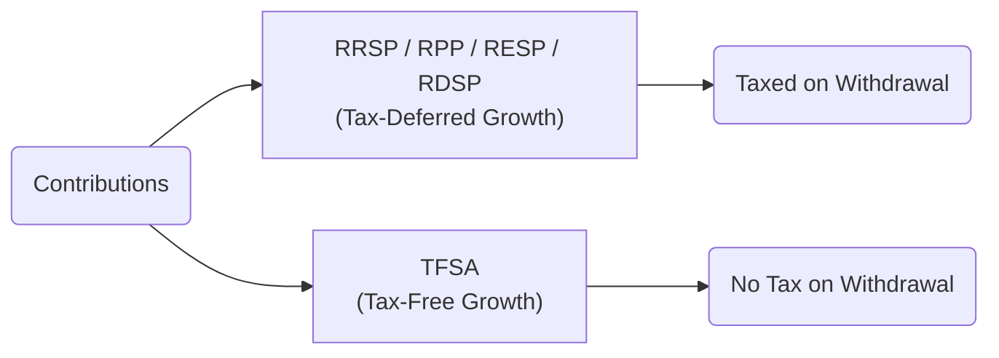

## 24.3 Tax Deferral and Tax-Free Plans

In Section 24.2, we examined capital gains and losses within the Canadian taxation system. In this section, we will discuss how to harness the power of tax-efficient savings and investment vehicles to minimize or defer taxes. Tax deferral and tax-free plans allow individuals to either postpone paying taxes on contributions and any growth until a later date, or avoid paying taxes on any gains altogether (subject to each plan’s rules). These plans can be instrumental tools in financial planning by reducing overall taxes owed and improving the total rate of return on investments.

Through their structure—offering tax deductions (in some cases), government grants, or tax-free compounding—these plans incentivize savings for retirement, education, disability support, or even general purposes. Canadians can thereby grow their wealth more efficiently, while also fostering a disciplined approach to saving and investing. This section covers the main tax-efficient savings vehicles:

• Registered Retirement Savings Plans (RRSPs)  
• Registered Pension Plans (RPPs)  
• Tax-Free Savings Accounts (TFSAs)  
• Registered Education Savings Plans (RESPs)  
• Registered Disability Savings Plans (RDSPs)  

Below, we outline the purpose, mechanics, benefits, and potential pitfalls of each plan, supplemented by illustrative case studies to ground these concepts in real-world Canadian financial scenarios.

---

## Overview of Tax-Deferred vs. Tax-Free Growth

Before diving into each plan, it is important to understand the two primary tax-advantaged structures:

1. Tax-Deferred Growth:  
   • Contributions often reduce current taxable income.  
   • Taxes on contributions and investment earnings are postponed until withdrawal.  
   • Common examples include RRSPs, RPPs, RESPs, and RDSPs (although each has distinct rules).  

2. Tax-Free Growth:  
   • Contributions do not reduce current taxable income.  
   • Earnings within the account are never taxed; withdrawals are similarly tax-free.  
   • The central example in Canada is the Tax-Free Savings Account (TFSA).  

The flow of contributions, growth, and eventual withdrawals can be visualized in the following diagram:

---

## Registered Retirement Savings Plan (RRSP)

### Purpose and Basic Mechanics
An RRSP is a registered plan designed to encourage Canadians to save for retirement by offering immediate tax savings. Individuals can contribute up to a specific annual limit—calculated based on earned income, up to a maximum dollar amount set by the Canada Revenue Agency (CRA). Any unused RRSP contribution room carries forward indefinitely, allowing flexibility in contribution timing.

• Contributions: Deductible from taxable income, lowering income tax for the year of contribution.  
• Investment Growth: Tax-deferred. Earnings within the plan are not taxed until funds are withdrawn.  
• Withdrawals: Fully taxable as income in the year withdrawn.  

Because withdrawals from an RRSP are added to an individual’s taxable income, it is typically more advantageous to withdraw when in a lower tax bracket (often during retirement).

### Example
Suppose a 35-year-old professional named Audrey contributes C$10,000 to her RRSP annually. Her marginal tax rate is 40%. By contributing to her RRSP, she might reduce her income taxes by up to C$4,000 in the contribution year. Meanwhile, the C$10,000 has the potential to grow tax-deferred inside her RRSP. Over many years, this can significantly increase her retirement nest egg compared to saving in a non-registered account where yearly taxes on dividends, interest, and capital gains would reduce annual returns.

### Best Practices and Pitfalls
• Best Practices:
  - Maximize annual contributions if cash flow allows, particularly if in a high tax bracket.  
  - Coordinate spousal RRSP contributions to optimize family income-splitting in retirement.  
  - Consider transferring corporate earnings from an incorporated business into an RRSP if drawn as salary.  

• Common Pitfalls:
  - Withdrawing early may trigger higher taxes and loss of contribution room.  
  - Individuals in lower tax brackets might benefit more from other registered plans (e.g., TFSA) before maximizing RRSP contributions, depending on their unique financial situation.  

For precise annual contribution limits and other RRSP rules, refer to the [CRA’s RRSP web pages](https://www.canada.ca/en/services/taxes.html).

---

## Registered Pension Plan (RPP)

### Role of RPPs
An RPP is an employer-sponsored retirement savings plan that aims to ensure employees have a stable income stream in retirement. RPPs can be either defined benefit (DB) plans—where the monthly pension is predetermined—or defined contribution (DC) plans—where the employer and employee contribute a set amount, but the retirement income depends on the investment performance of those contributions.

### Tax Deferral Advantages
Like an RRSP, an RPP offers tax deductions on contributions. Employees often see RPP contributions deducted directly from their paycheques. Employer contributions may or may not show on pay stubs but form part of the overall employer compensation package. The growth in an RPP is tax-deferred until retirement. Upon retiring, RPP beneficiaries typically receive either a lump-sum payment or periodic pension payments, which are taxed as income.

### Example
TD or RBC employees who participate in a DB or DC pension plan automatically benefit from tax deferral on employer and personal contributions. Their pension grows without annual taxes on investment returns. When they retire, they will pay taxes on monthly pension payments, but likely at a lower rate due to reduced income in retirement.

### Best Practices and Pitfalls
• Best Practices:
  - Verify vesting periods and the type of plan offered (DB vs. DC).  
  - Understand the portability options if you change employers (e.g., transferring to a Locked-In Retirement Account, or LIRA).  

• Common Pitfalls:
  - Failing to account for pension adjustments may inadvertently reduce available RRSP contribution room.  
  - Over-reliance on a single plan if not coordinating with other savings mechanisms (e.g., TFSAs).  

Further details can be found in corporate human resources documents and on the [CRA’s “RPP” pages](https://www.canada.ca/en/services/taxes.html).

---

## Tax-Free Savings Account (TFSA)

### Why TFSAs?
Introduced in 2009, TFSAs were designed to help Canadians save and invest without incurring taxes on investment earnings or withdrawals. Unlike RRSPs, TFSA contributions are not deductible from income taxes. However, all capital gains, interest, dividends, or distributions earned inside a TFSA are tax-free, and withdrawals are also not taxed.

### Key Features
• Annual Contribution Limits: Set by the federal government every year; unused room accumulates indefinitely.  
• Contributions: Not tax-deductible.  
• Growth: Tax-free.  
• Withdrawals: Tax-free, and withdrawals are added back to your contribution room in the following calendar year.  

This flexibility makes TFSAs ideal not only for long-term savings (e.g., retirement or major purchases) but also for emergency funds or medium-term goals.

### Example
Mario, aged 25, wants to start saving for a future home purchase. He contributes C$6,500 to his TFSA every January (assuming that’s the annual limit for the year). Over time, dividends and capital gains earned within his TFSA compound tax-free. If he sells some stocks for a profit and withdraws the gains, he owes no tax. This approach can accelerate savings for a down payment while avoiding tax erosion of his investment returns.

### Best Practices and Pitfalls
• Best Practices:
  - Maintain a regular contribution schedule to maximize annual limits.  
  - Use TFSAs for emergency funds due to the ease and tax-efficiency of withdrawals.  
  - Evaluate whether to hold income-generating assets (like high-yield bonds or dividend stocks) inside a TFSA to eliminate taxes on investment income.  

• Common Pitfalls:
  - Over-contributing can result in penalty taxes, so track available room carefully.  
  - Misunderstanding recontribution rules regarding withdrawn amounts.  

For the latest contribution limits and TFSA regulations, consult the [CRA’s TFSA resource](https://www.canada.ca/en/services/taxes.html) and the [Financial Consumer Agency of Canada (FCAC)](https://www.canada.ca/en/financial-consumer-agency.html).

---

## Registered Education Savings Plan (RESP)

### Purpose
RESPs encourage families to save for a child’s post-secondary education. While contributions are not tax-deductible, the plan’s growth is tax-deferred. As an added bonus, the government supports education savings through matching grants, such as the Canada Education Savings Grant (CESG), which can significantly boost contributions.

### How It Works
• Subscriber Contributions: Not tax-deductible, but grow tax-deferred.  
• Government Grants: CESG matches 20% of contributions up to a specific limit each year, subject to lifetime limits. Low-income families may also be eligible for additional grants.  
• Withdrawals: The original contributions can be withdrawn tax-free by the subscriber. The growth and government grants are taxed in the hands of the student beneficiary. Because most students have low or no income during their studies, their tax liability is often minimal.

### Example
Samantha sets up an RESP for her newborn daughter at RBC. Each year, Samantha contributes C$2,500, which qualifies for the maximum CESG of C$500 (20%). Over 18 years, the combined effect of investments compounding tax-deferred and additional government grants can significantly reduce the burden of post-secondary expenses.

### Best Practices and Pitfalls
• Best Practices:
  - Start early to maximize compounding and annual government grant eligibility.  
  - For multiple children, consider a Family RESP account so any unused grants or growth can be allocated to siblings.  

• Common Pitfalls:
  - Over-contribution may cause penalties.  
  - If the child does not pursue post-secondary education, careful planning is needed to manage grant repayments or transfer funds to an RRSP (where possible).  

Details on contribution limits and grant rules are available on the [CRA’s RESP page](https://www.canada.ca/en/services/taxes.html) and through resources offered by the [Financial Consumer Agency of Canada](https://www.canada.ca/en/financial-consumer-agency.html).

---

## Registered Disability Savings Plan (RDSP)

### Supporting Canadians with Disabilities
An RDSP is designed specifically for individuals with disabilities, offering them and their families a tax-deferred savings vehicle. Qualifying Canadians with disabilities can benefit from government matching grants and bonds, greatly enhancing their ability to save for long-term needs.

### Core Features
• Contributions: Not tax-deductible, but grow on a tax-deferred basis.  
• Grants and Bonds: The federal government may match contributions through Canada Disability Savings Grants. Low-income individuals might also receive Canada Disability Savings Bonds without needing to contribute.  
• Withdrawals: At withdrawal, only the growth portion and grants/bonds are taxable in the beneficiary’s hands. The original contributions can be withdrawn tax-free.  

### Example
Ryan, who has a disability and meets the eligibility criteria, opens an RDSP. His parents contribute C$1,500 annually. In many cases, the federal government will match a portion of this contribution through grants (depending on family income). These grants plus any portfolio gains remain deferred until Ryan withdraws the funds in the future, potentially during retirement.

### Best Practices and Pitfalls
• Best Practices:
  - Maximize contributions early to attract the highest government grant matching.  
  - Maintain updated Disability Tax Credit (DTC) status to ensure RDSP eligibility.  

• Common Pitfalls:
  - Withdrawing before the plan matures may also require repayment of grants and bonds.  
  - Plan holders must be aware of minimum and maximum withdrawal thresholds once mandatory withdrawal periods begin.  

Full details can be found at the [CRA’s RDSP section](https://www.canada.ca/en/services/taxes.html).

---

## Practical Considerations When Choosing a Plan

Choosing between a tax-deferred or tax-free plan (or combination of both) involves assessing personal financial goals, risk tolerance, and current vs. future income levels. Below are several considerations:

1. Income and Tax Bracket:  
   • High-income earners often benefit from RRSP contributions because of larger immediate tax savings.  
   • Lower-income earners might value the complete flexibility and tax-free nature of a TFSA.

2. Time Horizon:  
   • RRSPs, RPPs, RESPs, and RDSPs often focus on longer-term horizons (retirement, education, or disability support).  
   • TFSAs can be used both for short-term and long-term objectives.

3. Access to Savings:  
   • TFSAs allow withdrawals and recontributions with fewer restrictions.  
   • RRSP withdrawals generally trigger taxes (except for specific programs like the Home Buyers’ Plan or Lifelong Learning Plan).

4. Government Grants and Bonds:  
   • RESPs and RDSPs can leverage significant government incentives, making them powerful savings tools for education and disability purposes.

5. Employer Contributions:  
   • RPPs can boost retirement savings without requiring hands-on investment decisions.  

---

## Actionable Insights

Below are some practical steps and checks that Canadian investors can use to optimize their registered plans:

1. Calculate an “Optimal” RRSP vs. TFSA Split:  
   • Use open-source financial calculators or the [FCAC’s online tools](https://www.canada.ca/en/financial-consumer-agency.html) to simulate different scenarios.  

2. Track Your Contribution Room:  
   • Check your RRSP and TFSA room through the CRA’s My Account service ([CRA website](https://www.canada.ca/en/services/taxes.html)).  

3. Plan for Special Withdrawals:  
   • The Home Buyers’ Plan (HBP) and Lifelong Learning Plan (LLP) allow certain RRSP withdrawals without immediate taxation, subject to repayment conditions.  

4. Monitor Regulatory Updates:  
   • Stay informed on legislative or policy changes that affect RRSP limits, TFSA limits, and government grants (CESG, RDSP grants).  

5. Explore Additional Learning:  
   • “Retirement Income for Life” by Frederick Vettese offers deep insights into structuring retirement using RRSPs, pensions, and annuities.  

---

## Summary

Tax deferral and tax-free plans represent critical opportunities for Canadians to elevate their financial well-being. By allowing contributions, investments, and withdrawals under preferential tax treatment, these registered plans foster robust saving habits and long-term growth. RRSPs and RPPs reduce taxable income up-front, with withdrawals taxed later; TFSAs feature fully tax-free growth and withdrawals; RESPs help parents fund their children’s education with government grants; and RDSPs empower individuals with disabilities to accumulate wealth more effectively and with substantial government support.

When used wisely, these plans not only provide financial security but also encourage responsible investment practices and improve overall net returns. By understanding the distinct features, eligibility requirements, and regulations for each plan, Canadians can more effectively tailor their savings strategies to fit their lives—be it planning for retirement, their children’s education, or a comfortable financial future for someone with disabilities.

---

## Test Your Knowledge: Canadian Tax-Deferred & Tax-Free Plans Quiz



### Which of the following is a primary benefit of an RRSP?

- [ ] Contributions are not tax-deductible.  
- [x] Contributions are tax-deductible, and investment growth is tax-deferred.  
- [ ] Contributions and withdrawals are tax-free.  
- [ ] Withdrawals are never taxed if used for education.

> **Explanation:**( RRSP contributions reduce your taxable income for the year of contribution, and all earnings are tax-deferred until withdrawal.)

### What is a key feature of a Tax-Free Savings Account (TFSA)?

- [ ] Contributions reduce current taxable income.  
- [x] Withdrawals (including investment gains) are completely tax-free.  
- [ ] You cannot recover contribution room once you withdraw.  
- [ ] There is no annual contribution limit.

> **Explanation:**( In a TFSA, contributions are not tax-deductible, but any growth or withdrawals are tax-free. Contribution room for withdrawn amounts is reinstated the following year.)

### When you withdraw funds from an RRSP before retirement, what generally happens?

- [ ] They are tax-free if you reinvest them.  
- [ ] They remain tax-sheltered until the next tax year.  
- [x] They are added to your taxable income in the year of withdrawal.  
- [ ] They are not taxed if used for any personal expenses.

> **Explanation:**( Withdrawing from an RRSP before retirement triggers immediate taxation, adding the withdrawn amount to that year’s income.)

### Which plan is specifically designed to assist with savings for a beneficiary’s post-secondary education?

- [ ] RRSP  
- [x] RESP  
- [ ] TFSA  
- [ ] RDSP

> **Explanation:**( The Registered Education Savings Plan (RESP) is expressly for funding education, often supplemented by government grants like the CESG.)

### Why might a high-income earner prioritize an RRSP over a TFSA?

- [x] The immediate tax deduction from RRSP contributions can be substantial.  
- [ ] TFSAs have higher contribution limits.  
- [x] RRSP has both an immediate tax benefit and tax-deferred growth.  
- [ ] TFSA growth is taxable for high-income earners.

> **Explanation:**( High-income earners benefit significantly since RRSP contributions reduce taxable income and allow for deferred taxation.)

### In a Registered Pension Plan (RPP), who typically contributes?

- [x] Both employer and employee may contribute, and the contributions are often tax-deferred.  
- [ ] Only the employee contributes, and it is always tax-free.  
- [ ] Only the employer contributes, and withdrawals are tax-free.  
- [ ] The government funds all contributions.

> **Explanation:**( Many RPPs are funded by both the employer and employee. Contributions grow tax-deferred and are taxable when withdrawn.)

### What is a main difference between a Defined Benefit (DB) plan and a Defined Contribution (DC) plan within an RPP?

- [x] A DB plan promises a specific pension, whereas a DC plan’s payout depends on investment returns.  
- [ ] DC plans guarantee a pension based on years of service, while DB plans do not.  
- [x] DB plans shift investment risk to the employer, while DC plans shift risk to the employee.  
- [ ] They are essentially the same in structure.

> **Explanation:**( DB plans provide a predetermined payout, and the employer shoulders more investment and longevity risk, while DC plans depend on the contributions and performance of the underlying investments.)

### Why does an RESP offer potential tax advantages for a student beneficiary?

- [ ] The plan’s earnings are taxed at the parent’s rate.  
- [x] Withdrawals from the grant and growth portions are taxed in the student’s hands, who often has low or no income.  
- [ ] There are no lifetime limits for contributions, and it is all tax-free.  
- [ ] Over-contributions are not penalized if the beneficiary attends school within five years.

> **Explanation:**( Since the student’s income is usually low while in school, the tax liability on RESP earnings and grants is often minimal.)

### Which registered plan is tailored to support individuals with disabilities?

- [ ] RESP  
- [ ] RRSP  
- [ ] TFSA  
- [x] RDSP

> **Explanation:**( A Registered Disability Savings Plan (RDSP) offers grants and bonds for long-term savings, aimed at disability support needs.)

### RRSP contributions are generally most beneficial if made during high-income years because the tax savings are higher.

- [x] True  
- [ ] False  

> **Explanation:** Contributing to an RRSP when you are in a high tax bracket enables you to claim a larger deduction, thereby increasing immediate tax savings.



---

## For Additional Practice and Deeper Preparation

**Elevate your exam readiness with our comprehensive app, "Securities CA: Mock Exams," designed to challenge and refine your skills.**

* **Master Challenging Questions:** Dive into expertly crafted sample exam questions that go beyond standard references.
* **Scenario-Driven Learning:** Experience scenario-driven case questions and in-depth solutions to build practical expertise.
* **Sharpen Exam Strategies:** Build confidence with step-by-step explanations designed to refine your exam-day tactics.
* **Gain Real-World Insights:** Acquire practical tips and detailed rationales that demystify complex concepts.
* **CIRO and CSI Alignment:** Stay current with CIRO guidelines and CSI’s exam structure, with questions intentionally more challenging than the actual exam.

**Download the App Today:**

> Note: While these courses are specifically crafted to align with the CSC® exams outlines, they are independently developed and not endorsed by CSI or CIRO.
