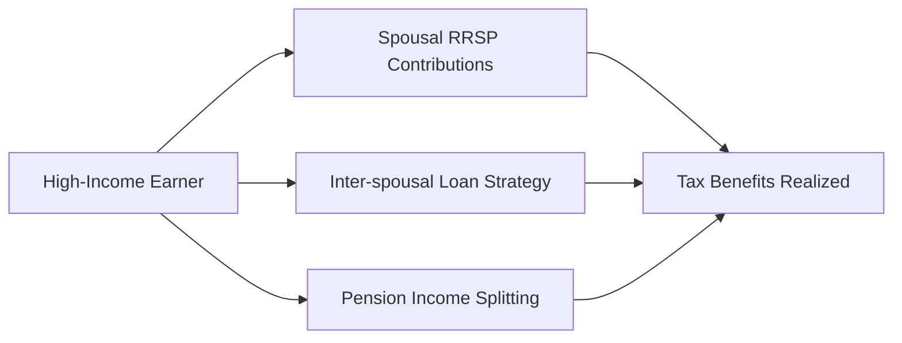

## 24.4 Tax Planning Strategies

Effective tax planning strategies play a crucial role in helping individuals, corporations, and trusts minimize tax exposure and optimize after-tax returns. In Canada, these strategies must always align with the laws and regulations outlined by the Canada Revenue Agency (CRA) and provincial/territorial tax authorities. At their core, tax planning strategies aim to reduce the amount of taxable income, take advantage of preferential tax rates or credits, and strategically schedule or split income to lower overall tax liability.

In this section, we cover some of the most commonly employed tax planning strategies, outline step-by-step guidance on applying them, and reference official Canadian regulations and resources. We also explore practical case studies and best practices, ensuring you have a strong foundation for effective tax planning within the Canadian financial landscape.

--------------------------------------------------------------------------------
### Table of Contents
1. Introduction to Tax Planning  
2. Income Splitting: Rationale and Methods  
3. Tax-Loss Harvesting  
4. Incorporation as a Tax Strategy  
5. Estate Planning Essentials  
6. Staying Current with Tax Legislation  
7. Practical Examples and Real-World Scenarios  
8. Diagrams and Tables  
9. Best Practices, Pitfalls, and Actionable Insights  
10. Summary of Key Points  

--------------------------------------------------------------------------------

## Introduction to Tax Planning

Tax planning involves making strategic decisions about how to structure your financial affairs—such as your investments, cash flow, and estate—to minimize tax liability and maximize after-tax returns. Sound tax planning should take into account:

• Short-term vs. long-term financial goals  
• Income levels and marginal rates  
• Risk tolerance  
• Retirement and estate considerations  
• Potential changes in tax laws  

Although tax strategies can vary significantly based on personal circumstances, aligning your strategy to the current Canadian tax regime is a key part of any successful approach. Financial advisors, tax professionals, and even specialized software solutions can assist in designing a plan that meets both regulatory requirements and strategic considerations.

--------------------------------------------------------------------------------

## Income Splitting: Rationale and Methods

Income splitting refers to the process of dividing or redistributing income between family members to reduce overall taxes by taking advantage of differences in marginal tax rates. When done properly and in line with CRA guidelines, this strategy can provide material tax savings for the family unit as a whole.

### Common Income Splitting Methods

1. **Spousal RRSPs:**  
   Contributions made by a higher-income spouse to a Spousal Registered Retirement Savings Plan (RRSP) can help shift future income to the lower-income spouse. This strategy can result in overall lower tax during retirement, as withdrawals are taxed in the hands of the lower-income spouse.

2. **Inter-Spousal Loans:**  
   A higher-income spouse can loan funds to a lower-income spouse for investment at the prescribed CRA interest rate. Properly structured, the investment income (or gains) would then be taxed at the lower spouse’s marginal rate. Careful documentation and adherence to the prescribed rate are essential to avoid attribution rules.

3. **Pension Income Splitting:**  
   In many cases, retirees can split eligible pension income with their spouse or common-law partner. This lowers the tax liability if one partner’s pension income is taxed at a higher marginal rate than that of the other partner.

Below is a simple flowchart summarizing these methods:

### Key Considerations

• **Attribution Rules**: The CRA’s attribution rules can cause investment income or capital gains to revert to the original higher-income spouse if not properly structured.  
• **Documentation**: Properly documenting loans and ensuring interest payments at the prescribed rate is crucial.  
• **Changing Life Circumstances**: Divorce, separation, or changing retirement plans can affect income splitting strategies.

--------------------------------------------------------------------------------

## Tax-Loss Harvesting

Tax-loss harvesting allows investors to sell an investment at a loss to offset realized capital gains. This strategy can reduce the amount of tax owed on capital gains during the current tax year or future years.

### How It Works

1. **Identify Underperforming Assets:** Look for investments in your taxable accounts that have declined in value below their adjusted cost base (ACB).  
2. **Sell to Realize Losses:** Sell the asset, thereby crystallizing the capital loss.  
3. **Offset Capital Gains:** The realized loss can be applied against realized capital gains in the current year, the three previous years, or carried forward indefinitely, subject to CRA rules.  

By reducing your net taxable capital gains, you can lower your overall tax owing. However, watch out for the “superficial loss” rule, which disallows a capital loss if you (or an affiliated person) repurchase an identical asset within 30 calendar days before or after the sale.

### Timing and Year-End Strategy

Investors often review taxable investment accounts near the end of the calendar year to identify opportunities to trigger and harvest losses. Timing can be key—realizing losses before year-end ensures they can offset that year’s gains, thereby reducing immediate tax liability.

--------------------------------------------------------------------------------

## Incorporation as a Tax Strategy

Entrepreneurs, professionals (e.g., doctors, lawyers, consultants), and business owners may choose to incorporate primarily to access tax rates that can be more favorable than personal marginal rates. Canada’s small business tax rate is typically lower than personal income tax rates at higher income levels.

### Potential Advantages

• **Tax Deferral:** Earnings retained in the corporation are taxed at the lower corporate rate, leaving more capital to grow within the corporation.  
• **Income Splitting Opportunities:** Salaries or dividends can be paid to family members if they are shareholders or employees, subject to strict regulations.  
• **Creditor Protection:** In certain cases, incorporating can isolate business liabilities from personal assets.  

### Additional Complexities

• **Additional Filing Requirements:** Corps must file corporate tax returns (T2) and maintain a separate set of books, leading to extra accounting costs.  
• **Personal Services Business (PSB) Rules:** If the CRA deems the corporation to be a PSB (essentially operating like an employee for a single client), it may trigger higher tax rates and reduce tax advantages.  
• **Shareholder Remuneration Strategy:** Balancing salary vs. dividends is complex and should be tailored to individual circumstances.

--------------------------------------------------------------------------------

## Estate Planning Essentials

Estate planning is the process of arranging for the management and disposal of a person’s estate during their life and after death. Proper estate planning can minimize taxes, avoid legal complications, and ensure a smooth transfer of wealth.

### Tools and Documents

• **Wills:** A will outlines how assets are to be distributed. Without a will, provincial intestacy laws apply, potentially causing higher taxes or distributions contrary to your wishes.  
• **Trusts:** Different types of trusts (e.g., family trusts or testamentary trusts) can reduce or defer taxes and maintain control over how assets are distributed.  
• **Beneficiary Designations:** RRSPs, RRIFs, TFSAs, and life insurance policies often allow direct beneficiary designations, bypassing probate and expediting transfers.  

### Tax Considerations

• **Deemed Disposition on Death:** Generally, capital property is deemed to be disposed of at fair market value upon death, which can trigger capital gains. Planning strategies like spousal rollovers can defer this event.  
• **Joint Ownership:** Holding property jointly with right of survivorship may avoid probate fees, but one should evaluate potential legal and familial implications.  
• **Use of Trusts:** Testamentary and intervivos trusts can provide income-splitting opportunities and professional asset management for minor children or dependents.

--------------------------------------------------------------------------------

## Staying Current with Tax Legislation

Tax rules and regulations can change significantly from year to year. Federal and provincial budgets often introduce modifications to tax credits, deductions, limitations, or rates. By staying informed, you can adjust your tax strategies accordingly:

• **Federal Budget Announcements:** Monitor annual federal budgets for changes to personal tax credits, corporate tax rates, and other measures.  
• **Provincial/Territorial Budgets:** Provincial or territorial budgets can introduce changes to OST (Ontario Surtax), PST (Provincial Sales Tax), or specialized credits for certain professionals or industries.  
• **CRA Updates:** The CRA website and its various guides (like Guide T4011 for deceased persons) are essential resources for up-to-date information on administrative policies and deadlines.

--------------------------------------------------------------------------------

## Practical Examples and Real-World Scenarios

### Canadian Pension Fund Strategy

Large Canadian pension funds (e.g., CPP Investments or Ontario Teachers’ Pension Plan) regularly employ tax optimization strategies by structuring their portfolios to balance capital gains with capital losses, minimize withholding taxes in foreign investments, and take advantage of double taxation treaties. While on a different scale, the underlying principles—reducing taxable events and optimizing the timing of gains—mirror individual tax planning.

### Case Study: RBC and TD Bank

Major Canadian banks like RBC and TD offer wealth management services that frequently include tax planning advice. An RBC client with a high net worth might receive a customized strategy that blends RRSPs, TFSAs, corporate structures, and trusts. Meanwhile, a TD wealth management client may prioritize philanthropic giving and utilize donation tax credits. Both scenarios underscore the importance of aligning tax strategies with individual goals and values.

--------------------------------------------------------------------------------

## Diagrams and Tables

Below is a table summarizing various tax planning strategies, their potential benefits, and important considerations.

| Strategy              | Key Benefits                                           | Key Considerations                                           |
|-----------------------|--------------------------------------------------------|--------------------------------------------------------------|
| Income Splitting      | Lower overall family tax liability, improved cash flow| Must adhere to attribution rules; documentation is crucial   |
| Tax-Loss Harvesting   | Offsets capital gains, reduces net taxable income      | Watch for superficial loss rules; timing is pivotal          |
| Incorporation         | Possible deferral at lower corp. rates, income splitting| Additional filing costs, PSB rules apply                     |
| Estate Planning       | Minimizes taxes on death, ensures asset distribution  | Requires accurate will/trust, knowledge of probate fees      |

--------------------------------------------------------------------------------

## Best Practices, Pitfalls, and Actionable Insights

### Best Practices

• **Engage Professional Advice:** Tax professionals (accountants, tax lawyers, or financial planners) ensure that strategies remain compliant and optimal.  
• **Maintain Updated Records:** Accurate record-keeping of transactions, spousal loans, and trust documents is essential for a valid tax planning approach.  
• **Leverage Registered Accounts:** Maximize RRSP/TFSA contributions, as these accounts offer tax-deferred or tax-free growth.  

### Pitfalls to Avoid

• **Misunderstanding Attribution Rules:** Improperly structured income-splitting arrangements can nullify any benefits if the CRA attributes income back to the initiating spouse.  
• **Ignoring Changing Circumstances:** Failing to revisit your plan after life events (e.g., the birth of a child, divorce) can result in suboptimal outcomes.  
• **Overlooking Estate Documents:** Neglecting wills or trust updates can lead to unintended tax consequences and drawn-out legal proceedings.

### Actionable Insights

• **Model Different Scenarios:** Use open-source financial planning tools or spreadsheet models to compare outcomes under various assumptions (e.g., changes in marginal tax rates or investment returns).  
• **Stay Educated:** Regularly visit official resources like the Canadian Tax Foundation (https://www.ctf.ca) or the CRA website for legislative changes.  
• **Year-End Reviews:** Conduct annual reviews of your portfolio for harvesting losses, making spousal RRSP contributions, or rebalancing before key deadlines.

--------------------------------------------------------------------------------

## Summary of Key Points

1. **Tax strategies** must be tailored to an individual’s or business’s unique goals, risk tolerance, and income profile.  
2. **Income splitting** can create significant savings when structured properly. Remember to follow CRA guidelines to avoid attribution pitfalls.  
3. **Tax-loss harvesting** strategically uses realized losses to offset capital gains, with careful attention to timing and superficial loss rules.  
4. **Incorporation** may yield tax deferral and income-splitting benefits but requires compliance with more stringent administrative and regulatory obligations.  
5. **Estate planning** ensures assets pass efficiently and with minimal taxation. Wills, trusts, and beneficiary designations are core tools in managing estate taxes.  
6. **Staying informed** about current budgets, CRA updates, and legislative changes is essential for maintaining an effective, compliant tax strategy.

By diligently applying the concepts of tax minimization, timing of income, and strategic investment decisions, Canadians can ensure that their wealth grows efficiently while remaining compliant with federal and provincial regulations.

--------------------------------------------------------------------------------

## Tax Planning Strategies Quiz



### Which of the following statements best describes income splitting?

- [ ] It is the act of combining multiple incomes into a single, higher tax bracket.
- [x] It is shifting taxable income among family members to reduce total tax liability.
- [ ] It is borrowing funds from one’s investment account to start a business.
- [ ] It is exclusively used for estate planning purposes.

> **Explanation:** Income splitting involves transferring or attributing income from a higher-income family member to a lower-income family member, thereby reducing overall family tax liability.

### Which strategy involves selling an investment at a loss to offset capital gains?

- [ ] Income splitting
- [ ] Incorporation
- [x] Tax-loss harvesting
- [ ] Estate planning

> **Explanation:** Tax-loss harvesting is the process by which investors sell assets at a loss to offset realized capital gains, reducing the net capital gains subject to tax.

### What is a critical factor to consider when using inter-spousal loans for income splitting?

- [ ] The share prices of foreign stocks.
- [x] The prescribed interest rate set by the CRA.
- [ ] The prime rate for mortgages.
- [ ] The discount rate set by the Bank of Canada.

> **Explanation:** The CRA’s prescribed interest rate must be charged for the loan to be considered valid and to avoid attribution rules.

### Which of the following is NOT a potential benefit of incorporating a business?

- [ ] Tax deferral from lower corporate tax rates.
- [ ] Possibility of income splitting through dividends.
- [ ] Creditor protection in certain situations.
- [x] Exemption from filing annual tax returns.

> **Explanation:** Corporations must file a corporate (T2) tax return annually, so incorporation does not exempt a business from filing obligations.

### Which document is fundamental to ensuring assets are distributed according to one’s wishes after death?

- [ ] A corporate annual report
- [ ] A CRA T2 return
- [x] A legally valid will
- [ ] An intercompany loan agreement

> **Explanation:** A will is the principal document outlining asset distribution post-death and minimizing potential tax consequences through careful planning.

### What do the CRA’s attribution rules aim to prevent?

- [x] The shifting of income to lower-tax-rate family members without proper legal mechanisms.
- [ ] The accumulation of foreign dividends in an RRSP.
- [ ] The deferral of capital gains for foreign-stock investors.
- [ ] The inflation of capital losses beyond the statutory maximum.

> **Explanation:** Attribution rules typically require income or gains to be attributed back to the original owner if transfers are not properly arranged, thereby preventing abusive income-splitting.

### Which strategy often involves reviewing a portfolio near the year-end to realize investment losses?

- [ ] Contributing exclusively to TFSAs
- [x] Tax-loss harvesting
- [ ] Spousal RRSP contributions
- [x] Income splitting with pension income

> **Explanation:** Tax-loss harvesting involves intentionally realizing losses near year-end. Pension income splitting also often occurs at year-end as individuals finalize taxable incomes.

### When might corporate income be subject to a “Personal Services Business” penalty tax rate?

- [x] If the corporation primarily provides services similar to an employee relationship for a single client.
- [ ] If the corporation invests heavily in preferred shares.
- [ ] If the retention of earnings in the corporation falls below $100,000.
- [ ] If the corporation is owned by foreign shareholders.

> **Explanation:** The CRA may classify a small, closely held corporation as a PSB if it functions like an employee for a single client, triggering higher tax rates.

### Which of the following is a direct way to transfer investment accounts or insurance proceeds without going through probate?

- [x] Naming beneficiaries on RRSPs, RRIFs, TFSAs, and insurance policies.
- [ ] Holding all investment property in a sole proprietorship.
- [ ] Incorporating a single-person business and paying all returns as dividends.
- [ ] Filing a corporate T2 return every quarter.

> **Explanation:** Naming beneficiaries directly on registered accounts and insurance policies allows those assets to bypass probate, resulting in faster distribution and reduced fees.

### True or False: Tax planning should be a one-time event rather than an ongoing process.

- [x] True
- [ ] False

> **Explanation:** This statement is false. Tax planning should be an ongoing process because life events and changing legislation can significantly impact an individual’s financial situation.



--------------------------------------------------------------------------------

## For Additional Practice and Deeper Preparation

**Elevate your exam readiness with our comprehensive app, "Securities CA: Mock Exams," designed to challenge and refine your skills.**

* **Master Challenging Questions:** Dive into expertly crafted sample exam questions that go beyond standard references.
* **Scenario-Driven Learning:** Experience scenario-driven case questions and in-depth solutions to build practical expertise.
* **Sharpen Exam Strategies:** Build confidence with step-by-step explanations designed to refine your exam-day tactics.
* **Gain Real-World Insights:** Acquire practical tips and detailed rationales that demystify complex concepts.
* **CIRO and CSI Alignment:** Stay current with CIRO guidelines and CSI’s exam structure, with questions intentionally more challenging than the actual exam.

**Download the App Today:**

> Note: While these courses are specifically crafted to align with the CSC® exams outlines, they are independently developed and not endorsed by CSI or CIRO.

--------------------------------------------------------------------------------

By understanding and applying these tax planning strategies—along with continuous monitoring of legislative changes and professional guidance—investors and financial professionals can optimize their tax obligations, preserve wealth, and achieve financial objectives within the Canadian regulatory framework.
