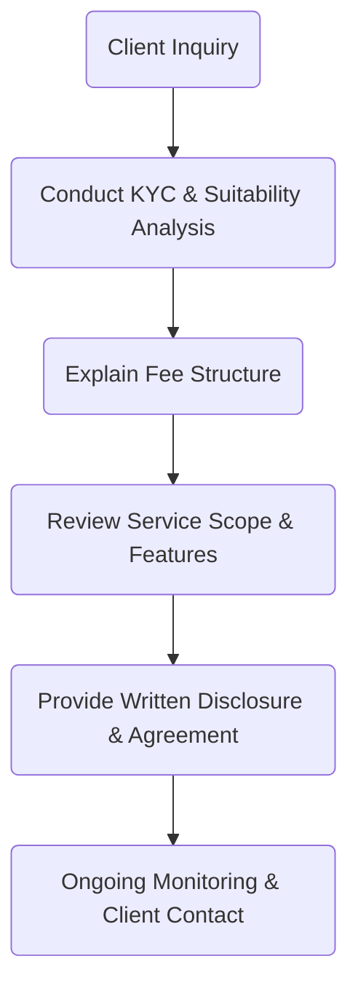

## 25.1 Overview of Fee-Based Accounts

Fee-based accounts have gained significant traction in the Canadian investment landscape over the past decade. Many advisors and brokerage firms are shifting from traditional commission-based structures to a model where clients pay a recurring fee that’s often tied to the total value of assets under management (AUM). This trend can be attributed to factors such as improved cost transparency, better alignment of advisor incentives with client objectives, and increased regulatory emphasis on client-focused practices. Whether you are an investor seeking a predictable expense structure or an industry professional aiming to implement this model, it is crucial to understand the fundamental components of fee-based accounts—how they work, their benefits, and the potential challenges they pose.

---

## Defining Fee-Based Accounts

In a traditional commission-based brokerage arrangement, clients typically pay a fee or commission each time they conduct a trade. By contrast, fee-based accounts aggregate the cost of advisory services and trading into a single or recurring fee. This fee may be calculated in several ways:

1. A percentage of assets under management (e.g., 1% of AUM per year).  
2. A flat-fee structure, sometimes termed a retainer.  
3. A performance-based fee, where the advisor’s fees are tied partly or wholly to achieving certain return benchmarks.

### Key Characteristics

• Predetermined fees that often scale up or down with account size.  
• Greater focus on ongoing advice, holistic financial planning, and relationship-building.  
• Reduced likelihood of churning—i.e., making excessive trades to generate commissions—in comparison to commission-based models.  

---

## Why Clients Choose Fee-Based Accounts

### Cost Transparency

Unlike commission-based structures, in which the total expense may vary wildly depending on trading activity, fee-based approaches tend to offer greater clarity. Clients see a set fee disclosed upfront, making budgeting simpler. Knowing precisely how much will be paid over a given period can help clients avoid surprises.

### Alignment of Advisor Incentives

Because advisors in a fee-based environment typically earn a proportion of the account’s total assets, they have a vested interest in growing the portfolio over time. Their compensation becomes more closely aligned with client success. This setup can foster a more collaborative and trusting relationship between client and advisor.

### Predictable and Reliable Billing

Investors who adopt a fee-based arrangement often appreciate predictable billing cycles. Regular quarterly or annual billing can help incorporate investment management costs into household budgets or corporate planning.

---

## Reducing Conflicts of Interest

### Potential Risks in Commission-Based Models

In a purely commission-based model, there is a risk (real or perceived) that an advisor might recommend unnecessary trades to boost their commission revenue, leading to:

• Higher transaction costs for the client.  
• Misalignment of objectives, where product pushing overshadows client suitability.  

### How Fee-Based Models Mitigate Conflicts

Under fee-based models:  
• Advisors are less inclined to push trades solely for compensation purposes.  
• The primary goal often shifts to maintaining or increasing a portfolio’s long-term value, creating a shared interest in growing and preserving asset value.

---

## Regulatory Guidelines and Client Focused Reforms (CFRs)

Since Canadian regulatory bodies such as the Canadian Investment Regulatory Organization (CIRO) and the securities commissions emphasize client protection, fee-based accounts come with specific regulations. Under the Client Focused Reforms (CFRs):

• Advisors must prioritize the best interests of the client.  
• Proficiency standards ensure advisors have the competencies needed to manage fee-based accounts ethically and effectively.  
• Conflict-of-interest disclosures must be made apparent so clients understand how advisors are compensated.  
• Fee disclosures must be clear, complete, and accessible, including regular reporting on fees paid, services provided, and net performance.

For more detailed guidance, consult the following documents:  
• National Instrument 31-103 – Registration Requirements, Exemptions, and Ongoing Registrant Obligations.  
• CSA Staff Notices on fee disclosure and client reporting.

---

## Relevance of Know Your Client (KYC) and Suitability

While fee-based accounts may reduce conflicts, they still must align with a client’s personal circumstances:

• Goals: Retirement, saving for children’s education, etc.  
• Time Horizon: Short-, medium-, or long-term investments.  
• Risk Tolerance: Conservative, moderate, or aggressive.  
• Investment Knowledge: Ranging from novice to highly knowledgeable.  

Advisors must conduct thorough KYC checks and confirm that a fee-based structure is suitable. For instance, if a client expects to execute only a few trades a year with minimal advisory needs, a fee-based model may not be cost-effective compared to paying individual commissions. Conversely, an active trader might prefer a fee-based model if it lowers overall transaction costs.

---

## Types of Fee-Based Accounts

Fee-based platforms can be subdivided into several categories, generally aligned with the level and style of service:

### Managed Fee-Based Accounts

In managed fee-based accounts, the advisor or portfolio manager may have discretionary authority to make trades without seeking the client’s approval each time. This often includes:  
1. Professional management of assets using established investment strategies.  
2. Frequent monitoring and rebalancing of holdings.  
3. Comprehensive services such as financial planning, tax optimization, and estate planning.  

Large Canadian financial institutions—like RBC, TD, and others—often offer managed fee-based programs that integrate advanced technology, proprietary research, and a designated wealth management team.

### Non-Managed Fee-Based Accounts

In this scenario, the client retains final decision-making authority. The advisor provides research, recommendations, and guidance, but each trade requires client authorization. Although the account does not charge per-trade commissions, clients still benefit from consolidated fees and consistent advisory support.

---

## Explaining the Fee Structure to Clients

### How Fees Are Calculated

When introducing clients to a fee-based model, advisors should detail how fees are calculated. For example:

• Percentage of AUM: 1% to 2% of the account’s value, charged quarterly.  
• Tiered Pricing: Lower fees for larger portfolios (e.g., 1.2% up to $1 million, 1% over $1 million to $3 million, etc.).  
• Retainer: A fixed monthly or annual fee.  

### Performance-Based Fees

In certain high-net-worth or institutional contexts, advisors adopt performance-based structures. For instance, a hedge fund might charge a 1% management fee plus 10% of all returns earned above a specified benchmark (commonly referred to as “1 and 10”). Essentially, the advisor benefits only if the portfolio outperforms a given yardstick, fostering alignment of goals.

### Scope of Services

Advisors must clarify the scope of services covered by the fee. This can include:

• Annual or quarterly financial planning reviews.  
• Tax strategies, such as Registered Retirement Savings Plan (RRSP) or Tax-Free Savings Account (TFSA) optimization.  
• Regular portfolio rebalancing and updates on market conditions.  
• Additional services like estate planning and insurance reviews, where relevant.

---

## Examples and Case Studies

### Case Study: A Mid-Career Professional (Non-Managed Fee-Based)

Sandra, a 45-year-old software engineer, has a diversified portfolio of $500,000. She wants ongoing advice but prefers to make the final call on trades. In a fee-based structure at 1% of AUM per year:

• She pays $5,000 annually, split into quarterly payments.  
• She can consult her advisor anytime without incurring additional trade commissions.  
• The advisor’s compensation is tied to portfolio performance, encouraging constructive guidance.  

### Case Study: A Retiree (Managed Fee-Based)

John, a 67-year-old retiree, receives a defined-benefit pension and invests $1.2 million in a professionally managed fee-based account. His portfolio is allocated primarily to income-generating instruments. If his annual fee is 1% on the first $1 million and 0.8% thereafter, he pays:

• $10,000 on the first $1 million  
• $1,600 on the remaining $200,000  
• Total annual fee: $11,600  

In exchange, John gets a dedicated portfolio manager who rebalances his holdings every quarter, handles reporting, and coordinates tax-efficient withdrawals.

---

## Opportunities and Challenges

### Strengths and Advantages

• Transparent Costs: Clients can easily track and budget.  
• Long-Term Partnership: Encourages a collaborative advisor-client relationship.  
• Regulatory Support: Aligns with Client Focused Reforms and industry best practices.

### Potential Downsides

• Cost Might Exceed Benefits: Occasional traders might pay more than in a commission-based setup.  
• Perceived Lack of Control: In some managed accounts, clients may feel less involved in daily decisions.  
• Scalability Limitations: Investors with minimal AUM might find the minimum annual fees too high compared to direct commissions.

---

## Best Practices for Advisors

Below is a simple visual workflow illustrating best practices for advisors when setting up or maintaining a fee-based account:

### Proper Disclosure and Communication

• Use plain language and simple illustrations in fee schedules.  
• Value proposition should be articulated, explaining how the client benefits from the structure.

### Continuous Monitoring of Client Situation

• Conduct regular check-ins to ensure that the fee-based model remains appropriate.  
• Adapt account features if the client’s financial objectives change.

### Maintaining Professional Standards

• Stay updated with new regulations and guidelines (e.g., CFR updates).  
• Offer training to advisory teams on compliance, ethics, and best practices.

---

## Summary

Fee-based accounts allow investors and advisors in Canada to establish a transparent, collaborative partnership focused on long-term growth. While these structures offer clear fee transparency, alignment of incentives, and regulatory support under the Client Focused Reforms, it remains critical for both parties to ensure suitability. Advisors must disclose fees openly and confirm that the arrangement aligns with each client’s unique goals, risk tolerance, and investment style. Clients, in turn, should carefully evaluate fee-based offerings to see if the holistic services and stability they provide justify the cost relative to other available account types.

---

## Quiz: Fee-Based Accounts



### Which of the following best describes the main advantage of a fee-based account structure? 
- [ ] It guarantees higher returns.  
- [x] It offers greater cost transparency and aligns advisor compensation with portfolio growth.  
- [ ] It allows clients to trade at no cost under all circumstances.  
- [ ] It eliminates all potential conflicts of interest.  

> **Explanation:**( A fee-based account structure generally makes fees more transparent and aligns the interests of advisors and clients by basing the advisor’s compensation on the portfolio size, rather than the number of trades.)

### In Canada, what primary regulation emphasizes the importance of client interests, fee disclosures, and conflict-of-interest management in fee-based accounts? 
- [x] Client Focused Reforms (CFRs)  
- [ ] The Companies Act  
- [ ] Prospectus Regulation (NI 41-101)  
- [ ] Insurance Companies Act of Canada  

> **Explanation:**( The Client Focused Reforms (CFRs) lay out regulations requiring advisors to prioritize client interests, disclose fees clearly, and manage or avoid conflicts of interest for fee-based accounts.)

### Which of the following fee structures might involve a 1% annual management fee plus an additional fee if the portfolio outperforms a specific benchmark? 
- [ ] Flat fee  
- [ ] Spread-based fee  
- [x] Performance-based fee  
- [ ] Transaction-based commission  

> **Explanation:**( A performance-based fee structure ties a portion of the advisor’s compensation to the portfolio’s performance relative to a benchmark. Many hedge funds and certain high-net-worth investment programs use this model.)

### Why might a low-trading-volume investor be less suited for a fee-based account? 
- [x] The annual fee could exceed what they would pay in a commission-based model.  
- [ ] The advisor is not required to provide any advice in a fee-based account.  
- [ ] Commissions tend to be higher for passive investors in fee-based models.  
- [ ] Fee disclosure is not required.  

> **Explanation:**( If an investor trades rarely, a commission-based structure could be cheaper overall since they don’t pay for frequent advisory services or ongoing fees.)

### Which of the following services would most likely be included in a managed fee-based account? 
- [x] Portfolio rebalancing and professional discretion on trades  
- [ ] Real estate brokerage advice  
- [x] Comprehensive financial planning  
- [ ] Free life insurance coverage  

> **Explanation:**( Managed fee-based accounts commonly include professional portfolio management (often with discretionary authority), regular portfolio rebalancing, and holistic financial services such as financial planning.)

### What is “churning,” and how does a fee-based account structure help mitigate it? 
- [x] Excessive trading to generate commissions; fee-based structures remove direct incentives for frequent trades.  
- [ ] Frequent portfolio rebalancing; fee-based structures encourage more trades.  
- [ ] The act of charging higher fees for smaller accounts; fee-based structures penalize smaller investors.  
- [ ] Rolling over retirement accounts; fee-based structures discourage transferring assets.  

> **Explanation:**( Churning refers to excessive trading done primarily to generate more commissions. Since fee-based accounts usually base compensation on AUM rather than volume of trades, there’s a reduced incentive to churn.)

### Under fee-based models, advisors often earn compensation as a percentage of: 
- [x] The client’s total assets under management (AUM).  
- [ ] The client’s monthly income.  
- [x] The overall profit in a single quarter.  
- [ ] The number of transactions executed.  

> **Explanation:**( Fee-based models are commonly tied to AUM, and in some cases, also involve a performance component. They are not directly tied to the number of transactions.)

### How do the Client Focused Reforms prioritize “Know Your Client” (KYC) in a fee-based setup? 
- [x] They require advisors to continuously update client details to ensure account suitability.  
- [ ] They eliminate the need for risk assessments after the account is opened.  
- [ ] They only require an initial KYC form.  
- [ ] They encourage advisors to focus solely on performance.  

> **Explanation:**( The CFRs demand that advisors maintain accurate and up-to-date client information. Ensuring the fees and strategy remain suitable is a continuous requirement, not just an initial one.)

### Which of the following Canadian institutions or solutions might be used in a fee-based account? 
- [x] RRSPs and TFSAs  
- [ ] Solely U.S. 401(k) plans  
- [ ] Only U.K. ISAs  
- [ ] None of the above  

> **Explanation:**( Fee-based accounts in Canada commonly include RRSPs, TFSAs, and other Canadian-registered as well as non-registered investment vehicles. U.S. 401(k)s and U.K. ISAs are generally not used directly in Canadian accounts.)

### A flat retainer fee for all clients, regardless of account size or performance, is an example of:  
- [x] A fee-based structure.  
- [ ] Commission-based compensation.  
- [ ] Transaction-based billing.  
- [ ] A clawback arrangement.  

> **Explanation:** A flat retainer that does not depend on the number of trades or account size is a form of fee-based structure. It is distinct from commission-based or AUM-based models.



---

---
