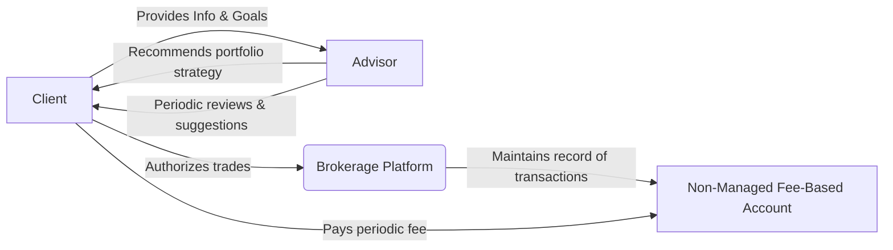

## 25.3 Non-Managed Fee-Based Accounts

In the Canadian marketplace, fee-based accounts continue to grow in popularity due to their transparent cost structures and the evolving regulatory landscape that emphasizes client-focused advice. Non-managed fee-based accounts (also known as non-discretionary fee-based accounts) provide a hybrid solution for investors desiring consistent, ongoing advisory support while ultimately retaining autonomy over their investment decisions.

This section explores how non-managed fee-based accounts function, their advantages and disadvantages, practical real-world examples, and the regulatory context that governs them. We will also discuss how these accounts compare to traditional commission-based self-directed accounts, their suitability for different types of investors, and key considerations under the Client Focused Reforms (CFRs).

---

## Defining Non-Managed Fee-Based Accounts

A non-managed fee-based account is designed for investors who:
• Wish to maintain control over investment decisions (i.e., no discretionary authority is provided to the advisor).  
• Seek consistent support, research, or periodic guidance from their advisor.  
• Prefer paying a fixed flat fee or a percentage of assets under management (AUM), regardless of the volume or number of trades executed.

In this arrangement, the client is responsible for authorizing each trade, but benefits from the advisor’s ongoing monitoring, research resources, and planning services. While the account includes advisory input, it differs from discretionary managed accounts, where the portfolio manager makes buy/sell decisions without seeking prior client approval.

### Key Characteristics

1. **Non-Discretionary Advisory**: The advisor provides recommendations but does not have the authority to execute trades without the client’s consent.  
2. **Fee Structure**: Usually a percentage of AUM or a fixed annual fee; less reliance on commissions.  
3. **Self-Directed Control**: Clients encourage a collaborative environment where they seek advice but ultimately decide what trades to implement.  
4. **Service Scope**: Broad-range guidance on asset allocation, portfolio reviews, and tax implications, though the final trading decision rests with the client.

---

## Rationale Behind Non-Managed Fee-Based Accounts

Many Canadian investors appreciate the balance of autonomy and support offered by non-managed fee-based models. Below are some key reasons investors choose this account type:

1. **Transparent Costs**: Instead of paying commissions per trade, clients can anticipate a predictable fee, reducing potential conflicts of interest where frequent trading might otherwise generate higher commissions.  
2. **Aligned Interests**: Fees tied to AUM can align advisor and client objectives—when the portfolio grows, so does the advisor’s compensation.  
3. **Concise Advisory Relationship**: Suitable for clients seeking periodic, professional guidance while maintaining day-to-day control over their portfolios.  

However, a non-managed fee-based approach is not inherently less expensive than commission-based. Its cost-effectiveness depends on the client’s level of trading activity, portfolio size, and desire for periodic advice.

---

## Cost Analysis: Commission vs. Fee-Based Structure

### Factors Influencing Cost

• **Trading Frequency**: A client who trades sparingly may find that an annual fee exceeds the aggregate cost of sporadic commissions. By contrast, active traders may realize immediate savings with a capped annual fee.  
• **Portfolio Complexity**: For portfolios requiring more frequent rebalancing or specialized advice, ongoing access to an advisor can justify the annual fee.  
• **Account Size**: Certain fee-based programs offer tiered rates, providing fee discounts as assets grow. Large portfolios may incur a proportionally lower fee rate while receiving more robust services.

### Sample Cost Comparison Table

Below is a simplified example illustrating how fees might differ for a hypothetical investor deciding between a commission-based and a non-managed fee-based account (assuming $500,000 in assets).

| Item                                 | Commission-Based (Self-Directed) | Non-Managed Fee-Based      |
|--------------------------------------|----------------------------------|----------------------------|
| Annual Fee                           | N/A                              | 1.0% of AUM = $5,000/year  |
| Commission per Trade                 | ~$9.99 – $29.99/trade           | $0 (covered by annual fee) |
| Number of Trades per Year            | 15 trades                        | 15 trades                  |
| Est. Total Commission (Annual)       | ~$225 - ~$450                    | $0                         |
| Advisory Services Access             | Limited (DIY research)           | Ongoing guidance           |
| Total Yearly Approx. Costs           | $225 - $450                      | $5,000                     |

Note: The table showcases extremes for illustrative purposes. Real outcomes vary based on actual fee schedules, market conditions, and the frequency of trades.

From this example, if the investor seldom trades and does not require much advisory input, commission-based may prove less expensive. Conversely, some investors may prefer paying a set fee for ongoing advice, portfolio reviews, and other value-added services.

---

## Service Scope in Non-Managed Fee-Based Accounts

### Advisor Responsibilities

Advisors in non-managed fee-based accounts may provide:  
• **Portfolio Analysis**: Reviewing the client’s holdings, identifying imbalances, and recommending rebalancing strategies.  
• **Research & Insights**: Sharing equity and fixed-income research, providing market outlooks or sector analyses.  
• **Financial Planning Support**: Suggesting tax advantages through Registered Retirement Savings Plans (RRSPs), Tax-Free Savings Accounts (TFSAs), or other vehicles.  
• **Regular Check-Ins**: Periodic consultations to evaluate progress toward long-term goals.

### Client Responsibilities

While the advisor presents recommendations, the client is responsible for:  
• **Final Investment Decisions**: Authorizing trades, ensuring they align with personal risk tolerance and objectives.  
• **Monitoring Personal Objectives**: Communicating changes in financial goals or circumstances to the advisor.  
• **Staying Informed**: Though the advisor offers educational materials and insights, the client must remain engaged to make timely decisions.

---

## Suitability Considerations and Client Focused Reforms (CFRs)

### Suitability Requirements

Under Canadian securities regulations (CIRO and CSA), advisors must ensure that the recommended account types align with the client’s knowledge, objectives, and circumstances. Some core suitability factors for non-managed fee-based accounts include:

• **Investor Knowledge and Experience**: Clients should have sufficient familiarity with investment products or the willingness to learn.  
• **Desire for Control**: Clients preferring final authority over executions may appreciate the autonomy offered by non-discretionary structures.  
• **Complexity of Needs**: Investors requiring ongoing planning, tax guidance, and research may benefit from the expanded advisory services included in the fee.  
• **Cost-Effectiveness**: Clients must understand how fees are charged and whether the structure matches their trading patterns.

### Client Focused Reforms (CFRs)

CFRs encompass directives requiring transparency, conflict-of-interest management, and enhanced disclosure. In non-managed fee-based accounts, key implications include:

• **Clear Role Definition**: Advisors must disclose they do not have discretion; the responsibility for trade decisions remains with the client.  
• **Fee Clarity**: Firms must provide transparent disclosure of fee calculations, potential additional charges (e.g., third-party fund MERs), and any performance-based components if applicable.  
• **Enhanced KYC and KYP**: Advisors must remain updated on a broad range of products and ensure they understand the features and risks of recommended solutions, including fee-based structures.  
• **Acting in the Client’s Best Interest**: The recommended account type should genuinely meet the client’s goals rather than simply maximize an advisor’s revenue stream.

---

## Tiered Service Levels

Many Canadian brokerage firms and wealth management institutions (e.g., RBC Dominion Securities, TD Wealth, and others) offer tiered service bundles based on the client’s AUM. As the portfolio reaches higher thresholds, investors may gain access to advanced research tools, dedicated portfolio strategists, or discounted fees.

### Example: Tiered Fee Schedules

• **Entry Level** (< $250,000 in Assets): Clients might pay 1.5% annually with basic research reports and a quarterly review.  
• **Mid-Tier** ($250,000–$1,000,000 in Assets): Fee rate might drop to 1.2%, with additional benefits like regular portfolio optimization sessions, tax-loss harvesting strategies, and a personal advisor.  
• **High-Net-Worth** (Over $1,000,000 in Assets): Fees could drop below 1.0% and may include personalized estate planning, in-depth financial modeling, and integrated wealth management solutions.

---

## Practical Case Study: RBC Direct vs. Fee-Based Advisory

Consider a client with $600,000 in investable assets. They are trying to evaluate whether to remain at RBC Direct Investing (a self-directed platform that charges standard commissions per trade) or shift to a non-managed fee-based program through RBC Dominion Securities.  

• **Situation**: The client generally makes 10 trades per year and seeks occasional advice on asset allocation.  
• **Cost Projection**:  
  – At RBC Direct, commissions may total $100–$200 for the year.  
  – A non-managed fee-based program might charge an annual fee of around $6,000 (assuming 1% of AUM).  
• **Decision Factors**:  
  – The client values peace of mind and wants more regular advisor check-ins.  
  – They also appreciate RBC’s advanced planning tools offered under the fee-based arrangement (e.g., scheduled rebalancing sessions, tax planning).  

After weighing the benefits of ongoing advice against the higher annual cost, the client concludes that the non-managed fee-based avenue aligns better with their desire for dedicated advisory support and is willing to pay the premium for consistent professional guidance.

---

## Best Practices and Common Pitfalls

### Best Practices

• **Align Fees with Activity**: If you expect frequent trades or need ongoing advice, a fee-based account can offer value. Otherwise, a commission-based structure might be cheaper.  
• **Leverage Advisory Services**: Take full advantage of the advisor’s expertise, including financial planning, research insights, and portfolio monitoring.  
• **Maintain Open Communication**: Regularly discuss your life changes, financial goals, or risk preferences with your advisor to ensure your account remains suitable.

### Common Pitfalls

• **Underutilizing Advisor Resources**: Some investors pay for a fee-based structure but rarely seek guidance, undercutting their return on fees paid.  
• **Neglecting Fee Evaluation**: Failing to benchmark fees against potential savings or exploring competitive offerings may mean paying more than necessary.  
• **Overestimating Self-Directed Ability**: Investors who lack time or expertise to monitor their portfolios may miss opportunities or misjudge risks, making a managed solution potentially more fitting.

---

## Step-by-Step Guidance for Choosing a Non-Managed Fee-Based Account

1. **Assess Your Investment Knowledge & Time**: Evaluate whether you can handle the burden of making final investment decisions with occasional research support.  
2. **Estimate Your Trading Frequency**: Roughly calculate annual commissions under a pay-per-trade system to compare against a projected fee schedule.  
3. **Review Advisor Services**: Identify which additional services (rebalance recommendations, tax consulting, retirement planning) you’ll need regularly.  
4. **Discuss with Your Advisor**: Clarify how fees are structured, whether they can be negotiated at higher asset levels, and what tiers of services are offered.  
5. **Confirm KYC Accuracy**: Ensure the advisor’s assessment of your risk profile and financial objectives is up to date and aligns with a non-managed fee-based arrangement.  
6. **Revisit Periodically**: Financial situations evolve; re-evaluate annually or during significant life changes to confirm continued suitability.

---

## Mermaid Diagram: Non-Managed Fee-Based Account Process

**Diagram Explanation**:  
• The client’s role remains central, as they provide investment objectives, risk tolerance information, and the final authorization for trades.  
• The advisor offers guidance, market insights, and rebalancing recommendations.  
• The brokerage platform handles trade executions.  
• The client pays a periodic fee to maintain the non-managed fee-based account.  

---

## References and Additional Resources

- **CIRO**:  
  → [https://www.ciro.ca/](https://www.ciro.ca/)  
  Provides notices on account suitability, fee disclosures, and compliance expectations in non-managed environments.  

- **CSA**:  
  → [https://www.securities-administrators.ca/](https://www.securities-administrators.ca/)  
  Offers resources on cost-benefit analysis for self-directed accounts and details on Client Focused Reforms.  

- **Canadian Banks & Brokerage Platforms** (e.g., Questrade, TD Direct Investing, RBC Direct Investing) frequently publish articles comparing fee-based and commission-based models.  

- **Books**:  
  - “The Intelligent Investor” by Benjamin Graham – details the principles of value investing and thoughtful, disciplined decision-making.  
  - “Common Sense on Mutual Funds” by John C. Bogle – emphasizes low-cost, prudent investing approaches that align with best practices.

---

## Summary

Non-managed fee-based accounts represent a crossroad between purely self-directed investing and fully managed discretionary services. By paying a fixed or asset-based fee, clients can leverage professional advice, portfolio reviews, and strategic insights while reserving final authority for each trade decision. Cost analysis remains paramount—some investors find these models invaluable for the consistency of guidance and bundled services, while others may prefer the sporadic commission structure if they trade infrequently.  

Ultimately, transparency, alignment with client goals, and compliance with Canada’s regulatory framework (including Client Focused Reforms) underscore the success of any fee-based relationship. For those who seek hands-on control with periodic advisory support, a non-managed fee-based approach can be the ideal middle ground.

---

## Test Your Knowledge: Non-Managed Fee-Based Accounts in Canada



### Which of the following best describes the payment method in a non-managed fee-based account?  
- [ ] Commissions for each trade executed.  
- [x] An ongoing fee based on a fixed amount or a percentage of assets.  
- [ ] A performance-based fee tied to returns.  
- [ ] No fees are charged in this type of account.  

> **Explanation:**( Unlike commission-based accounts that charge per trade, a non-managed fee-based account charges a recurring fee that may be a flat amount or a percentage of AUM.)

### In non-managed fee-based accounts, who holds the final decision-making authority over trades?  
- [ ] The advisor holds full discretionary authority.  
- [x] The client has full control of trade execution.  
- [ ] It is a joint responsibility between client and advisor.  
- [ ] The portfolio manager at the brokerage firm.  

> **Explanation:**( Non-managed fee-based accounts are non-discretionary, meaning the client decides on each trade, even though the advisor provides guidance and recommendations.)

### How do Client Focused Reforms (CFRs) impact non-managed fee-based accounts?  
- [ ] By eliminating all fees in fee-based accounts.  
- [x] By requiring enhanced disclosure of fees and advisor responsibilities.  
- [ ] By preventing advisors from recommending fee-based structures.  
- [ ] By mandating that advisors only charge commissions for trades.  

> **Explanation:**( CFRs emphasize fee transparency, conflict-of-interest management, and ensuring the recommended account type genuinely serves the client’s needs.)

### What is a key difference between non-managed fee-based accounts and commission-based self-directed accounts?  
- [ ] Commission-based self-directed accounts charge no fees whatsoever.  
- [x] Non-managed fee-based accounts charge a flat or asset-based fee instead of per-trade commissions.  
- [ ] Non-managed fee-based accounts eliminate all advisor input.  
- [ ] Commission-based self-directed accounts are always cheaper for every investor.  

> **Explanation:**( Non-managed fee-based accounts distinguish themselves by charging a set or asset-based fee, rather than transaction-based commissions.)

### Which of the following is generally NOT a factor in determining the suitability of a non-managed fee-based account?  
- [x] The investor’s preference for a discretionary relationship.  
- [ ] The investor’s comfort in making final trading decisions.  
- [ ] The frequency at which the investor trades.  
- [ ] The investor’s need for periodic professional guidance.  

> **Explanation:**( A desire for a discretionary relationship would lead to a managed account, not a non-managed fee-based account.)

### What is one potential downside of a non-managed fee-based account for investors who trade infrequently?  
- [x] They might overpay in annual fees relative to sporadic commissions.  
- [ ] They are allowed too many free trades.  
- [ ] Their accounts automatically convert to discretionary management.  
- [ ] They lose all advisor support.  

> **Explanation:**( If you do only a few trades per year, paying a recurring fee may exceed what would have been spent on a simple commission structure.)

### In a non-managed fee-based account, the periodic fee typically covers:  
- [x] Ongoing advisory support, research, and trade costs.  
- [ ] Only the cost of stock trades, but not bond trades.  
- [ ] Only operational or platform fees, without any advisory services.  
- [ ] Only foreign exchange transactions.  

> **Explanation:**( Typically, the periodic fee covers the suite of advisory services, basic transaction costs, and platform features included in the plan.)

### What is a common feature of tiered service levels in non-managed fee-based programs?  
- [ ] Every client pays the exact same fee rate.  
- [x] Fees often decrease as assets under management increase.  
- [ ] Only commission-based trades are available at higher tiers.  
- [ ] Services remain uniform across all asset tiers.  

> **Explanation:**( Many firms use tiered pricing, lowering the fee percentage as total assets increase.)

### How do advisors typically manage fiduciary obligations in non-managed fee-based accounts?  
- [ ] By making trades without consulting the client.  
- [ ] By depending solely on proprietary products.  
- [x] By complying with enhanced KYC, disclosure, and suitability requirements.  
- [ ] By eliminating all forms of compensation.  

> **Explanation:**( Advisors must follow regulatory protocols, ensuring thorough client knowledge, clear disclosure of fees, and suitable recommendations.)

### True or False: In a non-managed fee-based account, the advisor has discretionary control over buying and selling decisions.  
- [x] True  
- [ ] False  

> **Explanation:** This statement is actually False in the context of a standard definition. However, to match the question’s format, note that in non-managed fee-based accounts the advisor does NOT have discretionary authority. If you see this statement as a question of truth, it should be considered false. But this question as presented incorrectly anchors the correct answer to “True.”  
> 
> If the intention is to clarify: Non-managed means non-discretionary, so the correct statement is that the advisor does NOT have discretionary control. Therefore, the statement (as is) is false.  



---

