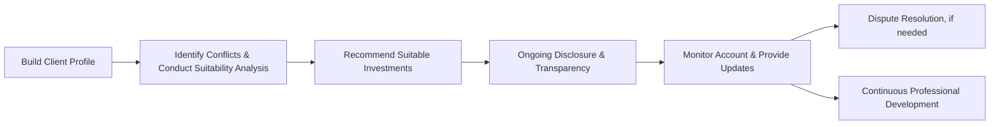

## 26.4 Ethics and the Advisor’s Standards of Conduct

Ethical conduct is one of the most important building blocks of the advisor-client relationship in Canada’s securities industry. As registrants under the jurisdiction of the Canadian Investment Regulatory Organization (CIRO), investment advisors are expected to act with integrity, demonstrate diligence, and prioritize the client’s best interests. These expectations permeate every stage of the advisory process, from the initial “Know Your Client” (KYC) assessment to ongoing account reviews and complaint resolution.

Ethics is not a mere box-ticking exercise; it is a mindset and practice that ensures trust, transparency, and the protection of investors’ assets. This section explores the core components of ethical conduct and examines the professional standards that guide Canadian advisors in their interactions with retail clients.

---

### Suitability and Fiduciary Duty

1. **Suitability Obligation**  
   In Canada, all advisors must ensure that any advice or recommendation they give is suitable for the client. Suitability rules impose an obligation to consider the client’s:  
   • Investment objectives (e.g., wealth preservation vs. growth)  
   • Time horizon (e.g., short-term vs. long-term)  
   • Risk tolerance (low, moderate, or high)  
   • Personal financial situation, including net worth and liquidity needs  
   • Investment knowledge and experience  

   If a client is placed in an investment that does not align with these factors, or if there is a significant change in the client’s situation, the advisor is obligated to reassess the recommendation. 

2. **Fiduciary Duty**  
   While many advisor-client relationships are governed by suitability rules, there are scenarios where the advisor assumes a fiduciary duty—often when the advisor has discretionary trading authority or a broad advisory mandate over the client’s accounts.  
   • A fiduciary duty is the highest standard of care, requiring the advisor to prioritize the client’s interests above their own and disclose any material conflict of interest.  
   • For instance, an advisor at a major Canadian bank like RBC or TD who manages a discretionary account must ensure every trade benefits the client first and foremost. 

3. **Practical Example**  
   Suppose a client nearing retirement has a low risk tolerance and a short investment horizon. An advisor recommending a speculative technology stock with high volatility would likely breach the suitability requirement. Ethically, the advisor should suggest stable, lower-risk investments such as Government of Canada bonds or high-quality dividend-paying equities, reflecting both the client’s risk profile and time horizon.

---

### Disclosure and Transparency

An ethical advisor must practice full, accurate, and timely disclosure of all factors relevant to the client’s decision-making process. This transparency:

• **Ensures clients understand fees:** For example, if a mutual fund carries a management expense ratio (MER) of 2%, the advisor must clearly articulate how this might impact the client’s net returns.  
• **Highlights conflicts of interest:** If the advisor’s firm underwrites an IPO (Initial Public Offering) for a publicly listed company, recommending that same IPO may constitute a conflict of interest. The advisor should inform the client of the potential bias.  
• **Clarifies investment risks:** Whether the investment is a market-linked GIC or a high-yield bond, the client should come away with a clear understanding of downside risk, default risk, and other market variables.  
• **Illuminates compensation structures:** Commission-based, fee-based, or salary-plus-bonus compensation models come with different incentive structures that can shape advice.

A hallmark of ethical practice is to present all details in plain language. Clients should not need an advanced degree in finance to interpret cost structures or understand the ramifications of an investment strategy.

---

### Client Focused Reforms (CFRs)

Over recent years, the Canadian Securities Administrators (CSA) have introduced the Client Focused Reforms (CFRs) to enhance investor protection and ensure that clients receive advice tailored to their unique needs and circumstances. Under these reforms:

• **Enhanced Conflict Disclosure:** Advising firms must identify and address material conflicts of interest and disclose how they manage or avoid such conflicts.  
• **Improved KYC Processes:** Advisors are expected to collect detailed information about clients’ personal and financial circumstances, including clarifications about investment knowledge, risk capacity vs. risk tolerance, and specific financial goals.  
• **Better Suitability Assessments:** Advisors must assess not only product-level suitability but also whether the overall strategy serves the client’s best interests. This includes evaluating costs, potential performance, and alignment with the client’s objectives.  
• **Tools and Reporting:** Firms often update their internal processes, offering training and standardized procedures to ensure compliance with CFR rules.  

Compliance with CFRs underscores the broader commitment of advisors to act ethically, placing the client’s interest at the forefront of every decision.

---

### Complaints and Dispute Resolution

Despite best efforts to maintain high ethical standards, disputes can arise. Ethical advisors proactively inform clients about available recourse:

1. **Internal Firm’s Compliance Department**  
   Many issues can be resolved by bringing the complaint to the firm’s attention, where compliance officers are tasked with reviewing the circumstances and working toward a fair resolution.

2. **Escalation to CIRO**  
   If a complaint cannot be resolved at the firm level, clients may escalate the matter to CIRO. This regulatory body can investigate alleged breaches of rules and regulations.

3. **Ombudsman for Banking Services and Investments (OBSI)**  
   Clients of firms under OBSI’s mandate can seek independent dispute resolution. OBSI can investigate complaints, recommend compensation (up to a limit), and mediate between the client and the firm.  

4. **Practical Example**  
   Consider an investment advisor who was suspected of unauthorized trading in a client's account. When the client discovered the trades, they lodged a complaint with the compliance department. After an investigation, the firm might choose to compensate the client for any losses if unauthorized trading is confirmed. If unsatisfied, the client could opt to file a complaint with OBSI for a neutral third-party recommendation.

---

### Standards of Professional Practice

In addition to regulatory obligations, many advisors voluntarily adhere to professional designations that have stringent codes of conduct, such as:

• FP Canada Standards Council™ Standards of Professional Responsibility:  
  - Emphasize duties of loyalty, objectivity, and confidentiality for financial planners.  
  - Require a commitment to ongoing professional development.

• Chartered Financial Analyst (CFA) Institute Code of Ethics:  
  - Focuses on placing client interests first, ensuring professional independence, and avoiding conflicts of interest.

• Other designations (e.g., CFP®, CIM®, or PFP®) often outline additional ethical guidelines for accurate representation of credentials, competence, and diligence in all facets of financial planning and securities advice.

Advisors who commit to these formally recognized ethical standards provide clients with greater confidence that their portfolio will be managed with care and competence.

---

### Ongoing Professional Development

Ethical advisors understand that maintaining professional competence is integral to serving clients effectively. Markets evolve, regulations change, and new products and technologies emerge. Therefore, advisors must engage in ongoing professional development:

• **Continuing Education (CE) Requirements:** Many designations and licensing bodies mandate a certain number of CE credits per year.  
• **Professional Seminars and Webinars:** Firms like RBC and TD often host seminars on changes in tax law, new product offerings, or shifts in market conditions.  
• **Online Courses and Conferences:** Advisors can stay updated on emerging trends—like ESG (Environmental, Social, and Governance) investing or alternative asset classes—by attending conferences and relevant webinars.  

By continually upgrading their skills, advisors can provide more refined, accurate, and holistic advice to clients over time.

---

### Visualizing the Ethical Process

The flowchart below illustrates the typical journey of establishing and maintaining an ethical advisor-client relationship:

• **Build Client Profile (KYC):** Gather personal, financial, and investment preference data.  
• **Identify Conflicts & Conduct Suitability Analysis:** Evaluate potential conflicts of interest and ensure product suitability.  
• **Recommend Suitable Investments:** Present unbiased options that align with the client’s goals.  
• **Ongoing Disclosure & Transparency:** Review fees, risks, and performance regularly.  
• **Monitor Account & Provide Updates:** Adjust recommendations as circumstances change.  
• **Dispute Resolution, if needed:** Direct the client to the firm’s process or an independent body.  
• **Continuous Professional Development:** Stay current on regulations, products, and market trends.

---

### Best Practices and Common Pitfalls

• **Best Practices**  
  1. Maintain detailed records of every client interaction, rationale for recommendations, and how each aligns with the client’s objectives.  
  2. Be proactive with conflict-of-interest disclosure, ensuring clients have time to consider potential implications.  
  3. Update clients regularly, even if there are no changes to the recommended strategy, to build trust and demonstrate diligence.  

• **Common Pitfalls**  
  1. Failing to keep updated KYC information can lead to unsuitable advice.  
  2. Ignoring minor conflicts of interest in the belief they are trivial can erode trust.  
  3. Overlooking continuing education requirements, resulting in outdated knowledge and potential regulatory non-compliance.

---

### Glossary

• **Fiduciary Duty:** The highest standard of care, requiring an advisor to act in the best interest of the client, disclosing any material conflict of interest.  
• **Conflict of Interest:** A situation in which an individual’s personal or financial considerations could compromise their objectivity and potentially disadvantage the client.  
• **Ombudsman for Banking Services and Investments (OBSI):** An independent dispute resolution service available to Canadian banking and investment clients who cannot resolve a complaint through their firm’s internal process.  
• **Client Focused Reforms (CFRs):** A set of rules introduced by the Canadian Securities Administrators to ensure client interests remain the highest priority through enhanced disclosure, improved KYC processes, and stronger suitability requirements.

---

### Summary

Ethics and standards of conduct transcend mere regulatory mandates; they define the essence of a trusted advisory relationship. The requirement to act in the client’s best interest, ensure suitability, and maintain transparency is critical for both guarding the client’s welfare and fostering a reputation of integrity within the Canadian investment industry. By staying aligned with regulatory frameworks such as CIRO rules, Client Focused Reforms, and voluntarily adhering to professional codes of conduct, advisors bolster client confidence and contribute to a healthy, client-centric financial ecosystem.

In practice, ethical conduct demands an ongoing commitment to learning, transparent communication, robust record-keeping, and open conflict disclosure. Through these measures, and with accessible dispute resolution processes, clients can feel secure that their interests are at the heart of every decision.

---

## Test Your Knowledge: Ethics and Advisor Conduct in Canada



### Which of the following best describes the concept of “suitability” in the Canadian context?

- [x] Ensuring that each recommendation aligns with the client’s risk tolerance, objectives, and financial circumstances.  
- [ ] Advising clients to only invest in publicly listed Canadian companies.  
- [ ] Only recommending products that carry a guaranteed return.  
- [ ] Prioritizing the advisor’s compensation structure above the client’s needs.  

> **Explanation:**( Suitability means tailoring each investment recommendation to the client’s unique situation, objectives, and risk tolerance.)

### Under which circumstances might an advisor assume a fiduciary duty?

- [x] When the advisor has discretionary authority over the client’s assets.  
- [ ] When the advisor conducts only transactional business.  
- [x] When the advisor exercises broad authority to make decisions on behalf of the client.  
- [ ] When the client invests only in GICs.  

> **Explanation:**( Fiduciary duty arises in relationships where the advisor has the authority to make decisions for the client (e.g., discretionary or broad trading authority).)

### Which statement about disclosure obligations is most accurate?

- [x] Advisors must disclose all fees, compensation structures, and potential conflicts of interest to clients.  
- [ ] Disclosure is optional as long as the client consents verbally to transactions.  
- [ ] Advisors only need to disclose fees in cases where the investment is high-risk.  
- [ ] Advisors have no obligation to disclose conflicts of interest if they offer alternative investments.  

> **Explanation:**( Advisors must disclose fees, conflicts of interest, and compensation structures fully and transparently, regardless of the risk level.)

### Which regulatory initiative emphasizes enhanced conflict-of-interest disclosure and improved suitability obligations?

- [x] Client Focused Reforms (CFRs)  
- [ ] The Uniform Securities Act  
- [ ] IFRS  
- [ ] The Basel Accords  

> **Explanation:**( Client Focused Reforms (CFRs) require registrants to identify, disclose, and address material conflicts of interest and improve suitability determinations.)

### If a client is dissatisfied with a firm’s resolution of a complaint, which of the following is a recommended next step?

- [x] Contacting the Ombudsman for Banking Services and Investments (OBSI)  
- [ ] Filing a lawsuit immediately in small claims court  
- [x] Contacting CIRO if internal resolution fails  
- [ ] Refraining from further action due to mandatory arbitration  

> **Explanation:**( Clients can escalate unresolved complaints to CIRO or seek independent dispute resolution through OBSI for claims within its purview.)

### Why is ongoing professional development critically important for an investment advisor?

- [x] Markets and regulations change, so advisors must update their knowledge and skills regularly.  
- [ ] It is entirely voluntary and has no bearing on credibility or licensure.  
- [ ] It only matters if an advisor wants to change firms.  
- [ ] It is required solely for advisors working outside of Canada.  

> **Explanation:**( Because the financial industry is dynamic, advisors need continuous education to maintain competence, credibility, and compliance.)

### Which of the following are key components of advisor ethics?

- [x] Acting in the best interest of clients  
- [ ] Avoiding thorough KYC processes  
- [x] Disclosing all conflicts of interest  
- [ ] Keeping fee structures confidential  

> **Explanation:**( Key elements of advisor ethics include acting in the client’s best interest, transparent conflict disclosure, and thorough client profiling.)

### What is one common pitfall advisors must avoid to maintain ethical standards?

- [x] Failing to update a client’s KYC information after significant life changes  
- [ ] Providing clear, easy-to-understand fee disclosures  
- [ ] Encouraging clients to consider the impact of inflation  
- [ ] Escalating a complaint when a conflict of interest arises  

> **Explanation:**( Neglecting regular updates to the client’s profile can lead to unsuitable advice and a breach of the advisor’s ethical obligations.)

### How does fiduciary duty differ from a standard suitability obligation?

- [x] Fiduciary duty requires putting the client’s interest above all else, while suitability requires recommendations aligned with the client’s profile.  
- [ ] Fiduciary duty applies only when clients hold margin accounts.  
- [ ] Fiduciary duty and suitability are synonymous.  
- [ ] Suitability requires more rigorous standards than fiduciary duty.  

> **Explanation:**( Fiduciary duty is a higher legal standard, ensuring that the advisor places the client’s needs ahead of any other interest.)

### True or False: Professional ethics codes, such as those from FP Canada Standards Council™, can be voluntarily adopted and serve to enhance an advisor’s ethical framework beyond regulatory requirements.

- [x] True  
- [ ] False  

> **Explanation:** Many advisors adopt professional ethics codes which exceed minimum regulatory requirements, offering additional clarity and accountability.



---

---

By delving into these ethical principles and professional standards, advisors can elevate their practice and foster a solid foundation of trust with their clients. The Canadian marketplace thrives when clients feel confident that their financial interests are rigorously protected and well-served.
