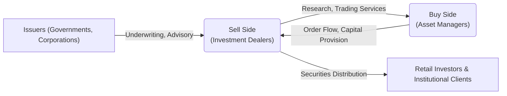

## 27.1 The Sell Side and the Buy Side of the Market

Institutional investing in Canada revolves around two critical segments: the sell side and the buy side. These two groups play interdependent roles that drive pricing efficiency, liquidity, and capital formation in the financial markets. While they often reside within the same large financial institution, they remain functionally separated by strict information barriers to prevent conflicts of interest and misuse of material non-public information. This section provides a comprehensive overview of these two segments, including their functions, challenges, and best practices within Canadian capital markets.

---

## Overview of the Institutional Marketplace

The institutional marketplace includes asset management firms, investment dealers, hedge funds, mutual funds, pension funds, large-scale insurance companies, and other organizations managing substantial pools of capital. These institutions significantly influence market liquidity, capital flows, and pricing, both in Canada and globally.

From a high-level perspective, institutions can be categorized as follows:

• Sell-Side Institutions (e.g., investment dealers, brokerages)  
• Buy-Side Institutions (e.g., mutual funds, pension funds, insurance companies)

Both groups interact closely with each other, exchanging research, capital, and trading services to maintain efficient markets. Understanding their distinct yet interconnected roles is essential for professionals in capital markets.

---

## The Sell Side

### Primary Role and Activities

The sell side primarily creates, markets, and distributes securities. They act as intermediaries between issuers—such as corporations or governments seeking to raise capital—and investors seeking to buy or sell those securities. Key services and roles of the sell side include:

• Underwriting and Issuing Securities: Investment banks, often part of large financial institutions like RBC Capital Markets or TD Securities, assist corporations or governments in bringing new equity or debt offerings to market. Their underwriting expertise includes pricing new issues and ensuring regulatory compliance with the Canadian Securities Administrators (CSA).  
• Research and Analysis: Sell-side analysts produce detailed, company-specific research, economic forecasts, and industry reports. This research is typically distributed to both institutional and retail clients, although institutional clients receive more specialized insights.  
• Market Making: Many sell-side institutions act as market makers, holding inventories of various securities (e.g., common shares, bonds) to provide liquidity. This ensures that institutional and retail investors can buy or sell securities swiftly.  
• Trading and Execution Services: The sell side facilitates trades on behalf of buy-side clients, matching buyers and sellers while adhering to best execution requirements under regulations enforced by the Canadian Investment Regulatory Organization (CIRO).  

### Product Creation and Innovation

Because the sell side is driven to provide new investment opportunities, they often engage in product innovation. For instance, structured products may be devised to meet specific risk or return profiles demanded by institutional investors. This includes:

• Principal-Protected Notes (PPNs)  
• Derivative-Linked Notes  
• Asset-Backed Securities  

Sell-side firms must ensure compliance with capital-raising regulations outlined by the CSA and maintain transparency to protect the interests of investors, while also helping issuers structure deals that are attractive and feasible.

### Research and Market Insights

Sell-side analysts play a crucial role in shaping market expectations. Through economic reports and company-specific recommendations (e.g., “buy,” “hold,” or “sell”), these analysts influence both retail and institutional trading decisions. While research must be objective and independent, the closeness of sell-side analysts to investment bankers can create potential conflicts of interest, which is why information barriers (commonly known as “Chinese walls”) are essential.

---

## The Buy Side

### Primary Role and Activities

Buy-side institutions manage client funds—be it for individuals (through mutual funds or segregated accounts) or for large entities like pension funds (e.g., Canada Pension Plan Investment Board) and insurance companies. Their primary goal is to invest assets in a manner that meets specific risk and return objectives. Key functions include:

• Asset Allocation: Determining the allocation of assets across equities, fixed income, alternative investments, and other asset classes, based on investment policy statements or mandates.  
• Security Selection: Leveraging internal research, external analysis, and market intelligence, buy-side portfolio managers choose securities that align with the fund’s strategy and risk tolerance.  
• Risk Management: Ensuring that the portfolio remains within regulatory and client-imposed risk parameters, often using sophisticated tools for stress testing, scenario analysis, and performance attribution.  
• Compliance and Reporting: Abiding by provincial securities regulations, CIRO guidelines, and the internal policies of the asset management firm to ensure ethical management and full disclosure.

### Typical Buy-Side Institutions

Buy-side players in Canada include:

1. Mutual Funds: Regal mutual fund companies aiming to provide market-based returns to retail investors.  
2. Pension Funds: Large pools, such as the Ontario Teachers’ Pension Plan or the Canada Pension Plan Investment Board, investing on behalf of current and future retirees.  
3. Insurance Companies: Institutions like Manulife or Sun Life, which invest insurance premiums strategically to generate stable returns while preserving capital for policyholder claims.  
4. Hedge Funds: Less regulated funds pursuing absolute returns. They may employ advanced techniques such as short selling, leverage, and derivatives, subject to restrictions and applicable regulatory frameworks.  
5. Asset Managers: Firms managing segregated portfolios or pooled vehicles on behalf of institutional and high net-worth clients.

### Investment Mandates and Strategies

Buy-side investors tailor their strategies to each client’s risk tolerance, liquidity needs, and return objectives. For example, a pension fund with long-duration liabilities might favor more stable, long-term investments. Conversely, a hedge fund might pursue higher-risk strategies seeking alpha through derivatives or event-driven trades.

---

## Information Barriers (Chinese Walls)

Large financial institutions may house both investment banking (sell side) and asset management (buy side) divisions. In these cases, strict internal procedures—described as “Chinese walls” or information barriers—help prevent the flow of material, non-public information between the two divisions. This practice ensures:

• Fair Treatment of Clients: The buy side must not receive insider or privileged data from the sell side that would lead to unfair trading advantages.  
• Regulatory Compliance: Institutions must adhere to securities laws enforced by provincial regulators within the CSA, as well as CIRO’s guidelines aiming to preserve market integrity.

An information barrier typically includes separate physical office spaces, dedicated IT systems preventing unauthorized data sharing, and documented policies outlining permissible interactions between departments.

---

## Navigating Trades Between Sell Side and Buy Side

### Execution Channels

Institutional trades, often in large “block” quantities, require specialized handling. The sell side offers the following execution channels:

1. Agency Trading: The sell side acts strictly on behalf of the client (buy side), executing trades at the best possible price.  
2. Principal Trading: The sell side acts as a counterparty, using its own capital to complete the trade. This can be advantageous for large orders that might otherwise disrupt the market.  
3. Electronic Trading and Algorithms: Algorithmic trading platforms facilitate automated execution strategies. Buy-side traders can input parameters like volume participation rates or price limits, enabling them to reduce market impact.

### Prime Brokerage

Prime brokerage services are specialized offerings for hedge funds or other active trading entities on the buy side. They typically include:

• Custody and Settlement Services  
• Securities Lending for Short Sales  
• Leverage and Margin Services  
• Sophisticated Analytics and Reporting  

These services, often provided by major Canadian financial institutions, help buy-side clients manage complex trading strategies, maintain compliance, and streamline operational processes.

---

## Regulatory Considerations and Market Integrity

### CIRO and CSA Oversight

In Canada, the Canadian Investment Regulatory Organization (CIRO), formerly known as IIROC, enforces rules for investment dealers and trading activity to ensure fairness and transparency. Meanwhile, at the provincial level, regulators under the CSA framework set the securities laws that govern:

• Disclosure Requirements in Public Offerings  
• Insider Trading Rules and Enforcement  
• Prudential and Conduct Standards for Investment Dealers  

Provincial regulators coordinate through the CSA to maintain consistent standards across Canada’s capital markets. By requiring accurate, timely disclosure, regulators foster a level playing field for all market participants.

### Compliance Best Practices

From a compliance perspective, both sell-side and buy-side organizations must:

• Maintain Proper Recordkeeping: Invoices, executed trade orders, electronic communications, and meeting notes must be stored properly for periodic audits.  
• Implement Ethical Codes of Conduct: Employees should follow strict guidelines to avoid conflicts of interest.  
• Conduct Regular Training: Staff must be trained to recognize and handle potential conflicts, such as receiving material non-public information.

---

## Diagram: Interplay Between Sell Side and Buy Side

Below is a simplified visualization of how sell-side and buy-side institutions interact in Canadian capital markets:

1. Issuers rely on the sell side for capital raising and distribution of new securities.  
2. The sell side provides research and execution services to the buy side.  
3. The buy side, in turn, channels capital back to issuers and the broader market.  
4. Retail and institutional clients may access the market through sell-side providers, bridging the process of investment and capital allocation.

---

## Real-World Examples and Case Studies

### Canadian Banks with Both Sell-Side and Buy-Side Divisions

Major Canadian banks like RBC, TD, and BMO operate both investment banking (sell-side) arms and wealth management or asset management (buy-side) arms. These divisions are legally and operationally separated through information barriers. For instance:

• RBC Capital Markets (Sell Side) underwrites new stock offerings and provides trading services.  
• RBC Wealth Management (Buy Side) handles client portfolios, mutual funds, and other investment products.

Despite the shared parent company, each division’s activities must comply with strict regulations that prohibit the free flow of non-public information.

### Pension Funds and Large Investment Needs

Consider the Ontario Teachers’ Pension Plan (OTPP), one of the world’s largest institutional investors. As a buy-side entity with billions in assets, OTPP works with various sell-side dealers for research, block trade execution, and customized derivatives. OTPP’s long-term investment horizon shapes its strategies, while the sell side tailors offerings like inflation-linked bonds or private placements to match OTPP’s objectives.

---

## Applications, Challenges, and Best Practices

### Common Pitfalls

• Conflict of Interest: Without robust information barriers, a combined institution might face scrutiny for sharing information among different departments.  
• Over-Reliance on Sell-Side Research: Buy-side managers should employ independent analysis rather than relying exclusively on sell-side recommendations.  
• Liquidity Traps: Large orders from buy-side institutions can sometimes distort markets if not carefully executed, leading to unfavorable fills.

### Strategies to Overcome Challenges

• Comprehensive Due Diligence: Both sell side and buy side require consistent, rigorous analysis—both fundamental and quantitative tools (e.g., QuantLib) can help model risks and returns.  
• Diversified Relationships: Buy-side firms often maintain relationships with multiple sell-side institutions to access varied insights and ensure competitive execution.  
• Transparent Communication: Clear guidelines must be established when discussing potential deals or trades between the buy side and sell side to remain compliant with CIRO and CSA rules.

### Best Practices for Professionals

• Stay Informed: Keep abreast of IIROC/CIRO bulletins, CSA updates, and new rules on best execution or disclosure obligations.  
• Encourage Ethical Culture: Promote a culture of compliance and ethics within your organization to foster trust and safeguard market integrity.  
• Embrace Technology and Analytics: Use advanced trading algorithms, performance measurement frameworks, and risk assessment tools for decision-making.

---

## Key Takeaways

1. The sell side produces, markets, and distributes securities, while the buy side invests assets according to mandates and risk profiles.  
2. Both segments are essential to market liquidity and efficiency, despite being functionally separate entities within the same financial institution.  
3. Robust regulations from CIRO and the CSA maintain transparency and fairness, mandating strict information barriers to prevent conflicts of interest.  
4. Institutional clients require tailored services such as block trading, prime brokerage, and specialized research, underscoring the interconnected yet distinct roles of these market participants.  
5. Maintaining strong compliance, ethical standards, and rigorous analytical methods is core to navigating the complex landscape of Canadian institutional markets.

---

## Quiz: The Sell Side and the Buy Side in Canadian Capital Markets



### Which of the following best describes the core function of the sell side in Canadian capital markets?
- [ ] Managing investors’ portfolios according to specific mandates  
- [x] Underwriting securities, providing research, and facilitating trades  
- [ ] Minimizing clients’ tax liabilities through structured plans  
- [ ] Supervising and enforcing securities regulations  

> **Explanation:** The sell side focuses on underwriting security offerings, providing market research, and executing trades for clients.

### Which institution type is primarily considered a buy-side participant in Canada?
- [ ] Investment dealers  
- [x] Pension funds  
- [x] Mutual fund companies  
- [ ] Municipal treasury departments  

> **Explanation:** Pension funds and mutual funds manage assets on behalf of investors, making them buy-side participants.

### What is the primary purpose of information barriers (Chinese walls) within an integrated financial institution?
- [x] To prevent the sharing of material non-public information between sell-side and buy-side divisions  
- [ ] To ensure all employees have unrestricted access to client data  
- [ ] To streamline communication among investment banking, trading, and research units  
- [ ] To reduce the paperwork associated with regulatory filings  

> **Explanation:** Information barriers protect against insider trading risks and maintain the integrity of market processes.

### Which of the following roles is unique to the sell side?
- [x] Market making to provide liquidity  
- [ ] Selecting securities based on investment mandates  
- [ ] Managing a pension fund’s long-term liabilities  
- [ ] Overseeing a corporation’s internal budget allocations  

> **Explanation:** Sell-side firms often act as market makers, holding securities in inventory to facilitate transactions and maintain market liquidity.

### When a large buy-side institution places a significant order for shares, what specialized trading service might they require?
- [x] Block trading services  
- [ ] Frequent day trading check-ups  
- [x] Prime brokerage solutions  
- [ ] Regulatory audits  

> **Explanation:** Large orders often require block trading for efficient execution, and prime brokerage can assist with services such as custody, leverage, and risk management.

### Which regulatory body enforces rules and monitors investment dealers’ trading activity in Canada?
- [x] CIRO (Canadian Investment Regulatory Organization)  
- [ ] Federal Reserve Board  
- [ ] Bank for International Settlements  
- [ ] Securities and Exchange Commission  

> **Explanation:** CIRO (formerly IIROC) regulates investment dealers and oversees markets in Canada.

### Which statement accurately distinguishes the buy side from the sell side?
- [x] The buy side invests capital according to mandates, while the sell side creates investment products and executes trades  
- [ ] The buy side engineers structured notes, while the sell side underwrites new offerings  
- [x] The buy side primarily serves public companies, while the sell side caters exclusively to retail investors  
- [ ] The buy side focuses on short-term trading, while the sell side focuses on long-term capital returns  

> **Explanation:** Buy-side managers invest funds according to risk and return objectives, whereas sell-side firms underwrite new issues, provide market research, and facilitate trades.

### Which scenario typically requires the involvement of both sell-side and buy-side teams?
- [x] A new equity issuance for a large corporation  
- [ ] A corporate budgeting session  
- [ ] The development of government fiscal policy  
- [ ] A personal tax planning exercise  

> **Explanation:** When a corporation issues new equity, the sell side underwrites and markets the stock, and the buy side may evaluate and potentially invest in that offering.

### What is one major risk if an integrated bank fails to maintain effective “Chinese walls”?
- [x] Insider trading or unfair market advantage  
- [ ] Improved product innovation for structured notes  
- [ ] Decreased capability for block trades  
- [ ] Greater access to advanced research for all clients  

> **Explanation:** Without proper barriers, material non-public information could improperly flow between divisions, creating insider trading opportunities and compromising market integrity.

### True or False: Principal trading occurs when a sell-side firm trades securities from its own inventory rather than acting as an agent.
- [x] True  
- [ ] False  

> **Explanation:** Principal trading involves the sell-side firm using its own capital to buy or sell securities, potentially offering more immediate liquidity to the buy side.



---

## For Additional Practice and Deeper Preparation

**Elevate your exam readiness with our comprehensive app, "Securities CA: Mock Exams," designed to challenge and refine your skills.**

* **Master Challenging Questions:** Dive into expertly crafted sample exam questions that go beyond standard references.
* **Scenario-Driven Learning:** Experience scenario-driven case questions and in-depth solutions to build practical expertise.
* **Sharpen Exam Strategies:** Build confidence with step-by-step explanations designed to refine your exam-day tactics.
* **Gain Real-World Insights:** Acquire practical tips and detailed rationales that demystify complex concepts.
* **CIRO and CSI Alignment:** Stay current with CIRO guidelines and CSI’s exam structure, with questions intentionally more challenging than the actual exam.

**Download the App Today:**

> Note: While these courses are specifically crafted to align with the CSC® exams outlines, they are independently developed and not endorsed by CSI or CIRO.

---

By understanding the symbiotic nature of the sell side and buy side in Canada’s capital markets, you’ll be well-prepared to navigate institutional investment landscapes, recognize compliance requirements, and implement best practices that foster credibility and trust. Leverage available resources like open-source financial tools (e.g., QuantLib) and authoritative textbooks (“Investment Analysis and Portfolio Management” by Reilly and Brown) to further strengthen your expertise in these critical market dynamics.
