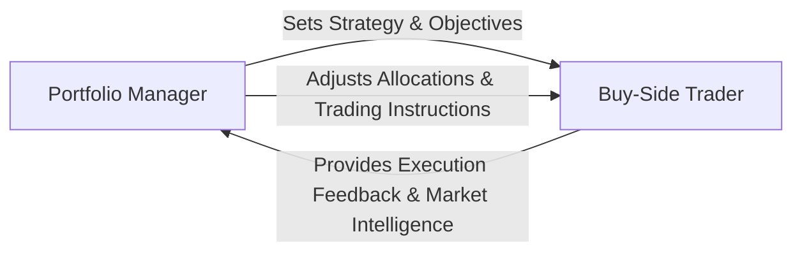

## 27.2 The Responsibilities of a Buy-Side Portfolio Manager and Trader

In the institutional investment realm, buy-side professionals play a pivotal role in managing assets for pension funds, mutual funds, insurance companies, and other large investment institutions. Their responsibilities encompass everything from devising investment strategies to satisfying fiduciary duties, all under a framework of regulations designed to protect investors and ensure integrity in the marketplace. This section provides an in-depth examination of the core duties, best practices, and compliance considerations that shape the responsibilities of buy-side portfolio managers and traders.

---

## Understanding the Buy-Side Landscape

The term “buy-side” refers to firms and professionals who purchase securities and other financial instruments for the purpose of investing and growing client capital. These organizations invest on behalf of entities such as:

• Pension funds (e.g., the Canada Pension Plan Investment Board)  
• Mutual funds and ETFs  
• Insurance companies  
• Endowments and foundations  
• Large corporate treasury departments  

Buy-side professionals make critical decisions regarding asset allocation, security selection, and rebalancing. Their mandate echoes a fiduciary responsibility to act in the best interests of their clients by carefully balancing risk and return.

---

## The Role of the Buy-Side Portfolio Manager

A buy-side portfolio manager wears multiple hats, from strategist to leader and fiduciary. The primary responsibilities can be broken down into the following areas:

### Fiduciary Duty and Client Mandates
Portfolio managers must adhere to strict fiduciary standards, ensuring all decisions serve the client’s best interests. This involves meticulously following an Investment Policy Statement (IPS) or mandate that outlines:

• Investment objectives (growth, income, preservation of capital, or a mix)  
• Risk tolerance  
• Liquidity requirements  
• Regulatory or ethical constraints (e.g., no tobacco or controversial weapons investments, in the case of certain socially responsible funds)  

In Canada, these obligations operate within the guidelines set by regulators such as the Canadian Securities Administrators (CSA) and the Canadian Investment Regulatory Organization (CIRO). Under CIRO rules, portfolio managers must maintain documented rationales for investment decisions and ensure transparent communication with clients.

### Formulating Investment Strategies
In collaboration with analysts and research teams, the portfolio manager develops strategies guided by:

• Macroeconomic factors (e.g., GDP growth, interest rate forecasts, inflation trends)  
• Sector analyses (e.g., transitioning to green energy, technology sector booms)  
• Security-specific evaluation (e.g., company fundamentals, bond credit ratings)  

They must also consider global factors such as currency fluctuations and political risks impacting multinational companies and commodity prices.

### Asset Allocation and Risk Management
Portfolio managers decide on the mix of asset classes (equities, fixed income, alternatives, cash, etc.) to optimize portfolio returns for a given level of risk. Tools often used include:

• Modern Portfolio Theory-based optimizers  
• Value-at-Risk (VaR) models  
• Stress tests to evaluate worst-case scenarios  

Canadian instruments like RRSPs, TFSAs, and corporate bond issues from major Canadian banks (e.g., RBC, TD) may be incorporated based on tax considerations and yield opportunities. Risk management also involves regular portfolio reviews to ensure exposures stay within permitted limits.

### Ongoing Monitoring and Performance Evaluation
Portfolio managers continuously track the performance of holdings relative to benchmarks such as the S&P/TSX Composite Index for Canadian equities or the FTSE Canada Universe Bond Index for fixed income. Given the importance of transparency, many buy-side firms apply the CFA Institute’s Global Investment Performance Standards (GIPS) to ensure consistent and accurate performance reporting.

### Regulatory Compliance
Canada’s regulatory framework emphasizes the protection of investors. Portfolio managers must:

• Follow CIRO Rule Book’s guidelines on best execution requirements.  
• Adhere to CSA regulations on disclosure, conflicts of interest, and insider trading.  
• Implement ongoing compliance training programs for themselves and their teams.  

---

## The Role of the Buy-Side Trader

While the portfolio manager sets strategy and risk parameters, the buy-side trader focuses on executing these strategies with precision in the markets.

### Best Execution
Traders work diligently to secure the best possible terms for their trades—often referred to as best execution—by balancing:

• Price  
• Transaction costs (commissions, spreads)  
• Speed of execution  
• Market liquidity  

A core element in best execution is selecting the appropriate venue—the Toronto Stock Exchange (TSX), alternative trading systems, or even crossing networks for large block trades—to minimize market impact.

### Market Impact and Liquidity Considerations
Handling large orders requires a strategic approach to avoid “moving the market” unfavorably. For instance, a multi-million-dollar equity purchase could drive the share price higher if executed all at once on a single exchange. By employing algorithmic trading strategies and smart order routing, buy-side traders can split orders into smaller “child orders” that minimize the overall footprint of their trades.

### Advanced Trading Technologies
Modern buy-side trading often leverages sophisticated electronic platforms. Algorithmic trading tools evaluate:

• Real-time market conditions (using data from platforms like Bloomberg or Refinitiv Eikon)  
• Historical volume patterns  
• Volatility metrics  

This approach allows traders to optimize execution speed, reduce transaction costs, and ensure compliance with regulatory standards.

---

## Collaborative Dynamics: Portfolio Manager and Trader

Communication between portfolio managers and traders is vital to successful execution:

• The portfolio manager outlines objectives—time horizon, target price, urgency.  
• The trader proposes a trading strategy—algorithm type, venue selection, or block trade negotiation.  
• Continuous feedback loops on market behavior ensure that the trade remains aligned with performance objectives and constraints.

Below is a visual representation of this relationship:

This cyclical communication ensures trades are executed optimally, fine-tuning the portfolio manager’s overarching strategy.

---

## Balancing Regulatory and Ethical Obligations

### Conflicts of Interest
Buy-side professionals must implement internal control mechanisms to address potential conflicts. For example, if a buy-side firm also has an investment banking division or other business lines that could pose conflicts, robust policies—such as information barriers (commonly known as “Chinese Walls”)—are needed to ensure compliance and impartiality.

### Fair Treatment of Clients
In Canada, regulators require “Fair Allocation” of trades, ensuring no favoritism. Institutions must maintain thorough records to demonstrate that large orders are allocated proportionately and equitably across client accounts.

### Duties under CIRO and CSA
Both portfolio managers and traders are continually subject to evolving regulations, including market structure changes (e.g., Project DeLarochelliere for streamlined compliance) or new reporting requirements. Staying current is therefore essential, achieved through periodic continuing education required by CIRO.

---

## Continuous Professional Development

Buy-side portfolio managers and traders face rapidly shifting landscapes due to:

• Technological innovation (algorithmic trading, AI-driven analytics)  
• Regulatory updates (CIRO Best Execution Requirements, CSA disclosures)  
• Global market interconnectivity  

Ongoing education is paramount. Resources include:

• Reading “The Intelligent Investor” by Benjamin Graham for time-tested investment principles.  
• Leveraging open-source financial tools (e.g., Python libraries for portfolio analytics) to refine strategies.  
• Reviewing the CFA Institute’s GIPS standards for performance reporting best practices.  

---

## Practical Example: A Canadian Pension Fund Scenario

Consider a large Canadian pension fund with a balanced portfolio. The portfolio manager anticipates rising interest rates and therefore decides to reduce the fund’s exposure to long-duration government bonds, increasing holdings in short-term corporate bonds issued by RBC and TD.

1. The manager communicates the strategic shift to the buy-side trader, specifying partial divestment goals and acceptable yield thresholds on shorter-term securities.  
2. The trader uses an algorithmic execution strategy, breaking sale orders into smaller blocks across multiple trading sessions to minimize negative market impact.  
3. As part of best execution, the trader compares TSX liquidity, alternative trading systems, and potential over-the-counter (OTC) transactions before finalizing trades.  
4. The portfolio manager reviews execution reports, compares trade data against relevant bond market indexes, and confirms the portfolio’s alignment with the pension’s risk profile and objectives.

This process shows how dynamic collaboration between a buy-side portfolio manager and trader can efficiently implement changes while maintaining fiduciary responsibility and best execution principles.

---

## Table: Key Differences Between Buy-Side and Sell-Side

Below is a simple comparison highlighting how buy-side roles differ from their sell-side counterparts:

| Aspect                 | Buy-Side                                                 | Sell-Side                                                  |
|------------------------|----------------------------------------------------------|------------------------------------------------------------|
| Main Objective         | Invest client assets for long-term value & returns      | Facilitate trades, provide market-making services, or underwriting |
| Client Base            | Pension funds, mutual funds, insurance companies        | Institutional investors, retail investors (via dealer channels)     |
| Primary Revenue Source | Management fees, performance fees                        | Trading commissions, underwriting fees, advisory fees           |
| Key Regulatory Focus   | Fiduciary duty, best execution, fair allocation         | Best prices for customers, compliance with capital requirements    |

---

## Actionable Insights and Best Practices

1. Use technology wisely: Algorithmic trading platforms can significantly reduce costs and market impact.  
2. Emphasize clear communication: Robust dialogue between managers and traders fosters alignment and swift responsiveness.  
3. Adopt thorough risk management: Employ stress testing and scenario analysis to stay ahead of market volatility.  
4. Maintain transparent records: Proper documentation of transactions, rationale, fees, and allocations is crucial for regulatory compliance.  
5. Prioritize ongoing learning: Regularly attend workshops, courses, and conferences to keep up-to-date with regulatory changes and emerging market tools.

---

## Further Resources and References

• CIRO Rule Book on Best Execution Requirements:  
  https://www.ciro.ca/  

• CFA Institute’s Global Investment Performance Standards (GIPS):  
  https://www.cfainstitute.org/  

• “The Intelligent Investor” by Benjamin Graham (classic text on fundamental investing principles)  

• Market Data and Analytics Platforms:  
  • Refinitiv Eikon  
  • Bloomberg  

• Open-Source Tools for Portfolio Construction and Analysis (e.g., Python libraries like Pandas, NumPy, and PyPortfolioOpt)

These references provide a solid foundation for professionals seeking to enhance their expertise in portfolio management and trading on the buy-side.

---

## Quiz: Buy-Side Portfolio Management and Trading



### Which of the following best describes the primary fiduciary duty of a buy-side portfolio manager in Canada?
- [x] Acting in the best interests of clients while following investment mandates
- [ ] Maximizing trading commissions and fees for intermediaries
- [ ] Achieving the institution’s annual profit target at all costs
- [ ] Aligning the portfolio exclusively with the manager’s personal investment preferences

> **Explanation:**( In Canada, buy-side portfolio managers must adhere to stringent fiduciary standards, prioritizing client interests and conforming to predetermined mandates and constraints.)

### What is the primary goal of best execution for buy-side traders?
- [x] Acquiring the most advantageous execution terms, balancing price, costs, and speed
- [ ] Maximizing total commissions for the trading desk
- [x] Minimizing negative market impact  
- [ ] Maintaining a uniform trade frequency irrespective of market conditions

> **Explanation:**( Best execution aims to secure optimal trade outcomes for the client—watching price, costs, and speed, and often using strategies to reduce market impact (especially for large order volumes).)

### Which of the following is a typical first step for a buy-side portfolio manager considering a strategic adjustment?
- [x] Performing macroeconomic and sector analyses
- [ ] Conducting daily risk reports only after the trades have been executed
- [ ] Relying solely on short-term technical indicators for all decisions
- [ ] Immediately placing large market orders without research

> **Explanation:**( Portfolio managers usually begin by researching and analyzing economic conditions, sectors, and specific securities before determining an appropriate strategy or realigning asset allocations.)

### Which phrase correctly describes “market impact” in relation to buy-side trading?
- [x] The pricing effect caused when a large order enters the market
- [ ] The value customers receive from marketing materials
- [ ] Government fiscal policy's effect on stock market indices
- [ ] The cyclical movements of a benchmark index

> **Explanation:**( “Market impact” refers to how large buy or sell orders can affect the traded security’s market price—often causing prices to move against the order.)

### How do algorithmic trading platforms assist buy-side traders?
- [x] They split large orders into smaller ones to minimize market impact
- [ ] They guarantee better returns than traditional trading
- [x] They track real-time liquidity and volatility for more precise execution
- [ ] They eliminate the need for professional oversight

> **Explanation:**( Algorithmic trading can divide sizable orders into smaller “child orders,” monitoring market conditions to enhance execution quality and reduce price disruptions.)

### What is the main goal of the communication loop between buy-side portfolio managers and traders?
- [x] Aligning trading strategies with portfolio objectives
- [ ] Ensuring that traders act independently of managerial input
- [ ] Minimizing compliance requirements
- [ ] Restricting ongoing feedback once trades are initiated

> **Explanation:**( Regular communication helps ensure that trade execution meets portfolio goals, adjusting tactics as market conditions change.)

### In Canadian regulatory terms, what is the “Fair Allocation” principle?
- [x] Ensuring that large block orders are allocated proportionately among client accounts
- [ ] Restricting trade allocation to a sole client to maximize returns
- [x] Excluding any client from a profitable opportunity to speed up settlement
- [ ] Allowing managers to allocate trades arbitrarily

> **Explanation:**( “Fair Allocation” ensures no favoritism in executing trades for multiple clients, requiring documentation and equitable distribution of securities among eligible accounts.)

### When referring to ongoing education for buy-side professionals, which statement is most accurate?
- [x] Staying updated on technologies, regulations, and market changes is essential
- [ ] Continuing education is optional once one becomes a portfolio manager
- [ ] The emphasis on new regulations is typically nonexistent in Canada
- [ ] Trading tools rarely change, so ongoing training is of limited benefit

> **Explanation:**( As Canadian and global markets evolve, buy-side professionals must remain well-informed to adapt to new regulatory guidelines, technology upgrades, and market innovations.)

### Which Canadian regulatory organizations oversee the activities of buy-side portfolio managers and traders?
- [x] CSA and CIRO
- [ ] Consumer Price Index (CPI) and BoC
- [ ] IIROC and CIPF
- [ ] IMF and World Bank

> **Explanation:**( The Canadian Securities Administrators (CSA) and the Canadian Investment Regulatory Organization (CIRO) establish, guide, and enforce rules that govern capital markets participants in Canada.)

### True or False: A buy-side trader’s primary client relationship management duty is to supervise commercial banking business.
- [x] True
- [ ] False

> **Explanation:** While buy-side professionals generally focus on investment management and trading responsibilities, larger financial institutions can require collaboration across multiple divisions. In some organizations, a buy-side trader may also liaise with commercial or corporate banking areas to coordinate large institutional flows.  



---

## For Additional Practice and Deeper Preparation

**Elevate your exam readiness with our comprehensive app, "Securities CA: Mock Exams," designed to challenge and refine your skills.**

* **Master Challenging Questions:** Dive into expertly crafted sample exam questions that go beyond standard references.
* **Scenario-Driven Learning:** Experience scenario-driven case questions and in-depth solutions to build practical expertise.
* **Sharpen Exam Strategies:** Build confidence with step-by-step explanations designed to refine your exam-day tactics.
* **Gain Real-World Insights:** Acquire practical tips and detailed rationales that demystify complex concepts.
* **CIRO and CSI Alignment:** Stay current with CIRO guidelines and CSI’s exam structure, with questions intentionally more challenging than the actual exam.

**Download the App Today:**

> Note: While these courses are specifically crafted to align with the CSC® exams outlines, they are independently developed and not endorsed by CSI or CIRO.
