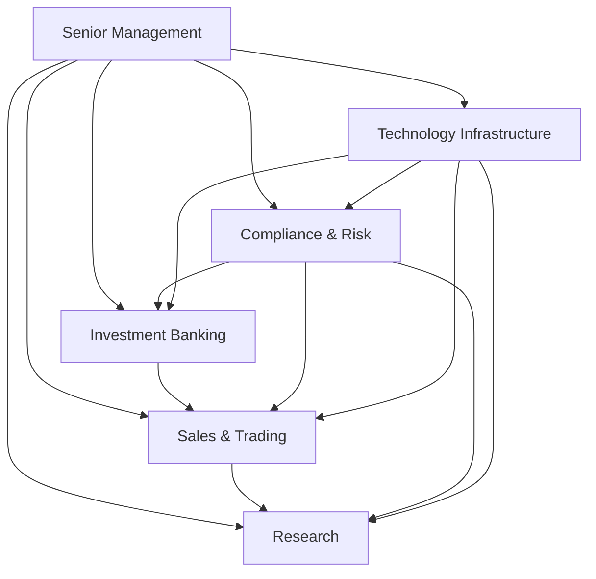

## 27.3 The Organizational Structure of a Sell-Side Trading Firm

Sell-side trading firms are key players in capital markets, facilitating the flow of capital from issuers to investors, and vice versa. While the overarching goal is to support markets and generate revenue, these firms’ internal divisions must coordinate to ensure continuous compliance with Canadian regulations, maintain risk controls, and uphold ethical standards.

In Canada, sell-side firms typically register and operate under the guidelines set by the Canadian Investment Regulatory Organization (CIRO) and must also adhere to provincial securities commissions under the umbrella of the Canadian Securities Administrators (CSA). Broadly, a sell-side trading firm can be divided into the following main areas:

• Investment Banking  
• Sales and Trading  
• Research  
• Compliance and Risk Management  
• Technology Infrastructure  
• Senior Management and Strategy  

Each of these divisions serves distinct yet complementary roles. This section delves into these key functional areas, provides insights on how they interoperate, and highlights best practices and challenges that can arise in their day-to-day activities.

---

### Investment Banking

#### Role and Responsibilities
Investment banking divisions play a pivotal role in connecting companies and governments (issuers) with the capital they need to fund projects, expand operations, or restructure. They handle:  
• Underwriting initial public offerings (IPOs) and follow-on equity offerings.  
• Structuring and issuing debt instruments, such as corporate bonds and debentures.  
• Advising on mergers and acquisitions (M&A).  
• Providing strategic advisory services to corporations and governments.

In Canada, well-known names like RBC Capital Markets and TD Securities lead on many underwriting transactions. These investment banking teams work closely with clients to determine the appropriate issue price, coordinate with legal counsel to finalize offering documents, and market the new securities to institutional and sometimes retail investors.

#### Canadian Regulatory Considerations
• Underwriting and distribution of new securities must comply with CSA regulations, with additional oversight by local securities commissions (e.g., Ontario Securities Commission, Autorité des marchés financiers in Quebec).  
• Investment bankers must ensure the transaction abides by disclosure requirements, including filing a prospectus or offering memorandum.  
• Bank of Canada’s monetary policies indirectly affect underwriting terms, as changes in interest rates can impact the attractiveness of debt.

#### Common Pitfalls and Best Practices
• Pitfall: Mispricing an IPO due to volatile market conditions can damage relationships and reputations.  
• Best Practice: Thoroughly analyze macroeconomic indicators and maintain close communication with buy-side analysts to gauge market appetite.  
• Pitfall: Failing to detect conflicts of interest where a bank might advise both parties in an M&A deal.  
• Best Practice: Implement strong internal information barriers and require employees to disclose personal holdings.

---

### Sales and Trading

#### The Sales Function
The sales team is responsible for building client relationships and distributing both new and secondary-market securities. This team:  
• Develops and nurtures relationships with institutional investors such as pension funds or hedge funds, and sometimes with high-net-worth individuals.  
• Presents investment ideas, facilitates large block trades, and provides market intelligence.  
• Assists in marketing new securities being underwritten by the investment banking division.

#### The Trading Desk
Traders execute orders in equities, fixed income, currencies, and derivatives for clients (agency trades) and often for the firm’s proprietary accounts. Key tasks include:  
• Matching buy and sell orders in the firm’s order book or through exchanges and alternative trading systems (ATS).  
• Monitoring real-time market movements to optimize trade execution.  
• Managing inventory (for market-making desks) and providing liquidity.

Typical desks include:  
• Equity Trading: Stocks, equity derivatives like options, warrants.  
• Fixed-Income Trading: Government bonds, corporate bonds, and money market instruments.  
• Derivatives Trading: Swaps, futures, forwards, and other structured products.

#### Technology and Algorithmic Trading
Sales and trading increasingly depend on robust technology platforms. Algorithmic (algo) trading strategies often rely on high-speed connectivity and proprietary models to identify and capture short-lived arbitrage opportunities. As markets move toward electronification, the technological edge can be a differentiator for sell-side firms.

#### Common Pitfalls and Best Practices
• Pitfall: Poor understanding of a client’s risk tolerance can lead to executing trades misaligned with client objectives.  
• Best Practice: Apply CIRO’s “Know-Your-Client” (KYC) and suitability requirements rigorously—though these are stricter on the retail side, many institutional engagements demand thorough due diligence.  
• Pitfall: Inadequate technology infrastructure can result in trade execution delays or system failures.  
• Best Practice: Continually invest in trading infrastructure, testing back-up systems, and use open-source analytics platforms (e.g., OpenGamma) or commercial solutions like FINCAD to measure and manage risk effectively.

---

### Research Division

#### Objectives and Output
Research analysts provide critical insights and forecasts regarding companies, industries, and macroeconomic trends. Their core functions include:  
• Creating equity and debt research reports with buy, sell, or hold recommendations.  
• Analyzing economic data, interest rates, and currency movements for fixed-income and broader market research.  
• Addressing specialized areas, such as sector-specific research (mining, financial services, technology, etc.).

In Canada, for instance, a research analyst might focus on major banks like RBC or TD, discussing their quarterly earnings, competitive edge, or new lines of business, and projecting future performance given interest rate forecasts from the Bank of Canada.

#### Conflicts of Interest Management
Though research divisions are integral, they can spark potential conflicts of interest if they overly align with investment banking deals. Strict regulations and firewall policies—often referred to as “Chinese walls”—ensure:  
• Research independence from the investment banking team.  
• Prohibition of undue influence on analysts’ recommendations by other internal departments.  
• Compliance checks for receiving inside information from corporate clients.

#### Best Practices
• Conduct thorough due diligence using both quantitative models and on-the-ground insights, such as site visits and management interviews.  
• Maintain impartiality to preserve the reliability and integrity of research outputs.  
• Incorporate relevant data from external sources, like the Bank of Canada’s Economic Indicator series or public disclosures from SEDAR (System for Electronic Document Analysis and Retrieval).

---

### Compliance and Risk Management

#### The Importance of Compliance
Compliance teams ensure that all divisions adhere to CIRO, CSA, and internal policies. Responsibilities include:  
• Monitoring trading activities for suspicious patterns and potential market abuse.  
• Ensuring regulatory filings and disclosures are submitted accurately and on time.  
• Training staff on ethical standards, anti-money laundering (AML) requirements, and insider trading rules.

#### Risk Management Functions
Risk management often operates alongside compliance but with a slightly different mandate, focusing on:  
• Market Risk: Exposure from price fluctuations of assets.  
• Credit Risk: Potential default from counterparties in derivative contracts or bond issuances.  
• Operational Risk: Failures stemming from inadequate or failed internal processes, human errors, or system constraints.

Firms leverage advanced risk analytics tools—both proprietary and third-party solutions, such as FINCAD or OpenGamma—to measure Scenario Value-at-Risk (VaR) or conduct stress tests against interest rate hikes or market downturns.

#### Key Challenges
• Keeping up with evolving rules: Canadian securities regulations often change in response to international trends, making continuous monitoring essential.  
• Implementing robust technology: Automated compliance platforms can flag suspicious activity yet require thorough configuration and oversight.  
• Balancing risk appetite: Senior management must set acceptable risk limits to align with strategic goals without compromising the firm’s financial standing or regulatory compliance.

---

### Technology Infrastructure

#### Core Systems
A sell-side trading firm’s operational efficiency and competitiveness hinge on a solid technology framework. Key elements include:  
• Trading Platforms and Order Management Systems (OMS).  
• High-Frequency Trading (HFT) networks and co-location facilities for low-latency execution.  
• Data Warehousing and Analytics for real-time risk monitoring.  

#### Cybersecurity
With increasing reliance on digital solutions, cybersecurity has become paramount. Firms need robust firewalls, encryption protocols, and continuous monitoring to protect sensitive client data and prevent breaches.

#### Operational Risk Mitigation
Technology can be a double-edged sword. While it streamlines order execution and risk analysis, technical glitches or system failures can lead to operational chaos. Backup servers, disaster recovery sites, and well-documented contingency plans form the core of risk mitigation strategies.

---

### Senior Management and Strategy

#### Leadership Role
Senior management sets the strategic vision and culture of the firm, balancing profit-driven objectives with regulatory and ethical obligations. Whether deciding expansion into new product lines or implementing cost-saving measures, management must align each department—investment banking, sales, trading, research, compliance, and technology—for integrated success.

#### Policy and Ethics
• Promote an ethical culture: Ensure employees understand that ethical behavior is non-negotiable.  
• Oversee corporate governance: This includes setting up committees for audit, risk, and compliance oversight.  
• Stay ahead of trends: Monitor global and Canadian economic indicators, government policy changes, and shifting market dynamics.

#### Organizational Hierarchy Overview (Diagram)

Below is a simplified Mermaid diagram showing how a typical sell-side trading firm might structure its core departments. The exact organization varies by firm size and strategy, but the fundamental divisions remain the same.

In this diagram, Senior Management provides strategic direction to all groups. Investment Banking, Sales and Trading, and Research collaborate to offer clients diverse financial services while remaining supervised by Compliance and Risk. Technology Infrastructure underpins every department with essential systems and security.

---

### Practical Examples and Case Studies

1. RBC Capital Markets:  
   • RBC, one of Canada’s largest banks, has a significant global presence in investment banking. Their capital markets division specializes in underwriting equity and debt offerings for global and Canadian clients.  
   • Example: Underwriting an initial public offering (IPO) for a mid-tier Canadian mining company, leveraging RBC Research analysts’ expertise in the sector.  

2. TD Securities:  
   • Known for strong fixed-income trading and corporate advisory, TD Securities excels in structuring complex derivative products to hedge currency and interest-rate risks.  
   • Example: Providing a tailored interest-rate swap for a pension fund seeking to mitigate inflation risk through the use of specialized derivative contracts.

---

### Actionable Insights and Best Practices

• Maintain robust information barriers between research, investment banking, and sales/trading to prevent conflicts of interest.  
• Continuously enhance technology platforms to stay competitive, using real-time data analytics and advanced risk models.  
• Adhere strictly to CIRO guidelines and CSA regulations, implementing ongoing AML checks, finite risk limits, and conflict-of-interest disclosures.  
• Foster a culture of open communication and teamwork across divisions to provide top-tier client service while ensuring regulatory compliance.  
• Utilize open-source tools (e.g., OpenGamma) to augment or validate proprietary risk analytics, especially under tight budgets.

---

### Summary

The organizational structure of a sell-side trading firm aligns various specialized departments to efficiently underwrite, distribute, and facilitate trading of securities in the Canadian market. Investment banking, sales, trading, research, and compliance divisions each have distinctive roles, yet rely heavily on centralized technology infrastructure and guiding strategies from senior management.  

In a regulated environment like Canada’s, success hinges on seamless collaboration among all teams while upholding exacting ethical and legal standards. As markets continue evolving—through shifts in technology, regulation, and client demands—sell-side firms must adapt by investing in innovative solutions and prudent risk management, ensuring the industry remains a cornerstone for capital allocation.

---

## Quiz: Organizational Structure in Sell-Side Trading Firms



### Which division of a sell-side trading firm typically handles the underwriting of new securities such as IPOs?

- [ ] Research
- [x] Investment Banking
- [ ] Sales
- [ ] Compliance

> **Explanation:** Investment banking is responsible for underwriting new securities like IPOs, advising on mergers and acquisitions, and structuring debt offerings.

### What is the main function of a sales desk within a sell-side firm?

- [x] Building and maintaining client relationships
- [ ] Executing algorithmic trades
- [ ] Monitoring internal compliance
- [ ] Managing research reports

> **Explanation:** The sales desk focuses on developing client relationships, facilitating trades, and communicating investment opportunities to institutional and sometimes retail clients.

### Which regulatory authority in Canada oversees investment dealer operations?

- [x] CIRO
- [ ] SEC
- [ ] FINRA
- [ ] ESMA

> **Explanation:** The Canadian Investment Regulatory Organization (CIRO) regulates and oversees the operations of investment dealers in Canada.  

### What does “operational risk” primarily refer to in a sell-side firm?

- [x] Risk of loss from inadequate or failed internal processes, people, or systems
- [ ] Risk of client default
- [ ] Risk of price fluctuation
- [ ] Risk arising from regulatory changes

> **Explanation:** Operational risk involves internal failures such as system outages, human errors, or process breakdowns, as opposed to market or credit risks.

### Which department in a sell-side firm is primarily responsible for analyzing and providing recommendations on companies and industries?

- [ ] Compliance
- [ ] Investment Banking
- [x] Research
- [ ] Sales

> **Explanation:** The research department analyzes companies, industries, and macroeconomic trends, then publishes recommendations (buy, sell, hold) for investors.

### What is a key way to prevent conflicts of interest between research and investment banking divisions?

- [x] Implementation of information barriers (Chinese walls)
- [ ] Using the same software platform for both divisions
- [ ] Having researchers report directly to investment bankers
- [ ] Restricting communication between legal teams

> **Explanation:** Information barriers (Chinese walls) are used to protect the independence of research from undue influence by investment banking or sales teams.

### Which of the following best describes the role of senior management in a sell-side trading firm?

- [x] Setting overall policy, culture, and strategic direction
- [ ] Day-to-day trade execution
- [x] Overseeing compliance and risk governance
- [ ] Creating research reports

> **Explanation:** Senior management focuses on the broader strategic objectives, ethical standards, policy-making, and oversight of risks and compliance, rather than daily operational tasks.

### Why is technology infrastructure critical for a sell-side firm?

- [ ] It is only needed for regulatory filing requirements
- [ ] It mostly pertains to the marketing activities of the firm
- [ ] It is irrelevant for risk management
- [x] It underpins trading, risk analytics, and customer data security

> **Explanation:** Technology infrastructure provides the backbone for rapid and secure trade execution, risk analytics, and data management. Proper systems are crucial to maintain competitiveness and compliance.

### Which of the following evokes the supervisory oversight for new security offerings in Canada?

- [ ] The U.S. Federal Reserve
- [x] Provincial securities commissions under the CSA
- [ ] FINRA
- [ ] The European Central Bank

> **Explanation:** In Canada, securities are regulated at the provincial level under the Canadian Securities Administrators (CSA), in coordination with various entities such as CIRO.

### The “sales and trading” division executes trades and often suggests investment ideas to clients.  
- [x] True
- [ ] False

> **Explanation:** Sales and trading desks do both: They facilitate client trades in various markets and offer clients insights or specific investment ideas, often relying on research.



---

