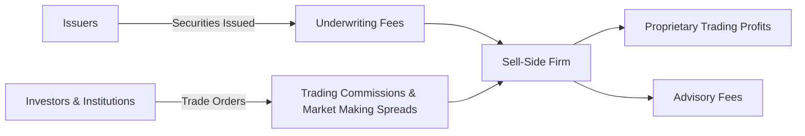

## 27.4 The Revenue Sources for Sell-Side Trading Firms

Sell-side trading firms, such as investment banks and broker-dealers, occupy a pivotal role in Canada’s capital markets by connecting issuers with investors and facilitating the buying and selling of securities. Their services extend across a wide range of activities, and their revenue is derived from fees, spreads, and trading gains. This section explores how these firms generate income while balancing regulatory constraints, client facilitation needs, and prudent risk management.

---

## Underwriting Fees

Underwriting fees typically represent a significant revenue source for sell-side trading firms. When a company decides to issue new securities, whether stocks or bonds, an investment dealer or an investment bank serves as the underwriter, purchasing the securities from the issuer and reselling them to investors. The underwriter charges an underwriting fee, which compensates the firm for:

• The financial risk it assumes by committing to buy the newly issued securities.  
• Providing strategic advice and valuation expertise.  
• Coordinating legal, accounting, and other administrative tasks.  

### The Role of an Underwriting Syndicate

Often, large issuances are too big for a single firm to handle. In such cases, several investment dealers form an underwriting syndicate. This syndicate spreads out the risks and responsibilities of underwriting among multiple parties. Firms in the syndicate collectively commit capital to the issue and share the fees in proportion to their participation.

• This approach mitigates individual firm risk and can broaden the distribution network.  
• Participants rely on each other’s networks, offering the issuer more comprehensive market coverage.

### Canadian Context and Regulations

In Canada, underwriters must adhere to rules set by the Canadian Securities Administrators (CSA) and monitored by the Canadian Investment Regulatory Organization (CIRO). These rules include minimum capital requirements, disclosure obligations, and best practices for underwriting processes. Firms also abide by guidelines from the Office of the Superintendent of Financial Institutions (OSFI) if they are part of a federally regulated financial institution.  

---

## Trading Commissions

Trading commissions are earned when sell-side firms execute trades on behalf of clients, such as retail investors, institutional investors, or pension funds. Commissions can be based on:

• The monetary value of the trade.  
• The number of shares or bonds traded.  
• A fixed commission schedule established by the brokerage house.  

Because commissions are tied to trading volume and frequency, revenue from this stream can fluctuate significantly depending on market sentiment and volatility. During periods of economic uncertainty or market opportunity, trading volumes often rise, driving higher commissions.

### Commission-Based Accounts vs. Fee-Based Accounts

Sell-side firms can earn commissions in both full-service brokerage and discount brokerage models. Full-service brokerage typically charges higher commission fees in exchange for research, advice, and personalized service. Meanwhile, online brokerage or discount brokerage platforms offer lower commission rates, focusing on trade execution with limited advice.  

In recent years, some investors and institutions have shifted to fee-based models (as discussed in Chapter 25), where advisory services are offered for an annual fee based on the size of assets under management (AUM). Even so, commissions remain a key revenue source for transaction-based relationships.

---

## Proprietary Trading

Proprietary trading refers to using the firm’s own capital to trade securities, derivatives, or other financial instruments in the market. The objective is to generate profits from short-term price movements or arbitrage opportunities. 

### Regulatory Constraints and Risk Management

Regulatory agencies, including CIRO and OSFI, impose net capital requirements and liquidity coverage ratios (LCR) to ensure that proprietary trading does not jeopardize the overall financial stability of the firm. Additionally, proprietary trading desks operate under strict internal risk limits to mitigate market and credit risks. In Canada, dealers must maintain sufficient capital reserves to cover potential trading losses.

### Potential Gains vs. Operational Risk

While proprietary trading can yield substantial profits, it also carries higher volatility. In periods of heightened market turbulence, losses can quickly accumulate if trades move in the wrong direction. Therefore, successful proprietary trading operations maintain:

• Sound risk-adjusted strategies.  
• Real-time risk monitoring systems.  
• Rigorous oversight by compliance and risk management teams.  

---

## Market Making (Spread Income)

Market making involves continuously quoting both a bid and an ask price for specific securities, aiming to provide liquidity to the marketplace. Market makers earn revenue from the spread—the difference between the bid (the price at which the firm is willing to buy) and the ask (the price at which the firm is willing to sell).

### The Importance of Liquidity

By acting as market makers, big investment dealers, and in some cases specialized brokerage firms, help ensure that markets remain liquid. This function is critical for investors who want to buy or sell securities quickly without causing large price swings. Market making can be particularly profitable when:

• Trading volumes are high, leading to more buy-and-sell transactions.  
• Spreads are wide because of market volatility or lesser-known securities with low liquidity.  

However, market makers also face risk. Maintaining an inventory of securities can lead to losses if market conditions shift unexpectedly.  

### Spread Dynamics

The spread that a market maker earns depends on:  
1. The stock’s bid-ask spread prescribed by market forces (i.e., supply and demand).  
2. Competitive pressures, since other market makers may also quote prices.  
3. The market maker’s assessment of risk and volatility in holding the inventory.  

---

## Advisory Fees

Advisory fees for investment banking services, such as merger and acquisition (M&A) advisory and capital-raising consultations, constitute another profitable revenue stream for sell-side firms. Canadian banks and independent investment dealers alike offer:

• Strategic reviews of potential M&A targets.  
• Assistance with due diligence and valuation.  
• Guidance through complex regulatory processes.  

When significant corporate transactions occur—such as when a major Canadian corporation acquires an international subsidiary—sell-side firms stand to earn substantial advisory fees. The exact fee structure often comprises a retainer plus a success fee, which is typically a percentage of the total transaction value upon deal completion.

---

## Balancing Risk and Reward

Because sell-side firms have multiple revenue sources, they must balance risk across these diverse activities. During times of high market volatility, market-making and proprietary trading can be highly profitable but also expose the firm to elevated risk. Conversely, underwriting fees and advisory fees may remain robust even when trading revenues dip, particularly if companies continue to raise capital or engage in M&A transactions.

### Impact of Economic Cycles

Revenue streams can fluctuate with economic cycles:  
• In bullish markets, trading volumes and underwriting activities often soar.  
• In bearish or volatile markets, commission income might rise momentarily if trade volumes increase, but underwriting deals may slow, and proprietary trading may become more unpredictable.

### Regulatory Influence

OSFI’s liquidity coverage ratio (LCR) rules, combined with CIRO’s oversight of net capital requirements, heavily influence how much capital a firm can allocate toward proprietary trading or market-making. These frameworks help ensure that firms maintain the capacity to meet short-term obligations and protect clients’ interests.

---

## Practical Example: RBC as a Market Maker and Underwriter

To illustrate these concepts, consider Royal Bank of Canada (RBC), one of the largest financial institutions in the country:

1. **Underwriting Fees**: RBC Capital Markets ranks among the top underwriters for both equity offerings and debt issuance in Canada, earning fees from corporate issuers and government entities.  
2. **Trading Commissions**: RBC Direct Investing offers self-directed brokerage accounts, collecting commissions on every executed trade.  
3. **Proprietary Trading**: RBC may engage in proprietary trading activities within set risk limits, capitalizing on market movements.  
4. **Market Making**: RBC often serves as a designated market maker for many Canadian equities, posting bids and asks throughout the trading day.  
5. **Advisory Fees**: RBC’s investment banking arm frequently advises on high-profile M&A transactions, drawing considerable fees for strategic and financial advisory services.

---

## Visualizing Revenue Sources

Below is a simple Mermaid diagram illustrating how sell-side trading firms generate and manage their revenue streams:

Explanation:  
• Issuers raise capital, sell-side firms earn underwriting fees (B).  
• Investors and institutions place trades, creating trading commissions and market-making opportunities (D).  
• The sell-side firm engages in proprietary trading, which can yield profits or losses (E).  
• Advisory engagements occur in parallel for M&A and other corporate activities (F).

---

## Common Pitfalls and Best Practices

### Pitfalls

• **Overreliance on a Single Revenue Stream**: Depending too heavily on proprietary trading or underwriting can expose the firm to cyclical downturns.  
• **Insufficient Risk Controls**: Risk management deficiencies in proprietary trading or market-making can lead to large, unexpected losses.  
• **Undercapitalization**: Failing to meet regulatory capital and liquidity requirements can result in sanctions or reduced operational flexibility.  
• **Conflict of Interest**: Operating simultaneously as underwriter, market maker, and proprietary trader must be managed carefully to avoid unethical or conflicting activities.

### Best Practices

• **Diversify Revenue Sources**: Maintain a balanced mix of trading commissions, underwriting, advisory, and market-making revenues.  
• **Strong Compliance Culture**: Ensure that staff are trained to abide by CIRO guidelines, CSA rules, and internal codes of ethics.  
• **Robust Risk Oversight**: Continuously update model assumptions, set prudent risk limits, and monitor exposure in real time.  
• **Transparent Fee Structures**: Provide clear disclosures to clients regarding fees and potential conflicts of interest.

---

## Applications and Real-World Scenarios

• **Canadian Pension Funds**: Large pension funds (e.g., CPP Investments, Ontario Teachers’ Pension Plan) typically rely on sell-side firms for trade execution in both the equity and fixed-income markets. Superior execution, made possible by these firms’ liquidity and market-making operations, can reduce overall transaction costs for the pension funds.  
• **Mid-Market Growth Companies**: Companies planning an IPO or secondary offering often partner with regional investment dealers in underwriting syndicates to ensure broad distribution and shared underwriting risk.  
• **Cross-Border M&A**: A Canadian company acquiring a U.S. entity might hire a sell-side firm for cross-border advisory services, exemplifying how advisory fees become a crucial revenue stream when capital market activity is booming.  

---

## Steps to Manage and Maximize Revenue

1. **Assess Market Conditions**: Monitor economic indicators, investor sentiment, and volatility metrics to calibrate underwriting schedules and proprietary trading positions.  
2. **Align Risk Limits**: Continuously align internal risk thresholds with regulatory mandates, adjusting positions in proprietary trading to reflect market conditions.  
3. **Maintain Capital Buffer**: Retain sufficient capital to meet OSFI’s LCR requirements and CIRO’s net capital requirements, ensuring resilience in market downturns.  
4. **Foster Client Relationships**: A strong reputation for client service can boost underwriting mandates, trading volumes, and advisory assignments.  
5. **Leverage Technology**: Implement sophisticated trading platforms and analytics to improve execution quality, monitor risk in real-time, and maintain a competitive edge.

---

## Summary

Sell-side trading firms in Canada—whether specialized broker-dealers or large integrated investment banks—generate revenues from a variety of sources: underwriting fees, trading commissions, proprietary trading profits, market-making spreads, and advisory fees. Each revenue stream offers distinct advantages and risks, and their relative importance can shift with market conditions. Proper governance and strict regulatory oversight from CIRO, OSFI, and CSA help ensure that firms balance profitability with prudent risk management, thus contributing to a stable and efficient capital market ecosystem.

---

## Further Resources and References

• CIRO Rules on Underwriting and Capital Requirements:  
  <https://www.ciro.ca/>

• Office of the Superintendent of Financial Institutions (OSFI) for banking regulation in Canada:  
  <https://www.osfi-bsif.gc.ca/>

• “The Handbook of Fixed Income Securities” by Frank J. Fabozzi for detailed insights into underwriting syndicates and bond market-making.

• Basel Committee on Banking Supervision frameworks:  
  Provides global standards for bank capital adequacy, stress testing, and liquidity requirements.

---

## Challenge Your Understanding: Revenue Sources in Sell-Side Trading Firms



### Which primary function earns revenue for sell-side firms through underwriting?
- [ ] Proprietary trading for the firm’s own account.
- [x] Issuing and distributing new securities for corporate clients.
- [ ] Collecting swap transaction fees.
- [ ] Trading with high-frequency algorithms.

> **Explanation:** Underwriting fees are generated by facilitating security issuance for corporate clients, rather than trading solely for the firm’s own account.

### What is the primary source of revenue when a firm consistently quotes both bid and ask prices in a security?
- [x] The difference between bid and ask prices (the spread).
- [ ] Commissions on each trade executed.
- [ ] Interest from holding inventory long term.
- [ ] Advisory fees from corporate finance deals.

> **Explanation:** Market makers earn the spread, which is the difference between the bid price and the ask price, by providing liquidity to the marketplace.

### In Canada, which regulatory bodies primarily oversee underwriting and capital requirements for sell-side firms? 
- [x] CSA and CIRO, with additional guidelines from OSFI for banks.
- [ ] The US Securities and Exchange Commission (SEC).
- [ ] The European Central Bank (ECB).
- [ ] World Trade Organization (WTO).

> **Explanation:** In Canada, the Canadian Securities Administrators (CSA) and the Canadian Investment Regulatory Organization (CIRO) have primary oversight, and OSFI governs banks’ capital and liquidity requirements.

### During periods of high market volatility, sell-side firms can experience:
- [x] Potentially higher profits from proprietary trading but also greater risk exposure.
- [ ] Lower revenues from market making due to wider spreads.
- [ ] Zero underwriting fees, regardless of market conditions.
- [ ] A mandatory suspension of trading activities.

> **Explanation:** High volatility can increase trading opportunities for sell-side firms, but it also increases the potential for large losses, especially in proprietary trading and market-making positions.

### Which factor below is most commonly used to determine the size of trading commissions?
- [x] The value or volume of the trade.
- [ ] The financial advisor’s personal relationship with the client.
- [x] Negotiated agreements between the broker and the client.
- [ ] The credit rating of the security being traded.

> **Explanation:** Commission structures can vary widely—some are based on the dollar value of the transaction, some on the number of shares, and others might be negotiable as part of a larger client relationship.

### Why do underwriting syndicates form for large securities issuances?
- [x] To distribute the risk among multiple investment dealers.
- [ ] To limit the distribution of securities to select investors.
- [ ] To avoid compliance with CIRO regulations.
- [ ] To achieve higher underwriting fees.

> **Explanation:** Underwriting syndicates share the underwriting responsibilities, spreading risk across multiple firms and widening the distribution base for the issuance.

### The Liquidity Coverage Ratio (LCR) is designed to ensure that a sell-side firm:
- [x] Holds sufficient high-quality liquid assets to cover short-term obligations.
- [ ] Avoids entering into any proprietary trades.
- [x] Simplifies its fee structure for clients.
- [ ] Eliminates underwriting fees during market downturns.

> **Explanation:** The LCR requires institutions to maintain adequate high-quality liquid assets to withstand a short-term liquidity stress scenario, ensuring market stability.

### What is the main drawback of proprietary trading for sell-side firms?
- [x] The potential for large losses under volatile market conditions.
- [ ] The inability to trade on behalf of clients.
- [ ] The elimination of underwriting opportunities.
- [ ] The prohibition of collecting market making spreads.

> **Explanation:** While proprietary trading can yield substantial profits, it also carries the inherent risk of significant losses if the market moves against the firm’s positions.

### How do fee-based advisory services differ from commission-based services?
- [x] Fee-based services often charge a set percentage of assets under management regardless of transaction volume.
- [ ] Fee-based services earn revenue only through commissions on trades.
- [ ] Fee-based models prohibit the use of mutual funds.
- [ ] Commission-based services must adopt a fiduciary standard.

> **Explanation:** Fee-based accounts typically charge an ongoing fee tied to assets under management (AUM) rather than earning commissions on each transaction, providing an alternative compensation model.

### A sell-side firm’s advisory fees are most often based on:
- [x] A retainer plus a success fee as a percentage of the transaction’s value.
- [ ] The number of trades executed in a given period.
- [ ] The firm’s proprietary trading profits.
- [ ] The provincial government’s regulatory requirements.

> **Explanation:** For major mergers and acquisitions or capital-raising consulting, firms often charge a base retainer and then a success fee that is calculated as a percentage of the transaction’s total value upon completion.



---

## For Additional Practice and Deeper Preparation

**Elevate your exam readiness with our comprehensive app, "Securities CA: Mock Exams," designed to challenge and refine your skills.**

* **Master Challenging Questions:** Dive into expertly crafted sample exam questions that go beyond standard references.
* **Scenario-Driven Learning:** Experience scenario-driven case questions and in-depth solutions to build practical expertise.
* **Sharpen Exam Strategies:** Build confidence with step-by-step explanations designed to refine your exam-day tactics.
* **Gain Real-World Insights:** Acquire practical tips and detailed rationales that demystify complex concepts.
* **CIRO and CSI Alignment:** Stay current with CIRO guidelines and CSI’s exam structure, with questions intentionally more challenging than the actual exam.

**Download the App Today:**

> Note: While these courses are specifically crafted to align with the CSC® exams outlines, they are independently developed and not endorsed by CSI or CIRO.
