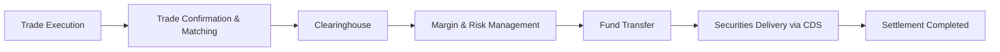

## 27.5 Institutional Clearing and Settlement

Institutional clearing and settlement processes play a critical role in maintaining the stability and credibility of Canada's capital markets. Whether trades involve equities, corporate bonds, or government debt, the smooth transfer of securities ownership and cash is paramount. This section provides a comprehensive overview of how large-scale transactions are cleared and settled, highlighting the roles of key institutions such as the Canadian Depository for Securities (CDS), clearinghouses, and other operational infrastructure. We also explore risk management principles, best practices, and real-world Canadian examples to illustrate how seamless clearing and settlement fosters an efficient marketplace.

---

## Overview of Clearing and Settlement

Clearing and settlement refer to the post-trade processes that confirm, match, and finalize the exchange of securities for payment between trading counterparties. In Canada, these processes typically involve:

• Depositories (e.g., CDS) for centralized custody and record-keeping of securities.  
• Clearinghouses that interpose themselves between buyers and sellers, guaranteeing the trade and mitigating counterparty risk.  
• Financial institutions’ back offices that reconcile trade details, fund movements, and ensure compliance with regulatory requirements.

### Trade Confirmation and Matching

After a trade is executed, the buyer and seller must confirm the details of the transaction—such as price, quantity, and settlement date. This process involves automated matching systems:

1. Trade capture: Trades are recorded in each party’s internal system.  
2. Trade confirmation: Counterparties validate the trade details.  
3. Trade matching: Automated systems match the provided trade details to ensure there are no discrepancies.

Once trades are matched, they move to the clearing phase, where the clearinghouse intercedes to manage payment and securities delivery.

---

## Role of the Clearinghouse

A clearinghouse serves as an intermediary that guarantees performance on both sides of a trade. By stepping between buyer and seller as the “central counterparty,” the clearinghouse offers protection from the risk that one party may default. In Canada, the central clearinghouse for most equity and fixed-income instruments is the CDS. However, for certain derivative transactions, other clearing platforms (e.g., the Canadian Derivatives Clearing Corporation, or CDCC) are also relevant.

### Risk Mitigation Through Margin and Collateral

Clearinghouses demand margin (or collateral) as insurance against default. Margin requirements align with the level of risk associated with positions held by clearing participants. When asset values fluctuate, the clearinghouse may issue a margin call to ensure that each participant continues to meet collateral requirements.

Risk management measures may include:  
• Initial Margin: Collected at trade initiation, reflecting the clearinghouse’s estimate of potential price movements.  
• Variation Margin: Adjustments to maintain margin requirements as security prices move.  
• Default Funds: Many clearinghouses also maintain a shared fund contributed by participants, used if a member’s margin proves insufficient.

---

## The Canadian Depository for Securities (CDS)

### Centralized Custody and Settlement

CDS is Canada’s primary clearing and settlement hub for equity, debt, and money market instruments. The organization provides a centralized ledger that tracks ownership changes and processes corporate actions (e.g., dividends, interest payments, and redemptions). By doing so, CDS reduces inefficiencies and errors that might otherwise occur if numerous parties held physical certificates.

### Settlement Cycles

• T+2: Most Canadian equity and corporate bond trades settle on a T+2 cycle, meaning two business days after the trade date.  
• T+1: Government debt instruments often settle one business day after the trade date (T+1), reflecting their traditionally higher liquidity and lower counterparty risk profile.

Aligning with international standards, these settlement cycles expedite the transfer of ownership, reduce outstanding risk, and improve market efficiency.

---

## Operational Flow of Institutional Clearing and Settlement

Below is a simplified diagram outlining how trades move from execution through to clearing and settlement:

1. Trade Execution: Institutional traders buy or sell securities on an exchange or alternative trading system (ATS).  
2. Trade Confirmation & Matching: The trade is captured, confirmed, and matched between the buyer and seller.  
3. Clearinghouse: The clearinghouse steps in as central counterparty.  
4. Margin & Risk Management: Margin requirements must be met to mitigate potential default risk.  
5. Fund Transfer: The buyer’s funds are transferred (often through a commercial bank).  
6. Securities Delivery via CDS: CDS debits the seller’s securities account and credits the buyer’s account accordingly.  
7. Settlement Completed: Ownership passes to the buyer, and funds to the seller.

---

## Risk Management in Clearing Operations

Effective risk management is vital to maintain the integrity of the Canadian financial system, ensuring that even in times of market disruptions, trades can be fulfilled. Key elements include:

### Margin Requirements

Margin ensures that parties can cover potential losses caused by adverse price movements. Clearing participants must monitor margin requirements in real-time, particularly in volatile markets.

### Collateral Management

In addition to cash, collateral can include government bonds or other low-risk assets. Institutions must evaluate the quality and liquidity of collateral to ensure it can be quickly liquidated if necessary.

### Mark-to-Market

Clearinghouses often require participants to mark their positions to market daily, comparing the current market value of securities against the margin posted. This process guards against accumulated exposures over time.

---

## Importance of Efficient Post-Trade Operations

A streamlined and robust clearing and settlement infrastructure:

• Reduces settlement risk: By ensuring all parties can fulfill obligations, market participants gain confidence in the system.  
• Enhances liquidity: Adequate post-trade processes encourage institutions to trade more often, knowing that the mechanisms for delivery and settlement are reliable.  
• Aligns with regulatory harmony: Canada’s alignment with international standards (e.g., T+2) fosters more global participation and competitiveness.

### Impact on Institutional Investors

Institutional investors—including pension funds, mutual funds, hedge funds, and insurance companies—depend on swift, secure settlement to rebalance portfolios, deploy new capital, and exit positions. Delays or failures in settlement can lead to reputational harm, financial loss, and regulatory scrutiny.

### Technology and Compliance

Institutions employ advanced back-office and middle-office systems to automate settlement tasks and maintain compliance with CIRO and Canadian Securities Administrators (CSA) rules. Emerging technologies like distributed ledger solutions may further enhance security and efficiency in the post-trade environment in the coming years.

---

## Practical Example: Canadian Pension Fund

Consider a large Canadian pension fund, such as the Canada Pension Plan Investment Board (CPPIB). Suppose CPPIB decides to purchase 2 million shares of a major Canadian bank (e.g., RBC) on a Monday (Trade Date = T). For T+2 settlement:

1. On Tuesday, the clearing process begins. CDS registers the trade details, and the clearinghouse calculates margin requirements for the broker facilitating the transaction.  
2. CPPIB ensures funds are available in its custodian bank account, while RBC shares are set aside in the seller’s account.  
3. By the end of Wednesday (T+2), the transaction settles; CDS debits the seller’s securities account and credits CPPIB's account. The pension fund’s custodian simultaneously transfers the requisite cash amount to the seller.

This seamless process, supported by well-structured clearing systems and regulatory mandates, ensures CPPIB gains legal ownership of the RBC shares without unexpected delays or costs.

---

## Regulatory Framework and Compliance

### CIRO and CSA Oversight

In Canada, the Canadian Investment Regulatory Organization (CIRO) sets margin and clearing rules, among other regulatory responsibilities. The Canadian Securities Administrators (CSA) also issues national instruments and policy guidance affecting clearing and settlement. Compliance with these regulations ensures that institutions keep adequate records, meet capital requirements, and protect client assets.

### Other Global Institutions

While Canadian markets primarily rely on CDS, there is also collaboration and recognition of the Depository Trust & Clearing Corporation (DTCC) in the U.S. and other international clearinghouses. This cross-border cooperation is key for Canadian institutions that transact globally.

---

## Best Practices and Common Pitfalls

### Best Practices

• Maintain robust back-office operations: Automate reconciliation, trade matching, and settlement instructions to minimize human errors.  
• Monitor collateral daily: Ensure margin calls are promptly met, and collateral is appropriately diversified.  
• Adhere to T+2 and T+1 deadlines: Confirm trade details as quickly as possible to avoid settlement delays.  
• Stay updated with regulations: Any changes in CIRO or CSA requirements must be integrated swiftly into operational workflows.

### Common Pitfalls

• Neglecting margin calls: Failing to meet a margin call can trigger penalties or a forced liquidation of positions.  
• Inadequate technology: Outdated systems can cause settlement failures, leading to reputational damage.  
• Poor communication: Gaps in communication between trading desks, back offices, and custodians can result in unmatched trades and settlement delays.

---

## Applying These Principles

For Canadian institutions—whether large asset managers or smaller specialized investment firms—understanding and optimizing clearing and settlement operations can be a competitive advantage. By streamlining post-trade processes, firms can reduce operational risk, enhance portfolio liquidity, and build trust with counterparties.

Institutions are encouraged to:  
• Review internal systems for alignment with CDS functionalities.  
• Establish clear risk management protocols for margin and collateral.  
• Regularly train employees on settlement cycles and regulatory reporting obligations.  
• Consider technology upgrades or vendor solutions to automate and standardize back-office tasks.

---

## Glossary

• **Clearinghouse:** An intermediary that matches and confirms trades, collects margins, and ensures the financial integrity of transactions.  
• **CDS (Canadian Depository for Securities):** The main Canadian clearing and settlement system for equities, debt, and money market instruments.  
• **T+2 Settlement Cycle:** Securities transactions must settle two business days following the trade date.  
• **Margin Call:** A demand by a clearinghouse or broker for additional capital when the value of collateral drops below required levels.

---

## Additional Resources

• [CDS Information and Services](https://www.cds.ca/) – Official website of the Canadian Depository for Securities.  
• [CIRO](https://www.ciro.ca/) – Regulatory updates, margin requirements, and clearing rules.  
• Clearing Services for Global Markets by Dermot Turing – A comprehensive international perspective on clearing operations.  
• [Depository Trust & Clearing Corporation (DTCC)](https://www.dtcc.com/) – U.S.-based clearinghouse solutions for cross-border transactions.

---

## Summary

Institutional clearing and settlement form the bedrock of confidence and efficiency in Canada's financial markets. Ensuring trades are properly matched, risk is mitigated through margin requirements, and final ownership transfers occur on time is essential to maintaining liquidity and trust. By adhering to regulatory guidelines, investing in robust back-office infrastructure, and maintaining active risk oversight, institutions can meet evolving market demands and effectively serve their clients.

Institutions should continually refine their clearing and settlement processes, drawing on best practices and adapting to any technological or regulatory shifts. Successful post-trade operations can significantly enhance competitiveness, reduce losses, and build long-term relationships with counterparties in Canada’s vibrant and well-regulated capital markets.

---

## Test Your Knowledge: Institutional Clearing and Settlement Essentials



### Which Canadian organization primarily handles clearing and settlement for equities and debt instruments?

- [x] CDS
- [ ] DTCC
- [ ] Canada Revenue Agency
- [ ] OCC

> **Explanation:** The Canadian Depository for Securities (CDS) is the central hub for clearing and settling equity and debt transactions in Canada.

### What is the most common settlement cycle for equities in Canada?

- [ ] T+1
- [x] T+2
- [ ] T+3
- [ ] T+5

> **Explanation:** Equities in Canada typically settle on a T+2 basis, meaning two business days after the trade date.

### How does a clearinghouse help reduce counterparty risk?

- [x] It acts as the buyer to every seller and the seller to every buyer.
- [ ] It only processes trades below a certain threshold.
- [ ] It eliminates the need for collateral posting.
- [ ] It charges higher fees to less creditworthy participants.

> **Explanation:** By standing in the middle of a transaction, the clearinghouse ensures that if one party defaults, the other party is still protected.

### When the value of collateral falls below a set threshold, what action might a clearinghouse take?

- [x] Issue a margin call
- [ ] Terminate the trade
- [ ] Refuse future trades
- [ ] Reverse the original transaction

> **Explanation:** A margin call requires additional funds or collateral from the participant to maintain the required margin level.

### Which of the following is a key benefit of an efficient clearing and settlement system?

- [x] Increased market liquidity
- [ ] Longer settlement timelines
- [x] Reduced operational risk
- [ ] Higher transaction fees

> **Explanation:** Streamlined post-trade operations lower operational risk and encourage more frequent trading, thus boosting liquidity.

### Which organization oversees margin and clearing rules in Canada?

- [x] CIRO
- [ ] International Monetary Fund
- [ ] Bank for International Settlements
- [ ] CRA

> **Explanation:** The Canadian Investment Regulatory Organization (CIRO) sets margin and clearing guidelines, among other regulatory responsibilities.

### Which term describes the process of updating the current market value of a security to ensure margin requirements remain accurate?

- [ ] Variation margin
- [x] Mark-to-market
- [ ] Settlement risk adjustment
- [ ] Net margining

> **Explanation:** Mark-to-market is the practice of recalculating the value of open positions according to current market prices.

### Which settlement cycle is most commonly applied to Government of Canada bonds?

- [ ] T+2
- [x] T+1
- [ ] T+3
- [ ] Same-day settlement

> **Explanation:** Many government debt instruments in Canada settle on T+1, reflecting their high liquidity and lower default risk.

### What is one common pitfall that can delay trade settlement and risk regulatory penalties?

- [x] Failing to match trade details promptly
- [ ] Providing excess collateral
- [ ] Using advanced back-office software
- [ ] Overfunding margin accounts

> **Explanation:** Prompt trade matching is essential. If details are mismatched or confirmed late, settlement may be delayed.

### Clearinghouses exist to guarantee the performance of both sides of a trade. True or False?

- [x] True
- [ ] False

> **Explanation:** A core function of a clearinghouse is to interpose itself between the buyer and the seller, thereby guaranteeing settlement if one party defaults.



---

## For Additional Practice and Deeper Preparation

**Elevate your exam readiness with our comprehensive app, "Securities CA: Mock Exams," designed to challenge and refine your skills.**

* **Master Challenging Questions:** Dive into expertly crafted sample exam questions that go beyond standard references.
* **Scenario-Driven Learning:** Experience scenario-driven case questions and in-depth solutions to build practical expertise.
* **Sharpen Exam Strategies:** Build confidence with step-by-step explanations designed to refine your exam-day tactics.
* **Gain Real-World Insights:** Acquire practical tips and detailed rationales that demystify complex concepts.
* **CIRO and CSI Alignment:** Stay current with CIRO guidelines and CSI’s exam structure, with questions intentionally more challenging than the actual exam.

**Download the App Today:**

> Note: While these courses are specifically crafted to align with the CSC® exams outlines, they are independently developed and not endorsed by CSI or CIRO.
