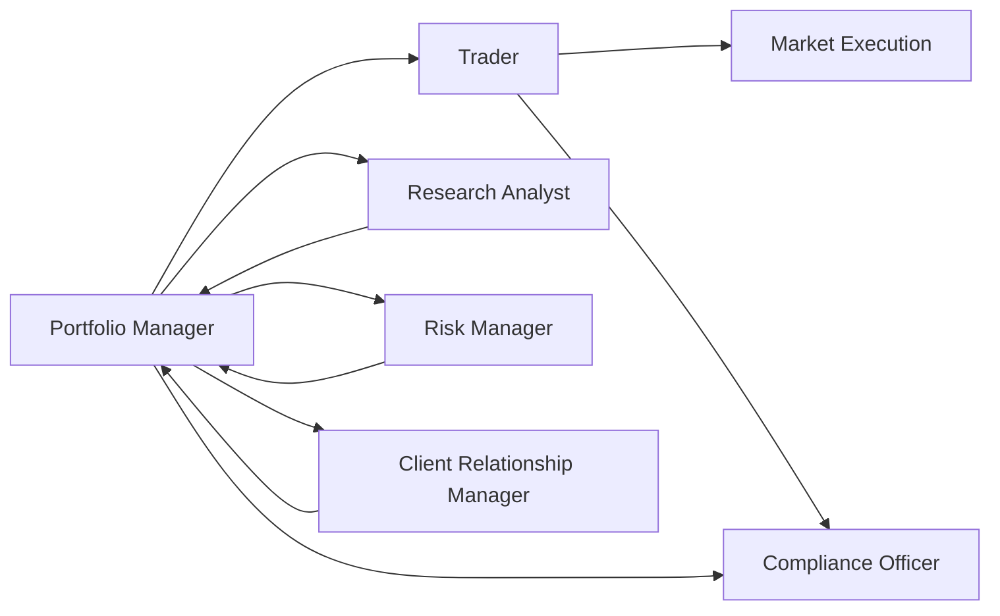

## 27.6 Roles and Responsibilities in the Institutional Market

In Canada’s institutional marketplace, a wide range of finance professionals work in tandem to manage large portfolios for clients such as pension funds, endowments, banks, insurance companies, and hedge funds. Utilizing advanced strategies and operating under strict regulations, these professionals combine their expertise to structure investment portfolios, execute trades, and ensure compliance. This chapter delves into the principal roles and responsibilities in the institutional environment, highlighting their interactions, regulatory considerations, and best practices.

---

## Overview of Institutional Roles

Large institutional investors require a multi-layered approach to portfolio management, risk mitigation, and operational efficiency. To illustrate this, consider a major Canadian pension fund investing in domestic and global equities, fixed-income securities, derivatives, and alternative assets:

- The Portfolio Manager oversees the overall investment strategy, aligning it with the institution’s objectives and constraints.  
- The Trader executes orders, ensuring best execution and minimizing transaction costs.  
- The Research Analyst provides critical market and security insights.  
- The Compliance Officer oversees processes to abide by regulations from organizations such as the Canadian Securities Administrators (CSA) and the Canadian Investment Regulatory Organization (CIRO).  
- The Risk Manager monitors exposures to market, credit, and operational risks.  
- Institutional Sales or Client Relationship Managers liaise with large clients and ensure service excellence.

Below is a simplified diagram illustrating the functional relationship among these roles:

Each arrow reflects communication or workflow crucial to effective institutional operations. This diagram can be more complex in practice, but it represents a high-level overview of how each participant collaborates within the institutional ecosystem.

---

## Portfolio Managers: Strategists and Decision-Makers

Portfolio managers are responsible for designing, implementing, and monitoring an investment strategy that meets a client’s objectives, risk tolerance, and time horizon. Key responsibilities include:

1. ■ Crafting the Investment Policy Statement (IPS): They outline target asset allocations, performance benchmarks, and risk management measures.  
2. ■ Conducting Sector and Industry Analysis: Fundamental and technical assessments guide security selection and timing decisions.  
3. ■ Performance Monitoring and Adjustment: They continually review results, rebalancing portfolios in response to market fluctuations or changing client needs.  
4. ■ Collaboration with Analysts and Traders: Portfolio managers rely on research teams for insights and coordinate with traders for efficient order execution.

Real-world Canadian Example:  
A portfolio manager at a large pension plan (such as the Canada Pension Plan Investment Board) may integrate macroeconomic forecasts and company-specific research to allocate assets across Canadian equities, government bonds, and alternative investments like real estate or private equity. By continually monitoring domestic economic indicators—including GDP growth, inflation trends, and interest rate policies—they rebalance to maintain an optimal risk-return profile.

---

## Traders: Executing and Optimizing Orders

Traders are fundamental in the institutional market, as their skills help achieve cost-effective and timely trades. Responsibilities include:

1. ■ Order Execution: Traders buy or sell securities across multiple platforms—such as the Toronto Stock Exchange (TSX), New York Stock Exchange (NYSE), or alternative trading systems—seeking best execution.  
2. ■ Price Optimization: Through tactics like limit orders, traders aim to minimize price slippage and market impact.  
3. ■ Relationship Management with Brokers: Traders leverage broker relationships to access research and block-trading capabilities, which are critical for large institutional trades.  
4. ■ Regulatory Compliance and Reporting: They work with compliance officers to report trades accurately and avoid practices like front-running or market manipulation.

Real-world Canadian Example:  
At RBC Capital Markets, institutional traders might facilitate large trades in TSX-listed equities for a pension plan. Using algorithmic trading strategies, they break down large orders into smaller increments to minimize market impact and achieve better fill prices.

---

## Research Analysts: Informing Investment Decisions

Research analysts enable data-driven decision-making by providing specialized security or market-level insights. Their responsibilities include:

1. ■ Conducting Fundamental Analysis: Assessing company financial statements, market conditions, and competitive landscapes.  
2. ■ Developing Valuation Models: Using discounted cash flow (DCF), price-to-earnings (P/E), or other metrics to estimate fair value.  
3. ■ Authoring Research Reports: Analysts present recommendations (buy/sell/hold) and outlooks for market sectors or specific securities.  
4. ■ Collaboration with Moreover Teams: Their insights guide portfolio managers, traders, and even institutional sales teams.

Real-world Canadian Example:  
An equity research analyst at TD Securities focuses on the Canadian banking sector. The analyst would examine factors such as net interest margins, loan loss provisions, and capital ratios to advise portfolio managers on whether to overweight or underweight large banks like RBC, BMO, or CIBC.

---

## Compliance Officers: Upholding Ethical and Regulatory Standards

Compliance officers serve as the guardians of integrity and legal adherence within an institution. Key functions include:

1. ■ Regulatory Monitoring: Staying updated with CIRO bylaws and CSA National Instruments, such as NI 31-103 (Registration Requirements) and NI 23-101 (Trading Rules).  
2. ■ Policy Development and Enforcement: Drafting internal standards that address conflict-of-interest scenarios, insider trading, and confidentiality.  
3. ■ Training and Education: Conducting professional development programs and ensuring staff understand new regulations or product innovations.  
4. ■ Oversight of Sensitive Information Flows: Managing “Chinese Walls” (or information barriers) to prevent the misuse of material non-public information.

Real-world Canadian Example:  
A compliance officer at a large broker-dealer ensures that employees with insider information about a pending merger do not disclose it to traders or portfolio managers, thereby preventing front-running or insider trading events.

---

## Risk Managers: Identifying, Measuring, and Mitigating Risks

Risk managers incorporate tools and methodologies to recognize and control various types of risks:

1. ■ Market Risk: Becoming familiar with value-at-risk (VaR) models and stress tests for equity, derivative, and fixed-income exposures.  
2. ■ Credit Risk: Evaluating credit quality of counterparties, especially in over-the-counter (OTC) transactions such as forward-rate agreements (FRAs) or interest-rate swaps.  
3. ■ Operational Risk: Ensuring adequate checks for technology failures, human error, or fraud.  
4. ■ Regulatory Capital Requirements: Working with accountants and regulatory bodies to maintain adequate capital buffers.

Real-world Canadian Example:  
A risk manager at a major Canadian insurer might use open-source software frameworks—like R or Python libraries—for modeling interest rate scenarios and stress-testing liquidity positions. The findings guide portfolio allocation decisions, especially on how much long-term debt to hold.

---

## Client Relationship Managers (Institutional Sales): Fostering Partnerships

Client Relationship Managers, often referred to as institutional sales professionals, act as liaisons between institutional clients and the firm. Their duties include:

1. ■ Understanding Client Needs: They discuss portfolio objectives and constraints, aligning solutions with the client’s risk profile, liquidity requirements, and return targets.  
2. ■ Presenting Research and Recommendations: They work alongside research teams to provide timely market insights and potential investment opportunities.  
3. ■ Coordination of Services: Ensuring clients have access to new issues, block trades, and other specialized services.  
4. ■ Managing Regulatory Boundaries: They must follow guidelines designed to prevent selective disclosure of non-public information.

Real-world Canadian Example:  
A senior Institutional Sales Associate at a major Canadian brokerage might hold monthly update calls with a university endowment fund, summarizing research insights from equity analysts and exploring new opportunities for diversifying into international markets.

---

## Collaboration and Information Flow

Effective institutional investing requires seamless communication, but strict safeguards must remain in place to prevent conflicts of interest or regulatory breaches. Common best practices include:

1. ■ Information Barriers (Chinese Walls): Preventing the leakage of material non-public information from corporate finance or merger-and-acquisition teams to traders or research analysts.  
2. ■ Regular Compliance Audits: Completing periodic internal or external reviews of trade records, communications, and staff training.  
3. ■ Ethical Guidelines: Reinforcing professional standards with codes of conduct from bodies like the CFA Institute or CIRO’s Code of Conduct.  

**Conflict-of-Interest Scenario – Example:**  
If a research analyst receives early notice that Company XYZ will be added to the S&P/TSX 60 Index, this could be classified as material non-public information until an official announcement. A compliance program ensures that this information is not passed to traders for personal gain or to front-run client orders.

---

## Professional Development and Ongoing Learning

The institutional market evolves rapidly, influenced by technological innovations, product breakthroughs, and changing regulatory environments. Ongoing education and professional development are often mandatory:

1. ■ Regulatory Refresher Courses: To align with new CSA or CIRO rules and maintain registration.  
2. ■ Designations and Further Education: Programs like the Certified Investment Management Analyst (CIMA®) or Chartered Financial Analyst (CFA) deliver advanced skills in portfolio construction, investment due diligence, and ethics.  
3. ■ Internal Workshops: Large firms regularly host sessions on emerging products (e.g., structured notes, ESG investments) and technologies (e.g., algorithmic trading, artificial intelligence).  

---

## Regulatory References and Additional Resources

Staying informed about policy, guidelines, and market developments is vital. Track these sources:

• CIRO’s Code of Conduct for ethical standards in institutional sales and trading.  
• Canadians Securities Administrators’ National Instruments on insider trading, market manipulation, and registration requirements.  
• “Integrity at Work in Financial Services” by the CFA Institute, which discusses ethical frameworks applicable to institutional markets.  
• Certified Investment Management Analyst (CIMA®) program — an advanced curriculum on institutional portfolio design and risk management.  
• Open-source finance tools (R, Python, and associated libraries) for modeling and analytics.  
• National Instrument 21-101 and 23-101 from the CSA, governing marketplace operations and trading rules.

---

## Summary

The institutional market thrives on a team-based approach, where specialized professionals combine strengths to serve the large-scale investment needs of pension plans, endowments, and other institutional clients. By coordinating effectively and adhering to ethical and regulatory standards, institutions can fulfill their fiduciary obligations and continuously enhance risk-adjusted returns. Through collaboration, clear information flows, and ongoing professional development, these roles maintain the integrity of Canada’s capital markets and contribute to the long-term growth of private and public capital pools.

Whether you’re considering a career path in institutional sales, focusing on risk management, or honing your analytical skills, building a solid foundation of regulatory knowledge, technical expertise, and ethical principles is key to excelling in the competitive institutional marketplace.

---

## Test Your Knowledge: Institutional Market Roles & Responsibilities Quiz



### Which of the following best describes the primary role of portfolio managers in the institutional market?

- [ ] To execute trades at best possible prices.  
- [x] To develop, implement, and monitor investment strategies in line with client objectives.  
- [ ] To ensure compliance with regulatory requirements.  
- [ ] To perform only research on market trends and sector fundamentals.  

> **Explanation:**( Portfolio managers are responsible for building and overseeing the investment strategy, including selecting securities, determining asset allocation, and ensuring the portfolio meets the clients’ objectives.)

### What is the primary responsibility of a Trader in an institutional setting?

- [ ] Designing investment policy statements for clients.  
- [x] Executing buy and sell orders at optimal prices and minimizing transaction costs.  
- [ ] Performing fundamental analysis of industries.  
- [ ] Preparing annual reports for public companies.  

> **Explanation:**( Traders are tasked with obtaining the best possible execution for trades, aiming to achieve optimal pricing and minimal market impact.)

### Which role is most directly responsible for identifying and mitigating potential market, credit, and operational risks within an institution?

- [ ] Compliance Officer  
- [ ] Research Analyst  
- [x] Risk Manager  
- [ ] Client Relationship Manager  

> **Explanation:**( Risk managers oversee different types of risk (market, credit, and operational) and implement strategies such as VaR models, stress testing, and counterparty assessments to control an institution’s overall risk exposure.)

### Research analysts primarily contribute to the investment process by:

- [ ] Overseeing investment policies for compliance.  
- [ ] Executing trades based on client instructions.  
- [x] Conducting in-depth assessments of market trends and specific securities to inform investment decisions.  
- [ ] Approving new issues before they hit the markets.  

> **Explanation:**( Research analysts provide fundamental and technical research, evaluation of financial statements, and market insights that guide portfolio managers and traders.)

### Identify the primary duty of a Compliance Officer:

- [ ] Securing best-execution pricing for large institutional orders.  
- [ ] Building complex valuation models.  
- [x] Ensuring the firm adheres to regulatory, ethical, and internal policy standards.  
- [ ] Maintaining client relationships and communication.  

> **Explanation:**( Compliance officers design, implement, and supervise compliance processes to prevent insider trading, market manipulation, and other regulatory infractions.)

### A situation in which a broker executes a personal order ahead of a client’s known pending order to profit from potential price changes is known as:

- [ ] Block trading  
- [ ] Spread betting  
- [x] Front-running  
- [ ] Arbitrage  

> **Explanation:**( Front-running is an unethical and illegal practice where an individual trades based on privileged knowledge of upcoming client orders.)

### Which role primarily acts as the liaison between large institutional clients and the brokerage firm, focusing on relationship development?

- [x] Institutional Sales (Client Relationship Manager)  
- [ ] Portfolio Manager  
- [ ] Risk Manager  
- [ ] Research Analyst  

> **Explanation:**( Institutional sales or client relationship managers ensure that each institutional client’s needs are met, providing research, new issue allocations, and coordinated solutions.)

### Which of the following best describes why professional development programs are important?

- [x] They keep staff updated on evolving regulations, market practices, and product innovations.  
- [ ] They primarily focus on IT training for system upgrades.  
- [ ] They serve only as a marketing tool for new institutional clients.  
- [ ] They are mandated only for traders and do not apply to other roles.  

> **Explanation:**( Continuous education ensures that professionals remain compliant, informed on emerging trends, and proficient in cutting-edge market skills.)

### What is “Material Non-Public Information” (MNPI) in finance?

- [ ] Officially announced profit estimates for public companies.  
- [ ] Data that is widely known among all investors.  
- [x] Information that could affect an investment decision but is not yet publicly disclosed.  
- [ ] News about interest rates after the Bank of Canada’s press release.  

> **Explanation:**( MNPI includes any non-disclosed data that, if made public, might influence security prices or an investor’s decision. Handling such information improperly can lead to insider trading accusations.)

### A trustee of a university endowment fund who must preserve the endowment’s principal invests only its returns for operations. This approach is a typical example of managing:

- [x] Endowment Funds  
- [ ] Hedge Funds  
- [ ] Mutual Funds  
- [ ] Principal-Protected Notes  

> **Explanation:** Endowment funds maintain the principal intact, spending only investment returns (or a percentage of them) to finance operational needs.



---

