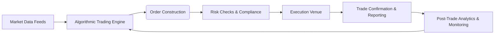

## 27.8 Algorithmic Trading

Algorithmic trading has transformed the way large institutions participate in the equity, fixed-income, and derivatives markets. Using sophisticated computer programs, traders can execute orders based on a variety of criteria—from simple timing mechanisms to highly complex strategies that interpret massive volumes of market data within milliseconds. In Canada, algorithmic trading operates under careful regulation by the Canadian Investment Regulatory Organization (CIRO) and under the guidelines from the Canadian Securities Administrators (CSA), ensuring that rapid advancements in technology do not compromise market integrity.

This section explores the core concepts behind algorithmic trading and high-frequency trading (HFT), the role of dark pools in reducing market impact, the significance of regulatory oversight, and best practices for risk management. Whether you are working on a buy-side desk building long-term portfolio strategies or a sell-side firm providing liquidity, an in-depth understanding of algorithmic trading is critical to serving institutional clients effectively and maintaining compliance in Canada’s rapidly evolving markets.

---

### Introduction to Algorithmic Trading

Algorithmic trading is the automated execution of trades according to pre-set rules, parameters, or algorithms. The parameters may include factors such as:

• Price thresholds  
• Time intervals  
• Volume limitations  
• Advanced technical signals or predictive modeling  

These algorithms can instantly determine the optimal timing and venue for trade execution, enabling institutions to handle large, complex orders more efficiently than manual methods. In practice, algorithmic trading:

• Reduces market impact by subdividing large orders into smaller, more discreet trades.  
• Responds faster to market conditions than a human trader could.  
• Minimizes emotional bias by executing trades purely based on data-driven signals.

#### Example: Canadian Pension Fund Rebalancing

A large Canadian pension fund, seeking to rebalance its equity allocation, might deploy an algorithmic trading strategy to purchase shares in different Canadian banks, such as RBC and TD, over multiple days. By distributing purchase orders in smaller blocks and executing them at strategic times, the fund reduces the likelihood of causing sharp price movements, thus preserving portfolio value.

---

### High-Frequency Trading (HFT)

High-Frequency Trading (HFT) is an extension of algorithmic trading characterized by extremely rapid trade execution and brief holding periods—sometimes only milliseconds. These strategies capitalize on:

• Very small, short-lived pricing discrepancies.  
• High turnover rates, with a large number of trades executed within very short time frames.  
• The use of ultra-low-latency trading infrastructure and colocation services (placing servers extremely close to exchange data centers to minimize data travel time).

HFT can enhance liquidity by narrowing bid-ask spreads but also raises concerns regarding:

• Market fairness — HFT firms may gain competitive edge through technology.  
• Systemic risk — A malfunctioning HFT algorithm can create rapid, large market swings.  
• Regulation — Authorities, including CIRO and the CSA, oversee HFT practices to ensure compliance.

#### Real-World Insight: RBC’s Technological Edge

Major Canadian banks like RBC often invest in cutting-edge trading infrastructure to remain competitive. They may colocate trading servers close to major market exchanges or rely on high-speed data transmission lines to capitalize on fleeting arbitrage opportunities, all while keeping within the boundaries of Canadian electronic trading regulations such as National Instrument 23-103.

---

### Dark Pools and Their Role in Algorithmic Trading

Dark pools are private trading venues that allow large institutional orders to be executed away from public (“lit”) exchanges. The primary advantages include:

• Reduced Market Impact: Large buy or sell orders can be executed anonymously, minimizing visible order flow in public order books.  
• Improved Liquidity for Block Trades: Institutional investors can efficiently handle significant blocks of shares without negatively influencing market prices.

However, dark pools raise regulatory questions about:

• Transparency: Critics argue that even partial opacity can reduce overall price discovery in the market.  
• Fairness: Retail investors may question whether institutions gain unfair advantages in these private marketplaces.

In Canada, dark pools must operate under specific CSA guidelines to ensure that they contribute to market stability without disadvantaging other participants.

---

### Regulatory Oversight in Canada

Canada maintains a strong regulatory framework for algorithmic trading through:

• CIRO (Canadian Investment Regulatory Organization): Overseeing investment dealers and related activities to uphold market integrity.  
• CSA (Canadian Securities Administrators): The umbrella organization of provincial and territorial securities regulators, providing national instruments like National Instrument 23-103 that govern electronic trading and direct electronic access.  

Key aspects of Canadian regulation include:

1. Pre-Trade Risk Controls: Ensuring that orders meet capital, credit, and regulatory requirements before they reach the market.  
2. Post-Trade Monitoring: Monitoring executed trades for compliance violations and irregular market patterns.  
3. Kill Switch Requirements: Firms must have an emergency switch to shut down any erroneous or “runaway” algorithms.  
4. Limits on Order Message Traffic: Regulators monitor message traffic to prevent bandwidth congestion and potential automated manipulative trading.

#### Reference Material

You can explore additional guidance from CIRO at:  
• https://www.ciro.ca/  

And read further details about electronic trading rules under:  
• CSA’s National Instrument 23-103 “Electronic Trading and Direct Electronic Access to Marketplaces.”

---

### Risk Management and Real-Time Monitoring

Because trades occur rapidly, sometimes in microseconds, a robust risk management infrastructure is essential. Key elements include:

1. **Real-Time Monitoring**  
   Firms utilize sophisticated software that aggregates order flow data and tracks any anomalies such as erroneous prices or exceptionally large orders.

2. **Kill Switches**  
   A kill switch can instantly disable all trading if the algorithm exhibits unexpected behavior, such as entering a feedback loop that generates unlimited orders.

3. **Pre-Trade and Post-Trade Checks**  
   • Pre-trade checks validate available capital, margin, and credit lines.  
   • Post-trade analysis helps firms detect patterns of suspicious or manipulative activity, ensuring compliance with securities law.

4. **Stress Testing**  
   Algorithms are tested under simulated extreme market conditions—such as sudden spikes in volatility or decreased liquidity—to evaluate potential breakdown points.

5. **Compliance and Supervision**  
   Compliance teams must remain vigilant, ensuring that the firm’s algorithms adhere to best execution requirements, ethical standards, and all relevant supervisory protocols.

---

### Technology and Infrastructure

The success of algorithmic trading hinges on the firm’s technological capabilities:

• **Low-Latency Networks**: Data and order transmission must occur in the shortest possible time to maintain competitive advantage, especially for HFT.  
• **Advanced Analytics**: Real-time data analytics, machine learning models, and quantitative frameworks guide decision-making.  
• **Dynamic Algorithm Development**: Continuous adaptation to market changes and technology updates is necessary for staying ahead.

Below is a high-level process diagram for an algorithmic trading workflow:

**Diagram Explanation**:  
1. Market Data Feeds (A) provide real-time price and volume information that flows into the Algorithmic Trading Engine (B).  
2. Algorithms formulate execution strategies, generating specific orders (C).  
3. Before sending orders to exchanges (E), the firm conducts essential risk checks (D).  
4. Once trades are executed, confirmations (F) feed back into post-trade analytics (G) and further refine the algorithmic strategies (B).

---

### Best Practices and Potential Pitfalls

1. **Algorithm Testing and Validation**  
   • Backtesting historical data to validate assumptions.  
   • Forward testing and paper trading to observe live market conditions without risking actual capital.

2. **Liquidity Management**  
   • For large orders, choose venues carefully and consider the liquidity profile.  
   • Dark pools can help mitigate visible market impact but require regulatory care.

3. **Data Quality**  
   • Reliable, accurate, and up-to-date market data is crucial.  
   • Inconsistent or delayed data feeds can result in suboptimal trades or system errors.

4. **Ethical and Regulatory Compliance**  
   • Avoid manipulative practices (e.g., layering, spoofing).  
   • Follow guidelines from bodies like CIRO to prevent market disruptions.

5. **Infrastructure Investments**  
   • Ensure that hardware and software can handle peak loads.  
   • Plan for continuous updates to remain competitive as technology evolves.

---

### Applications and Case Studies in the Canadian Market

• **Merger Arbitrage**  
  Algorithms can systematically take positions in companies engaged in mergers or acquisitions. Watching for regulatory approvals or changes in terms, these algorithms exploit price discrepancies in the short term.  

• **Index Rebalancing**  
  Institutional portfolios that track the S&P/TSX Composite Index often utilize algorithms to manage large-scale rebalancing effectively, smoothing execution across multiple days to reduce costs.  

• **Government Bond Auctions**  
  Dealer desks may benefit from algorithmic trading strategies during primary or secondary auctions, optimizing the price of newly issued federal and provincial bonds.

---

### Future Developments

• **Artificial Intelligence and Machine Learning**: Increasingly, algorithms use predictive analytics to interpret unstructured data such as social media sentiment, economic reports, or corporate events.  
• **RegTech (Regulatory Technology)**: Tools for automated compliance checks, real-time transaction reporting, and advanced analytics for suspicious activity detection will become more prevalent.  
• **Distributed Ledger Technologies**: Blockchain-based protocols may eventually influence how trades are settled, offering near-instant finality and transparent record-keeping.

As algorithmic trading evolves, professionals who develop expertise in both the technologies and the regulatory environment will be well-positioned to serve institutional clients effectively.

---

### Summary

Algorithmic trading offers immense opportunities for both buy-side and sell-side participants to execute large orders, manage market impact, and leverage real-time data analytics. In Canada, the legislative framework set by the CSA and enforced by CIRO ensures that these technologies are used responsibly and ethically. Firms must invest in not only ultra-fast data and hardware but also robust risk management systems, compliance structures, and well-trained professionals. By mastering these concepts, you will be prepared to navigate the intricate world of algorithmic trading and better serve sophisticated institutional clients.

---

## Test Your Knowledge: Algorithmic Trading Mastery Quiz



### Which of the following best describes the primary purpose of algorithmic trading in institutional contexts?

- [ ] To eliminate all human involvement in trading decisions  
- [x] To execute large orders efficiently while minimizing market impact  
- [ ] To maximize the number of trades executed in a day regardless of strategy  
- [ ] To avoid regulatory oversight by using private exchanges  

> **Explanation:** Algorithmic trading is primarily employed to break large orders into smaller transactions, mitigating the market impact and ensuring more efficient execution.  

### High-frequency trading (HFT) strategies are typically characterized by:

- [x] Extremely short holding periods and high turnover rates  
- [ ] Long holding periods focused on dividend collection  
- [x] Ultra-low latency infrastructure  
- [ ] Exclusively trading in foreign currency markets  

> **Explanation:** HFT involves making a high volume of trades within very brief holding periods using highly optimized, low-latency infrastructure.  

### What is a dark pool?

- [ ] A public exchange where retail investors see all large orders  
- [x] A private venue designed primarily for large, disclosed block trades  
- [ ] An illegal market for trading unregistered securities  
- [ ] A tool used to disguise high-frequency trading algorithms  

> **Explanation:** Dark pools allow large trades to be executed without displaying the full size and intent of the order to the public market, helping institutions reduce market impact.  

### Which entity oversees algorithmic trading in Canada?

- [ ] The Federal Reserve  
- [ ] The European Central Bank  
- [x] CIRO (Canadian Investment Regulatory Organization)  
- [ ] The World Trade Organization  

> **Explanation:** CIRO is responsible for regulating investment dealers and ensuring market integrity in Canada, including oversight for algorithmic trading.  

### Which of the following is a risk management tool commonly used in algorithmic trading?

- [x] Real-time monitoring  
- [ ] Extended settlement periods  
- [x] Kill switches  
- [ ] Elimination of pre-trade checks  

> **Explanation:** Real-time monitoring and kill switches are critical components to swiftly terminate trades and mitigate errors or rogue algorithms.  

### According to CSA’s National Instrument 23-103, what are firms required to implement?

- [x] Pre-trade and post-trade risk checks  
- [ ] Guaranteed trades with no risk of loss  
- [ ] Employee trading with no monitoring  
- [ ] Instant settlement for all trades  

> **Explanation:** Under NI 23-103, firms must maintain adequate risk controls to detect and prevent erroneous or manipulative trading, reinforcing pre-trade and post-trade supervision.  

### What is the primary advantage of using dark pools for large orders?

- [x] Minimizing visible market impact  
- [ ] Guaranteeing no regulatory compliance is needed  
- [x] Maintaining some level of confidentiality for trade size and purpose  
- [ ] Increasing price transparency for retail investors  

> **Explanation:** Dark pools allow large trades to occur with minimal public disclosure, reducing market reactivity and adverse price movements.  

### Which technology infrastructure characteristic is most crucial for HFT?

- [x] Ultra-low latency networks  
- [ ] 24-hour human oversight  
- [ ] Limited bandwidth to prevent overtrading  
- [ ] Monthly data updates  

> **Explanation:** HFT relies on executing trades at lightning speeds before market conditions change, making ultra-low latency networks indispensable.  

### Which best practice can help validate the effectiveness of an algorithmic trading strategy?

- [x] Backtesting with historical market data   
- [ ] Relying on gut feeling and manual entry  
- [ ] Submitting orders only through dark pools  
- [ ] Avoiding all risk checks in order to trade quickly  

> **Explanation:** Backtesting allows traders to simulate how a proposed algorithmic strategy would have performed historically, identifying potential weaknesses before live deployment.  

### Dark pools reduce market impact because:

- [x] Trades are not immediately exposed on the public order book  
- [ ] They are open only to retail investors  
- [ ] They list all trades and volumes in real-time  
- [ ] All trades are held for at least one week  

> **Explanation:** Dark pools conceal the size and nature of large block trades from public view, significantly reducing the potential price movement that large orders might cause.  



---

## For Additional Practice and Deeper Preparation

**Elevate your exam readiness with our comprehensive app, "Securities CA: Mock Exams," designed to challenge and refine your skills.**

* **Master Challenging Questions:** Dive into expertly crafted sample exam questions that go beyond standard references.
* **Scenario-Driven Learning:** Experience scenario-driven case questions and in-depth solutions to build practical expertise.
* **Sharpen Exam Strategies:** Build confidence with step-by-step explanations designed to refine your exam-day tactics.
* **Gain Real-World Insights:** Acquire practical tips and detailed rationales that demystify complex concepts.
* **CIRO and CSI Alignment:** Stay current with CIRO guidelines and CSI’s exam structure, with questions intentionally more challenging than the actual exam.

**Download the App Today:**

> Note: While these courses are specifically crafted to align with the CSC® exams outlines, they are independently developed and not endorsed by CSI or CIRO.
