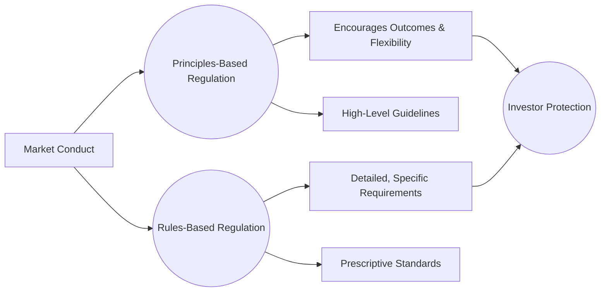
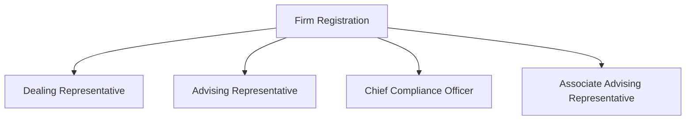

## 3.2 Regulation and Supervision

Regulation is the backbone of the Canadian securities industry, shaping how financial markets operate and ensuring public trust. Supervision complements regulation by monitoring ongoing activities to preserve market integrity and investor protection. In this section, we examine how Canadian securities regulation has evolved, look closely at who enforces these rules, explore how they coordinate across provinces, and consider the importance of adopting both a principles-based and rules-based approach. By thoroughly understanding how regulation and supervision work in the Canadian context, financial professionals and investors can better comply with regulations, protect clients effectively, and foster healthy capital markets.

---

## Overview of Principles-Based vs. Rules-Based Regulation

### The Growing Trend Toward Principles-Based Regulation
Historically, Canadian securities regulation was largely rules-based, meaning that detailed prescriptions governed every aspect of market conduct. However, there has been a gradual shift to principles-based regulation, emphasizing broad principles and desired outcomes (e.g., transparency, fairness, investor trust). Rather than relying solely on prescriptive rules, principles-based regulation encourages market participants to interpret and implement the spirit of the law. This more flexible approach allows adaptation to evolving market conditions and innovative financial instruments.

### Benefits of Principles-Based Regulation
• Flexibility: Firms can adopt compliance solutions that best match their business models and client needs.  
• Focus on Outcomes: Regulators underscore the underlying objectives rather than just checking boxes.  
• Encouraging Innovation: Emerging financial products can often be integrated into the market more swiftly and responsibly.

### When Rules are Still Necessary
Despite the shift toward principles, Canada’s securities industry still relies on traditional rules and national instruments for clarity and consistency. For example, registration requirements for individuals and firms are often explicit, as are disclosure obligations for various securities. This blend ensures that certain core aspects—like investor protection, trade reporting, and capital requirements—remain well-defined, avoiding ambiguity or uneven application.

Below is a visual representation of how principles-based and rules-based regulation interact, illustrating their roles in fostering market integrity:

In this diagram, Market Conduct is guided by both high-level principles and detailed rules, converging on common objectives such as investor protection.

---

## Legislative Authority

### Provincial Securities Acts
Canada does not have a single, centralized securities regulator. Instead, regulation occurs primarily at the provincial and territorial level. Each province or territory has its own securities legislation—such as the Ontario Securities Act or the British Columbia Securities Act—that provides the legislative authority for regulating the offer and sale of securities. These acts empower provincial regulatory bodies, such as the Ontario Securities Commission (OSC), the British Columbia Securities Commission (BCSC), or the Alberta Securities Commission (ASC).

### National Instruments and Multilateral Instruments
The Canadian Securities Administrators (CSA) is an umbrella organization comprising the country’s provincial and territorial securities regulators. The CSA issues National Instruments (NIs) and Multilateral Instruments (MIs) to harmonize regulations across jurisdictions. A prominent example is NI 31-103, which establishes registration requirements and ongoing obligations for registrants across Canada.  

### Role of Regulatory Commissions and Tribunals
Legally, these commissions have the power to create and enforce rules. They can approve or reject prospectuses, impose conditions on registration, conduct hearings, and levy penalties. If a regulatory breach contravenes both securities law and criminal law, these matters can be referred to provincial or federal courts.

---

## Registration Categories and Proficiency

### Why Registration Matters
Registration ensures that individuals and firms interacting with the public meet educational, ethical, and financial standards. It is a core pillar of investor protection, and regulators hold registered individuals to high professional standards.

### Registration Categories
Common registration categories include:  
• Dealing Representatives (e.g., investment advisors or mutual fund representatives)  
• Advising Representatives (portfolio managers providing investment advice)  
• Associate Advising Representatives (assist Advising Representatives under supervision)  
• Chief Compliance Officers (responsible for firm-wide compliance)  

Below is a simplified diagram showing how registration tiers and roles relate within a typical investment firm:

### Proficiency Requirements
Educational prerequisites vary by category. Entry-level mutual fund or dealing representative roles often require courses like the Canadian Securities Course (CSC®). More senior or specialized roles, such as Advising Representatives for portfolio managers, typically require advanced designations (e.g., CFA) or significant industry experience.  
A shift is underway with the Canadian Investment Regulatory Organization (CIRO), which is examining a more assessment-focused approach to proficiency. Rather than only classroom-based instruction, new rules may rely on a combination of practical assessments, continuous learning, and demonstration of skills directly relevant to daily tasks.

---

## Supervisory Structure

### Role of Registrants and Dealing Representatives
Firms and individual registrants share responsibility for oversight to ensure that day-to-day activities comply with securities laws, CIRO rules, and internal policies. For example, a dealing representative (commonly known as an advisor) must act in clients’ best interests and document all interactions to demonstrate suitability and transparency.

### Internal Compliance Departments
Most firms have an internal compliance department that monitors and supervises employees. Key duties include:  
• Reviewing new client applications and ensuring proper KYC (Know Your Client) documentation.  
• Approving marketing materials for accuracy and truthfulness.  
• Monitoring trading activity and raising red flags for unusual patterns or suspected market manipulation.  
• Providing ongoing training sessions to educate employees on emerging regulations and best practices.

### CIRO and Self-Regulation
CIRO (the Canadian Investment Regulatory Organization) was established through the merger of IIROC and the MFDA. CIRO enforces many of the rules that apply to broker-dealers and mutual fund dealers, including compliance policies and trade surveillance. While CIRO is not a government agency, it is recognized by securities commissions, which delegate significant oversight authority to it.  
CIRO’s rules often parallel provincial laws, but they can be more prescriptive in certain areas—such as margin requirements or business conduct standards. Registered firms under CIRO must meet these self-regulatory standards in addition to the requirements under provincial acts.

---

## Enforcement and Penalties

### Investigative Powers
Regulators can investigate when they suspect wrongdoing. They commonly:  
• Request transaction records and communications (emails, phone logs).  
• Interview registrants and any other relevant parties.  
• Collaborate with other regulators or law enforcement if a crime is suspected.

### Penalties and Sanctions
If a violation occurs, regulators can impose a range of sanctions:  
• Monetary Fines: These can vary from modest amounts to millions of dollars.  
• License Suspension or Revocation: Advisors who recklessly or repeatedly violate rules can be suspended or permanently barred.  
• Cease Trade Orders: Prevents a firm or person from trading in certain securities.  
• Criminal Charges: Securities fraud cases can be pursued under the Criminal Code of Canada in severe instances.

A practical example is the case of an advisor at a major Canadian bank (e.g., RBC or TD) who was found to allocate unsuitable high-risk products to clients nearing retirement. The provincial commission could impose fines and order the advisor to retake regulatory courses, while CIRO might also require the firm to strengthen compliance oversight to prevent future issues.

---

## Coordination Among Regulators

### Canadian Securities Administrators (CSA)
The CSA is the coordinating body for Canada’s 13 provincial and territorial regulators. It harmonizes and streamlines securities regulation across provinces to reduce duplication. The CSA meets regularly to develop National Instruments, coordinate enforcement actions, and share best practices.  

### Federal-Level Coordination
While securities regulation is primarily provincial, certain federal agencies and laws also influence the securities landscape. For instance, the Office of the Superintendent of Financial Institutions (OSFI) regulates banks and insurance companies, and sometimes these regulations intersect with securities activities (e.g., underwriting, structured notes).  

### Evolving Efforts Toward Centralization
There have been ongoing discussions about creating a national securities regulator. Proposals include the Cooperative Capital Markets Regulatory System (CCMR), which would combine several provinces under a single federal body. Although not yet fully adopted, these initiatives reflect a desire to further unify Canada’s regulatory framework, reducing fragmentation and compliance complexity for interprovincial firms.

---

## Glossary of Key Terms

• **Principles-Based Regulation**: A regulatory approach focusing on high-level objectives. Rules are less prescriptive, giving firms flexibility to meet desired outcomes (e.g., fairness, transparency).  
• **Registration**: The mandatory process through which individuals and firms receive authorization to deal in or advise on securities. Requires meeting experience and educational standards.  
• **Approved Person**: An individual recognized by self-regulatory organizations (now CIRO) for specified roles like dealing representative or compliance officer.  
• **Enforcement**: The set of activities regulators undertake to investigate potential breaches and impose penalties. Ensures market integrity by holding rule-breakers legally accountable.  

---

## Best Practices, Pitfalls, and Real-World Applications

• **Best Practices**:  
  – Strengthen Internal Controls: Maintaining thorough client documentation, transparent marketing materials, and up-to-date compliance software can help detect issues early.  
  – Ongoing Training: Advisor education should extend beyond mandatory proficiency courses, incorporating compliance refreshers and emerging regulation updates.  
  – Documentation and Communication: Record all investor interactions, maintain logs of trades, and ensure marketing materials are pre-approved by compliance.

• **Common Pitfalls**:  
  – Incomplete KYC Files: Failing to capture a client’s risk tolerance or investment objectives can lead to enforcement actions if unsuitable trades result in losses.  
  – Conflicts of Interest: Advisors must disclose and suitably manage potential conflicts, such as referral fees or dual-occupancy roles.  
  – Outdated Policies: Changing regulations require constant updates to policies and procedures. Firms that do not keep pace risk non-compliance.

• **Real-World Scenario**:  
  – A large Canadian bank branch follows a robust firm-wide compliance protocol. Every trade flagged as higher risk automatically triggers a compliance check for suitability. Focus on client risk tolerance ensures alignment with KYC. This practice not only prevents regulatory infractions but also fosters trust.

---

## References and Additional Resources

• Provincial Securities Acts (e.g., Ontario Securities Act):  
  – https://www.ontario.ca/laws  
• CSA National Instruments (e.g., NI 31-103 Registration Requirements):  
  – https://www.securities-administrators.ca/  
• CIRO proposed proficiency model guidance:  
  – https://www.ciro.ca/  
• “Practitioner’s Guide to Canadian Securities Regulation” (McMillan LLP).  
• Free educational webinars from the CSA that clarify new or evolving regulations.  

---

## Summary

Canadian securities regulation and supervision seek to protect investors, foster confidence in the financial system, and maintain the fairness and efficiency of capital markets. While the country’s regulatory framework is rooted in provincial laws, organizations like the CSA help unify its approach. Regulatory structures continue to evolve—balancing the stability offered by rules-based legislation with the adaptability of principles-based oversight.  
Whether you are an advisor, compliance professional, or investor, gaining a solid grasp of these regulations is essential for successful market participation. This knowledge empowers you to align your practices with legal requirements, uphold ethical standards, and contribute to a more robust Canadian capital market.

---

## Test Your Knowledge: Canadian Securities Regulation and Supervision Quiz



### Which of the following best describes principles-based regulation in Canada?

- [x] It focuses on broad, high-level objectives, allowing firms to determine how best to meet those objectives.  
- [ ] It relies exclusively on prescriptive rules that outline every measure for compliance.  
- [ ] It eliminates the need for any form of regulatory oversight.  
- [ ] It only applies to international banks operating in Canada.  

> **Explanation:** Principles-based regulation emphasizes outcomes and overarching objectives rather than prescriptive, detailed rules.

### What is the primary legislative authority for securities regulation in Canada?

- [x] Provincial securities acts, such as the Ontario Securities Act.  
- [ ] The Securities Act of Canada, a federal statute.  
- [ ] Only the Canadian Investment Regulatory Organization (CIRO).  
- [ ] The Financial Transactions and Reports Analysis Centre of Canada (FINTRAC).  

> **Explanation:** Each province and territory has its own securities law, with no single national securities regulator in Canada.

### Which statement accurately describes National Instruments (NIs)?

- [x] They are rules created by the CSA to harmonize securities regulations across provinces and territories.  
- [ ] They are federal laws introduced by the Government of Canada.  
- [ ] They are exclusive to the province of Quebec.  
- [ ] They are informal guidelines only; they have no legal standing.  

> **Explanation:** The Canadian Securities Administrators (CSA) issues National Instruments to standardize regulations among provincial and territorial regulators.

### Which of the following is a principal function of an internal compliance department in a registered firm?

- [x] Reviewing client account openings, performing KYC checks, and monitoring trades for unusual patterns.  
- [ ] Setting global monetary policy in coordination with the Bank of Canada.  
- [ ] Granting provincial licenses to new securities registrants.  
- [ ] Issuing National Instruments on behalf of the CSA.  

> **Explanation:** Internal compliance oversees the firm’s adherence to regulations, including client onboarding, marketing, and trading reviews.

### Which of the following is a common penalty regulators can impose if a registered individual commits a violation?

- [x] Monetary fines and possible suspension or revocation of registration.  
- [ ] An unpublicized warning without any further repercussions.  
- [x] Requirements to retake mandatory proficiency courses.  
- [ ] Automatic passport revocation for foreign nationals.  

> **Explanation:** Regulators can levy fines, suspend or revoke licenses, and require additional training, among other sanctions.  

### What is CIRO’s role in the Canadian securities landscape?

- [x] It is a self-regulatory organization that oversees broker-dealers and mutual fund dealers, enforcing market rules under recognition by provincial regulators.  
- [ ] It sets federal interest rates for Canada.  
- [ ] It handles all civil lawsuits related to securities misrepresentation in the country.  
- [ ] It operates independently with no coordination or recognition from any provincial securities commissions.  

> **Explanation:** CIRO (formerly IIROC and MFDA) is recognized by provincial regulators to enforce regulations on investment dealers and mutual fund dealers.

### Why might a shift toward an assessment-centric approach for registrant proficiency be beneficial?

- [x] It may better evaluate practical skills and readiness to perform daily tasks, rather than relying solely on exams.  
- [ ] It eliminates ongoing education requirements, saving time and money.  
- [x] It perfectly replaces theoretical foundations with real-world experience only.  
- [ ] It reduces transparency and fosters inconsistency in regulatory practices.  

> **Explanation:** An assessment-based approach emphasizes practical competencies, ensuring registrants are well-prepared for real-world responsibilities.

### Which of the following entities typically looks after the regulation of banks in Canada, potentially intersecting with securities oversight?

- [x] The Office of the Superintendent of Financial Institutions (OSFI).  
- [ ] The Ontario Securities Commission (OSC).  
- [ ] The Bank of Nova Scotia (Scotiabank).  
- [ ] The Ministry of Finance of each province.  

> **Explanation:** OSFI regulates banks and some insurance companies, complementing provincial securities supervision when banks engage in securities activities.

### In the context of Canadian securities enforcement, why might a “cease trade order” be issued?

- [x] To prohibit a person or firm from trading in certain securities when a serious violation is suspected.  
- [ ] To force a company to list its shares on a Canadian stock exchange.  
- [ ] To authorize a new initial public offering (IPO).  
- [ ] To reduce foreign exchange volatility.  

> **Explanation:** Cease trade orders temporarily halt trading activities to protect investors and prevent further harm during investigations.

### Under the current system, is there one single national securities regulator in Canada?

- [x] True  
- [ ] False  

> **Explanation:** While efforts exist to create a more centralized system (e.g., the CCMR), no single national securities regulator exists today. It remains a provincial/territorial framework.



---

