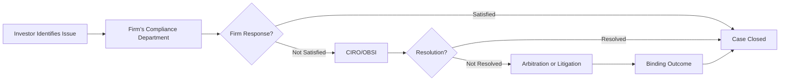

## 3.3 Remediation

Remediation is a critical aspect of maintaining trust and integrity within the Canadian securities industry. It outlines the avenues and procedures available for investors who have complaints or seek redress due to perceived misconduct, negligence, or other disputes with their investment dealers or advisors. Whether the issue is small or large, there exists a structured framework that helps ensure fair and efficient resolution. This section provides a comprehensive overview of remediation, discussing the client complaint process, escalation channels, formal dispute resolution, and the role of protective measures such as the Canadian Investor Protection Fund (CIPF).

-------------------------------------------------------------------------------
### The Client Complaint Process
-------------------------------------------------------------------------------

The starting point for any investor complaint is typically the firm’s compliance department. Canadian securities regulations mandate that all registered firms investigate and document client complaints thoroughly and respond to them within certain timeframes.

1. **Initial Submission**  
   - Investors typically submit a written complaint to their investment firm or advisor, ensuring a clear statement of the issue and the desired resolution.  
   - Most Canadian financial institutions, such as RBC or TD, have designated “Client Complaint” or “Compliance” portals on their websites where clients can initiate formal complaints.

2. **Compliance Department Investigation**  
   - Once received, the firm’s compliance team reviews all relevant account statements, advisor correspondence, transaction details, and any other supporting documents related to the complaint.  
   - Compliance or management determines whether client harm occurred and if remedial action is needed.

3. **Timelines and Communication**  
   - Firms must acknowledge the complaint, provide updates, and communicate a final response within certain regulatory deadlines (often 90 days or sooner, depending on the case).   
   - Clear communication fosters transparency and reinforces trust in the regulatory environment.

If the firm resolves the issue to the client’s satisfaction at this stage, the process ends. Otherwise, clients can pursue avenues outside of the firm.

-------------------------------------------------------------------------------
### Options for Redress
-------------------------------------------------------------------------------

If a client remains unsatisfied with the firm’s internal response or resolution, they can escalate the matter further through additional avenues. The structures available blend industry self-regulation with independent dispute resolution.

#### Internal Resolution
Many investment firms offer internal escalation channels beyond the initial compliance review, especially for complex cases:

- **Escalation to Senior Management:** Some complaints may warrant a deeper investigation by higher-level staff, such as the Head of Compliance or the firm’s Chief Risk Officer.  
- **Mediation or Settlement:** The firm may offer to settle financially or adjust accounts to reconcile client losses if wrongdoing is found.  
- **Apology or Process Change:** In certain situations, remedial measures may include enhanced training for the advisor or revised internal controls aimed at preventing future errors.

#### CIRO Complaints Process
The Canadian Investment Regulatory Organization (CIRO) is responsible for overseeing investment dealers and their advisors. When a complaint remains unresolved at the firm level:

- **Formal Complaint to CIRO:** The client can submit a complaint directly via CIRO’s online complaint channels.  
- **CIRO Review and Investigation:** CIRO will examine whether the firm or advisor breached any regulatory requirements.  
- **Possible Disciplinary Measures:** If a breach is established, CIRO may impose fines, suspensions, or other penalties on the firm or individual. This action helps ensure regulatory standards are upheld.

#### Ombudsman for Banking Services and Investments (OBSI)
OBSI is an independent body that provides a free and impartial dispute resolution service:

- **Scope of OBSI:** OBSI can review claims against participating financial institutions, including banks, mutual fund dealers, and investment dealers.  
- **Investigation and Recommendation:** After the investigation, OBSI issues a recommendation. If it rules in the client’s favor, it can recommend compensation (non-binding). Though not legally enforceable, most firms honor OBSI recommendations to maintain good standing and public trust.  
- **Client Choice:** If the client is still dissatisfied, they retain the option to pursue arbitration or civil litigation.

#### Arbitration and Civil Litigation
As a measure of last resort, clients can consider:

- **Arbitration:** A legally binding process that uses a neutral third-party arbitrator. Arbitration can be quicker, less formal, and generally cheaper than a full litigation process. However, the arbitrator’s decision is final and binding.  
- **Civil Litigation:** Clients can file a lawsuit in the courts if they believe their losses are significant or if other remedies have been ineffective. Litigation can be expensive and time-consuming, but it may provide a legally binding judgment.

-------------------------------------------------------------------------------
### Role of CIPF in Insolvency Cases
-------------------------------------------------------------------------------

The Canadian Investor Protection Fund (CIPF) offers coverage if a **CIRO-member firm becomes insolvent.** When a member investment dealer fails financially, client cash and securities might be missing from accounts. CIPF helps ensure that investors do not bear the brunt of such shortfalls:

1. **Coverage Limits:** CIPF coverage accounts for up to C$1 million for general accounts and separate coverage for specific registered accounts, such as RRSPs or TFSAs.  
2. **Eligibility Requirements:** To be covered, clients must have assets with a **CIRO-member firm** that is declared insolvent.  
3. **Claim Process:** Clients file a claim with CIPF, disclosing the nature and value of missing property. CIPF coordinates with the insolvency receiver to reconcile client assets and distribute available funds or securities.

It is important to note that CIPF coverage only applies to insolvencies, not to losses arising from market fluctuations or alleged misconduct. Complaints about advisor misconduct or firm negligence must be pursued separately through the firm’s internal process, CIRO, or OBSI, as outlined above.

-------------------------------------------------------------------------------
### Investor Education and Awareness
-------------------------------------------------------------------------------

Canadian regulators emphasize empowering investors. A well-informed client knows how to:
- **Identify Misconduct:** Recognize red flags such as unauthorized trades or inappropriate risk levels.  
- **Follow Up:** Track and verify all account activities and promptly raise concerns.  
- **Seek Remedies:** Understand the steps and timeframes for lodging formal complaints and the resources available for assistance.

Below is a **Mermaid diagram** illustrating the typical journey of a complaint through the remediation cycle:

This streamlined process ensures that concerns do not fall through the cracks, promoting a transparent environment where investors have channels to seek and obtain fairness.

-------------------------------------------------------------------------------
### Practical Examples and Case Studies
-------------------------------------------------------------------------------

Below are a few **real-world scenarios** to give context to the remediation process:

1. **Case Study: TFSA Overcontribution**  
   - A client at a major bank (e.g. RBC) discovers that their advisor recommended multiple contributions to their TFSA without proper checks, causing them to exceed the annual contribution limit.  
   - The client complains internally, showing evidence of their contribution statements and relevant memos from the advisor.  
   - The firm acknowledges the oversight and credits the client for the associated penalty. This resolves the dispute internally, demonstrating the firm’s willingness to rectify mistakes promptly.

2. **Case Study: Unauthorized Trades in a Margin Account**  
   - An investor at a smaller CIRO-member firm notices several trades they never authorized.  
   - After failing to resolve the issue with compliance, the client escalates to CIRO. An investigation confirms violations of “Know Your Client” (KYC) and “Suitability” rules.  
   - CIRO disciplines the advisor, and the firm compensates the client for the losses and legal fees.  
   - This outcome highlights the self-regulatory approach where CIRO enforces standards and ensures accountability.

3. **Case Study: Insolvency and CIPF Coverage**  
   - A boutique investment dealer becomes insolvent due to a scandal. Some client securities are missing.  
   - Clients file a claim with CIPF, which steps in to ensure each eligible client is protected up to the coverage limit.  
   - Although the insolvency outcome is unfortunate, CIPF’s safety net preserves investors’ trust in the market and mitigates systemic panic that might otherwise ensue.

-------------------------------------------------------------------------------
### Glossary
-------------------------------------------------------------------------------

- **Ombudsman for Banking Services and Investments (OBSI):**  
  An independent organization that resolves disputes between participating financial services firms and their clients at no cost to the client.

- **Arbitration:**  
  A legally binding process involving a neutral third-party, who hears both sides and delivers a final decision. Often faster and more flexible than civil court proceedings.

- **Complaint Resolution:**  
  A formal process for seeking remedy if an investor believes they have been wronged by an advisor or dealer. It typically involves internal reviews, followed by external dispute resolution channels if needed.

- **Insolvency:**  
  A state in which a firm cannot meet its financial obligations. Investors with assets in an insolvent CIRO-member firm may be eligible for CIPF coverage of missing property up to defined limits.

-------------------------------------------------------------------------------
### Key Canadian Regulatory Resources
-------------------------------------------------------------------------------

• **Ombudsman for Banking Services and Investments (OBSI)**  
  Website: [https://www.obsi.ca/](https://www.obsi.ca/)  
  A free and independent dispute resolution service for clients of participating financial services firms.

• **CIRO Complaint Resolution Information**  
  Website: [https://www.ciro.ca/](https://www.ciro.ca/)  
  (Search “complaints” or “complaint process” for step-by-step guidelines on filing a complaint.)

• **Canadian Investor Protection Fund (CIPF)**  
  Website: [https://www.cipf.ca/](https://www.cipf.ca/)  
  Explains investor coverage in cases of member-firm insolvency.

• **Ontario Securities Commission’s “Get Smarter About Money”**  
  [https://www.getsmarteraboutmoney.ca/](https://www.getsmarteraboutmoney.ca/)  
  Offers tools, calculators, and educational articles for everyday investors.

• **Investor Protection Clinic**  
  For example, at the Osgoode Hall Law School, providing pro bono legal assistance in certain complaint situations if individuals cannot otherwise afford representation.

-------------------------------------------------------------------------------
### Best Practices and Actionable Insights
-------------------------------------------------------------------------------

1. **Document Everything:** Keep copies of all account statements, trade confirmations, and email correspondence with your advisor or firm. Comprehensive records facilitate a smoother investigation.

2. **Act Swiftly:** If an issue arises, contact the firm as soon as possible. The earlier you raise a complaint, the more easily records and transaction histories can be verified.

3. **Follow the Proper Channels:** Begin with the firm’s compliance department, then move to external bodies (CIRO or OBSI) if internal resolution fails.

4. **Evaluate Costs vs. Benefits:** If the matter is small, consider whether arbitration is more time- and cost-effective than a lawsuit. For larger claims, legal advice might be warranted.

5. **Stay Informed of Regulatory Developments:** Regulatory frameworks evolve. Periodically check for changes in CIPF coverage limits or complaint resolution rules.

6. **Leverage Educational Resources:** Free resources, including those provided by regulators, can sharpen your financial literacy and empower you to identify potential missteps at an early stage.

-------------------------------------------------------------------------------
### Summary
-------------------------------------------------------------------------------

Remediation processes in the Canadian securities industry exist to uphold fairness and integrity. Investors should first attempt to resolve complaints directly with the firm. Where needed, clients can escalate to CIRO, OBSI, or, as a last resort, arbitration or litigation. Meanwhile, CIPF serves as a backstop in the case of member firm insolvencies, ensuring confidence in the overall system. By understanding their rights, documenting evidence thoroughly, and acting promptly, investors can seek appropriate remedies and safeguard their financial interests.

-------------------------------------------------------------------------------

## Test Your Knowledge: Canadian Securities Remediation Quiz



### What is the first step an investor should take if they have a complaint about their advisor or dealer? 
- [ ] Immediately file a lawsuit in the provincial courts.  
- [ ] Contact the Ombudsman for Banking Services and Investments (OBSI).  
- [x] Submit the complaint to the firm’s compliance department.  
- [ ] Contact the Canadian Investor Protection Fund (CIPF).  

> **Explanation:** Regulations generally require clients to go through the dealer’s internal complaint process first. Firms must investigate complaints and respond according to regulatory guidelines.

### Which of the following best describes the role of CIRO in complaint resolution? 
- [x] It oversees investment dealers and has a formal complaint and disciplinary process.  
- [ ] It provides free arbitration services for clients of participating banks.  
- [ ] It guarantees payment to investors in case of firm insolvency.  
- [ ] It is a government agency responsible for setting national interest rates.  

> **Explanation:** CIRO is the self-regulatory organization responsible for monitoring member dealers and their advisors. It enforces rules and can discipline firms or individuals who violate them.

### What is the function of the Ombudsman for Banking Services and Investments (OBSI)? 
- [ ] To impose fines and penalties on member dealers.  
- [x] To provide free, independent dispute resolution and recommend non-binding settlements.  
- [ ] To serve as a mediator in the arbitration process.  
- [ ] To insure client accounts against market losses.  

> **Explanation:** OBSI investigates disputes between clients and participating firms. It can recommend compensation but, unlike an arbitrator or judge, its decisions are not legally binding.

### Which remedial option is typically legally binding on both parties? 
- [ ] OBSI’s final recommendation.  
- [ ] The dealer’s internal recommendation.  
- [x] Arbitration.  
- [ ] Mediation by an internal compliance officer.  

> **Explanation:** Arbitration decisions are binding, while OBSI’s recommendations, though influential, are non-binding.

### Which coverage applies to clients if their CIRO-member firm becomes insolvent and client assets are missing? 
- [x] CIPF coverage up to predefined limits.  
- [ ] A guaranteed return offered by the dealer.  
- [x] Additional CIPF coverage for registered accounts.  
- [ ] OBSI arbitration to recover missing assets.  

> **Explanation:** CIPF will cover missing client property up to certain limits. There are separate coverage limits for registered accounts such as RRSPs or TFSAs.

### What type of losses does CIRO generally not cover? 
- [x] Market-related losses when an appropriate product was sold.  
- [ ] Losses due to advisor fraud or negligence.  
- [ ] Damages determined by an arbitrator.  
- [ ] Losses incurred in a TFSA.  

> **Explanation:** CIRO deals with regulatory breaches, but it does not reimburse normal market fluctuations or poor performance if the product was suitable and properly explained.

### What is one reason a client may escalate a complaint to CIRO even after a negative internal review at the firm level? 
- [x] Because the client believes that the firm violated regulatory standards.  
- [ ] Because the client wants a guaranteed higher settlement.  
- [x] Because the client wants regulatory authorities to punish the firm.  
- [ ] Because there is no option to settle disputes internally.  

> **Explanation:** If a client suspects violations of regulatory requirements, they can request CIRO to investigate whether any rules were broken.

### In an arbitration process, who makes the final, enforceable decision? 
- [x] A neutral third-party arbitrator.  
- [ ] The compliance officer at the firm.  
- [ ] The client and advisor jointly.  
- [ ] The Ontario Securities Commission.  

> **Explanation:** During arbitration, a neutral arbitrator hears evidence from both parties and issues a binding decision.

### Why might an investor choose OBSI rather than arbitration right away? 
- [x] OBSI is free and often simpler than arbitration.  
- [ ] Arbitration does not result in legally binding settlements.  
- [ ] OBSI can only handle very small claims.  
- [ ] Arbitration always takes longer than litigation.  

> **Explanation:** OBSI offers a no-cost process and can recommend compensation if it rules for the client. Arbitration involves fees and other formalities.

### CIPF protection covers all of an investor’s losses due to market fluctuations. 
- [ ] True  
- [x] False  

> **Explanation:** CIPF coverage is limited to shortfalls in client property when a CIRO-member firm becomes insolvent. It does not cover normal market losses.



---

