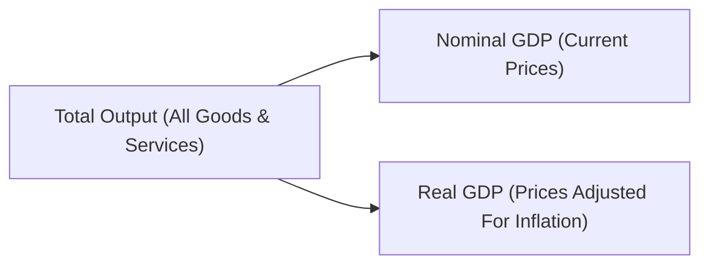

## 4.2 Measuring Economic Growth

Measuring economic growth is essential for understanding the health and prospects of a nation’s economy. In Canada, tracking economic growth helps investors, policymakers, and financial professionals assess the country’s economic vitality and make informed decisions. In this section, we will explore the most common economic growth indicators, focusing on Gross Domestic Product (GDP), Gross National Product (GNP), and related metrics used by Canadian market participants and government institutions. We will also address how growth is influenced by various structural and policy factors, and provide practical examples to underscore the importance of knowing how, and when, to measure economic growth.

---

## Understanding Economic Growth

Economic growth represents an expansion in the volume—or more precisely, the value—of goods and services produced by an economy over a specified period. Increasing economic output usually corresponds to higher incomes, improved standards of living, and more robust business opportunities. For Canadian investors, accelerated growth may imply stronger corporate profits, better performance on the Toronto Stock Exchange (TSX), and potentially favorable job market conditions.

### Why Economic Growth Matters

1. **Indicator of Prosperity**  
   Higher levels of output often lead to more jobs, which in turn improves consumer confidence and stimulates further spending. A healthy, growing economy generally indicates that businesses and individuals have more resources at their disposal.

2. **Investment Performance**  
   When economic growth is strong, Canadian companies—e.g., RBC (Royal Bank of Canada), TD (Toronto-Dominion) Bank, and others—tend to see an uptick in demand for financial services, lending, and investment products.

3. **Policy and Regulation**  
   Measuring growth guides government policy decisions. National agencies such as the Bank of Canada (BoC) and the Department of Finance use growth data to adjust interest rates, manage inflation, and shape fiscal measures like taxation or expenditures.

---

## Key Measures of Economic Growth

### Gross Domestic Product (GDP)

GDP is the most broadly utilized metric to gauge an economy’s overall output. It sums the monetary value of all final goods and services produced within a country’s borders in a given period—commonly reported quarterly and annually.

#### Inclusion Criteria

• All final goods and services, excluding intermediate goods (to prevent double-counting).  
• Economic activity within Canada’s geographic boundaries—including output by foreign-owned entities operating in Canada.

#### Example of Canadian GDP Calculation

To illustrate, consider the financial outputs from multiple sectors of the Canadian economy:  
• Manufacturing output in Ontario (e.g., automotive production).  
• Financial services in Toronto’s financial district (e.g., RBC and TD’s banking and advisory services).  
• Energy production and exports in Alberta (e.g., oil sands).  

All final goods and services in these sectors are aggregated—minus intermediate inputs—resulting in the country’s GDP figure for that period.

### Gross National Product (GNP)

While GDP centers on domestic output, Gross National Product (GNP) emphasizes the total value of goods and services produced by a country’s residents, regardless of their geographic location. For instance, profits earned abroad by Canadian-owned brokerage firms or technology startups also factor into Canada’s GNP. Conversely, foreign-owned companies operating within Canada contribute to Canadian GDP but not its GNP (their earnings would be associated with the GNP of their home countries).

### Nominal GDP vs. Real GDP

When analyzing changes in an economy’s production across time, it is crucial to distinguish between nominal GDP and real GDP.

• **Nominal GDP** measures the value of goods and services using the current year’s prices. It does not adjust for changes in the price level.  
• **Real GDP** strips out the effects of inflation or deflation by using constant prices (a “base year” price level). This provides a clearer picture of actual changes in production volume rather than shifts caused by fluctuating price levels.

Below is a simple mermaid diagram illustrating the distinction between nominal and real GDP:

Real GDP is often viewed as the more accurate metric when assessing true economic growth, as it reveals whether the economy’s production is genuinely expanding, holding prices steady for consistent comparison.

---

## Methods of Measuring GDP

There are three primary approaches to calculating GDP, each offering a different vantage point on the same total value:

### The Income Approach

This method sums all forms of income within the economy, including:  
• Wages and salaries (paid to workers)  
• Corporate profits (earned by businesses)  
• Interest income (accrued to lenders)  
• Rent (collected by property owners)  

By aggregating all income paid to the factors of production (i.e., labour, capital, land, and entrepreneurship), the total should theoretically match the GDP figure from other methods.

### The Expenditure Approach

GDP can also be viewed through the total spending on final goods and services:

• Consumption (C) – Household spending on goods and services.  
• Investment (I) – Business expenditure on capital goods and residential construction.  
• Government spending (G) – Purchases by federal, provincial, and municipal governments.  
• Net Exports (NX) – The difference between exports (items produced domestically and sold abroad) and imports (items produced abroad for domestic sale).

Mathematically, this is expressed as:  
(1)  
 \text{GDP} = C + I + G + (X - M) 

### The Production (or Output) Approach

This approach sums the value added at each stage of production. Practically, it tallies each firm’s output, subtracting the cost of intermediate inputs to avoid double-counting. 

While all methods theoretically yield the same total GDP, discrepancies can arise from data collection issues or timing. Statistics Canada works diligently to reconcile these differences and publish unified GDP figures.

---

## GDP per Capita and Limitations

### GDP per Capita

GDP per capita is obtained by dividing GDP by the total population. It serves as a broad gauge of a population’s average standard of living. For instance, if Canada’s GDP is $2 trillion and its population is 40 million, the GDP per capita would be $50,000. This figure can help compare living standards among provinces or with other countries.

### Limitations

1. **Inequality**  
   GDP per capita does not account for income distribution. A small affluent segment could raise average figures, masking poverty or low incomes for the majority.

2. **Non-Monetary Factors**  
   Economic output does not normally track environmental well-being or leisure time. Higher output might coincide with environmental degradation or declining quality of life.

3. **Economic Inclusivity**  
   Informal or “underground” economic activities, which can be substantial in certain areas, are often not accurately reflected in official GDP data.

---

## Factors Affecting Economic Growth

### Technological Innovation and Productivity

Advances in technology often boost productivity, enabling the same amount of labour or capital to yield more output. In Canada, new digital banking platforms adopted by major banks like TD or RBC can streamline customer service, reduce transaction costs, and enhance efficiency—ultimately contributing to national productivity growth.

### Labour Force Dynamics

Employment levels, immigration policies, and education or skills development significantly impact economic output. A skilled and growing Canadian workforce arguably underpins better job creation and corporate expansion.

### Capital Accumulation

Savings and investment rates directly affect a country’s capacity to accumulate capital—such as machinery, infrastructure, or advanced technology. Canadians who actively invest through RRSPs (Registered Retirement Savings Plans) or TFSAs (Tax-Free Savings Accounts) help channel capital into businesses, propelling overall economic growth.

### Government Policies

Government policies—both fiscal (e.g., changes in taxes and public spending) and monetary (e.g., interest rates set by the Bank of Canada)—can stimulate or cool down economic growth. For example, when the Bank of Canada lowers interest rates, borrowing costs decline, often spurring consumer and business spending.

---

## Tracking Economic Growth in Canada

In practice, several bodies conduct data collection, forecasting, and policy formulation associated with Canadian economic growth:

• **Statistics Canada** – Publishes comprehensive economic indicators, including monthly and quarterly GDP estimates.  
• **Bank of Canada** – Monitors inflation and sets the target for the overnight rate, a key interest rate that influences broader financial conditions.  
• **Department of Finance** – Shapes fiscal policy decisions, such as taxation and government program spending.

Below is a simplified table illustrating where to find some of the key growth-related data:

| Institution      | Data/Indicator                              | Website                                            |
|------------------|---------------------------------------------|----------------------------------------------------|
| Statistics Canada| GDP by Industry, Demographic Data, Trade    | https://www.statcan.gc.ca/en/subjects-start/economy|
| Bank of Canada   | Interest Rates, Economic Projections        | https://www.bankofcanada.ca/rates/indicators/      |
| OECD             | Cross-Country Comparisons, Economic Outlook | https://www.oecd.org/                              |

As Canadian securities professionals, staying informed about these economic indicators is vital for interpreting equity and debt market performance, advising clients, and structuring holistic financial plans.

---

## Practical Examples and Case Studies

### Example: Canadian Pension Funds Assessing Growth Trends

Pension funds, such as the Canada Pension Plan Investment Board (CPPIB), regularly analyze real GDP growth trends when allocating assets. If forecasts indicate robust economic expansion, they might shift a larger portion of their portfolio into equities to capitalize on expected gains in corporate earnings.

### Example: Bank Forecasting

Major Canadian banks (e.g., RBC, Scotiabank) publish quarterly economic reports. Their economists use GDP growth data to revise forecasts for interest rates, stock market outcomes, and sector performance. Such insights guide investment dealers in offering well-grounded advice to retail and institutional clients.

### Example: Personal Investment Strategy

Individuals reviewing economic trends may decide to rebalance their RRSP portfolios. For instance, if high GDP growth is projected green-lighting strong corporate profits, an investor might tilt more toward equities. Conversely, if indicators suggest slowing growth, shifting to more conservative fixed-income instruments could be prudent.

---

## Step-by-Step Guidance: Analyzing GDP Data

1. **Obtain Official Figures**  
   Visit the Statistics Canada website to access the latest GDP press releases and data tables.

2. **Distinguish Nominal from Real GDP**  
   Determine whether you’re dealing with figures adjusted for inflation (real GDP) or unadjusted current prices (nominal GDP).

3. **Look at Trends Over Time**  
   Monitor quarterly or yearly growth rates. Pay attention to whether trend lines are upward (expansion) or downward (contraction).

4. **Check Per Capita Measures**  
   Compare GDP growth to population changes. Rapid population growth with stable GDP could lower GDP per capita.

5. **Dig Deeper into Components**  
   Use the expenditure approach (C + I + G + X - M) to identify which sector (consumer spending, government spending, etc.) contributed the most to the change.

6. **Correlate with Other Indicators**  
   Look at employment data, consumer confidence surveys, and industrial production indexes for consistent signals.

7. **Formulate Investment Decisions**  
   Combine GDP insights with interest-rate and inflation outlooks to inform your asset allocation strategy.

---

## Best Practices, Common Challenges, and Actionable Insights

1. **Stay Updated**  
   Economic data are frequently revised. Always check the latest updates—especially preliminary versus final releases.

2. **Diversify Viewpoints**  
   Compare forecasts from multiple institutions (Bank of Canada, private banks, think tanks) to avoid relying solely on one source.

3. **Incorporate Global Context**  
   Canada’s economy is trade-dependent, so external factors such as commodity prices or global demand can significantly affect GDP.

4. **Overcome Overreliance**  
   GDP is just one measure. Complement it with indicators like the Consumer Price Index (CPI) for inflation, labour productivity indexes, and consumer sentiment surveys.

5. **Automate Analyses**  
   Various open-source tools (e.g., R, Python libraries, or free data from Statistics Canada’s website) can help parse and model large datasets. These can streamline recurrent analyses for professional advisors and portfolio managers.

---

## Summary and Key Takeaways

• **GDP** is the principal measure for evaluating an economy’s size and growth.  
• **GNP** extends coverage to resident-based production worldwide, distinguishing it from GDP’s domestic focus.  
• **Real GDP** is generally preferred over **nominal GDP** for historical trend analysis, because it accounts for inflation.  
• **GDP per capita** offers a proxy for average living standards, albeit without reflecting income distribution.  
• **Factors such as technology, labour force participation, and capital investment** heavily influence growth.  
• **Canadian investors and policymakers** rely on data from **Statistics Canada** and the **Bank of Canada** to monitor growth, formulate policy, and allocate resources.  
• **Economic growth indicators** should be combined with other metrics (e.g., inflation, employment) to guide more effective and comprehensive investment or policy decisions.

---

## Further Resources for Exploration

• [Statistics Canada – GDP Data](https://www.statcan.gc.ca/en/subjects-start/economy)  
• [Bank of Canada – Economic Indicators](https://www.bankofcanada.ca/rates/indicators/)  
• [OECD – Country-level Economic Reports](https://www.oecd.org/)  
• Recommended Reading:  
  – Blanchard, Olivier. “Macroeconomics.”  
  – Weil, David N. “Economic Growth.”  

---

## Quiz: Mastering Canada's Economic Growth Metrics



### Which statement best describes why Real GDP is often considered more reliable than Nominal GDP?

- [ ] Real GDP includes government spending, whereas Nominal GDP excludes it.  
- [ ] Real GDP focuses on services only, while Nominal GDP focuses on goods only.  
- [x] Real GDP is adjusted for changes in the price level, allowing for consistent comparisons over time.  
- [ ] Real GDP considers the output of Canadian residents abroad, while Nominal GDP does not.  

> **Explanation:**( Real GDP factors out the effects of inflation by using base-year prices, providing a more accurate representation of actual economic output over time.)

### What is the primary focus of Gross National Product (GNP) compared to GDP?

- [x] GNP measures the output produced by a country’s residents worldwide.  
- [ ] GNP focuses on per capita measures only.  
- [ ] GNP tracks intermediate goods, while GDP excludes them.  
- [ ] GNP ignores government spending to reflect pure market valuation.  

> **Explanation:**( GNP centers on the production of a nation’s residents, including income earned outside domestic borders, in contrast to GDP’s domestic production focus.)

### When calculating GDP using the expenditure approach, which of the following components is subtracted?

- [ ] Government Spending  
- [ ] Consumer Spending  
- [ ] Investment  
- [x] Imports  

> **Explanation:**( The expenditure formula is GDP = C + I + G + (X - M). Imports (M) are subtracted to exclude foreign-produced goods from domestic calculations.)

### Which federal agency is the main source of Canada’s official GDP data?

- [ ] Bank of Canada  
- [x] Statistics Canada  
- [ ] Department of Finance  
- [ ] Canada Revenue Agency  

> **Explanation:**( Statistics Canada collects and publishes comprehensive economic data, including official GDP figures.)

### Which metric is most commonly used as an indicator of a population’s average standard of living?

- [ ] GNP  
- [ ] Nominal GDP  
- [x] GDP per Capita  
- [ ] Real GDP Growth Rate  

> **Explanation:**( GDP per capita divides total output by population, giving a broad estimate of the average economic well-being of individuals.)

### Which of the following elements can contribute to economic growth in Canada?

- [x] Technological innovation and productivity improvements  
- [ ] Increasing inflation rates only  
- [ ] Strict capital controls  
- [ ] Prolonged stagnation in population growth  

> **Explanation:**( Technological innovation and productivity enhancements drive long-term economic growth by boosting output potential.)

### In the income approach to measuring GDP, which of the following is not typically included?

- [ ] Wages and salaries  
- [ ] Interest income  
- [x] Consumer spending  
- [ ] Corporate profits  

> **Explanation:**( Consumer spending is part of the expenditure approach. The income approach sums wages, interest, rent, and profits earned within the economy.)

### How does the Bank of Canada most directly influence Canada’s economic growth?

- [x] By setting the overnight interest rate, thereby affecting borrowing costs  
- [ ] By publishing GDP estimates  
- [ ] By determining corporate tax rates  
- [ ] By adjusting population growth policies  

> **Explanation:**( By controlling key interest rates, the Bank of Canada influences credit availability, investment, and consumption, which all affect the pace of economic growth.)

### Which of the following describes a limitation of GDP as a measure of well-being?

- [ ] GDP includes all underground economic activity.  
- [x] GDP doesn’t indicate whether income is distributed equitably across the population.  
- [ ] GDP precisely measures inflation as well as output.  
- [ ] GDP directly reflects environmental quality.  

> **Explanation:**( GDP does not capture wealth inequality or non-monetary factors (e.g., environmental impact and social well-being), limiting its ability to measure overall welfare.)

### True or False: When a nation’s nominal GDP increases, it always indicates that there is real economic growth.

- [ ] True  
- [x] False  

> **Explanation:** Nominal GDP growth can be due to inflation rather than an increase in actual economic output. Adjusting for inflation via Real GDP is necessary to confirm real growth.



---

