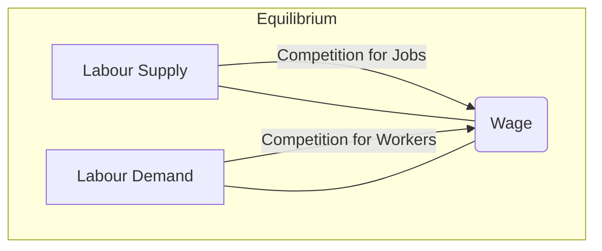

## 4.4 The Labour Market

The labour market is a critical component of any economy, including Canada’s. It is where workers (the supply of labour) and employers (the demand for labour) come together, negotiating wages, employment conditions, and long-term job security. Labour market indicators, such as the unemployment rate, labour force participation rate, job vacancy statistics, and wage growth, provide essential clues about the overall health of the economy and the potential direction of monetary and fiscal policy.

In this section, we will examine how the Canadian labour market operates, highlighting various types of unemployment, wage determinants, and government policies that impact employment. By understanding these dynamics, investors, financial professionals, and policymakers can make more informed decisions related to asset allocation, inflation-risk assessments, and long-term strategic planning.

---

## Understanding the Labour Market in Canada

### Supply and Demand in the Labour Market

The labour market follows the same fundamental principle of supply and demand that underpins many economic models:

• The “supply” side represents the pool of available workers, including individuals actively seeking jobs and those willing to transition between positions.  
• The “demand” side encompasses employers who need labour to produce goods and services.  

When the demand for labour outstrips supply, employers may raise wages to attract and retain qualified workers. Conversely, if there is a surplus of labour, wages may stagnate or decline due to heightened competition for available jobs.

Below is a simplified diagram illustrating the classical supply and demand framework in the labour market.

In this diagram:  
• A (Labour Supply) and B (Labour Demand) intersect at a wage level C (Wage).  
• The equilibrium wage is determined by the overall level at which the quantity of labour supplied equals the quantity of labour demanded.

---

## Key Labour Market Indicators

Sound investment decisions and policy measures rely on accurate assessments of the labour market. The most commonly referenced metrics include:

### Unemployment Rate

The unemployment rate is the percentage of the total labour force that is not employed but is actively seeking work. In Canada, the labour force generally includes all individuals aged 15 years and older who are either employed or actively looking for employment.

• A rising unemployment rate often signals reduced economic activity or a potential recession.  
• When unemployment is low, the economy may be expanding; however, policymakers must also monitor wage pressures that can stoke inflation.

### Labour Force Participation Rate

The labour force participation rate measures the proportion of the working-age population (usually defined as those aged 15 to 64 in Canada) who are either employed or actively seeking employment.  
• A declining participation rate can indicate a structural shift, as people might be retiring early, pursuing further education, or discouraged from seeking work.  
• An increasing participation rate may suggest stronger confidence in the availability of jobs, or demographic shifts with more individuals wanting or needing to work.

### Employment Growth

Employment growth captures the net change in the number of employed individuals over a given period. Accelerating job growth often coincides with economic expansion and rising corporate profits, which can encourage investment and boost consumer spending. Conversely, job losses frequently indicate economic headwinds and signals of potential contraction.

### Job Vacancy Statistics

Job vacancy rates reflect the unmet labour demand in the market. They indicate the number of opened positions that remain unfilled.  
• High vacancies may imply a mismatch between the skills of available workers and employer requirements or strong economic conditions where demand for labour outpaces supply.  
• When job vacancy rates are low, it may suggest a softer labour market with fewer opportunities or a slowdown in hiring.

Government agencies, banks, and research institutions use these indicators to track economic vitality. For instance, RBC Economics, TD Economics, and other major Canadian financial institutions release monthly or quarterly labour market updates that provide insights into wage trends and sector-specific employment data.

---

## Types of Unemployment

Understanding the different categories of unemployment helps investors and policymakers diagnose the causes behind joblessness and craft appropriate solutions. In Canada, and internationally, economists generally reference three key types:

1. **Structural Unemployment**  
   Structural unemployment arises when workers’ skills no longer match the profiles demanded by employers. This mismatch can result from technological advancements, shifting consumer preferences, or changes in global trade patterns. For example, a Canadian auto plant worker facing long-term unemployment due to automation may require retraining to transition into a new sector, such as advanced manufacturing or green technology.

2. **Frictional Unemployment**  
   Frictional unemployment is the short-term joblessness that occurs when workers are “in between” jobs or newly entering the workforce. Typical examples include recent university graduates searching for their first positions or individuals who voluntarily left their previous employment to find better opportunities. In a healthy economy, frictional unemployment is typically unavoidable but is also often a sign of a dynamic labour market where workers freely move to better-suited or higher-paying jobs.

3. **Cyclical Unemployment**  
   Cyclical unemployment is directly tied to fluctuations in the business cycle. During recessions or economic downturns, the demand for goods and services falls, prompting firms to reduce their workforce. As the economy recovers and demand rebounds, cyclical unemployment tends to decline.

Below is a table summarizing the key attributes of each type of unemployment.

| Type of Unemployment  | Primary Cause                                | Duration           | Example                        |
|-----------------------|----------------------------------------------|--------------------|--------------------------------|
| Structural            | Skills/job mismatch, tech changes            | Long-term          | Automation in manufacturing    |
| Frictional            | Transition between jobs or workforce entry   | Short-term         | Recent graduate job searching  |
| Cyclical              | Economic downturn or recession               | Varies with cycles | Layoffs during market slowdown |

---

## Government and Central Bank Influence on Employment

### Fiscal Policy

Federal and provincial governments in Canada can influence the labour market through spending and taxation policies:  
• Stimulus spending on infrastructure projects may create jobs in construction and related industries.  
• Tax incentives for businesses can encourage expansion, prompting new hires.  
• Training programs run by Employment and Social Development Canada (ESDC) can reduce structural unemployment by teaching workers in-demand skills.

### Monetary Policy

The Bank of Canada also contributes to shaping employment levels, primarily by adjusting interest rates.  
• When the Bank lowers interest rates, borrowing becomes more affordable, which may spur business investment and consumer spending, potentially raising employment.  
• Conversely, raising interest rates can temper inflationary pressures but may also slow economic growth and hiring.

---

## Practical Case Studies in the Finnish Context

While labour market mechanisms are universal, let’s consider a brief example illustrating how these forces can interact in Canada:

1. **Case Study: Resource-Based Provinces**  
   Provinces like Alberta rely heavily on the oil and energy sectors. A drop in oil prices can lead to cyclical unemployment as companies reduce production and cut costs. Government support programs (like extended employment insurance) aim to mitigate the short-term social costs. At the same time, structural unemployment may arise if shifts toward renewable energy reduce long-term demand for certain fossil fuels, forcing workers to upskill.

2. **Case Study: Tech Sector Growth in Ontario**  
   Toronto’s technology corridor has seen robust job growth, fueled by demand for software developers, data analysts, and AI specialists. This scenario can create structural unemployment for workers with skill sets in declining industries unless they retrain for roles in technology. Government-sponsored programs, such as those supported by Employment Ontario or partially funded by the federal government, aim to bridge the skill gap and facilitate a smoother transition for affected workers.

---

## Reading and Interpreting Labour Market Data from Statistics Canada

When analyzing labour market reports from Statistics Canada (often released monthly), focus on these steps:

1. **Check the Headline Data**: Look at the unemployment rate and job gains/losses.  
2. **Examine the Participation Rate**: Determine if changes in the unemployment rate stem from new job creation or a shrinking labour force.  
3. **Assess Sector-Specific Trends**: Note which industries (e.g., construction, finance, technology, healthcare) are hiring or cutting back.  
4. **Monitor Wage Growth**: Evaluate whether wage increases are outpacing inflation, which can signal potential inflationary pressures.  
5. **Compare Regional Differences**: Labour market conditions can vary significantly among provinces and territories.

---

## The Intersection of the Labour Market and Investment Decisions

Financial professionals, including portfolio managers and investment advisors, regularly integrate labour market insights into their models. Here are common reasons:

1. **Inflation Expectations**: Tight labour markets can lead to rising wages, which may increase inflation. This can drive interest rate adjustments by the Bank of Canada.  
2. **Consumer Spending**: Employment growth translates to higher disposable income, potentially boosting consumer-oriented sectors like retail and automotive.  
3. **Corporate Profitability**: Labour costs often represent one of the largest expenses for businesses. Significant changes in wage levels can impact profit margins, making certain equities more or less attractive.  
4. **Macro-Economic Forecasting**: Labour market data is a key input in GDP forecasting and an essential component for identifying peak/trough moments within the business cycle.

---

## Conclusion and Key Takeaways

The labour market is a vital economic barometer, showcasing the balance between employers’ needs and workers’ availability. By understanding labour market data—unemployment rates, participation rates, job vacancies, and wage trends—professionals gain insights into broader economic conditions and potential investment opportunities. Differentiating among structural, frictional, and cyclical unemployment clarifies the root causes of joblessness and highlights targeted solutions. Fiscal and monetary policies in Canada, administered by both federal authorities and the Bank of Canada, play significant roles in shaping employment levels, consumer confidence, and overall economic health.

As you continue your exploration of Canadian economic fundamentals, keep returning to labour market indicators. They serve as a real-time pulse on economic activity and can decisively influence policy decisions, business strategies, and financial markets.

---

## Mermaid Diagram Explanation

• The mermaid diagram above shows labour supply and demand intersecting at a wage level that balances worker availability with employer demand. This basic model underpins wage negotiations and informs policymakers about potential shortages or surpluses of labour in different industries.

---

## Best Practices and Common Pitfalls

• **Stay Current with Reports**: Track monthly labour force surveys from Statistics Canada and quarterly updates from major Canadian banks.  
• **Differentiate Among Unemployment Types**: Policies that address frictional unemployment (e.g., job-placement services) differ from those addressing structural unemployment (e.g., retraining programs).  
• **Evaluate Regional Disparities**: A single national unemployment rate may mask regional differences in employment conditions.  
• **Avoid Over-Reliance on Headline Data**: Delve deeper into wage growth, underemployment, and sector-specific metrics to get the full picture.

---

## Additional Resources

• Statistics Canada – Labour Market Indicators:  
  https://www.statcan.gc.ca/en/subjects-start/labour

• Employment and Social Development Canada (ESDC):  
  https://www.canada.ca/en/employment-social-development.html

• Bank of Canada – Reports on Labour Market Conditions:  
  https://www.bankofcanada.ca/

• Recommended Reading  
  – “Canadian Labour Market and Skills Researcher Network” Publications  
  – “Labour Economics” by George J. Borjas  

• Open-Source Economic Data Tools  
  – FRED API (Federal Reserve Economic Data; while U.S.-focused, it can include some Canadian data via cross-listings)  
  – Statistics Canada Open Data Portal  

---

## Quiz: Test Your Knowledge of the Canadian Labour Market



### Which factor does the labour supply in Canada primarily represent in the labour market? 
- [ ] Employers seeking to hire qualified personnel  
- [x] Individuals who are employed or actively seeking employment  
- [ ] Both employers and employees together  
- [ ] The federal government's hiring strategies  

> **Explanation:** In the labour market, “labour supply” refers to individuals available and willing to work, including those employed or actively looking for jobs.

### Which best describes frictional unemployment?
- [x] Temporary unemployment among workers in between jobs  
- [ ] Long-term unemployment caused by skill mismatches  
- [ ] Unemployment linked to a recessionary period  
- [ ] Technological advancements displacing workers  

> **Explanation:** Frictional unemployment occurs when individuals are voluntarily between jobs or entering the workforce for the first time.

### What does a high labour force participation rate indicate?
- [x] A large share of the working-age population is either employed or seeking employment  
- [ ] Most of the working-age population is unemployed  
- [ ] The economy is in a recession  
- [ ] Disposable income is decreasing  

> **Explanation:** The labour force participation rate measures how many working-age individuals are actively contributing to or looking to contribute to the workforce.

### Which type of unemployment is closely correlated with downturns in the business cycle?
- [ ] Frictional unemployment  
- [ ] Structural unemployment  
- [x] Cyclical unemployment  
- [ ] Seasonal unemployment  

> **Explanation:** Cyclical unemployment arises from fluctuations in economic activity, typically increasing during recessions and decreasing during expansions.

### Which of the following policies is most likely to reduce structural unemployment?
- [x] Offering government-funded retraining programs for workers  
- [ ] Lowering interest rates to increase borrowing for companies  
- [x] Providing tax breaks for companies to adopt new technologies  
- [ ] Reducing government spending on social programs  

> **Explanation:** Structural unemployment occurs when workers’ skills do not match market demands. Retraining programs and incentives encouraging firms to invest in new opportunities can help workers transition into necessary skill sets.

### Why might a tight labour market lead to inflationary pressures?
- [x] Employers increase wages to attract scarce talent, raising production costs and potentially prices  
- [ ] Workers voluntarily leave the workforce en masse  
- [ ] The Bank of Canada reduces interest rates  
- [ ] Consumer demand for goods decreases  

> **Explanation:** A tight labour market often translates into higher wages, which can fuel higher consumer demand and push up prices, contributing to inflation.

### What kind of information does the Bank of Canada typically use to adjust interest rates? 
- [x] Labour market indicators, inflation trends, and GDP growth  
- [ ] Real estate listings and home renovation data  
- [x] Local municipal budgets and infrastructure spending only  
- [ ] All forms of enterprise-level equity holdings  

> **Explanation:** The Bank of Canada frequently reviews employment trends, inflation data, and GDP figures when deciding on monetary policy actions like rate hikes or cuts.

### When the unemployment rate falls, but the labour force participation rate also declines, what might this suggest?
- [x] Some people have stopped looking for work and are no longer counted as unemployed  
- [ ] The economy is rapidly expanding with no side effects  
- [ ] GDP always increases when unemployment rates drop  
- [ ] The labour market is unaffected by business cycles  

> **Explanation:** A dropping unemployment rate might be misleading if workers are exiting the labour force rather than finding jobs.

### Which government body in Canada is primarily responsible for collecting and publishing labour market data?
- [x] Statistics Canada  
- [ ] Employment Insurance Canada  
- [ ] Ministry of Finance Canada  
- [ ] Bank of Canada  

> **Explanation:** Statistics Canada is the main federal agency responsible for producing data that helps Canadians better understand their country, including labour market statistics.

### The term “structural unemployment” primarily refers to joblessness due to:
- [x] A mismatch between the skills of workers and the jobs available  
- [ ] Temporary transitions between jobs  
- [ ] Fluctuations in economic cycles  
- [ ] Seasonal variations in employment  

> **Explanation:** Structural unemployment reflects deeper, longer-term changes in the economy where workers’ existing skills are not suitable for emerging job opportunities.



---

