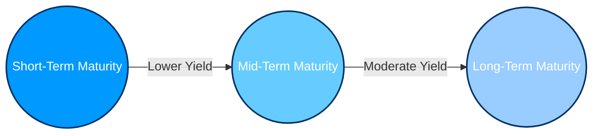

## 4.5 The Role of Interest Rates

Interest rates represent the cost of borrowing or the reward for saving. They are pivotal to economic growth, impacting everything from household mortgages to major corporate investment decisions. In Canada, the Bank of Canada (BoC) plays a central role in setting policy interest rates. This policy rate cascades through the financial system, influencing short-term interest rates, long-term bond yields, mortgage rates, and even the exchange rate of the Canadian dollar.

The purpose of this section is to provide a comprehensive overview of how interest rates function, why they matter for investors and corporations, and how they translate into real-world impacts on the Canadian economy. We will delve into the role played by the Bank of Canada in setting monetary policy, demonstrate how interest rates ripple through capital markets, and highlight practical examples, case studies, and exercises that readers can use to deepen their understanding.

---

## Understanding Interest Rates

Interest rates, at their core, can be viewed in two ways:  
1. The percentage a lender charges a borrower for the use of money.  
2. The return earned by depositing or investing funds.

### Terminology and Core Concepts

• Interest Rate: The cost of borrowing money or the reward for saving. It is typically expressed as an annual percentage of the principal amount.  
• Policy Interest Rate: The benchmark interest rate the central bank (the Bank of Canada in this context) sets to guide monetary conditions.  
• Bond Yield: The percentage return an investor expects to earn from holding a bond. Bond yields fluctuate in response to market interest rates, credit risk, and market sentiment.  
• Risk-Free Rate: The theoretical return on an investment with zero risk, often estimated using relatively safe Government of Canada bonds.  
• Discount Rate (in valuation): Used for calculating the present value of future cash flows—higher discount rates lower the present value of future income streams.

### Key Influences on Interest Rates

1. Policy Decisions by the Bank of Canada  
   – When the Bank of Canada drops its policy rate, short-term interest rates typically follow, making loans more affordable and stimulating borrowing.  
   – Conversely, when the Bank raises rates, borrowing costs increase, potentially dampening spending and helping control inflation.

2. Inflation Expectations  
   – Investors and institutional lenders will adjust the rates they charge for borrowing to account for expected future inflation. Higher inflation expectations often lead to higher interest rates.

3. Credit and Default Risk  
   – Different borrowers pay different rates based on their creditworthiness (i.e., the likelihood they can repay). For example, Government of Canada bonds typically have lower yields because of their high credit quality, whereas corporate bonds from companies with weaker credit ratings offer higher yields.

4. Global Capital Flows  
   – Canada’s open economy can be influenced by shifts in global interest rates. If foreign interest rates rise significantly relative to Canadian rates, global investors might shift capital away from Canadian debt, influencing domestic bond yields and, to some degree, the exchange rate of the Canadian dollar.

---

## The Bank of Canada’s Role in Monetary Policy

The Bank of Canada manages monetary policy primarily through its **overnight rate** target—an interest rate used by major financial institutions to lend/borrow among themselves for one-day (overnight) funds. By raising or lowering this benchmark rate, the Bank of Canada attempts to keep inflation within a target range (typically 1% to 3%).

### Monetary Policy Tools

1. Open Market Operations  
   – The Bank of Canada buys or sells Canadian Government securities in the open market, influencing the amount of money in circulation and indirectly affecting market interest rates.

2. Policy Rate Announcements  
   – Scheduled eight times a year, these announcements outline the Bank’s view on economic conditions and its decision to maintain, raise, or lower the key interest rate.

3. Forward Guidance  
   – The Bank can signal future policy intentions to influence market expectations and shape financial conditions before any actual policy change.

### Stimulating vs. Cooling the Economy

• Lowering Interest Rates:  
  – Reduces borrowing costs, encouraging consumer spending on large-ticket items (e.g., homes, cars).  
  – Stimulates business investment by lowering the cost of capital.  
  – May lead to currency depreciation, boosting exports (since Canadian goods become cheaper abroad).

• Raising Interest Rates:  
  – Increases borrowing costs, reducing credit demand and curbing excessive monetary expansion.  
  – Slows consumer and business spending, helping to cool inflation.  
  – Can lead to currency appreciation, making imports cheaper but potentially reducing export competitiveness.

---

## Interest Rates in Capital Markets

In capital markets, interest rates frame the foundation upon which risk premiums and discount rates are built. For instance, the yield offered on a 10-year Government of Canada bond is often viewed as the “risk-free rate,” serving as a baseline to evaluate other, riskier investments.

### Yield Curves

A “yield curve” plots the yields on Government of Canada bonds of varying maturities, from short-term (e.g., 3-month T-bills) to long-term (30-year bonds).  
• A normal yield curve gently slopes upward, meaning longer maturities usually command higher yields to compensate for additional risks (such as inflation and interest rate uncertainty).  
• An inverted yield curve (where short-term yields exceed long-term yields) may signal expectations of slower economic growth or recession.

Here is a simple visual representation of typical yield curve shapes using Mermaid.js:

### Bond Valuation and Yields

When market interest rates rise, existing bonds (with lower coupon rates) become less attractive, driving their prices down. Conversely, when interest rates fall, existing bonds become more appealing, and their prices generally climb. This inverse relationship between bond prices and yields is central to bond investing strategies.  

#### Practical Example:  
• Suppose RBC issues a 5% coupon bond at par value of $1,000. If interest rates in the market suddenly drop to 4%, the existing 5% bond looks more attractive. Its price on the secondary market may rise above $1,000 (above par).  
• Conversely, if interest rates jump to 6%, new bonds offer a higher coupon rate, so the 5% bond’s price will typically fall below $1,000 (below par) to compensate for the lower coupon.

---

## Interest Rates’ Impact on Corporate Financing

Canadian corporations—like Toronto-Dominion (TD) or any other major company—track interest rates to time their debt issuance. Lower borrowing costs can spur expansions, allowing businesses to invest in new equipment or expand globally. Conversely, companies might delay projects when interest rates are high because of the higher cost of capital.

### Equity Valuation and Discount Rates

In equity valuation, analysts often use a **discount rate** to calculate the present value of future cash flows. A frequently used discount rate is the **Weighted Average Cost of Capital (WACC)**, which includes the cost of equity and the cost of debt. If interest rates rise, the cost of debt increases. Consequently, an analyst’s discount rate might go up, reducing the valuation of future intangible or uncertain cash flows.

#### Simplified Example of Present Value Calculation:

If a stock is expected to generate $10 in dividends and share price appreciation next year and you discount this by 5%, the present value (PV) is:
  

PV = \frac{10}{1 + 0.05} = \$9.52


If your discount rate rises to 7%, the PV becomes:
  

PV = \frac{10}{1 + 0.07} = \$9.35


Even a small change in the discount rate can produce a noticeable shift in valuation—one critical reason why interest rates are so central to equity analysis.

---

## Household and Institutional Borrowing

Beyond corporate financing, households also face the effects of interest rates in their daily lives. mortgage rates, personal lines of credit, and car loans typically fluctuate in response to the Bank of Canada’s policy rate and broader market conditions.

### Mortgage Rates

Banks adjust their prime lending rates when the Bank of Canada shifts its key rate. This change causes mortgage rates to move, influencing home affordability and the real estate market’s overall activity. A low-interest-rate environment can fuel a surge in home purchases, whereas higher rates may dampen demand.

### Consumer Credit

Financial institutions may adjust interest rates on credit cards, auto loans, and lines of credit in line with the prime rate. Consumers are therefore faced with higher or lower monthly payments depending on the current interest rate environment.

### Institutional Borrowing

• Pension Funds: Large pension funds (e.g., the Canada Pension Plan Investment Board) may adjust their investment strategies if returns from fixed-income securities rise or fall.  
• Hedge Funds and Asset Managers: They might alter leverage or adopt different strategies depending on financing costs.

---

## Regulatory Context in Canada

Interest rate policies do not exist in a vacuum. They interact with regulations and guidelines established by bodies such as the Canadian Investment Regulatory Organization (CIRO) and the Office of the Superintendent of Financial Institutions (OSFI).

• CIRO’s rulebook (https://www.ciro.ca/) provides guidelines for margin accounts and client lending, ensuring robust risk management practices despite shifts in interest rates.  
• OSFI sets regulatory capital requirements for banks, influencing how they extend loans and manage interest rate risk.  
• The Bank of Canada, in coordination with the Ministry of Finance, ensures that interest rate policy aligns with broader economic stability objectives.

---

## Strategies for Navigating Interest Rate Environments

### Best Practices

1. Stay Informed on Bank of Canada Announcements  
   – Review policy statements, economic projections, and forward guidance.  
   – Set up alerts from the Bank of Canada: https://www.bankofcanada.ca/rates/interest-rates/

2. Diversify Across Asset Classes  
   – Maintain a balanced portfolio of equities, bonds, and alternative investments.  
   – Adjust the allocation in line with changing outlooks on interest rates.

3. Consider Duration and Credit Risk in Fixed Income  
   – Focus on short-term bonds when rates are expected to rise, since they are less sensitive to rate hikes.  
   – If you anticipate falling rates, longer-term bonds may see price appreciation.

### Potential Challenges and Pitfalls

• **Overleveraging**: Borrowers who take on too much debt during periods of low interest rates can face strain when rates rise.  
• **Ignoring Inflation**: Even if nominal rates are low, a high inflation environment can erode real returns.  
• **Chasing Yield**: Seeking higher returns in riskier assets without sufficient due diligence can lead to significant portfolio losses if market conditions change rapidly.

---

## Step-by-Step Guide to Analyzing Interest Rate Impacts

1. Identify the Current Policy Environment  
   – Check the latest BoC policy rate and read their recent announcements.  
2. Assess Inflation and Economic Indicators  
   – Examine the Consumer Price Index (CPI), unemployment rate, GDP growth, and other macroeconomic signals.  
3. Evaluate Market Sentiment  
   – Look at bond yield movements, yield curve shape, and credit spreads.  
4. Conduct Scenario Analysis  
   – Model how shifts in interest rates (e.g., +1% or –1%) might affect your portfolio or business operations.  
5. Adjust Asset Allocation  
   – For investor portfolios, possibly reduce long-term bonds when rates are rising, or consider variable-rate notes if suitable for your risk profile.  
6. Monitor Since Conditions Evolve Rapidly  
   – Reassess interest rate assumptions regularly, keeping track of domestic and global events.

---

## Real-World Application: Case Study

### Pension Fund Asset Allocation

Consider a major Canadian pension plan that invests in both fixed-income and equity markets. When the Bank of Canada lowers interest rates:  
• The pension fund’s government bond holdings may increase in price, boosting returns in the short term. However, new bond purchases will offer lower yields.  
• The plan may shift some allocation toward equities to try to generate higher returns, given the low yields in fixed income.  
• Longer-term, the fund remains vigilant about duration risk and is prepared to move back into shorter-term bonds if yields begin to climb.

### Corporate Decision-Making at a Large Canadian Bank

A leading Canadian commercial bank (e.g., RBC) might time the issuance of new bonds to coincide with favorable market interest rates. If RBC expects an upcoming interest rate hike:  
• It might issue debt earlier to lock in a lower rate now.  
• Anticipate that future borrowing becomes more expensive.  
• Possibly adjust loan offerings and mortgage rates for clients, influencing how the bank competes within the industry.

---

## Additional Resources

Below are some authoritative sources for those interested in studying interest rates further:

• Bank of Canada – Policy Interest Rate Announcements:  
  https://www.bankofcanada.ca/rates/interest-rates/

• CIRO’s rulebook for dealer and client margin and lending guidelines:  
  https://www.ciro.ca/

• Open-source worldwide interest rate data from:  
  – International Monetary Fund (IMF)  
  – World Bank Data Portals

• Recommended Reading:  
  1. “Inside the Bank of Canada – Monetary Policy in Action” by Alexandra Gorbenko et al.  
  2. “Money, Banking, and Financial Markets” by Frederic Mishkin  

---

## Conclusion

Interest rates wield a tremendous influence over the Canadian economy, impacting consumer borrowing costs, corporate capital structures, and overall financial policies. The Bank of Canada’s role in setting the policy rate is critical to moderating inflation, nurturing economic growth, and influencing the Canadian dollar’s strength in global markets. For investors, understanding how interest rates affect valuations and borrowing costs is fundamental to constructing well-balanced portfolios and making informed decisions.

By staying abreast of economic indicators, listening to policy announcements, and applying best practices in portfolio and risk management, investors and financial professionals can navigate the ever-evolving landscape of interest rates. As with all areas in finance, continuous learning and vigilance are key—just as real-world conditions inform interest rate movements, they should also drive your approach to both capital raising and investing strategies.

---

## Quiz: Mastering the Role of Interest Rates in Canada



### Which of the following best describes the primary objective of the Bank of Canada’s monetary policy?
- [ ] Sustaining maximum employment regardless of inflation.  
- [ ] Ensuring zero inflation.  
- [ ] Providing profitability for commercial banks.  
- [x] Maintaining price stability and supporting economic growth.  

> **Explanation:**( The Bank of Canada’s main objectives are to keep inflation within a target range (usually 1%–3%) and to support stable, sustainable economic growth.)

### When the Bank of Canada lowers its key policy rate, which of the following typically occurs?
- [x] Borrowing costs fall, stimulating economic activity.  
- [ ] Borrowing costs rise, slowing economic activity.  
- [ ] Prime lending rates remain unchanged.  
- [ ] Inflation falls substantially in the short term.  

> **Explanation:**( Lowering the policy rate makes borrowing cheaper, which usually encourages consumer and business spending. Prime lending rates are often reduced, facilitating economic growth.)

### A yield curve that slopes downward (inverted) most frequently suggests:
- [ ] Very high inflation expectations.  
- [x] Market sentiment predicting slower economic growth or a recession.  
- [ ] The Bank of Canada’s plan to keep rates near zero permanently.  
- [ ] Unusually high short-term Treasury yields influenced by corporate bond spreads.  

> **Explanation:**( An inverted yield curve typically reflects market expectations that economic growth will slow and that interest rates will be lower in the future.)

### Which factor does NOT commonly affect interest rates in Canada?
- [ ] The Bank of Canada’s policy decisions.  
- [ ] Global capital flows.  
- [ ] Inflation expectations.  
- [x] The U.S. Internal Revenue Service (IRS) tax policies.  

> **Explanation:**( While U.S. economic policies can have an indirect influence on Canadian interest rates through global market dynamics, the IRS tax code is not a direct factor shaping Canadian interest rates.)

### How do higher market interest rates generally affect bond prices?
- [x] Bond prices generally decrease as interest rates rise.  
- [ ] Bond prices remain unaffected by changes in interest rates.  
- [x] The “coupon rate” also independently adjusts upward automatically.  
- [ ] Bond prices generally increase as interest rates rise.  

> **Explanation:**( Bond prices and interest rates move inversely. If interest rates increase, existing fixed-coupon bonds provide lower returns compared to new issues, causing their market prices to decline. Note that coupons do not typically adjust automatically—once set, the coupon rate is fixed (except in the case of variable-rate bonds).)

### In calculating equity valuations, the discount rate primarily:
- [x] Determines the present value of future cash flows.  
- [ ] Increases future cash flows to match inflation.  
- [ ] Eliminates risk premiums.  
- [ ] Guarantees a higher stock price in low interest rate environments.  

> **Explanation:**( A discount rate is used to compute the present value of expected future cash flows. Changes to the discount rate can significantly alter that valuation.)

### Which Canadian regulatory body sets margin and lending guidelines for investment dealers?
- [x] The Canadian Investment Regulatory Organization (CIRO).  
- [ ] The World Bank.  
- [x] The Office of the Superintendent of Financial Institutions (OSFI).  
- [ ] The Canada Revenue Agency (CRA).  

> **Explanation:**( CIRO (formerly IIROC) oversees dealer member regulation and sets key margin and lending guidelines. OSFI, on the other hand, also plays a role in overseeing financial institutions, but not specifically margin guidelines for investment dealers.)

### When the Bank of Canada signals it might raise rates, corporations often:
- [x] Issue debt sooner to lock in lower rates.  
- [ ] Issue fewer bonds when rates are still low.  
- [ ] Delay capital intensive projects to benefit from future low rates.  
- [ ] Avoid adjusting their treasury strategies.  

> **Explanation:**( Expecting higher future rates, many corporations will issue bonds or take on debt earlier, anticipating that future borrowing costs will be higher.)

### Which of the following is considered a key step in analyzing interest rate impacts on a portfolio?
- [x] Conducting scenario analysis for varying interest rates.  
- [ ] Ignoring risk-free assets entirely to focus on higher returns.  
- [ ] Assuming bond prices generally rise as interest rates rise.  
- [ ] Eliminating equity investments during monetary tightening.  

> **Explanation:**( Scenario analysis examines different interest rate environments to measure the potential impact on a portfolio. This proactive approach helps in adjusting asset allocations strategically.)

### The relationship between interest rates and inflation is:
- [x] True  
- [ ] False  

> **Explanation:** There is a relationship: interest rates are often raised to combat high inflation, whereas lowering rates can stimulate economic activity if inflation is stable or below target.  



---

## For Additional Practice and Deeper Preparation

**Elevate your exam readiness with our comprehensive app, "Securities CA: Mock Exams," designed to challenge and refine your skills.**

* **Master Challenging Questions:** Dive into expertly crafted sample exam questions that go beyond standard references.
* **Scenario-Driven Learning:** Experience scenario-driven case questions and in-depth solutions to build practical expertise.
* **Sharpen Exam Strategies:** Build confidence with step-by-step explanations designed to refine your exam-day tactics.
* **Gain Real-World Insights:** Acquire practical tips and detailed rationales that demystify complex concepts.
* **CIRO and CSI Alignment:** Stay current with CIRO guidelines and CSI’s exam structure, with questions intentionally more challenging than the actual exam.

**Download the App Today:**

> Note: While these courses are specifically crafted to align with the CSC® exams outlines, they are independently developed and not endorsed by CSI or CIRO.
