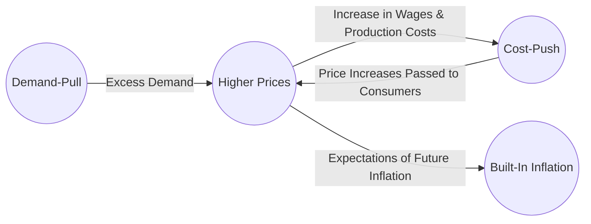

## 4.6 The Impact of Inflation

Inflation, at its most basic level, is the sustained rise in the overall price level of goods and services over time. When inflation is moderate and controlled, it generally reflects a growing economy, where demand, wages, and prices move in sync. However, if inflation is too high—and especially when it is unpredictable—it can damage economic stability by eroding purchasing power. Conversely, deflation, or a general decrease in price levels, can stifle growth because economic agents delay spending and investment, anticipating even lower prices in the future. 

Understanding how inflation arises, is measured, and can be managed is crucial for everyone from policy-makers and institutional portfolio managers to individual investors saving for retirement. This section delves into the nature of inflation, the role of the Bank of Canada in regulating inflation, and how investors can account for it in their strategies to ensure real returns keep pace with or surpass the rate of rising prices.

---

## Defining Inflation

### Overview
Inflation measures how much more expensive a set of goods and services has become over a certain period. As inflation increases, each dollar buys fewer goods and services, reducing the purchasing power of money. While the Canadian economy, like most contemporary economies, experiences a moderate level of inflation over time, extreme scenarios such as hyperinflation and sustained deflation can be immensely disruptive.

### Key Terminology
• Inflation: A general increase in prices over time, reducing the purchasing power of money.  
• Consumer Price Index (CPI): A measure that tracks changes in the prices of a “basket” of common consumer goods and services.  
• Demand-Pull Inflation: Occurs when consumer demand outpaces the economy’s capacity to produce, leading to upward pressure on prices.  
• Cost-Push Inflation: Occurs when rising costs of production—such as higher wages or increased raw material costs—push prices upward.  
• Deflation: A broad decrease in general price levels. Though it might sound beneficial at first, deflation can slow or even stall economic activity.

---

## Measuring Inflation: The Consumer Price Index (CPI)

### CPI Composition
In Canada, Statistics Canada compiles the CPI data by monitoring the prices of hundreds of items in various categories such as food, transportation, clothing, and shelter. The “basket” is updated periodically to reflect changing consumer habits. The average of price changes is then converted into an index, making it easy to see how prices shift over time.

### Interpreting the CPI
An increase in the CPI indicates that, on average, these items cost more; a decline suggests they cost less. While useful, the CPI may not perfectly capture personal inflation experiences because individual consumption patterns vary. Nonetheless, it remains the most widely referenced metric for setting government policy and guiding business decisions in Canada.

For more detailed CPI data:  
• Bank of Canada – [Inflation Calculator and CPI Publications](https://www.bankofcanada.ca/rates/related/inflation-calculator/)  
• [Statistics Canada – Consumer Price Index data](https://www.statcan.gc.ca/en/subjects-start/prices_and_price_indexes)

---

## Types of Inflation

Inflation can manifest through several mechanisms. Understanding these helps in formulating appropriate policy, investment, or personal finance strategies.

### Demand-Pull Inflation
When demand for goods and services exceeds the economy’s productive capacity, prices tend to rise. This scenario typically emerges in an environment where consumer confidence is high, unemployment is low, and consumers have greater disposable income. Rapid economic growth can lead to demand-pull inflation if supply cannot keep up with surging demand.

### Cost-Push Inflation
Inflation driven by rising production costs—often brought about by higher wages, raw material price increases, or supply chain disruptions—leads to cost-push inflation. Producers, facing higher costs, pass them on to consumers through higher prices. A classic example includes oil-price shocks that affect transportation and manufacturing across the economy.

### Built-In Inflation
Sometimes referred to as wage–price spirals, built-in inflation occurs when workers demand higher wages to keep up with rising costs. Businesses then raise the prices of goods and services to cover the wage increases, leading to further inflation. This cyclical upward pressure on prices and wages can make inflation self-reinforcing.

In the Mermaid diagram above, we see how these three inflation mechanisms interconnect. For instance, demand-pull inflation can eventually translate into cost-push if wage pressures arise and feed into a wage-price spiral.

---

## Central Bank Targets and Monetary Policy

### The Bank of Canada’s Inflation Target
The Bank of Canada aims to keep inflation around 2% (within a 1%–3% target band). This target is believed to foster price stability that supports long-term economic growth. The Bank uses tools such as setting the policy interest rate (via the overnight rate) to influence borrowing costs, spending, and investment decisions.

### Adjusting Policy Rates
When inflation threatens to exceed the target range, the Bank of Canada may raise policy rates. This action makes borrowing more expensive, cooling consumption and investment, thus reducing inflationary pressure. Conversely, in a deflationary or low-inflation environment, the Bank can lower rates, making borrowing cheaper and boosting economic activity.

### Policy Communication and Forward Guidance
Beyond rate changes, the Bank of Canada communicates policy stances and future expectations through publications and press releases. By signaling future rate moves, policymakers guide market expectations, which can help stabilize prices in anticipation of real policy shifts.

---

## Inflation’s Impact on Investments and Personal Finance

### Real Versus Nominal Returns
From an investment perspective, the “real return” factors in inflation. Even if a nominal return on an investment seems attractive, high inflation can erode much of that gain. Real return is calculated as:

$$
\text{Real Return} = \text{Nominal Return} - \text{Inflation Rate}
$$

For example, if you earn 5% on a bond, but inflation is 3%, your real return is approximately 2%. Investors focus on real returns to gauge the true purchasing power of their investments over time.

### Case Study: Canadian Pension Funds
Canadian pension funds, such as the Canada Pension Plan Investment Board (CPPIB), often incorporate inflation expectations into their asset allocation models. They may invest in real return bonds (RRBs), infrastructure, or other inflation-hedging assets like real estate. Real return bonds adjust their principal (and typically interest payments) in line with inflation, ensuring that the investor’s purchasing power is maintained.

### Example with Canadian Banks
Major Canadian banks like RBC and TD often integrate inflation forecasts into their lending and deposit rate strategies. For instance, if RBC anticipates a rise in inflation, it may adjust mortgage rates upward in response to the Bank of Canada’s policy rate changes. This ensures they manage risk appropriately while offering competitive rates to clients.

### Long-Term Planning: RRSPs and TFSAs
Inflation is a critical consideration in retirement planning within vehicles like RRSPs (Registered Retirement Savings Plans) and TFSAs (Tax-Free Savings Accounts). Even though these accounts offer tax advantages, inflation can diminish real returns if the chosen investments underperform relative to the inflation rate. Balancing a mix of growth-oriented assets (e.g., equities) and inflation-protected instruments (e.g., RRBs) can help.

---

## Strategies for Inflation Management

### Diversification
A diversified portfolio spread across various asset classes—equities, fixed income, real estate, commodities—can mitigate inflation risk. Historically, real assets (like real estate) and commodities (like gold) often hold or increase their value during inflationary periods.

### Real Return Bonds (RRBs)
The Government of Canada issues real return bonds that adjust for inflation. Investors receive a fixed coupon rate on an inflation-adjusted principal. When the CPI increases, the principal amount grows, thus preserving the real value of the investment.

### Equity as a Long-Term Hedge
While stock market returns fluctuate, equities have often outpaced inflation over extended periods. Companies can pass on rising costs to consumers if demand remains stable. This can help corporate earnings keep pace with inflation, and consequently, share prices can maintain or increase in real terms.

### Monitoring Inflation Indicators
Staying informed about CPI trends, wage growth data, producer price indexes (PPIs), and Bank of Canada announcements helps investors anticipate potential shifts. For data enthusiasts, open-source financial data and analytics tools (e.g., R, Python libraries like “pandas_datareader”) can chart historical CPI movements and predict trends.

---

## Best Practices, Challenges, and Pitfalls

### Best Practices
• Continuously review your portfolio’s sensitivity to inflation.  
• Incorporate inflation-hedged securities, particularly for long-term goals.  
• Remain alert to economic indicators and central bank communications.  
• Consider professional advice if you have limited experience in choosing inflation-hedged assets.

### Common Challenges
• Predicting inflation is complex. External shocks (e.g., global pandemics, geopolitical tensions) can cause unexpected upswings in costs.  
• Timing the market in anticipation of policy decisions can be risky; misreading signals may lead to losses.  
• Over-reliance on a single asset class for inflation protection can expose you to concentrated risks, such as sector downturns.

### Potential Pitfalls
• Neglecting real return calculations can lead to an overestimation of true gains.  
• Holding too much cash in high-inflation environments can erode value.  
• Failing to rebalance your portfolio regularly may leave it misaligned with your target inflation-hedging strategy.

---

## Additional Resources

• Bank of Canada – [Inflation Calculator and CPI Publications](https://www.bankofcanada.ca/rates/related/inflation-calculator/)  
• [Statistics Canada – Consumer Price Index data](https://www.statcan.gc.ca/en/subjects-start/prices_and_price_indexes)  
• “Inflation Matters” by Pete Comley  
• “Monetary Theory and Policy” by Carl E. Walsh  

These resources explore advanced aspects of inflation and monetary policy, tracing the interplay between inflation rates, central banking activities, and long-term financial planning.

---

## Summary and Key Takeaways

1. Inflation reduces purchasing power over time, making it imperative to consider real returns rather than nominal ones.  
2. The CPI remains the standard tool to measure changes in the overall price level in Canada.  
3. Inflation may be driven by demand-pull, cost-push, or built-in (wage-price spiral) factors.  
4. The Bank of Canada targets a low, stable inflation rate at around 2%, using tools such as rate adjustments.  
5. Managing inflation risk is crucial for personal finances, especially for long-term investments in accounts like RRSPs and TFSAs.  
6. Investors can use real return bonds, diversification, and equities to hedge against inflationary pressures.  
7. Staying informed on economic indicators and maintaining a well-rebalanced portfolio can alleviate inflation risks.

Encourage yourself to review your portfolio strategy periodically, monitoring the broader economic climate and adjusting asset allocations to hedge against inflationary pressures. In doing so, you can safeguard and grow your purchasing power in alignment with market realities.

---

## Mastering the Impact of Inflation: Quiz for Canadian Investors



### Question 1
Which of the following best describes inflation?  
- [ ] A general decrease in prices over time  
- [x] A sustained rise in the general level of prices, reducing purchasing power  
- [ ] A sudden decrease in interest rates set by a central bank  
- [ ] A targeted government policy to promote exports  

> **Explanation:** Inflation is the sustained increase in overall price levels, which in turn reduces the amount of goods and services one can purchase with a given amount of money.

### Question 2
What is the primary purpose of the Consumer Price Index (CPI) in Canada?  
- [ ] To measure the debt-to-GDP ratio  
- [ ] To track corporate profits  
- [x] To gauge changes in the prices of a typical basket of goods and services  
- [ ] To benchmark employment standards  

> **Explanation:** The CPI monitors price changes in a standardized basket of goods and services, reflecting how prices evolve for Canadian consumers over time.

### Question 3
Which statement accurately characterizes demand-pull inflation?  
- [ ] It is most often caused by a reduction in aggregate demand  
- [ ] It occurs only in times of economic recession  
- [x] It happens when aggregate demand exceeds the productive capacity of the economy  
- [ ] It occurs exclusively due to monetary policy tightening  

> **Explanation:** Demand-pull inflation arises when strong consumer demand outstrips supply, placing upward pressure on prices.

### Question 4
How does the Bank of Canada typically respond when inflation exceeds its target range?  
- [x] By raising policy interest rates to cool down economic activity  
- [ ] By canceling government bonds  
- [ ] By reducing taxes on businesses  
- [ ] By urging consumers to save less and spend more  

> **Explanation:** The Bank of Canada influences inflation by adjusting policy rates. Increasing rates makes borrowing more expensive, which can reduce spending and slow the rate of inflation.

### Question 5
Which investment vehicle is specifically designed to protect against inflation in Canada?  
- [ ] Corporate common stock  
- [x] Real return bonds (RRBs)  
- [x] Treasury Bills (T-Bills)  
- [ ] Growth-oriented mutual funds only  

> **Explanation:** Real return bonds (RRBs) adjust their principal based on changes in the CPI, preserving the real value of the investment. Treasury Bills (T-Bills) also can be part of an inflation hedge strategy, though they are not directly CPI-linked; they’re short-term instruments with returns closely correlated to interest rate changes.

### Question 6
Why is it important to consider “real returns” instead of just “nominal returns”?  
- [x] Because inflation can erode the purchasing power of nominal gains  
- [ ] Because real returns always yield higher profits  
- [ ] Because nominal returns are never used in financial statements  
- [ ] Because real returns only apply to short-term trades  

> **Explanation:** Real returns subtract the inflation rate from nominal returns, revealing how much an investment truly increases one’s purchasing power.

### Question 7
What is one drawback of holding large amounts of cash in a high-inflation environment?  
- [x] Erosion of purchasing power over time  
- [ ] Unlimited capital gains  
- [x] Guaranteed growth in nominal terms  
- [ ] High transaction fees  

> **Explanation:** During periods of high inflation, idle cash loses real value, meaning it can buy fewer goods and services over time.

### Question 8
Which of the following is an example of cost-push inflation?  
- [ ] Consumers spending more due to higher household income  
- [x] An increase in the price of oil leading to higher transportation costs, which raises product prices  
- [ ] A decrease in consumer demand for luxury items  
- [ ] A central bank reducing the money supply  

> **Explanation:** Cost-push inflation results from higher production costs—such as those triggered by a spike in oil prices—that lead producers to raise prices to maintain margins.

### Question 9
Why does the Bank of Canada communicate future inflation expectations and policy moves?  
- [ ] To share confidential corporate data  
- [ ] To reduce reliance on private banks  
- [ ] To undermine consumer confidence  
- [x] To stabilize prices by guiding market expectations  

> **Explanation:** Forward guidance helps align business and consumer expectations around monetary policy, contributing to more stable financial markets and price levels.

### Question 10
The Bank of Canada commonly targets an inflation rate of around 2%.  
- [x] True  
- [ ] False  

> **Explanation:** The Bank of Canada’s monetary policy framework aims to keep inflation at the midpoint of the 1%–3% control range, with 2% as the official target.



---

