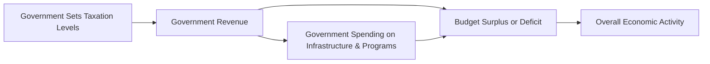

## 5.1 Fiscal Policy

Fiscal policy represents one of the central pillars of government economic strategy, involving decisions around taxation, government spending, and the resulting budget balance (deficit, surplus, or balanced budget). In Canada, fiscal policy is typically enacted by the federal government through the Department of Finance, underpinned by annual federal budgets, budget implementation bills, and various legislative instruments. However, provincial and municipal governments also maintain their own fiscal authority, levying certain taxes and deciding local public expenditures.

A properly formulated fiscal policy can help stabilize an economy, stimulate economic growth, rein in inflation, and influence employment levels. These policies have short-term and long-term effects, and are complemented by monetary policy, which is discussed elsewhere in this course. In the sections that follow, we will break down the fundamentals, examine the mechanics, and consider strategic implications of fiscal policy implementation in the Canadian context.

---

## 5.1.1 Core Components of Fiscal Policy

Broadly speaking, the two primary components of fiscal policy are:

1. **Taxation**  
   • Taxes are collected from individuals, businesses, and other entities to generate government revenue.  
   • Examples include personal income taxes, corporate taxes, sales taxes (GST/HST), excise taxes, and various provincial/municipal taxes.  
   • Taxation policies can shape consumer and business behavior. For instance, a cut in corporate taxes may inspire businesses to expand operations or hire more employees. Meanwhile, a personal income tax reduction can stimulate consumption by leaving households with more disposable income.

2. **Government Expenditures**  
   • Public spending on infrastructure (roads, bridges, public transportation), social programs (e.g., Employment Insurance, social housing), healthcare, and education injects funds directly into the economy.  
   • Government demand for goods and services can stimulate economic activity. This can have a multiplicative effect when new jobs and business contracts lead to additional rounds of spending.  
   • Certain expenditures, such as research grants or technology investments, can boost innovation and long-term economic growth.

### Budgetary Outcomes: Deficits, Surpluses, and Balanced Budgets

Depending on the relationship between government revenues (primarily taxes) and expenditures (spending programs, administrative costs, etc.), the government can face:

- **Budget Deficit:** Occurs when government expenditures exceed revenues in a given fiscal period, prompting the government to borrow money—often through issuing various debt instruments, such as Government of Canada bonds and T-bills.  
- **Budget Surplus:** Occurs when revenues exceed expenditures, enabling the government to reduce existing debts or allocate extra funding to new programs or initiatives.  
- **Balanced Budget:** Occurs when the government’s revenues and expenditures are equal for a fiscal cycle.

---

## 5.1.2 Understanding Fiscal Policy Goals and Effects

### Macroeconomic Objectives

The overarching goals of fiscal policy include:

• **Economic Growth:** By stimulating investment and consumption.  
• **Price Stability (Inflation Control):** By modulating the level of demand in the economy.  
• **Full Employment:** By boosting job creation in both public and private sectors.  
• **Equitable Income Distribution:** Through progressive taxation and targeted social spending.  

### Direct and Indirect Effects

1. **Direct Effects**: When the federal government increases its procurement of goods or services, demand for these items rises immediately. For example, if the Canadian federal government launches a national infrastructure program, construction firms secure more contracts, hire additional employees, and purchase more materials—fueling the economy directly.

2. **Indirect Effects**: Changes in taxation—or the anticipation of future changes—alter consumer and business behavior. For instance, an increase in sales tax might reduce consumer spending on certain goods. Conversely, a tax break for first-time homebuyers might boost the housing sector, affecting both builders and financial institutions like RBC or TD that offer mortgage products.

### Practical Example: Stimulus Spending

Consider a hypothetical situation where Canada experiences an economic slowdown attributed to a slump in global demand for commodities. To counteract rising unemployment, the federal government may roll out an expansionary fiscal policy by announcing:

- A decrease in personal income tax rates to spur consumer spending.  
- Increased spending on infrastructure projects, such as the expansion of public transit systems across major cities or significant repairs to highways in Ontario and Quebec.  

This dual measure aims to strengthen the labor market and foster economic growth. The government, however, may experience a larger budget deficit during this period, financed typically by issuing additional bonds in the capital market.

---

## 5.1.3 Expansionary vs. Contractionary Fiscal Policy

### Expansionary Fiscal Policy

• **Definition**: Implemented when the government wants to stimulate economic activity.  
• **Mechanics**: Involves either cutting taxes, increasing government spending, or both.  
• **Desired Outcomes**: Higher consumer demand, increased production, lower unemployment.  
• **Potential Pitfalls**: Persistent deficits might lead to higher public debt loads over time. There can be a risk of inflation if the economy is already near full capacity.

### Contractionary Fiscal Policy

• **Definition**: Implemented when the government aims to cool down an overheating economy or address inflationary pressures.  
• **Mechanics**: Involves raising taxes, reducing government spending, or both.  
• **Desired Outcomes**: Slowed consumer demand, tempered inflation, reduced pressure on prices.  
• **Potential Pitfalls**: Decreased government investment in critical sectors might hamper long-term growth. Higher taxes may dampen consumer and business confidence if not carefully structured.

---

## 5.1.4 Financing Fiscal Deficits and ‘Crowding Out’

When the government encounters a budget deficit, it needs to borrow money. Common methods include:

• Issuing **Treasury Bills (T-Bills)** for short-term borrowing.  
• Issuing **Government of Canada Bonds** for medium- to long-term borrowing.  
• Potential use of alternative debt instruments like **Real Return Bonds** that offer inflation protection.

### Crowding Out

“Crowding out” refers to a potential scenario where large-scale government borrowing pushes up interest rates, making capital more expensive for private businesses. Consequently, this can stifle private investment or business expansion, diminishing the net stimulative impact of the government’s action in the economy.

This phenomenon is especially relevant to Canadian institutional investors, such as pension funds or insurance companies, which often purchase government bonds as stable long-term investments. If government bond yields become more attractive relative to corporate bonds, some capital could shift away from the corporate sector toward government debt, affecting private enterprise.

---

## 5.1.5 Time Lags and Policy Implementation

Fiscal policy’s effect even in a modern economy can be delayed. Primary lags include:

1. **Recognition Lag**: The time it takes for policymakers to identify that an economic issue (e.g., a recession) is occurring.  
2. **Decision Lag**: Once recognized, time is needed for the political process (debates, legislative approvals) and for the government to determine the best course of action.  
3. **Implementation Lag**: Actual spending or tax programs need additional time to roll out.  
4. **Impact Lag**: Once implemented, it often takes weeks or months for the policy effects to permeate the broader economy.

This delay underscores the importance of accurate economic forecasts and flexible policy instruments. Frequent data publications, such as Statistics Canada’s GDP reports or unemployment figures, help policymakers at the Department of Finance or provincial finance ministries to gauge economic conditions more rapidly and respond appropriately.

---

## 5.1.6 Case Study: Infrastructure Spending in Canada

During a period of economic downturn, the Government of Canada may partner with provincial governments to invest in infrastructure. Major banks like RBC or TD may finance part of the projects or extend credit to construction companies and suppliers. This synergy can rapidly inject liquidity and foster job growth:

1. **The government** announces an expansionary budget with a focus on new public transit lines, highway expansions, or green infrastructure projects.  
2. **Construction firms** benefit from direct contracts, hiring additional workers and sourcing materials, thus creating more jobs.  
3. **Financial institutions** provide financing to businesses in construction and related sectors, fueling further economic growth.  
4. **Local communities** see improvements in public services and potentially benefit from increased property values near upgraded facilities.  

In this manner, fiscal policy can have far-reaching and immediate effects on a broad swath of the Canadian economy.

---

## 5.1.7 Visualizing Fiscal Flows

Below is a simple diagram illustrating how fiscal policy affects economic activity:

• **Government Sets Taxation Levels**: Determines the amount of revenue collected.  
• **Government Revenue**: Funds key spending and determines the budget’s bottom line.  
• **Government Spending**: Directly influences goods and services demand.  
• **Budget Surplus or Deficit**: Surplus fuels savings or more investment options; deficit increases borrowing needs.  
• **Overall Economic Activity**: Combined result of public demand, private consumption, and investor confidence.

---

## 5.1.8 Sustainability and Long-Term Considerations

While short-term measures often aim at stabilizing markets or spurring growth, long-term sustainability involves ensuring public debt does not grow faster than the economy’s capacity to service it. Policymakers must weigh:

• **Public Debt Level**: Consistent deficits leading to higher debt levels place pressure on future budgets.  
• **Demographic Changes**: Aging populations can affect spending requirements (e.g., healthcare, pensions) and reduce the growth of the tax base.  
• **Global Market Factors**: Rating agencies and bond markets closely watch and price a country’s fiscal balance and debt load. An unfavorable outlook can raise borrowing costs.

---

## 5.1.9 Best Practices and Common Pitfalls

### Best Practices

1. **Transparency and Clarity**: Governments should present budgets with clear revenue and expenditure forecasts, fostering public trust.  
2. **Prudent Debt Management**: Financing deficits through a mix of short-term and long-term instruments helps mitigate interest rate risk.  
3. **Counter-Cyclical Policies**: Running surpluses or balanced budgets during economic booms can help build “fiscal room” for expansionary measures during downturns.  

### Common Pitfalls

1. **Pro-Cyclical Spending**: Increasing spending or cutting taxes excessively during a boom may amplify inflation and lead to overheating.  
2. **Underestimating Time Lags**: Failure to account for implementation and impact lags can result in fiscal measures taking effect too late.  
3. **Excessive Reliance on Debt**: Persistent deficits may escalate interest obligations, ultimately reducing government flexibility.

---

## 5.1.10 Additional Resources & References

Below are a few key resources for further exploration of Canadian fiscal policy:

- **Department of Finance Canada**:  
  [https://www.fin.gc.ca/](https://www.fin.gc.ca/)  
  (Official government updates, policy documents, and legislative information.)

- **Government of Canada’s Budget website**:  
  [https://www.budget.gc.ca/](https://www.budget.gc.ca/)  
  (Annual federal budget documents, analyses, and forecasts.)

- **Budget Implementation Acts**  
  (Federal legislation that outlines the government’s spending and revenue measures.)

- **CIRO (Canadian Investment Regulatory Organization)**  
  [https://www.ciro.ca/](https://www.ciro.ca/)  
  (National self-regulatory organization; relevant for industry updates related to regulatory compliance.)

- **IMF Fiscal Monitor**:  
  [https://www.imf.org/en/Publications/FM](https://www.imf.org/en/Publications/FM)  
  (For a global perspective on fiscal policy trends and data.)

- **Suggested Reading: “Canadian Public Finance” by Geneviève Tellier**  
  (In-depth review of Canada’s fiscal frameworks and policy challenges.)

---

## Summary

Fiscal policy shapes the trajectory of Canada’s economy through taxation levels and government expenditures. Key decisions revolve around whether to adopt expansionary or contractionary measures, often impacting employment, inflation, and general economic activity. The government’s budget balance—deficit, surplus, or balanced—serves as a barometer for the country’s fiscal health and influences borrowing strategies as well as the private sector’s investment decisions. Time lags, global market forces, and long-term demographic considerations all play critical roles in determining fiscal policy’s effectiveness and sustainability.

By understanding the mechanics and effects of fiscal policy, market professionals and investors can better anticipate economic fluctuations, devise informed strategies around interest rates and industry trends, and engage as responsible stakeholders in Canada’s evolving financial landscape.

---

## Test Your Knowledge: Canadian Fiscal Policy Essentials



### Which government entity in Canada primarily formulates federal fiscal policy?

- [x] The Department of Finance
- [ ] The Bank of Canada
- [ ] Provincial Ministries of Finance
- [ ] The Canada Revenue Agency

> **Explanation:** The Department of Finance Canada is responsible for formulating fiscal policy at the federal level, primarily through annual budgets and other legislative measures.

### What is the main goal of expansionary fiscal policy?

- [x] Stimulate economic growth by increasing demand
- [ ] Combat inflation by reducing government spending
- [ ] Maintain federal government surpluses
- [ ] Reduce consumer consumption

> **Explanation:** Expansionary fiscal policy involves increasing government spending or cutting taxes to stimulate demand, economic growth, and employment.

### What does the term “crowding out” refer to?

- [x] When government borrowing pushes up interest rates and reduces private investment
- [ ] When excessive taxation drives consumers to spend outside the economy
- [ ] When government imposes regulations limiting corporate borrowing
- [ ] When banks increase lending rates to outcompete government bonds

> **Explanation:** Crowding out occurs when the government issues a significant amount of debt, raising interest rates and making borrowing more expensive, thereby reducing private-sector investment.

### Which of the following is NOT considered a form of government expenditure?

- [ ] Social program funding
- [ ] Infrastructure projects
- [ ] Public sector wages
- [x] Corporate bond issuance

> **Explanation:** Corporate bond issuance is not a government expenditure; it is a financing activity typically undertaken by private corporations. Government expenditures relate to programs, infrastructure, and staffing.

### When the government’s revenues and expenditures are equal, this is known as:

- [x] A balanced budget
- [ ] A deficit
- [x] A surplus
- [ ] A rollback

> **Explanation:** A balanced budget happens when revenues equal expenditures. (Note: The presence of multiple correct answers above is a quiz demonstration; the correct single concept describing equal revenues and expenditures is “balanced budget.”)

### Which scenario reflects a contractionary fiscal policy?

- [x] Cutting government spending and/or raising taxes
- [ ] Raising corporate bond issuance to grow businesses
- [ ] Decreasing interest rates to spur economic growth
- [ ] Increasing infrastructure spending

> **Explanation:** Contractionary fiscal policy involves reducing the aggregate demand in the economy through spending cuts and/or tax hikes.

### What is a key limitation often associated with fiscal policy?

- [x] Time lags in implementation and impact
- [ ] Absence of any political influence
- [x] Guaranteed success in stabilizing economic fluctuations
- [ ] Inability to influence inflation

> **Explanation:** Fiscal policy does face implementation and impact time lags. Also, it can be subject to political considerations. Despite its power, it does not guarantee economic stabilization.

### Which of the following is a potential consequence of maintaining large and persistent government deficits?

- [x] Increased debt servicing costs
- [ ] Decreased financial market scrutiny
- [ ] Higher private investment
- [ ] Lower interest rates

> **Explanation:** Large, persistent deficits typically increase the debt burden, leading to higher debt servicing costs over time. Markets may scrutinize debt loads more carefully as they grow.

### What type of fiscal measure can a government implement to directly address an aging population's healthcare needs?

- [x] Increasing targeted government spending on public healthcare programs
- [ ] Reducing public pension benefits
- [ ] Introducing export taxes on consumer goods
- [ ] Promoting reduction in sales tax

> **Explanation:** Increasing public healthcare funding is a direct government spending measure aimed at addressing the rising healthcare costs associated with an aging population.

### A federal government decides to lower personal income taxes and launch a national infrastructure program simultaneously. This approach is characteristic of:

- [x] Expansionary fiscal policy
- [ ] Contractionary fiscal policy
- [ ] Neutral fiscal policy
- [ ] Pro-cyclical fiscal policy

> **Explanation:** Lowering taxes and enhancing infrastructure spending are both measures that raise aggregate demand and stimulate the economy, exemplifying expansionary fiscal policy.



---

