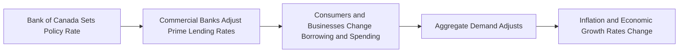

## 5.2 The Bank of Canada

In Canada’s financial ecosystem, the Bank of Canada (BoC) serves as the central bank and steward of the nation’s monetary stability. The BoC is mandated to implement monetary policies that ensure price stability, support a well-functioning financial system, and foster sustainable economic growth. This crucial role influences how financial institutions, businesses, and individuals make decisions about borrowing, lending, and investing within the Canadian economy.

---

### Role and Mandate of the Bank of Canada

The Bank of Canada was established in 1935, gaining its independence from the federal government in subsequent years. Its core mandate encompasses several responsibilities:

1. **Formulating Monetary Policy**: Using tools such as the policy interest rate (also called the target for the overnight rate) to influence economic activity and control inflation.  
2. **Issuing Currency**: Printing, distributing, and safeguarding the integrity of Canada’s banknotes.  
3. **Promoting Financial Stability**: Coordinating with other federal agencies, such as the Office of the Superintendent of Financial Institutions (OSFI) and the Canadian Investment Regulatory Organization (CIRO), to support a resilient financial system.  
4. **Acting as Banker and Fiscal Agent**: The BoC provides banking services to the federal government and certain Crown corporations. It also manages foreign currency reserves.

By managing these responsibilities, the Bank of Canada aims to maintain confidence in Canada’s financial system, preserve the value of money, and ensure that credit and capital markets function efficiently.

---

### Monetary Policy and the Policy Interest Rate

A central element of the Bank of Canada’s toolkit is **monetary policy**, which heavily relies on the **policy interest rate**—often referred to simply as the BoC rate or the target for the overnight rate. This rate influences the interest rates that commercial financial institutions, such as RBC and TD Bank, charge on mortgages, personal loans, and business credit lines.

#### Setting the Policy Rate

• **Frequency of Announcements**: The BoC sets and announces the policy rate eight times per year. These fixed dates allow for transparent communication and help financial markets anticipate changes.

• **Impact on Commercial Rates**: Commercial banks typically adjust their prime lending rates in response to changes in the BoC’s policy rate. For example, if the Bank of Canada raises the policy rate by 0.25%, RBC or TD Bank often increases their prime rates accordingly, affecting the cost of borrowing for Canadian households and businesses.

• **Open Market Operations**: To ensure that overnight interest rates remain near the target, the BoC conducts open market operations (e.g., buying or selling government securities). This mechanism helps keep short-term interest rates aligned with policy intentions.

> Changes in the policy rate ripple through the economy, influencing consumer spending, corporate investment, and ultimately the inflation rate in Canada.

Below is a simplified diagram illustrating how central bank actions translate to market rates and economic activity:

---

### Currency Issuance

The Bank of Canada is the sole authority for printing and distributing Canadian banknotes. In collaboration with specialized printing facilities, the BoC:

1. **Designs and Prints Banknotes**: Incorporates security features (e.g., holograms, raised ink) to prevent counterfeiting.  
2. **Ensures a Secure Supply of Currency**: Coordinates with Canada’s financial institutions to circulate banknotes and replace damaged or worn-out notes.  
3. **Protects Against Counterfeiting**: Leverages new technology and frequently updates designs to maintain confidence in the integrity of Canadian bills.

---

### Promoting a Sound and Efficient Financial System

The BoC plays a major role in ensuring Canada’s financial system is stable and efficient. In collaboration with OSFI, CIRO, the Canada Deposit Insurance Corporation (CDIC), and the Department of Finance, the Bank of Canada helps:

• **Identify and Monitor Systemic Risks**: Tracks domestic financial indicators—such as housing market conditions and bank capital ratios—to assess stability.  
• **Develop Regulatory Policies**: Advises on prudential regulation in partnership with OSFI, which directly supervises Canadian banks and insurance companies.  
• **Foster Market Infrastructure**: Facilitates payment clearance and settlement mechanisms, ensuring speed and security in Canada’s payments system.

---

### Inflation Targeting

A primary goal of the Bank of Canada is to keep inflation at around 2% annually, within a target range of 1% to 3%. Through monetary policy decisions and public communications, the BoC aligns expectations and fosters stable pricing. By maintaining a predictable inflation environment, investors and businesses can better plan long-term projects, and households can anticipate pricing trends more reliably.

Mathematically, one way to measure inflation is:


\text{Inflation Rate} = \frac{ (\text{CPI}_t - \text{CPI}_{t-1}) }{\text{CPI}_{t-1}} \times 100


where:
• \\(\text{CPI}_t\\) = Consumer Price Index at time \\(t\\).  
• \\(\text{CPI}_{t-1}\\) = Consumer Price Index at time \\(t-1\\).

By adopting a clear and transparent inflation-control target, the Bank of Canada reinforces market confidence, reduces undue volatility in interest and exchange rates, and facilitates stable economic growth.

---

### Providing Liquidity in Times of Stress

During periods of financial turbulence or crisis—such as the 2008 global financial crisis or the COVID-19 pandemic—the Bank of Canada can inject liquidity into the financial system to maintain stability and confidence. This may include:

1. **Emergency Lending Facilities**: Offering temporary loans to financial institutions that cannot secure funding from traditional sources.  
2. **Asset Purchase Programs**: Buying securities (e.g., government bonds) to increase the money supply and lower borrowing costs when traditional policy rates are near their lower limit.  
3. **Coordinated Interventions**: Working alongside other central banks, such as the U.S. Federal Reserve, to stabilize global markets when systemic risks are elevated.

These liquidity measures ensure that credit keeps flowing to businesses and households, preventing widespread defaults or contractions in economic activity.

---

### Practical Examples and Case Studies

1. **Prime Rate Adjustments by Major Banks**: Suppose the BoC reduces its policy interest rate by 50 basis points. RBC and TD Bank typically respond within days by lowering their prime rates. Mortgage holders with variable-rate mortgages immediately see changes in their monthly payments, directly impacting household budgets.

2. **Inflation-Control Success**: Over the past two decades, Canada’s inflation rate has generally remained within the 1% to 3% target range, demonstrating the effectiveness of the Bank of Canada’s inflation targeting. Stable and predictable inflation encouraged Canadian pension funds to diversify investments and plan payouts more reliably, benefiting retirees nationwide.

3. **Financial Crisis Response**: During the 2008 financial crisis, the BoC implemented extraordinary measures, such as expanding its balance sheet and engaging in asset purchase programs, ensuring sufficient liquidity for Canadian financial institutions. As a result, Canada’s banking system weathered the crisis more smoothly than many other jurisdictions, preserving both depositors’ and international investors’ confidence.

---

### Additional Resources

Below are some key resources for deeper exploration of the Bank of Canada’s role and responsibilities:

- **Bank of Canada**:  
  https://www.bankofcanada.ca/  
  (Policy rate announcements, economic projections, governor’s speeches)

- **BoC’s Monetary Policy Report**:  
  https://www.bankofcanada.ca/publications/monetary-policy-report/  
  (Quarterly analysis of the economy and inflationary trends)

- **Office of the Superintendent of Financial Institutions (OSFI)**:  
  https://www.osfi-bsif.gc.ca/  
  (Information on prudential regulation of banks and insurers)

- **Open-Source Data**:  
  https://www.bankofcanada.ca/rates/  
  (Access to historical interest rates, exchange rates, and key financial indicators)

- **Suggested Reading**:  
  “Money, Banking, and Financial Markets” by Stephen Cecchetti and Kermit Schoenholtz  
  (For a broader global context on central banking and monetary policy)

---

### Summary

The Bank of Canada’s responsibilities span from setting and implementing monetary policy to ensuring a stable, resilient financial system. Its primary tools—such as the policy interest rate, open market operations, and liquidity provisions—contribute significantly to economic stability and the preservation of Canadians’ purchasing power. By staying transparent about its policy decisions and focusing on an inflation-control target, the BoC fosters confidence among investors, institutions, and citizens within the Canadian financial landscape.

Stay attuned to policy rate announcements, inflation reports, and economic projections from the Bank of Canada to effectively manage personal and professional financial decisions. Understanding these macro-level signals is essential for portfolio allocation, risk mitigation, and long-term financial planning.

---

## Test Your Knowledge: Bank of Canada & Monetary Policy Quiz



### Which of the following best describes the primary role of the Bank of Canada’s policy interest rate?

- [ ] Setting long-term bond yields.
- [x] Influencing the overnight borrowing costs between financial institutions.
- [ ] Determining mutual fund management fees.
- [ ] Calculating property tax rates for municipalities.

> **Explanation:**( The Bank of Canada’s policy rate primarily influences the overnight borrowing costs between financial institutions, which in turn affect consumer and business lending rates.)

### How often does the Bank of Canada typically set its policy rate?

- [ ] Once a month.
- [ ] Four times a year.
- [x] Eight times a year.
- [ ] Only once a year.

> **Explanation:**( The Bank of Canada announces its policy rate on pre-set dates eight times per year, providing transparency to markets.)

### Which of the following is part of the Bank of Canada’s mandate?

- [x] Issuing Canadian banknotes.
- [ ] Setting federal tax rates.
- [ ] Overseeing credit unions exclusively.
- [ ] Auditing provincial budgets.

> **Explanation:**( The BoC is responsible for the design, printing, and distribution of Canadian banknotes, among other key functions.)

### The Bank of Canada’s inflation-control target is:

- [ ] 0% to 1%.
- [ ] 2% to 4%.
- [x] 1% to 3%.
- [ ] 4% to 6%.

> **Explanation:**( The BoC aims to keep inflation within 1% to 3%, with 2% as the midpoint of that range.)

### What effect does lowering the Bank of Canada’s policy rate typically have on the economy?

- [x] It generally encourages borrowing and spending.
- [ ] It causes widespread deflation.
- [x] It reduces commercial banks’ prime lending rates.
- [ ] It shuts down government borrowing.

> **Explanation:**( When the BoC lowers its policy rate, commercial banks often lower their prime rates, making loans cheaper and encouraging borrowing and spending.)

### Which of the following tools might the Bank of Canada use in a financial crisis?

- [x] Offering emergency lending facilities.
- [ ] Increasing property taxes.
- [ ] Cancelling all debts.
- [ ] Outsourcing monetary policy to commercial banks.

> **Explanation:**( During crisis situations, the BoC can offer emergency lending facilities or purchase assets to provide liquidity and support market functioning.)

### If the Bank of Canada sees inflation rising above the target range, what might it do?

- [x] Raise the policy interest rate.
- [ ] Stop issuing currency.
- [x] Conduct open market operations to reduce money supply.
- [ ] Prohibit commercial banks from lending.

> **Explanation:**( To tame rising inflation, the BoC may raise interest rates or engage in open market operations that reduce the money supply and cool demand.)

### Which external institution does the Bank of Canada collaborate with to maintain financial system stability?

- [ ] Provincial auditors.
- [x] Office of the Superintendent of Financial Institutions (OSFI).
- [ ] Municipal planning offices.
- [ ] Provincial lotteries.

> **Explanation:**( The BoC works closely with OSFI, which supervises and regulates federally registered banks, insurers, and pension plans, among others.)

### What is one benefit of having a clear, transparent inflation-control target?

- [x] It helps businesses and investors plan for the future with more certainty.
- [ ] It immediately guarantees zero inflation.
- [ ] It eliminates the need for banks to hold capital.
- [ ] It discourages consumer savings.

> **Explanation:**( When the inflation target is clear, businesses and investors can make more informed decisions about spending, saving, and investing.)

### The Bank of Canada’s policy rate adjustments most directly influence:

- [x] Short-term lending rates among financial institutions.
- [ ] Property tax rates set by local municipalities.
- [ ] International trade tariffs.
- [ ] Provincial government employment levels.

> **Explanation:** Short-term lending rates among financial institutions are directly tied to the policy rate, which has knock-on effects for prime rates and consumer loans.



---

## For Additional Practice and Deeper Preparation

**Elevate your exam readiness with our comprehensive app, "Securities CA: Mock Exams," designed to challenge and refine your skills.**

* **Master Challenging Questions:** Dive into expertly crafted sample exam questions that go beyond standard references.
* **Scenario-Driven Learning:** Experience scenario-driven case questions and in-depth solutions to build practical expertise.
* **Sharpen Exam Strategies:** Build confidence with step-by-step explanations designed to refine your exam-day tactics.
* **Gain Real-World Insights:** Acquire practical tips and detailed rationales that demystify complex concepts.
* **CIRO and CSI Alignment:** Stay current with CIRO guidelines and CSI’s exam structure, with questions intentionally more challenging than the actual exam.

**Download the App Today:**

> Note: While these courses are specifically crafted to align with the CSC® exams outlines, they are independently developed and not endorsed by CSI or CIRO.
