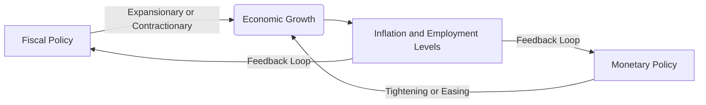

## 5.4 The Challenges of Government Policy

Government policies—particularly fiscal and monetary policy—play a key role in shaping Canada’s economic environment. While these tools have proven effective in guiding growth, stabilizing prices, and managing financial volatility, policymakers face multiple challenges in their design, timing, and implementation. In this section, we will explore common hurdles that Canadian policymakers encounter, discuss how these issues affect economic outcomes, and analyze solutions or best practices that can mitigate some of the potential pitfalls.

---

### Overview and Context

Economic policy in Canada involves close coordination between elected officials (primarily responsible for fiscal policy) and the independent Bank of Canada (responsible for monetary policy). Fiscal policy can include government spending programs, tax incentives, and social services, while monetary policy centers on controlling the money supply and influencing interest rates. Both policy sets aim to foster economic stability and prosperity; however, each faces inherent limitations:

• Policies often have delayed effects because it takes time to design and approve them, and further time for them to pass through the economy.  
• Conflicting goals—such as reducing inflation while promoting employment growth—require careful balancing acts.  
• Global conditions, such as commodity price fluctuations or geopolitical events, may hamper domestic efforts.  
• Political pressures can shift agendas, delaying or reshaping crucial initiatives.  

Understanding these challenges helps investors, financial professionals, and policymakers better navigate the complexities of Canadian macroeconomic policy.

---

### Time Lags in Policy Implementation

The concept of time lags refers to the delay between identifying an economic problem, formulating a policy response, implementing the policy, and finally seeing its effects. These lags can be summarized as follows:

1. Recognition Lag: Policymakers need time to gather and interpret economic data (e.g., GDP growth, unemployment rate, CPI inflation). Revisions to data may make it harder to gauge the actual state of the economy immediately.  
2. Decision Lag: Even after recognizing an issue, internal debate and parliamentary or legislative procedures can delay the adoption of a new policy.  
3. Implementation Lag: After a policy is approved, it may take time to deploy fiscal measures (e.g., building infrastructure requires contracts, planning, and coordination) or adjust monetary instruments (e.g., the Bank of Canada’s open market operations).  
4. Impact Lag: Once implemented, a policy still needs time to filter through the economy. For instance, a stimulus may require months or even years to significantly affect production, employment, or inflation rates.

Time lags can significantly reduce the effectiveness of counter-cyclical policies, particularly if economic conditions change before the policy fully takes effect. For example, if the government boosts spending to stimulate growth, but by the time the spending reaches the market the economy is already recovering, the additional stimulus might fuel unnecessary inflationary pressures.

---

### Conflicting Objectives

Governments commonly seek to achieve multiple objectives simultaneously:  
• Controlling inflation  
• Maximizing employment  
• Maintaining stable financial markets  
• Promoting economic growth  

Achieving one policy goal may undermine another. For instance, raising interest rates can help combat inflation but can also slow down overall economic growth, potentially increasing unemployment. The Bank of Canada explicitly targets inflation rates (currently around 2% in its inflation-targeting framework), but the federal government may prioritize other short-term objectives, such as reducing unemployment through job-creation programs.

Policy approaches that attempt to handle all these issues concurrently can become complicated “balancing acts.” Thus, conflicts may arise between public officials emphasizing the need for economic stimulus and the central bank focusing on price stability. A measured view that aligns both sets of objectives over the medium to long term is often ideal.

---

### External Factors

Even the most well-designed domestic policies can be undermined by global forces. Canada’s economy is export-oriented and deeply integrated into global trade networks, particularly those involving the United States, Europe, and Asia. Significant external factors include:

• Geopolitical Shocks: Wars, political instability, or severe economic crises in major economies can disrupt trade flows and investment channels.  
• Commodity Price Volatility: Canada is a major exporter of oil, metals, and other natural resources. Sudden price changes can dramatically affect government revenues, corporate profitability, and employment rates across various provinces.  
• Currency Fluctuations: The relative value of the Canadian dollar versus major currencies (e.g., the U.S. dollar) impacts exports, imports, and inflation.  
• Global Interest Rates: Global financial conditions can limit the Bank of Canada’s ability to set domestic interest rates independently.

These external dependencies mean that local policies must remain flexible and adaptive. A timely example can be seen in the 2020 global pandemic, where governments worldwide took unprecedented measures—fiscal stimulus, lockdowns, and interest rate cuts—to cushion their economies from a severe synchronized shock.

---

### Public Debt and Deficits

Fiscal deficits occur when government expenditures surpass revenues in a given period. Deficits, if sustained over many years, can accumulate into large public debt, which creates additional challenges:

• Higher Debt Servicing Costs: As public debt expands, more of the government’s budget is allocated to interest payments, reducing funds available for core social programs or infrastructure.  
• Credit Ratings: A rising debt-to-GDP ratio can lead to potential credit rating downgrades, increasing borrowing costs across the economy.  
• Reduced Policy Flexibility: High debt may limit the government’s ability to implement expansionary policies during downturns, as increased borrowing could become prohibitively expensive or politically contentious.

Case studies of major Canadian banks, such as RBC or TD, highlight how government bond rates influence mortgage and loan interest rates, meaning an overextended public debt situation can ultimately push up borrowing costs for both consumers and businesses.

---

### Political Pressures

Policymaking is inherently political, and elections, public opinion, and shifting leadership priorities can significantly influence economic policy. This dynamic is often referred to as the “political business cycle,” where elected officials may:

• Use expansionary policies—like tax cuts or increased government spending—to stimulate the economy before an election, generating short-term gains in employment and consumer confidence.  
• Face voter backlash if policies geared toward long-term stability (e.g., higher taxes to reduce debt) are deemed unpopular in the short run.  
• Postpone essential but potentially unpopular adjustments—like scaling back spending—until after elections, by which time imbalances may have worsened.

Such pressures can lead to a cycle where short-term decisions overshadow long-term economic stability.

---

### Data Reliability and Forecasting Uncertainty

Policymakers, market analysts, and investors rely on data like GDP growth, inflation, and employment figures to make informed decisions. However, economic data can be subject to:

• Revisions: As statisticians refine initial estimates with more comprehensive information, reported figures may change considerably over time.  
• Reporting Delays: Monthly or quarterly reports may not accurately reflect current conditions.  
• Forecasting Errors: Econometric models used by the Bank of Canada and other agencies rely on assumptions about consumer behavior, global trade, and technological changes that may shift rapidly.

When data is unreliable or out-of-date, implementing timely and appropriate policy choices becomes more daunting. Overly optimistic or pessimistic forecasts may skew decision-making, resulting in either insufficient or excessive policy action.

---

### Coordination Among Government Entities in Canada

Compared to many jurisdictions, Canada boasts a relatively collaborative environment among its key financial and regulatory institutions. These institutions include:

• The Department of Finance Canada (overseeing fiscal policy design, budgets, and economic updates).  
• The Bank of Canada (an independent entity managing the country’s monetary policy, primarily through setting benchmark interest rates and overseeing money supply).  
• The Canada Revenue Agency (CRA), which administers tax policy and ensures compliance.  
• Self-Regulatory Organizations (SROs), such as the Canadian Investment Regulatory Organization (CIRO), which supervises investment dealers and mutual fund dealers, ensuring that markets remain fair and transparent.

Collaborative efforts can help align objectives such as controlling inflation and sustaining employment. For instance, if the Bank of Canada notices inflationary pressures rising, it might coordinate with the federal government to ensure that fiscal stimulus measures do not exacerbate these conditions.

---

### Balancing Fiscal and Monetary Policy

Fostering a stable environment for Canadian growth and investment requires careful calibration between fiscal and monetary policy—particularly over the longer term. In the short term, these policy tools may move in divergent directions:  

• Example: The federal government might enact a stimulus package to combat rising unemployment, while the Bank of Canada could be concerned about potential inflationary impulses and look to raise interest rates or reduce asset purchases.  

When the two policy arms align effectively, the results can be powerful, fueling sustainable growth with stable prices. This synergy is often evident in expansions when inflation is similarly under firm control. By contrast, disjointed policies can undermine each other and lead to suboptimal outcomes, such as persistent high unemployment or recurring bouts of inflation.

Below is a simplified visual representation of how fiscal and monetary policies ideally work in tandem:

In this diagram, both fiscal and monetary policy feed into broader economic outcomes, such as growth, inflation, or employment. These outcomes then inform subsequent policy decisions, creating a continuous feedback loop that shapes future measures.

---

### Best Practices and Potential Solutions

Given these challenges, policymakers and market participants often employ multiple strategies to enhance the effectiveness of economic policy in Canada:

1. Transparent Communication: The Bank of Canada’s forward guidance policy ensures that market participants understand the rationale behind interest rate decisions and future policy directions.  
2. Automatic Stabilizers: Government programs like Employment Insurance (EI) or progressive taxation help cushion economic fluctuations without requiring new legislation.  
3. Fiscal Rules: Some governments adopt rules—such as balanced-budget mandates or debt ceilings—to maintain credible long-term commitments to sustainable public finances.  
4. Independent Agencies: Allowing independent bodies to collect and publish economic data (Statistics Canada) encourages objectivity and accuracy, reducing the risk of politically motivated distortions.  
5. Regular Policy Reviews: Governments and central banks undertake periodic reviews (e.g., Canada’s inflation-control target is reviewed every five years) to ensure frameworks remain fit for purpose.  
6. Scenario Analysis: Canadian pension funds, like the Canada Pension Plan Investment Board (CPPIB), commonly use scenario analysis to assess how changes in government policy and economic conditions might affect portfolio returns.

---

### Glossary

• **Time Lags**: Delays between identifying an economic issue, deciding on a policy, implementing it, and observing the policy’s full impact.  
• **Conflicting Objectives**: Situations where achieving certain policy goals (e.g., controlling inflation) may contradict or hinder other objectives (e.g., maximizing employment).  
• **Public Debt Servicing**: The ongoing cost, primarily interest, that a government must pay on its outstanding debt.  
• **Political Business Cycle**: The theory that elected officials may use expansionary policies to boost the economy before elections, which can lead to corrective or contractionary measures afterward.  

---

### Practical Examples and Case Studies

• A provincial government planning a large infrastructure project might face time lags from legislative approval to completion, during which a recession could evolve into a recovery, thus reducing the intended stimulus effect.  
• RBC and TD Bank often adjust lending rates based on the Bank of Canada’s policy rates; if the central bank raises rates to tackle inflation, it could inadvertently curb homeownership or small business lending, conflicting with a federal government goal of stimulating the housing market.  
• During global economic downturns, such as the 2008 financial crisis, Canadian policymakers benefited from a relatively stable banking sector and robust regulatory framework. Nevertheless, external shocks still impacted exports, prompting coordinated fiscal stimulus measures.  

---

### Encouraging Hands-On Analysis

For students and professionals, analyzing policy impacts on investments is an essential skill:

1. Try to model a simple scenario where the federal government increases spending on infrastructure while the Bank of Canada simultaneously prepares to increase its overnight rate.  
2. Examine how this dual shift might affect your hypothetical portfolio, focusing on Canadian government bonds, equity securities, and potential foreign exchange movements.  
3. Consider how time lags and conflicting objectives can materialize in real-world data, noticing how delayed policy measures might become apparent in quarterly earning reports or revised GDP data.

This practice helps learners see firsthand how macro-level policies can ripple through the financial markets they operate in.

---

### References and Additional Resources

• Department of Finance Canada – Economic and Fiscal Updates:  
  https://www.fin.gc.ca/

• Canada Revenue Agency (CRA) – Tax Policy Implementation:  
  https://www.canada.ca/en/revenue-agency.html

• Canadian Investment Regulatory Organization (CIRO) – Oversight of investment and mutual fund dealers ensuring fair and efficient marketplaces:  
  https://www.ciro.ca/

• OECD Economic Surveys (Canada):  
  https://www.oecd.org/economy/surveys/

• Suggested Reading:  
  “Canadian Federalism and Economic Policy” by Bakvis & Skogstad

These resources provide divergent perspectives on how policies are formulated and evaluated, supporting both academic and professional applications.

---

## Test Your Knowledge: Canadian Fiscal and Monetary Policy Challenges Quiz



### Which of the following best describes the concept of a time lag in economic policy?
- [ ] The immediate response of the economy once a policy is announced  
- [ ] The effectiveness of policies only during an election cycle  
- [x] The delay between identifying an economic issue, implementing the policy, and seeing its impact  
- [ ] The time it takes for foreign investors to react to domestic policy changes  

> **Explanation:**( “Time lag” includes recognition, implementation, and impact delays, reducing the effectiveness of policy measures if the economic environment changes before the policy takes effect.)

### How might conflicting objectives manifest in a government’s economic policy?
- [x] Tighter monetary policy to combat inflation may conflict with expansionary fiscal measures to reduce unemployment  
- [ ] Policies always seamlessly work together to achieve multiple objectives concurrently  
- [ ] Conflicting objectives only arise from external influences  
- [ ] All conflicting policy objectives involve currency devaluation  

> **Explanation:**( Conflicts occur because measures designed to control inflation often slow growth, making it harder to reduce unemployment in the short run.)

### Which global factor can particularly challenge Canada’s domestic policy initiatives?
- [x] Commodity price swings affecting export revenues  
- [ ] An ideal correlation between stock market returns and interest rates  
- [ ] Zero influence from international markets  
- [ ] Complete insulation from currency fluctuations  

> **Explanation:**( As a resource-rich nation, Canada is vulnerable to swings in global commodity prices, which can undermine or enhance domestic economic policy objectives.)

### How can sustained fiscal deficits become problematic over time?
- [ ] They never pose issues because the government can always print money  
- [ ] They have no effect on government financial stability  
- [ ] They only affect small local governments  
- [x] They increase public debt and lead to higher debt-servicing costs  

> **Explanation:**( Persistent deficits accumulate into larger overall debt, raising interest costs and limiting the government’s fiscal flexibility.)

### “Political business cycle” theory suggests that elected officials may:
- [x] Use expansionary policies before elections to gain short-term economic boosts  
- [x] Possibly impose contractionary policies after elections to correct imbalances  
- [ ] Shun any expansionary policies during election seasons  
- [ ] Only focus on monetary policy tools  

> **Explanation:**( In pursuit of re-election, politicians might adopt expansionary measures for voter appeal, leading to potential corrections afterward.)

### Which of the following solutions can help mitigate the challenges posed by time lags?
- [x] Automatic stabilizers like Employment Insurance (EI)  
- [ ] Eliminating all economic data releases  
- [ ] A rigid, unchangeable fiscal plan for five years  
- [ ] Banning foreign trade and investment  

> **Explanation:**( Automatic stabilizers operate without the need for new legislation, speeding up the policy response to economic fluctuations.)

### How does the Bank of Canada typically communicate future monetary policy directions to the public?
- [x] Forward guidance in official statements and rate announcements  
- [ ] Keeping future measures secret and confidential  
- [x] Publishing regular monetary policy reports  
- [ ] Only relying on commentary from private analysts  

> **Explanation:**( The Bank of Canada’s policy communication is key to reducing uncertainty; official statements and Monetary Policy Reports provide insight into potential interest rate paths.)

### Which agency in Canada is primarily responsible for administering tax policy?
- [ ] Bank of Canada  
- [ ] Canadian Investment Regulatory Organization (CIRO)  
- [ ] Department of Finance Canada  
- [x] Canada Revenue Agency (CRA)  

> **Explanation:**( While the Department of Finance designs tax policy, the Canada Revenue Agency implements and enforces these regulations.)

### Which best practice helps align fiscal and monetary policies in Canada?
- [ ] Keeping the Bank of Canada unaware of federal government agendas  
- [ ] Ensuring zero communication between the central bank and elected officials  
- [x] Coordination between the Bank of Canada and the Department of Finance to manage inflation and employment  
- [ ] Deliberately setting conflicting targets  

> **Explanation:**( Effective coordination allows the Bank of Canada to manage inflation while the government supports employment and growth objectives, creating a balanced approach.)

### In the context of policy objectives, is it always possible to achieve all targets simultaneously?
- [ ] True  
- [x] False  

> **Explanation:** Factors like time lags, economic data revisions, and conflicting goals often force trade-offs, making it challenging to fulfill all objectives at once.



---

## For Additional Practice and Deeper Preparation

**Elevate your exam readiness with our comprehensive app, "Securities CA: Mock Exams," designed to challenge and refine your skills.**

* **Master Challenging Questions:** Dive into expertly crafted sample exam questions that go beyond standard references.
* **Scenario-Driven Learning:** Experience scenario-driven case questions and in-depth solutions to build practical expertise.
* **Sharpen Exam Strategies:** Build confidence with step-by-step explanations designed to refine your exam-day tactics.
* **Gain Real-World Insights:** Acquire practical tips and detailed rationales that demystify complex concepts.
* **CIRO and CSI Alignment:** Stay current with CIRO guidelines and CSI’s exam structure, with questions intentionally more challenging than the actual exam.

**Download the App Today:**

> Note: While these courses are specifically crafted to align with the CSC® exams outlines, they are independently developed and not endorsed by CSI or CIRO.
