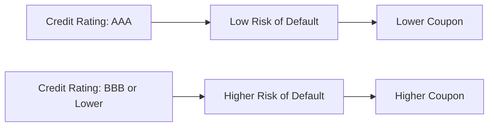

## 6.2 The Basic Features and Terminology of Fixed-Income Securities

Fixed-income securities—commonly referred to as bonds or debt instruments—play a central role in both corporate and government financing. They provide investors with steady interest income, typically through scheduled coupon payments, and promise the return of principal upon maturity. In Canada, fixed-income products are prominent in portfolios ranging from individual Registered Retirement Savings Plans (RRSPs) to large institutional funds managed by pension plans or insurance companies.

This section offers a comprehensive look at key terminology and features that define fixed-income securities. By understanding coupon rates, yields, maturity dates, redemption features, and other critical concepts, you will be equipped to make more informed investment decisions.

---

## Core Terminology in Fixed-Income Securities

### Principal (Face Value or Par Value)
The principal (also known as face value or par value) is the amount the issuer agrees to repay at maturity. Most bonds have a face value of $1,000, though variations exist (e.g., $5,000 or $10,000). The interest (coupon) calculations are generally based on this par value, not the bond’s market price.

• Example: If you buy a Royal Bank of Canada (RBC) bond with a face value of $1,000, RBC will repay that $1,000 upon the bond’s maturity date, assuming no default occurs.

### Coupon Rate
The coupon rate is the annual interest rate the issuer promises to pay on the face value. Minimal bond coupons might be less than 1%, whereas higher-yield corporate bonds can reach significantly above prevailing market rates if the issuer has higher credit risk.

• Fixed vs. Floating:
  – Fixed-Rate Coupons: Remain the same for the bond’s entire life.  
  – Floating-Rate (Variable) Coupons: Reset periodically, linked to a reference rate such as the prime rate or the Canadian Dealer Offered Rate (CDOR).

• Example: A 5% fixed-coupon bond with a $1,000 face value pays $50 in interest per year, typically in two semi-annual payments of $25 each.

### Maturity Date
The maturity date is when the bond’s principal must be repaid. Maturities can range from short-term (under one year) to long-term (over 10 years). In the Canadian context, Government of Canada Treasury Bills (T-Bills) are short-term instruments with maturities of less than one year, while some corporate bonds can extend beyond 30 years.

• Example: An Ontario provincial bond that matures in 2035 means that on the maturity date in 2035, the province of Ontario will repay the outstanding principal to bondholders.

---

## Yield Measures

### Current Yield
A bond’s current yield roughly gauges its annual return by dividing the yearly coupon payment by its current market price. This metric reflects the immediate income generated.

Current Yield = (Annual Coupon / Current Bond Price) × 100%

• Example: Suppose a $1,000 face value bond with a 5% coupon is trading at $950. Its annual coupon is $50, so the current yield is $50 / $950 = 5.26%.

### Yield to Maturity (YTM)
Yield to maturity (YTM) accounts for both the coupon payments and any capital gain or loss from the bond’s current price to its maturity value. YTM integrates the time value of money concept, offering a more accurate picture of the bond’s total return if held until maturity.

• Calculation Factors:
  1. Coupon Payments: Known and scheduled (assuming no default).  
  2. Principal Repayment at Maturity: The bond’s face value.  
  3. Time Horizon: The remaining life of the bond.  
  4. Current Market Price: Influenced by interest rates, credit quality, and market demand.

Though the YTM calculation can be complex, many online calculators and spreadsheet functions (e.g., Excel’s YIELD function or open-source libraries on Python) provide quick estimates.

---

## Redemption Provisions and Bond Structures

### Call Features
A call feature permits the issuer to repay the bond principal before its scheduled maturity. This typically occurs when market interest rates have declined, allowing the issuer to refinance at a lower rate.

• Example: If TD Bank issues a 10-year bond with a 5% coupon but interest rates fall to 3% after 5 years, TD might “call” the bond, pay back the principal, and reissue new debt at the lower rate. This can be disadvantageous to bondholders who lose future coupon payments.

### Sinking Funds
Some issuers set aside money over time to systematically retire portions of the bond principal. This structure—known as a sinking fund—reduces risk for investors because it ensures the issuer won’t face a large, single repayment at maturity.

• Example: A manufacturing company may create a sinking fund, making annual contributions to redeem portions of the bond issue. This gradual principal pay-down can enhance investor confidence in repayment reliability.

---

## Secured vs. Unsecured Debt

### Secured Debt
Secured debt is backed by specific collateral. In the event of issuer default, holders of secured debt have a claim on the pledged assets.

• Example: A mining company might secure a bond with its equipment or mineral rights. If the company cannot meet obligations, bondholders can claim the assets to recover some or all of their investment.

### Unsecured Debt (Debentures)
A debenture, or unsecured bond, relies solely on the issuer’s creditworthiness and general assets. Since no collateral secures them, debentures often bear higher coupons to compensate investors for extra credit risk (depending on the issuer’s rating).

---

## Credit Ratings and Default Risk

Institutional and retail investors alike rely on credit rating agencies such as DBRS Morningstar, Moody’s, and S&P Global Ratings to evaluate default risk. These agencies assess the issuer’s financial strength, stability of revenue, and economic context to assign a letter grade (e.g., AAA, BBB, or below investment grade).

• Example: A high-rated issuer (e.g., AAA-rated Government of Canada bond) typically pays a lower coupon than a BBB-rated corporate bond because the government’s perceived default risk is nearly non-existent, whereas the corporate issuer faces business-related uncertainties.

Below is a simplified illustration of how credit risk influences pricing and yield:

---

## Practical Applications and Case Studies

### Pension Fund Portfolio Example
Canadian pension funds like the Ontario Teachers’ Pension Plan (OTPP) often hold a diversified blend of federal, provincial, and corporate bonds. By focusing on highly rated but varying maturities, pension funds match their liabilities (future benefit payments) to the cash flows from bond coupons and principal redemptions.

• Strategy Insight: Long-term provincial bonds (e.g., 20+ years) are used to hedge future liabilities, while short-term federal bonds can ease liquidity requirements.

### Corporate Treasury Example: RBC
RBC might issue a debenture to fund expansion projects. While RBC’s strong credit rating (often AA or higher) helps keep its funding costs moderate, the bond’s coupon will still surpass the yield on an equivalent Government of Canada bond because the government is considered more creditworthy.

---

## Key Regulatory and Tax Considerations

1. CIRO Regulation:  
   The Canadian Investment Regulatory Organization (CIRO) oversees investment dealers in Canada. This self-regulatory organization imposes proficiency requirements for those selling and analyzing fixed-income products.

2. Bond Market Regulations:  
   Provincial securities commissions, such as the Ontario Securities Commission (OSC) or Autorité des marchés financiers (AMF), also regulate bond offerings and disclosures to protect investors.

3. Taxation (CRA Guidance):  
   The Canada Revenue Agency (CRA) defines how interest income and any capital gains from bond investments are taxed. Interest is typically taxed as ordinary income, whereas capital gains are taxed at 50% of the investor’s marginal rate. (Reference:  
   https://www.canada.ca/en/revenue-agency.html)

4. Additional Resources:  
   • InvestingInBonds.com (archived) provides investor-friendly explanations of bond terms.  
   • For advanced historical yield data, platforms like Quandl (https://data.nasdaq.com/) offer open-source data for quantitative analysis.

---

## Best Practices and Potential Pitfalls

• Matching Maturities with Goals: Align your bond’s maturity date with the timing of future cash needs. Holding long-term bonds to meet short-term liquidity requirements can force a premature sale at unfavorable prices.  
• Understanding Call Features: Be aware that high-coupon callable bonds may be redeemed early if interest rates decline, impacting your expected returns.  
• Monitoring Creditworthiness: An issuer’s financial health can weaken over time, potentially resulting in credit downgrades. Continuous monitoring helps investors respond proactively.  
• Balancing Yield and Risk: Higher-yielding fixed-income securities can be alluring but generally carry greater default risk. Evaluate whether the risk premium adequately compensates for the additional uncertainty.  

---

## Summary and Next Steps

Fixed-income securities are invaluable to Canadian investors seeking regular income and capital preservation. By grasping the nuances of coupon rates, yields, redemption features, and credit ratings, you can make well-informed decisions that align with your risk tolerance and investment goals. Always consider professional advice when dealing with complex instruments or when uncertain about the specific risks.

Continue exploring broader fixed-income topics, such as Government of Canada securities, provincial and municipal bonds, and the role of corporate bonds within a diversified portfolio. Delve into pricing considerations and bond trading mechanics to round out your knowledge of the fixed-income landscape.

---

## Test Your Knowledge: Fixed-Income Features & Terminology Mastery



### Which term refers to the amount the issuer promises to repay at maturity?

- [x] Principal (Face Value)
- [ ] Coupon
- [ ] Call Price
- [ ] Sinking Fund

> **Explanation:** The face value, or principal, is the sum the issuer repays to bondholders at maturity.

### A bond with no collateral pledged and backed only by the issuer's creditworthiness is known as:

- [ ] Secured Bond
- [ ] Guaranteed Bond
- [x] Debenture
- [ ] Convertible Bond

> **Explanation:** Debentures are unsecured bonds relying solely on the issuer’s general creditworthiness.

### In Canada, the regulators overseeing fixed-income transactions primarily include:

- [x] Provincial securities commissions and CIRO
- [ ] The Federal Reserve
- [ ] The U.S. Securities and Exchange Commission
- [ ] The European Central Bank

> **Explanation:** Provincial securities commissions (like the OSC, AMF) and the Canadian Investment Regulatory Organization (CIRO) set the standards for Canadian market transactions.

### Yield to Maturity (YTM) is best described as:

- [ ] The bond’s interest payment divided by its current price
- [x] The total return considering price, coupon, redemption value, and time
- [ ] The principal amount returned at maturity
- [ ] The highest potential yield if bond is called

> **Explanation:** YTM factors in all coupon payments, the bond’s price, potential capital gain (or loss), and the time value of money over the bond’s life.

### Which of the following is NOT typically a feature of a bond?

- [x] Shareholder Voting Rights
- [ ] Call Provision
- [ ] Coupon Rate
- [ ] Maturity Date

> **Explanation:** Bondholders typically do not have shareholder rights. They are creditors, not owners.

### A sinking fund:

- [x] Requires the issuer to set aside funds to retire a portion of the bond issue over time
- [ ] Protects investors from credit risk
- [ ] Limits the issuer from paying coupons
- [ ] Automatically extends the maturity date

> **Explanation:** A sinking fund obliges the issuer to systematically pay down the bond principal before maturity.

### Floating-rate bonds:

- [x] Have coupon payments that adjust based on a benchmark rate
- [ ] Pay a fixed coupon throughout the bond’s life
- [x] Might be tied to the prime rate or CDOR
- [ ] Never change coupons once issued

> **Explanation:** Floating rates adjust according to reference market rates, such as prime or CDOR, allowing coupons to fluctuate.

### A callable bond:

- [x] Can be redeemed by the issuer before maturity
- [ ] Automatically converts into common shares
- [ ] Has coupons that float
- [ ] Is always secured by collateral

> **Explanation:** A callable bond contains a provision that allows the issuer to “call” or redeem the bond early, often to refinance at lower interest rates.

### One common pitfall for investors buying callable bonds is:

- [x] The bond may be called away early, reducing future income
- [ ] Prices never fluctuate
- [ ] They are always lower rated
- [ ] They cannot be resold in the secondary market

> **Explanation:** Callable bonds pose reinvestment risk—the bond can be redeemed prematurely when interest rates fall, interrupting expected coupon income.

### True or False: A bond’s credit rating can be downgraded if its issuer’s financial health deteriorates.

- [x] True
- [ ] False

> **Explanation:** Credit rating agencies may downgrade a bond if the issuer experiences significant financial weakness, indicating higher default risk.



---

