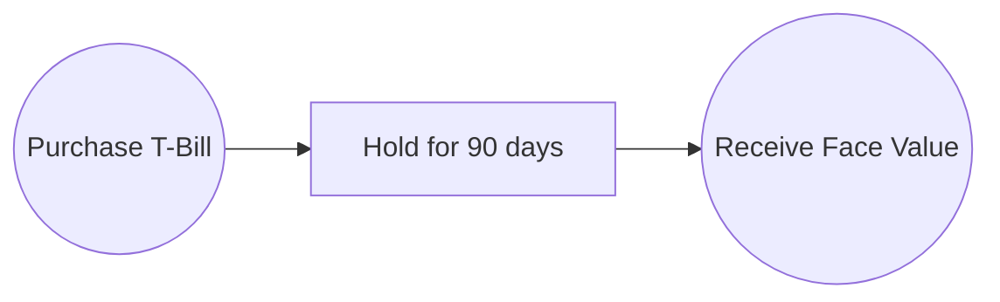
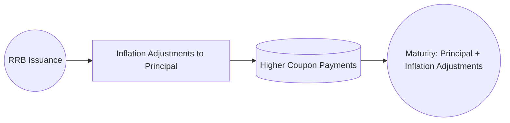

## 6.3 Government of Canada Securities

Government of Canada securities occupy a central role in the fixed-income market. Often considered the benchmark for low-risk debt instruments in Canada, they serve individual investors, financial institutions, corporations, and pension funds alike. This section explores how the federal government raises funds by issuing these securities, the mechanisms behind their auction and distribution, and the unique features and risks each instrument presents. From short-term Treasury Bills (T-Bills) to long-term Real Return Bonds (RRBs), Canadian investors benefit from a range of structures that cater to different investment horizons and risk profiles.

---

## Overview of Federal Government Funding in Canada

The Government of Canada raises funds primarily through the issuance of debt securities. This process is supervised by the Bank of Canada and the Department of Finance Canada. The Bank of Canada acts as the government’s fiscal agent, facilitating auctions, maintaining market liquidity, and implementing monetary policies. Key motivations for issuing government debt include:

• Funding day-to-day operations.  
• Financing infrastructure projects.  
• Managing existing debt (refinancing).  
• Meeting short-term cash flow needs.  

Because the federal government can collect taxes and has the power to adjust fiscal policy, it is generally considered extremely creditworthy by Canadian investors. As a result, these securities are often referred to as “default-risk-free,” although, in practice, no investment is entirely free of risk.

### Bank of Canada Auctions and Distribution Network

The Bank of Canada periodically conducts auctions for new issuances of Government of Canada securities. It publishes an auction schedule, which you can find here:  
• Bank of Canada’s Auction Schedule: [https://www.bankofcanada.ca/stats/current-research/market-operations/](https://www.bankofcanada.ca/stats/current-research/market-operations/)

Major financial institutions (often referred to as primary dealers) participate directly in these auctions. Investment dealers, such as RBC Capital Markets, TD Securities, or other large banks, then distribute or resell these securities to individual and institutional investors through the secondary market. Investors can also purchase certain securities directly through discount brokerages or online investment platforms.

---

## Types of Federal Government Debt Securities

The federal government in Canada issues several major types of debt instruments, each designed to meet different investor needs and maturity preferences.

### Treasury Bills (T-Bills)

Treasury Bills are short-term debt securities with maturities of one year or less—commonly 1-month, 3-month, 6-month, or 12-month maturities. They are issued at a discount to their face (par) value and mature at par.  
• Key Feature: T-Bills do not pay a coupon. Instead, the return is the difference between the discount purchase price and the face value paid at maturity.  
• Example: A 90-day T-Bill with a face value of C$1,000 could be purchased for C$990. Upon maturity, the investor receives C$1,000, yielding a C$10 return.  

Below is a simplified illustration of a T-Bill’s cash flow over time:

#### Risk Profile  
• Default Risk: Minimal, considered effectively zero from a Canadian investor’s perspective.  
• Interest Rate Risk: Minimal for short-term maturities but not entirely absent.  
• Liquidity Risk: T-Bills are highly liquid, generally available for quick purchase or sale on the secondary market.  

### Canada Savings Bonds (Discontinued for New Sales)

Canada Savings Bonds (CSBs) were once popular for retail investors as a safe, government-backed savings vehicle. Although the federal government discontinued the sale of new CSBs, outstanding bonds remain until their final maturity. They historically served as an accessible entry point for Canadians to invest small amounts in a risk-free government instrument.  

• Key Features:  
  – Small denominations, making them accessible.  
  – Offered a guaranteed minimum interest rate for a defined period.  
  – Redeemable at any time (with some interest rate adjustments), providing liquidity.  

While CSBs are no longer sold, it is useful to be aware of them historically when analyzing past portfolio structures or when dealing with inherited portfolios containing these instruments.

### Marketable Bonds

Marketable bonds are longer-term debt instruments that typically pay a fixed coupon semi-annually, and their maturity ranges from over 1 year up to 30 or more years. They can be bought and sold in the secondary market, making them more flexible than non-marketable instruments.  

• Nominal Bonds: Standard bonds with a fixed coupon. The coupon rate is determined at the time of issuance, based on prevailing market interest rates and investor demand.  
• Real Return Bonds (RRBs): Specialized bonds offering inflation protection by adjusting the principal value with changes in the Consumer Price Index (CPI).  

#### Nominal Bonds

Nominal government bonds provide a fixed income stream. For example, a 10-year Government of Canada bond might have a face value of C$1,000 with a 2.5% annual coupon, paying C$25 in two semi-annual installments each year (C$12.50 each). At maturity, the investor receives back the bond’s face value, subject to reinvestment risk and interest rate fluctuations during the holding period.

#### Real Return Bonds (RRBs)

RRBs aim to preserve an investor’s real (inflation-adjusted) purchasing power. The bond’s principal is adjusted periodically based on changes in the Canadian CPI. Consequently, the semi-annual coupon payments, which are calculated as a percentage of the inflation-adjusted principal, also rise with inflation.  
• Example: Suppose an investor holds an RRB with a 2% coupon. If the principal of C$1,000 is adjusted to C$1,020 to reflect the rise in the CPI, the 2% annual coupon is applied to C$1,020, not the original C$1,000. As inflation accumulates over time, both the adjusted principal and coupon payments grow, maintaining the real rate of return.

• Risk Considerations: RRBs still carry interest rate risk and can experience price fluctuations if market rates rise or fall significantly. However, they reduce inflation risk by preserving purchasing power over the bond’s lifetime.

### Canada Mortgage Bonds

Canada Mortgage Bonds (CMBs) are issued through the Canada Mortgage and Housing Corporation (CMHC), a Crown corporation. These bonds are backed by pools of insured residential mortgages, offering investors a form of government-backed exposure to the Canadian residential mortgage market.  

• Typically carry a higher yield than sovereign Government of Canada bonds but still reflect a relatively low level of credit risk, thanks to the government backing.  
• Used by financial institutions as a stable funding source for mortgage lending.  

---

## Risk and Return Analysis of Government of Canada Securities

### Default Risk

From a Canadian investor’s viewpoint, Government of Canada debt is considered default-risk-free because the government’s ability to tax and print currency theoretically allows it to meet its financial obligations. However, it is crucial for investors and advisors to remember that “risk-free” refers specifically to default risk. Other types of risk still apply.

### Interest Rate Risk and Inflation Risk

• Interest Rate Risk: Even Government of Canada bonds are vulnerable to price swings when market rates change. Longer-duration bonds experience more pronounced price fluctuations.  
• Inflation Risk: While nominal bonds’ real returns can be eroded by inflation, Real Return Bonds are designed to mitigate this risk by linking the bond’s principal to inflation.

### Liquidity and Trading

Federal government debt is generally the most liquid fixed-income security in Canada. The market for such bonds is large, and the bid-ask spreads are typically narrow. By contrast, provincial and corporate bonds often feature wider spreads and slower trading activity. Large institutions like pension funds and big banks trade these securities frequently, ensuring robust secondary markets.

### Yield Considerations

Yields on Government of Canada securities usually serve as benchmarks for other Canadian fixed-income products. For example, the yield on a 10-year Government of Canada benchmark bond is a common point of reference for setting interest rates on mortgages, corporate bonds, and other debt instruments.

---

## How Government of Canada Securities Trade

### Primary Market (Auctions)

Government of Canada securities are initially offered through auctions, where designated primary dealers submit bids. The auction can follow different formats (e.g., single-price or multiple-price auctions), but the common goal is to establish a fair market price.  
• After an auction is completed, successful bidders purchase the securities at the auction’s clearing price.

### Secondary Market

Once issued, investors can buy or sell Government of Canada securities in the centralized secondary market. Major exchanges and electronic trading platforms facilitate these transactions. Brokers typically quote prices, allowing investors to participate without directly dealing with the Bank of Canada or attending auctions.

### Settlement

Most fixed-income transactions settle within two business days (T+2). CIRO guidelines (formerly IIROC) offer specific rules on reporting, margin requirements, and settlement procedures for dealers. For more information, consult the CIRO website or your compliance department.

---

## Practical Applications and Case Studies

Below are illustrative scenarios showing how Canadian investors integrate Government of Canada securities into their portfolios:

1. **Pension Funds**: Large pension funds (e.g., the Canada Pension Plan Investment Board) often hold significant allocations to long-term Government of Canada bonds for liability matching. If a fund expects to make pension payouts for decades, long duration instruments can help align with future obligations.

2. **Individual Investors**: Investors approaching retirement might keep a portion of their portfolio in T-Bills or short-term Government of Canada bonds to reduce market volatility and ensure liquidity for living expenses.

3. **Major Canadian Banks (e.g., RBC, TD)**: Banks use Government of Canada bonds as collateral for interbank lending and for managing liquidity. Their large treasury operations constantly trade, hedge, and rebalance positions in these securities.

4. **Inflation Hedge**: In periods of rising inflation, Real Return Bonds can help protect purchasing power. Institutional investors might increase RRB exposure if they anticipate higher CPI growth.

---

## Step-by-Step Guidance for Investors

Below is a suggested step-by-step approach for those interested in adding Government of Canada securities to their portfolios:

1. **Determine Objectives**: Identify what portion of your portfolio needs reduced risk, stable income, or inflation protection.  
2. **Research Maturities**: Short-term T-Bills may fit a liquidity need, while medium- to long-term bonds (including RRBs) are suitable for intermediate or long-term goals.  
3. **Check Auction Schedules**: If buying new issues, monitor upcoming auction dates via the Bank of Canada website.  
4. **Evaluate Secondary Market Options**: Use a broker or trading platform to compare yields and bond prices if the timing does not line up with auctions.  
5. **Assess Tax Implications**: Interest income on Government of Canada bonds is typically fully taxable in Canada. Consider holding these securities in registered accounts like RRSPs or TFSAs to defer or eliminate tax on interest income.  
6. **Monitor Market Rates**: Keep track of changes in interest rates and inflation expectations. For RRBs, monitor CPI trends, as they directly impact coupon and principal adjustments.  
7. **Rebalance Periodically**: As your objectives or market conditions change, adjust the exposure to these securities accordingly.

---

## Regulatory Considerations and Resources

• **CIRO Compliance**: CIRO sets guidelines on conducting fixed-income trades, margin rules, and client suitability. Always ensure compliance with relevant regulations when advising clients or executing trades.  
• **Bank of Canada**: Acts as the fiscal agent, managing auctions and publishing market data.  
• **Department of Finance Canada**: Oversees federal debt policies and publishes debt management reports at [https://www.fin.gc.ca/](https://www.fin.gc.ca/).  

Investors are encouraged to consult these resources and remain up-to-date with regulatory changes:

1. Bank of Canada Auction Schedule:  
   [https://www.bankofcanada.ca/stats/current-research/market-operations/](https://www.bankofcanada.ca/stats/current-research/market-operations/)  

2. CIRO (for compliance obligations):  
   [https://www.ciro.ca/](https://www.ciro.ca/)  

3. Department of Finance Canada:  
   [https://www.fin.gc.ca/](https://www.fin.gc.ca/)  

These platforms publish timely market data, regulatory updates, and detailed reports on government debt issuance, helping investors and financial professionals stay well informed.

---

## Glossary of Key Terms

• **Treasury Bill (T-Bill)**: A short-term government debt security sold at a discount and maturing at par, typically within one year.  
• **Real Return Bond (RRB)**: A bond that adjusts the principal value according to inflation, thus preserving the real value of the investor’s interest and principal.  
• **Nominal Bond**: A standard bond paying a fixed coupon based on its face value, without inflation adjustment.  
• **Default Risk**: The risk that an issuer will be unable to pay interest or repay principal in a timely manner.

---

## Conclusion

Government of Canada securities serve as a cornerstone of the Canadian fixed-income market, providing short-term liquidity through T-Bills, stable long-term income through nominal bonds, and inflation protection via Real Return Bonds. While often considered free of default risk, investors should remain cognizant of interest rate risk and inflation risk. Through a strategically balanced portfolio—potentially incorporating both nominal and inflation-adjusted bonds—Canadian investors can tailor their risk-return profiles according to their financial objectives and market outlooks.

---

## Test Your Knowledge: Government of Canada Securities Quiz



### Which entity acts as the federal government’s fiscal agent for issuing debt securities in Canada?

- [x] The Bank of Canada
- [ ] The Canada Revenue Agency (CRA)
- [ ] CIRO
- [ ] The Department of Finance Canada

> **Explanation:** The Bank of Canada serves as the fiscal agent, conducting auctions and managing the government’s borrowing operations on behalf of the federal government.

### What is the defining feature of a Treasury Bill (T-Bill)?

- [x] It is issued at a discount and matures at par value with no coupon payments.
- [ ] It has no maturity date.
- [ ] It pays a floating coupon rate.
- [ ] It pays interest monthly.

> **Explanation:** T-Bills provide returns through the price discount at issuance, as they do not pay interest in the form of coupons.

### Which of the following is a primary benefit of Real Return Bonds (RRBs)?

- [x] Protection against inflation by adjusting the bond’s principal using CPI.
- [ ] Ensuring the highest possible nominal yield in the market.
- [ ] Completely eliminating interest rate risk.
- [ ] Guaranteeing a real yield of at least 10% per annum.

> **Explanation:** Real Return Bonds maintain the purchasing power of both the principal and coupon payments by linking their values to changes in the Consumer Price Index.

### How are Canada Savings Bonds (CSBs) used in today’s market?

- [ ] They are widely issued to new investors.
- [ ] They are exclusively issued to institutional investors.
- [x] They have been discontinued, but previously held CSBs remain valid until maturity.
- [ ] They are being replaced by new issuance of RRBs.

> **Explanation:** Canada Savings Bonds are no longer sold to the public, but any outstanding bonds remain active until they reach maturity.

### What is the typical settlement period for Government of Canada bond trades?

- [x] T+2
- [ ] T+0
- [x] T+1
- [ ] T+3

> **Explanation:** Most Government of Canada securities transactions settle on a T+2 basis, although certain money market instruments can settle on T+1. (Note: Settlement periods can vary based on facility and regulations.)

### Which of the following risks still applies to Government of Canada bonds despite their default-risk-free status?

- [x] Interest rate risk
- [ ] Foreign currency risk for Canadian investors
- [ ] Corporate credit risk
- [ ] Management risk

> **Explanation:** Government of Canada bonds are exposed to interest rate risk. Their prices fluctuate with changes in interest rates.

### Why are Government of Canada bonds considered “default-risk-free” to Canadian investors?

- [x] The federal government can tax and print money to service its debts.
- [ ] They are insured by major Canadian banks.
- [x] They offer the highest nominal yields.
- [ ] The Canada Revenue Agency guarantees all coupons.

> **Explanation:** The federal government’s power to tax and its ability to print money underpins its capacity to repay its debt, thereby essentially eliminating default risk.

### Which type of government bond adjusts its principal for inflation?

- [x] Real Return Bonds
- [ ] Corporate Bonds
- [ ] T-Bills
- [ ] Treasury Inflation Protected Securities (TIPS)

> **Explanation:** Real Return Bonds (RRBs) adjust their principal based on the Canadian CPI to preserve the real value of the bond. TIPS perform a similar function in the U.S. market.

### Which statement best describes the function of Canada Mortgage Bonds (CMBs)?

- [x] They provide investors with exposure to pools of insured residential mortgages through CMHC.
- [ ] They finance the Bank of Canada’s lending activities.
- [ ] They are non-marketable debt instruments issued by provincial governments.
- [ ] They are not backed by Canadian government agencies.

> **Explanation:** CMBs are issued by the Canada Mortgage and Housing Corporation (CMHC) and are backed by insured mortgage pools, offering relatively low credit risk.

### Government of Canada securities are typically used by major financial institutions (e.g., RBC, TD) for which primary purpose?

- [x] Managing liquidity and collateral for interbank lending
- [ ] Eliminating market risk
- [ ] Hiking deposit interest rates
- [ ] Covering foreign exchange hedging positions

> **Explanation:** Large Canadian banks hold Government of Canada securities for liquidity, collateral, and short-term cash management. They are also used in repo transactions and as a safe asset for regulatory requirements.



---

